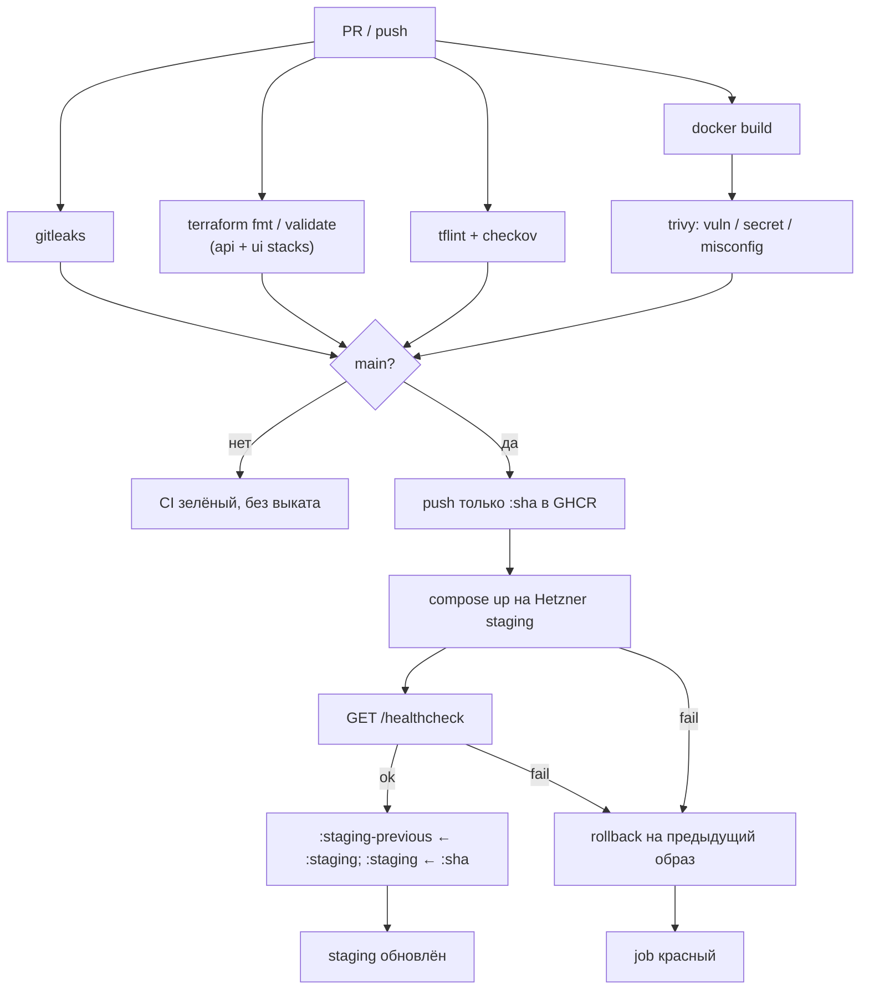

# CI/CD — API (команда 6)

| | |
|---|---|
| Статус | рабочий каркас пайплайна |
| Владелец | инфраструктура (роль 3) |
| Связанные документы | [INFRASTRUCTURE.md](INFRASTRUCTURE.md), [SECRETS.md](SECRETS.md) |

Пайплайн собирает FastAPI-бэкенд в OCI-образ, проверяет инфраструктурный код и выкатывает образ на staging-VM в Hetzner Cloud вместе с PostgreSQL. Реестр — **GitHub Container Registry**.

---

## 1. Конвейер



| Job | Когда | Permissions | Что делает |
|---|---|---|---|
| `Secret scan` | PR и `main` | `contents: read` | Gitleaks с `--redact` |
| `Terraform fmt / validate` | PR и `main` | `contents: read` | `fmt -check`, `validate` для `api-staging` и `ui-staging` |
| `Terraform lint / security` | PR и `main` | `contents: read` | TFLint + Checkov |
| `Docker image build` | PR и `main` | `contents: read` | образ `python:3.13-slim` |
| `Docker image security scan` | после сборки | `contents: read` | Trivy `CRITICAL`/`HIGH` |
| `Push Docker image` | только `main` | `contents: read`, `packages: write` | GHCR только `:sha` (тот же artifact, что прошёл Trivy) |
| `Deploy staging` | только `main` | `contents: read`, `packages: write` | Compose, health check, авто-rollback, промо `:staging` после успеха |

Корневые permissions workflow: `contents: read`. Остальное — только у job, которому это нужно.

---

## 2. Инструкция по deployment

Стенд должен уже существовать ([INFRASTRUCTURE.md](INFRASTRUCTURE.md)). Secrets и variables — [SECRETS.md](SECRETS.md).

1. Settings → Environments → `staging`: заполнить secrets/variables, включить required reviewers.
2. Push (или merge) в `main`.
3. Дождаться зелёных проверок и job **Push Docker image** (immutable `:sha`).
4. Job **Deploy staging** копирует `deploy/` на `/opt/dmc-268-api`, поднимает API + PostgreSQL; bootstrap снимается только после успешного `compose up`.
5. Runner проверяет `GET /healthcheck` снаружи (`STAGING_HEALTH_URL` или `http://$STAGING_HOST/healthcheck`, 12 × 5 с).
6. Успех: тег `:staging` продвигается на проверенный `:sha`, прежний `:staging` сохраняется как `:staging-previous`. Неуспех deploy или health: авто-rollback (включая первый выкат → bootstrap) и красный job.

Повторный ручной запуск того же workflow: **Actions → CI/CD → Run workflow** (ветка `main`).

Локально образ без выката:

```bash
docker build -t dmc-268-api:local .
docker run --rm -p 8000:8000 dmc-268-api:local
curl -fsS http://127.0.0.1:8000/healthcheck
```

---

## 3. Образ и health check

Образ слушает `:8000`, Uvicorn `app.main:app`, пользователь `app`.

```http
GET /healthcheck
200 {"status":"ok"}
```

PostgreSQL только во внутренней docker-сети. Том `postgres-data` переживает выкат и rollback API-образа.

---

## 4. Container Registry

| Параметр | Значение |
|---|---|
| Host | `ghcr.io` |
| Repository | `ghcr.io/<owner>/dmc-268-api-t6` |
| Auth CI | `GITHUB_TOKEN` |
| Auth staging | тот же token, только на время `docker pull`, затем `docker logout` |
| Теги | `:<git-sha>`, `:staging`, `:staging-previous` |

---

## 5. Rollback

1. **Автоматический.** Deploy или health check не прошли → `rollback.sh` поднимает образ из `.deploy-state.previous`. На первом выкате без предыдущего release восстанавливается bootstrap nginx. Данные PostgreSQL не сбрасываются. Тег `:staging` в GHCR не менялся до успешного health check.
2. **Ручной.** Actions → **Rollback staging** → Run workflow.
   - `reason` — обязателен.
   - Пустой `image` — предыдущий успешный выкат.
   - `staging-previous` / `abc123` / полный `ghcr.io/...@sha256:...` — конкретная версия.
3. После отката тот же внешний `/healthcheck`.
4. Deploy и rollback делят группу `staging-deploy` без отмены друг друга.

На VM:

```bash
/opt/dmc-268-api/rollback.sh
/opt/dmc-268-api/rollback.sh ghcr.io/<owner>/dmc-268-api-t6:staging-previous
```

---

## 6. Secrets и permissions

Перечень, хранение, доставка на VM и запрет утечек в git/логи — [SECRETS.md](SECRETS.md).

Кратко: в Environment `staging` секреты — только `STAGING_SSH_KEY` и `POSTGRES_PASSWORD`. Хост и SSH-пользователь — variables. `HCLOUD_TOKEN` в Actions нет.

---

## 7. Локальные команды CI

```bash
terraform fmt -check -diff -recursive terraform/
for stack in terraform/api-staging terraform/ui-staging; do
  terraform -chdir="${stack}" init -backend=false -input=false -lockfile=readonly
  terraform -chdir="${stack}" validate
done
tflint --init && tflint --recursive
checkov --config-file .checkov.yaml -d .

docker build -t dmc-268-api:local .
trivy image --severity CRITICAL,HIGH --exit-code 1 dmc-268-api:local
```
