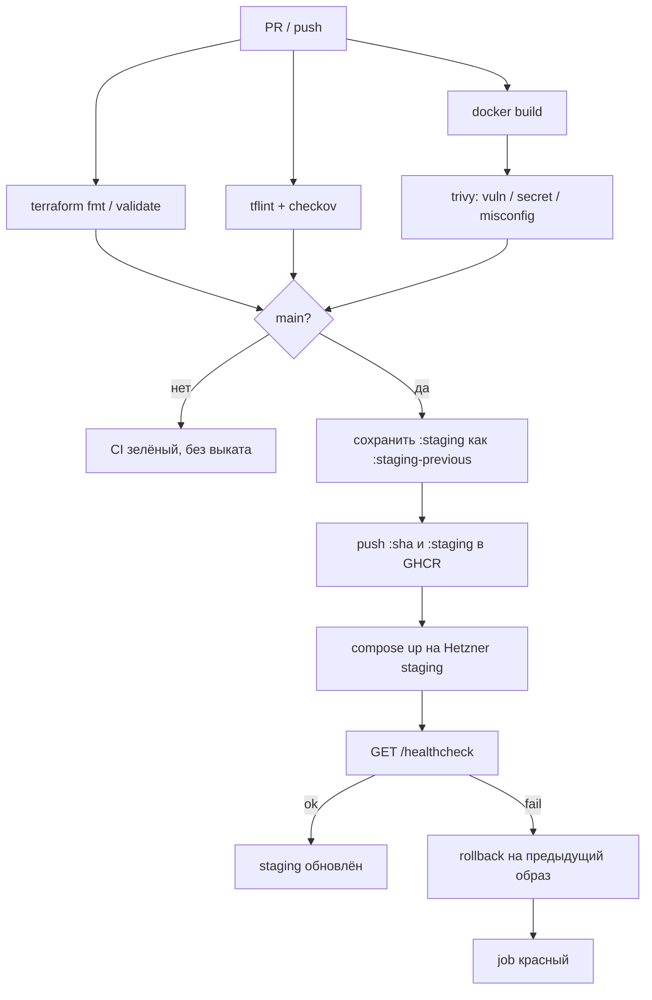

# CI/CD — API (команда 6)

| | |
|---|---|
| Статус | рабочий каркас пайплайна |
| Владелец | инфраструктура (роль 3) |
| Связанные документы | локальный `docker-compose.yml` (FastAPI + PostgreSQL) |

Пайплайн собирает FastAPI-бэкенд в OCI-образ, проверяет инфраструктурный код и выкатывает образ на staging-VM в Hetzner Cloud вместе с PostgreSQL. Реестр — **GitHub Container Registry**: у Hetzner нет managed registry, продукт уже живёт в GitHub.

---

## 1. Конвейер



| Job | Когда | Что проверяет / делает |
|---|---|---|
| `Terraform fmt / validate` | PR и `main` | `terraform fmt -check`, `terraform validate` |
| `Terraform lint / security` | PR и `main` | TFLint (recommended) + Checkov (Terraform + Dockerfile) |
| `Docker image build` | PR и `main` | образ `python:3.13-slim` + `uv sync --locked --no-dev` |
| `Docker image security scan` | после сборки | Trivy: `CRITICAL`/`HIGH`, scanners `vuln,secret,misconfig` |
| `Push Docker image` | только `main` | login в `ghcr.io`, сохранение прошлого `:staging`, push `:sha` и `:staging` |
| `Deploy staging` | только `main` | `docker compose` (API + PostgreSQL) на VM, внешний health check, авто-rollback |

Ручной откат: workflow **Rollback staging** (`workflow_dispatch`). Пустой `image` → предыдущий успешный выкат; иначе тег или полный ref.

---

## 2. Образ и health check

Образ слушает `:8000` и поднимает Uvicorn (`app.main:app`) от непривилегированного пользователя `app`. Контракт живости:

```http
GET /healthcheck
200 {"status":"ok"}
```

После `compose up --wait` runner дергает тот же URL снаружи (`STAGING_HEALTH_URL` или `http://$STAGING_HOST/healthcheck`, 12 попыток × 5 с). Если ответ не `ok` — на VM запускается `rollback.sh`, job падает.

PostgreSQL остаётся на внутренней docker-сети и наружу не публикуется. Том `postgres-data` переживает выкат и rollback API-образа.

---

## 3. Container Registry

| Параметр | Значение |
|---|---|
| Host | `ghcr.io` |
| Repository | `ghcr.io/<owner>/dmc-268-api-t6` |
| Auth CI | `GITHUB_TOKEN`, `packages: write` |
| Auth staging pull | тот же token, только на время `docker pull` |
| Теги | `:<git-sha>` (неизменяемый), `:staging` (текущий), `:staging-previous` (точка отката) |

Имя репозитория и хост реестра заданы в Terraform (`container_registry`, `image_repository`) и выводятся в `image_repository` / `health_url`.

---

## 4. Staging (Hetzner)

Одна VM, Docker Compose, наружу только HTTP(S) и SSH. Сеть отделена от UI-стенда: `10.21.0.0/16`, чтобы два стека можно было поднять в одном проекте Hetzner.

Terraform поднимает:

- private network `10.21.0.0/16` + subnet `10.21.1.0/24`
- firewall: 80, 443, ICMP; SSH только из `ssh_allowed_cidrs`
- Debian 12 + Docker / Compose через cloud-init
- публичный IPv4/IPv6 и статический private IP `10.21.1.10`

`terraform apply` — отдельная операция оператора (нужен remote state, иначе runner каждый раз создаст новую VM). CI проверяет код, но не применяет его.

```bash
cd terraform
terraform init
terraform plan  -var-file=environments/staging.tfvars
terraform apply -var-file=environments/staging.tfvars
```

Токен: `HCLOUD_TOKEN`. Пример переменных: `terraform/environments/staging.tfvars.example`.

---

## 5. Rollback

1. **Автоматический.** Health check после выката не прошёл → `rollback.sh` поднимает образ из `.deploy-state.previous`. Данные PostgreSQL не сбрасываются.
2. **Ручной.** Actions → Rollback staging. Пустой image = previous; `staging-previous` / `abc123` / полный `ghcr.io/...@sha256:...` = конкретная версия.
3. **Конкурентность.** Deploy и rollback делят группу `staging-deploy` без отмены друг друга.

---

## 6. Секреты GitHub Environment `staging`

| Secret | Назначение |
|---|---|
| `STAGING_HOST` | публичный IPv4 или DNS VM |
| `STAGING_SSH_USER` | пользователь с Docker (`root` после cloud-init) |
| `STAGING_SSH_KEY` | приватный ключ к `hcloud_ssh_key.ci` |
| `STAGING_HEALTH_URL` | необязательно; иначе `http://$STAGING_HOST/healthcheck` |
| `POSTGRES_PASSWORD` | пароль PostgreSQL на staging (обязателен при первом выкате) |
| `POSTGRES_USER` | необязательно; по умолчанию `app` |
| `POSTGRES_DB` | необязательно; по умолчанию `app` |
| `HCLOUD_TOKEN` | только для локального / операторского `terraform apply` |

---

## 7. Локальные команды

```bash
terraform -chdir=terraform fmt -check -recursive
terraform -chdir=terraform init -backend=false
terraform -chdir=terraform validate
tflint --init && tflint --recursive
checkov -f .checkov.yaml

docker build -t dmc-268-api:local .
trivy image --severity CRITICAL,HIGH --exit-code 1 dmc-268-api:local
docker run --rm -p 8000:8000 dmc-268-api:local
curl -fsS http://127.0.0.1:8000/healthcheck
```
