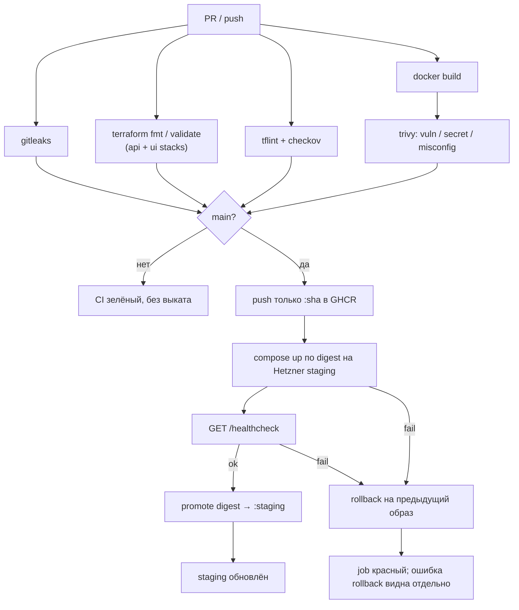

# CI/CD — API (команда 6)

| | |
|---|---|
| Статус | рабочий каркас пайплайна |
| Владелец | инфраструктура (роль 3) |
| Связанные документы | [INFRASTRUCTURE.md](INFRASTRUCTURE.md), [SECRETS.md](SECRETS.md) |

Пайплайн собирает FastAPI-бэкенд в OCI-образ, проверяет инфраструктурный код и выкатывает образ на staging-VM в Hetzner Cloud вместе с PostgreSQL. Реестр — **GitHub Container Registry**.

---

## 1. Конвейер



| Job | Когда | Permissions | Что делает |
|---|---|---|---|
| `Secret scan` | PR и `main` | `contents: read` | Gitleaks с `.gitleaks.toml` и `--redact` (сканирует docs и examples) |
| `Terraform fmt / validate` | PR и `main` | `contents: read` | `fmt -check`, `validate` для `api-staging` и `ui-staging` |
| `Terraform lint / security` | PR и `main` | `contents: read` | TFLint + Checkov |
| `Docker image build` | PR и `main` | `contents: read` | образ `python:3.13-slim` |
| `Docker image security scan` | после сборки | `contents: read` | Trivy `CRITICAL`/`HIGH` |
| `Push Docker image` | только `main` | `contents: read`, `packages: write`, `actions: read` | push `:sha`, resolve digest (тот же artifact, что прошёл Trivy) |
| `Deploy staging` | только `main` | `contents: read`, `packages: read` | Compose по digest, health check, авто-rollback при ошибке deploy или health |
| `Promote staging tag` | после успешного health check | `contents: read`, `packages: write` | под lock `staging-deploy` читает `.deploy-state` на VM; если там всё ещё этот digest — `:staging-previous` ← `:staging`, `:staging` ← проверенный digest, иначе warning и пропуск |

Корневые permissions workflow: `contents: read`. Остальное — только у job, которому это нужно.

---

## 2. Инструкция по deployment

Стенд должен уже существовать ([INFRASTRUCTURE.md](INFRASTRUCTURE.md)). Secrets и variables — [SECRETS.md](SECRETS.md).

1. Settings → Environments → `staging`: заполнить secrets/variables, включить required reviewers.
2. Push (или merge) в `main`.
3. Дождаться зелёных проверок и job **Push Docker image** (immutable `:sha` + digest в логах).
4. Job **Deploy staging** копирует `deploy/` на `/opt/dmc-268-api`, выкатывает образ по digest; bootstrap снимается только после `docker pull` и перед `compose up`.
5. Runner проверяет `GET /healthcheck` снаружи (`STAGING_HEALTH_URL` или `http://$STAGING_HOST/healthcheck`, 12 × 5 с).
6. Успех: job **Promote staging tag** продвигает проверенный digest в `:staging`, прежний `:staging` сохраняется как `:staging-previous`. Неуспех deploy или health: авто-rollback (первый выкат без previous → bootstrap), отдельное сообщение при ошибке rollback, job красный.

Повторный ручной запуск того же workflow: **Actions → CI/CD → Run workflow** (ветка `main`).

Локально образ без выката:

```bash
docker build -t dmc-268-api:local .
docker run --rm -p 8000:8000 dmc-268-api:local
curl -fsS http://127.0.0.1:8000/healthcheck
```

---

## 3. Образ и health check

Образ слушает `:8000`, Uvicorn `app.main:app`, пользователь `app`.

```http
GET /healthcheck
200 {"status":"ok"}
```

PostgreSQL только во внутренней docker-сети. Том `postgres-data` переживает выкат и rollback API-образа.

---

## 4. Container Registry

| Параметр | Значение |
|---|---|
| Host | `ghcr.io` |
| Repository | `ghcr.io/<owner>/dmc-268-api-t6` |
| Auth CI | `GITHUB_TOKEN` |
| Auth staging | тот же token, только на время `docker pull`, затем `docker logout` |
| Теги | `:<git-sha>` + `@sha256:…` (deploy), `:staging`, `:staging-previous` |

---

## 5. Rollback

1. **Автоматический.** Deploy или health check не прошли → `rollback.sh` с `ROLLBACK_MODE=auto` поднимает образ из `.deploy-state.previous` и не записывает упавший образ в previous: повторный откат не вернёт сломанный релиз. На первом выкате без previous release восстанавливается bootstrap nginx. При падении `compose up` rollback вызывается и из `deploy.sh`. Данные PostgreSQL не сбрасываются. Тег `:staging` в GHCR не меняется до успешного health check.
2. **Ручной.** Actions → **Rollback staging** → Run workflow, ветка `main` (с другой ветки jobs пропускаются; Environment `staging` тоже ограничен веткой `main`, см. [SECRETS.md](SECRETS.md)).
   - `reason` — обязателен.
   - Пустой `image` — предыдущий релиз из `.deploy-state.previous`; релиз, с которого откатились, становится новым previous (как `:staging` → `:staging-previous`).
   - Конкретная версия — полный 40-символьный git SHA (→ `ghcr.io/<owner>/dmc-268-api-t6:<sha>`) или полный `ghcr.io/...@sha256:...`. Короткий SHA или `staging-previous` откатят VM, но promotion упадёт: в `:staging` продвигается только digest или тег полного SHA образа `ghcr.io/<owner>/dmc-268-api-t6`; образ из другого реестра или репозитория валит promotion.
3. После отката проверка снаружи: для образа API — `/healthcheck`, для bootstrap — `GET /` с HTTP 200. Workflow синхронизирует `:staging` с фактически запущенным образом; bootstrap пропускает promotion, неожиданная ссылка на образ валит job.
4. Deploy, promotion и rollback делят группу `staging-deploy` без отмены друг друга. Если ручной rollback успел пройти между deploy и promotion, promotion видит на VM другой образ и не перезаписывает `:staging` (warning в job). Ожидающий job в группе GitHub отменяет, когда в неё встаёт следующий, — отменённая promotion безопасна: `:staging` просто не меняется.

На VM:

```bash
read -rs GHCR_TOKEN && export GHCR_TOKEN GHCR_USER=<github-user>   # PAT с read:packages, не попадает в history
/opt/dmc-268-api/rollback.sh
/opt/dmc-268-api/rollback.sh ghcr.io/<owner>/dmc-268-api-t6@sha256:<digest>
```

Пакет в GHCR приватный: без `GHCR_TOKEN` `docker pull` на VM упадёт. Скрипт логинится только на время pull и делает `docker logout` при выходе.

---

## 6. Secrets и permissions

Перечень, хранение, доставка на VM и запрет утечек в git/логи — [SECRETS.md](SECRETS.md).

Кратко: в Environment `staging` секреты — только `STAGING_SSH_KEY` и `POSTGRES_PASSWORD`. Хост, SSH-порт (`STAGING_SSH_PORT`) и SSH-пользователь — variables. `HCLOUD_TOKEN` в Actions нет.

SSH на VM: нестандартный порт (`ssh_port`, по умолчанию `22022`), только ключи, fail2ban. Порт открыт миру намеренно — у GitHub-hosted runners нет стабильных egress IP ([INFRASTRUCTURE.md](INFRASTRUCTURE.md#41-ssh-доступ)). Все шаги `appleboy/*` передают `port: ${{ vars.STAGING_SSH_PORT }}`; deploy, promotion и rollback падают первым шагом, если не задан `STAGING_SSH_PORT` или `STAGING_SSH_FINGERPRINT` не в формате `SHA256:…` (с пустым fingerprint appleboy принимает любой host key).

---

## 7. Локальные команды CI

```bash
docker run --rm -v "$PWD:/src:ro" ghcr.io/gitleaks/gitleaks:v8.28.0 \
  detect --source /src --config /src/.gitleaks.toml --no-banner --redact --exit-code 1

terraform fmt -check -diff -recursive terraform/
for stack in terraform/api-staging terraform/ui-staging; do
  terraform -chdir="${stack}" init -backend=false -input=false -lockfile=readonly
  terraform -chdir="${stack}" validate
done
tflint --init && tflint --recursive
checkov --config-file .checkov.yaml -d .

docker build -t dmc-268-api:local .
trivy image --severity CRITICAL,HIGH --exit-code 1 dmc-268-api:local
```

Проверка Gitleaks на контролируемом секрете (вне git): временно добавьте строку `password = "gitleaks-test-secret-do-not-commit"` в любой файл, запустите команду выше — scan должен завершиться с exit code 1.
