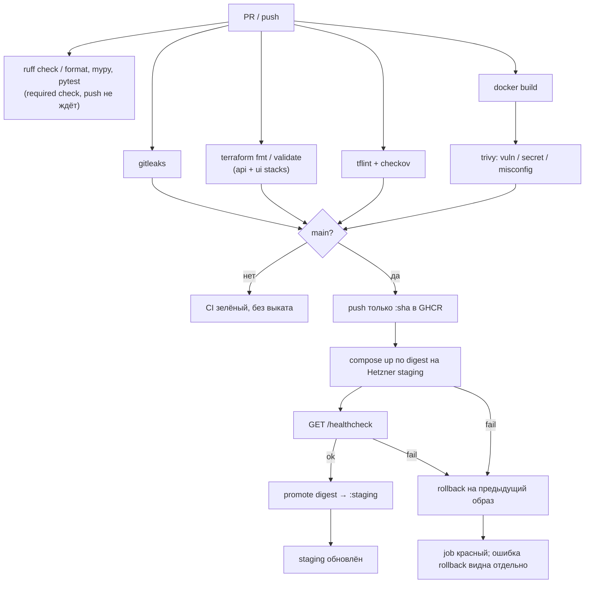

# CI/CD — API (команда 6)

| | |
|---|---|
| Статус | рабочий каркас пайплайна |
| Владелец | инфраструктура (роль 3) |
| Связанные документы | [INFRASTRUCTURE.md](INFRASTRUCTURE.md), [SECRETS.md](SECRETS.md) |

Пайплайн собирает FastAPI-бэкенд в OCI-образ, проверяет инфраструктурный код и выкатывает образ на staging-VM в Hetzner Cloud вместе с PostgreSQL. Реестр — **GitHub Container Registry**.

---

## 1. Конвейер



| Job | Когда | Permissions | Что делает |
|---|---|---|---|
| `Secret scan` | PR и `main` | `contents: read` | Gitleaks с `.gitleaks.toml` и `--redact` (сканирует docs и examples) |
| `Terraform fmt / validate` | PR и `main` | `contents: read` | `fmt -check`, `validate` для `api-staging` и `ui-staging` |
| `Terraform lint / security` | PR и `main` | `contents: read` | TFLint + Checkov (встроенные и custom policies `.checkov/policies`); отдельный шаг проверяет, что каждая custom policy падает на `.checkov/fixtures/bad` |
| `Python lint / type / test` | PR и `main` | `contents: read` | uv 0.12.11, Python 3.13: `uv sync --locked --all-groups`, `ruff check`, `ruff format --check` (Markdown исключён в `pyproject.toml`), `mypy`, `pytest`. Имя — required check в правилах `main`, менять только вместе с ними. В `needs` у `Push Docker image` не входит. Интеграционные тесты без `TEST_DATABASE_URL` пропускаются |
| `Docker image build` | PR и `main` | `contents: read` | образ `python:3.13-slim` |
| `Docker image security scan` | после сборки | `contents: read` | Trivy `CRITICAL`/`HIGH` |
| `Push Docker image` | только `main` | `contents: read`, `packages: write`, `actions: read` | push `:sha`, resolve digest (тот же artifact, что прошёл Trivy) |
| `Deploy staging` | только `main` | `contents: read`, `packages: read` | выбор цели (курсовой VPS или Terraform-хост, §8), подготовка хоста (Docker, на VPS — edge-прокси), Compose по digest, health check, авто-rollback при ошибке deploy или health |
| `Promote staging tag` | после успешного health check | `contents: read`, `packages: write` | под lock `staging-deploy` читает `.deploy-state` на VM; если там всё ещё этот digest — `:staging-previous` ← `:staging`, `:staging` ← проверенный digest, иначе warning и пропуск |

Корневые permissions workflow: `contents: read`. Остальное — только у job, которому это нужно.

---

## 2. Инструкция по deployment

Стенд должен уже существовать ([INFRASTRUCTURE.md](INFRASTRUCTURE.md)). Secrets и variables — [SECRETS.md](SECRETS.md).

1. Settings → Environments → `staging`: Deployment branches → только `main`; для Terraform-хоста заполнить secrets/variables environment (для курсового VPS хватает organization secrets и repository variables, §8). Required reviewers по умолчанию не включать — см. [SECRETS.md](SECRETS.md) §2.
2. Push (или merge) в `main`.
3. Дождаться зелёных проверок и job **Push Docker image** (immutable `:sha` + digest в логах).
4. Job **Deploy staging** выбирает цель (§8), копирует `deploy/` в `APP_DIR` (`/opt/dmc-268-api` на Terraform-хосте, `/opt/dmc-268-api-staging` на курсовом VPS), готовит хост и выкатывает образ по digest; bootstrap снимается только после `docker pull` и перед `compose up`.
5. Runner проверяет `GET /healthcheck` снаружи, 12 × 5 с: Terraform-хост — `STAGING_HEALTH_URL` или `http://$STAGING_HOST/healthcheck`; курсовой VPS — `https://staging-api.<APP_DOMAIN>/healthcheck` через edge-прокси.
6. Успех: job **Promote staging tag** продвигает проверенный digest в `:staging`, прежний `:staging` сохраняется как `:staging-previous`. Неуспех deploy или health: авто-rollback (первый выкат без previous → bootstrap), отдельное сообщение при ошибке rollback, job красный.

Повторный ручной запуск того же workflow: **Actions → CI/CD → Run workflow** (ветка `main`).

Локально образ без выката:

```bash
docker build -t dmc-268-api:local .
docker run --rm -p 8000:8000 dmc-268-api:local
curl -fsS http://127.0.0.1:8000/healthcheck
```

---

## 3. Образ и health check

Образ слушает `:8000`, Uvicorn `app.main:app`, пользователь `app`.

```http
GET /healthcheck
200 {"status":"ok"}
```

PostgreSQL только во внутренней docker-сети. Том `postgres-data` переживает выкат и rollback API-образа.

---

## 4. Container Registry

| Параметр | Значение |
|---|---|
| Host | `ghcr.io` |
| Repository | `ghcr.io/<owner>/dmc-268-api-t6` |
| Auth CI | `GITHUB_TOKEN` |
| Auth staging | тот же token, только на время `docker pull`, затем `docker logout` |
| Теги | `:<git-sha>` + `@sha256:…` (deploy), `:staging`, `:staging-previous` |

---

## 5. Rollback

1. **Автоматический.** Deploy или health check не прошли → `rollback.sh` с `ROLLBACK_MODE=auto` поднимает образ из `.deploy-state.previous` и не записывает упавший образ в previous: повторный откат не вернёт сломанный релиз. На первом выкате без previous release восстанавливается bootstrap nginx. При падении `compose up` rollback вызывается и из `deploy.sh`. Данные PostgreSQL не сбрасываются. Тег `:staging` в GHCR не меняется до успешного health check.
2. **Ручной.** Actions → **Rollback staging** → Run workflow, ветка `main` (с другой ветки jobs пропускаются; Environment `staging` тоже ограничен веткой `main`, см. [SECRETS.md](SECRETS.md)).
   - `reason` — обязателен.
   - Пустой `image` — предыдущий релиз из `.deploy-state.previous`; релиз, с которого откатились, становится новым previous (как `:staging` → `:staging-previous`).
   - Конкретная версия — полный 40-символьный git SHA (→ `ghcr.io/<owner>/dmc-268-api-t6:<sha>`) или полный `ghcr.io/...@sha256:...`. Короткий SHA или `staging-previous` откатят VM, но promotion упадёт: в `:staging` продвигается только digest или тег полного SHA образа `ghcr.io/<owner>/dmc-268-api-t6`; образ из другого реестра или репозитория валит promotion.
3. После отката проверка снаружи: для образа API — `/healthcheck`, для bootstrap — `GET /` с HTTP 200. Workflow синхронизирует `:staging` с фактически запущенным образом; bootstrap пропускает promotion, неожиданная ссылка на образ валит job.
4. Deploy, promotion и rollback делят группу `staging-deploy`; выполняющийся job не отменяется (`cancel-in-progress: false`). Если ручной rollback успел пройти между deploy и promotion, promotion видит на VM другой образ и не перезаписывает `:staging` (warning в job). Ожидающий job в группе GitHub отменяет, когда в неё встаёт следующий, — отменённая promotion безопасна: `:staging` просто не меняется.
5. **Отмена в очереди.** GitHub держит в группе concurrency один выполняющийся и только самый новый ожидающий run/job. Ожидающий **Rollback staging** отменится, если следом в группу встанет deploy из нового push в `main`, и наоборот: ожидающий deploy отменяется rollback, вставшим в очередь позже. Runbook на инцидент:
   1. Заморозить merge в `main` на время инцидента.
   2. Запустить **Rollback staging**.
   3. Если run показал `cancelled` — запустить заново (Re-run или новый Run workflow).
   4. Снять заморозку после зелёного rollback и внешней проверки.

На VM:

```bash
read -rs GHCR_TOKEN && export GHCR_TOKEN GHCR_USER=<github-user>   # PAT с read:packages, не попадает в history
/opt/dmc-268-api/rollback.sh
/opt/dmc-268-api/rollback.sh ghcr.io/<owner>/dmc-268-api-t6@sha256:<digest>
# курсовой VPS: APP_DIR обязателен, иначе скрипт возьмёт /opt/dmc-268-api
APP_DIR=/opt/dmc-268-api-staging /opt/dmc-268-api-staging/rollback.sh
```

Пакет в GHCR приватный: без `GHCR_TOKEN` `docker pull` на VM упадёт. Скрипт логинится только на время pull и делает `docker logout` при выходе.

---

## 6. Secrets и permissions

Перечень, хранение, доставка на VM и запрет утечек в git/логи — [SECRETS.md](SECRETS.md).

Кратко: курсовой VPS — organization variable `VPS_DMC268_IP_T6` и secrets `VPS_DMC268_U` / `VPS_DMC268_P`, плюс repository variables `STAGING_SSH_FINGERPRINT` и `APP_DOMAIN`. Terraform-хост — Environment `staging`: secret `STAGING_SSH_KEY`, variables хоста, SSH-порта и пользователя. `POSTGRES_PASSWORD` необязателен (генерируется на хосте). `AI_DMC268_T6` — ключ приложения, CI его не использует. `HCLOUD_TOKEN` в Actions нет.

SSH на Terraform-хосте: нестандартный порт (`ssh_port`, по умолчанию `22022`), только ключи, fail2ban. На курсовом VPS — порт 22 и пароль; sshd и firewall общего VPS не меняем. Порт открыт миру намеренно — у GitHub-hosted runners нет стабильных egress IP ([INFRASTRUCTURE.md](INFRASTRUCTURE.md#41-ssh-доступ)). Все шаги `appleboy/*` берут хост, порт и способ входа из шага **Resolve staging target**: ключ уходит только на Terraform-хост, пароль — только на VPS. Deploy, promotion и rollback падают первым шагом, если цель задана не полностью или `STAGING_SSH_FINGERPRINT` не в формате `SHA256:…` (с пустым fingerprint appleboy принимает любой host key).

---

## 7. Локальные команды CI

```bash
docker run --rm -v "$PWD:/src:ro" ghcr.io/gitleaks/gitleaks:v8.28.0 \
  detect --source /src --config /src/.gitleaks.toml --no-banner --redact --exit-code 1

terraform fmt -check -diff -recursive terraform/
for stack in terraform/api-staging terraform/ui-staging; do
  terraform -chdir="${stack}" init -backend=false -input=false -lockfile=readonly
  terraform -chdir="${stack}" validate
done
tflint --init && tflint --recursive
checkov --config-file .checkov.yaml -d .

uv sync --locked --all-groups
uv run ruff check .
uv run ruff format --check .
uv run mypy .
uv run pytest

docker build -t dmc-268-api:local .
trivy image --severity CRITICAL,HIGH --exit-code 1 dmc-268-api:local
```

Проверка Gitleaks на контролируемом секрете (вне git): временно добавьте строку `password = "gitleaks-test-secret-do-not-commit"` в любой файл, запустите команду выше — scan должен завершиться с exit code 1.

---

## 8. Курсовой VPS и edge-прокси

### 8.1. Две цели

Шаг **Resolve staging target** выбирает цель в `deploy-staging`, `promote-staging` и Rollback:

| | Курсовой VPS | Terraform / Hetzner |
|---|---|---|
| Когда | `STAGING_HOST` пуст | задан `STAGING_HOST` |
| SSH | `VPS_DMC268_IP_T6`:22, `VPS_DMC268_U` + пароль `VPS_DMC268_P` | `STAGING_HOST`:`STAGING_SSH_PORT` (22022), `STAGING_SSH_USER` + ключ `STAGING_SSH_KEY` |
| Host key | repository variable `STAGING_SSH_FINGERPRINT` | тот же variable (значение на уровне environment перекрывает repository) |
| `APP_DIR` / compose project | `/opt/dmc-268-api-staging` / `dmc-268-api-staging` | `/opt/dmc-268-api` / `dmc-268-api` |
| Публикация API | без host-порта: сеть `dmc268-edge`, alias `api-staging` (`compose.edge.yml`) | host-порт 80 (`compose.ports.yml`), без edge |
| URL | `https://staging-api.<APP_DOMAIN>` (нужен `APP_DOMAIN`) | `http://<STAGING_HOST>` |
| Docker | ставит CI (`provision.sh`, пакеты Debian) | из cloud-init, `provision.sh` ничего не делает |

Режим (`DEPLOY_MODE=edge|ports`) и alias сохраняются в `<APP_DIR>/.env`; ручной `rollback.sh` на хосте читает их оттуда.

При переключении цели (задать или очистить `STAGING_HOST`) обновите `STAGING_SSH_FINGERPRINT` под новый хост: при несовпадении host key все SSH-шаги падают, выката на чужой хост не будет.

### 8.2. Edge-прокси

Caddy (compose project `dmc-268-edge`, `/opt/dmc-268-edge`) принимает 80/443 на VPS, выпускает сертификаты Let's Encrypt и перенаправляет HTTP на HTTPS. Сертификаты лежат в томе `caddy_data` и переживают перевыкат.

- **Владелец — репозиторий API.** Каждый выкат API на VPS (и Rollback) обновляет прокси: `up -d --wait`, затем `caddy reload`. Репозиторий UI и другие сервисы прокси **не выкатывают** и `deploy/edge/` не копируют.
- Изменение маршрутов — PR в `deploy/edge/Caddyfile` этого репозитория.
- Перед выкатом приложения (и перед Rollback) job до 180 с ждёт успешного TLS-рукопожатия с `https://staging-api.<APP_DOMAIN>/` (любой HTTP-статус, 502 тоже). Без сертификата job падает до изменений на хосте, поэтому медленный первый выпуск в Let's Encrypt не запускает авто-rollback.

| Hostname (`APP_DOMAIN` = `dmc268-t6.axyi.ru`) | Upstream в `dmc268-edge` | Статус |
|---|---|---|
| `staging-api.<APP_DOMAIN>` | `api-staging:8000` | выкатывается этим репозиторием |
| `api.<APP_DOMAIN>` | `api-prod:8000` | маршрут есть, prod-выката пока нет → 502 |
| `staging-ui.<APP_DOMAIN>` | `ui-staging:8080` | выкатывает репозиторий UI |
| `ui.<APP_DOMAIN>` | `ui-prod:8080` | 502 до prod-выката |
| `staging-webhook.<APP_DOMAIN>` | `webhook-staging:8000` | будущий сервис → 502 |
| `webhook.<APP_DOMAIN>` | `webhook-prod:8000` | будущий сервис → 502 |
| `<APP_DOMAIN>` | — | 301 на `https://ui.<APP_DOMAIN>{uri}` |

Контракт для сервиса за прокси: подключиться к внешней docker-сети `dmc268-edge` с alias `<service>-<env>` и слушать порт из таблицы; host-порты на VPS не публиковать (80/443 заняты прокси). Пока upstream не запущен, маршрут отвечает 502, остальные работают. Webhook в MVP — отдельный сервис; роль API gateway выполняет этот прокси.

HSTS: `max-age=31536000` без `includeSubDomains` и `preload`. ACME email не задан.

