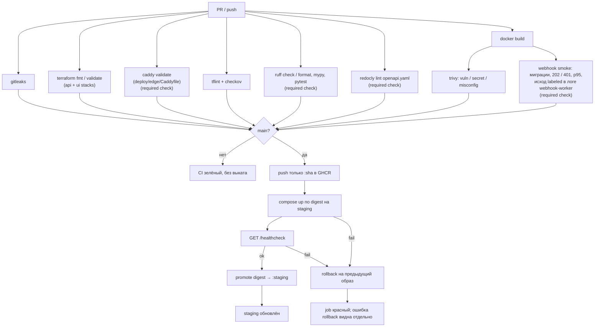

# CI/CD — API (команда 6)

| | |
|---|---|
| Статус | рабочий каркас пайплайна |
| Владелец | инфраструктура (роль 3) |
| Связанные документы | [INFRASTRUCTURE.md](INFRASTRUCTURE.md), [SECRETS.md](SECRETS.md) |

Пайплайн собирает FastAPI-бэкенд в OCI-образ, проверяет инфраструктурный код и выкатывает образ на staging — курсовой VPS (§8; Terraform-хост в Hetzner — задокументированная альтернатива). Вместе с `api` на staging работают воркеры `worker` и `webhook-worker` из того же образа, PostgreSQL 17, RabbitMQ (брокер очереди) и Redis (только кэш) — §3. Реестр — **GitHub Container Registry**.

---

## 1. Конвейер


```mermaid
flowchart TD
  pr["PR / push"] --> secrets["gitleaks"]
  pr --> tf["terraform fmt / validate\n(api + ui stacks)"]
  pr --> caddy["caddy validate\n(deploy/edge/Caddyfile)\n(required check)"]
  pr --> lint["tflint + checkov"]
  pr --> py["ruff check / format, mypy, pytest\n(required check)"]
  pr --> oas["redocly lint openapi.yaml\n(required check)"]
  pr --> build["docker build"]
  build --> scan["trivy: vuln / secret / misconfig"]
  build --> smoke["webhook smoke: миграции, 202 / 401, p95,\nисход labeled в логе webhook-worker\n(required check)"]
  secrets --> gate{"main?"}
  py --> gate
  tf --> gate
  caddy --> gate
  lint --> gate
  scan --> gate
  oas --> gate
  smoke --> gate
  gate -->|нет| stop["CI зелёный, без выката"]
  gate -->|да| push["push только :sha в GHCR"]
  push --> deploy["compose up по digest на staging"]
  deploy --> health["GET /healthcheck"]
  health -->|ok| promote["promote digest → :staging"]
  promote --> done["staging обновлён"]
  health -->|fail| rb["rollback на предыдущий образ"]
  deploy -->|fail| rb
  rb --> fail["job красный; ошибка rollback видна отдельно"]
```

| Job | Когда | Permissions | Что делает |
|---|---|---|---|
| `Secret scan` | PR и `main` | `contents: read` | Gitleaks с `.gitleaks.toml` и `--redact` (сканирует docs и examples) |
| `Terraform fmt / validate` | PR и `main` | `contents: read` | `fmt -check`, `validate` для `api-staging` и `ui-staging` |
| `Edge Caddyfile validate` | PR и `main` | `contents: read` | `caddy validate` для `deploy/edge/Caddyfile` с `APP_DOMAIN=example.test` — та же команда, что вручную (§8.2); образ caddy читается из `deploy/edge/compose.yml`, второго тега в workflow нет. Имя — required check в правилах `main`, менять только вместе с ними. Входит в `needs` у `Push Docker image`: Caddyfile с ошибкой не доходит до `caddy reload` при выкате |
| `Terraform lint / security` | PR и `main` | `contents: read` | TFLint + Checkov (встроенные и custom policies `.checkov/policies`); отдельный шаг проверяет, что каждая custom policy падает на `.checkov/fixtures/bad` |
| `Python lint / type / test` | PR и `main` | `contents: read` | uv 0.12.11, Python 3.13: `uv sync --locked --all-groups`, `ruff check`, `ruff format --check` (Markdown исключён в `pyproject.toml`), `mypy`, `pytest`. Имя — required check в правилах `main`, менять только вместе с ними. Входит в `needs` у `Push Docker image`: с красными тестами образ не пушится и staging не выкатывается. Шаг «Gold corpus and recorded replay» запускает `validate_dataset.py --final` и `eval_replay.py` по закоммиченному baseline; без response manifest job падает. Интеграционные тесты идут против service-контейнеров PostgreSQL 17 и RabbitMQ 4 этого job (`TEST_DATABASE_URL`, `RABBITMQ_URL`); шаг «Integration suite (zero skips)» (`pytest -m integration`) падает, если хоть один тест skipped |
| `OpenAPI lint` | PR и `main` | `contents: read` | Redocly CLI 2.57.0: `npx --yes @redocly/cli@2.57.0 lint contracts/openapi.yaml` — та же команда, что локально (PIPELINE_SPEC §16); `redocly.yaml` расширяет `recommended-strict`, поэтому любое предупреждение — ошибка, осознанные исключения — `.redocly.lint-ignore.yaml`. Имя — required check в правилах `main` (с 04.10.2026), менять только вместе с ними. Входит в `needs` у `Push Docker image` |
| `Docker image build` | PR и `main` | `contents: read` | образ `python:3.13-slim` |
| `Docker image security scan` | после сборки | `contents: read` | Trivy `CRITICAL`/`HIGH` |
| `Webhook container smoke` | PR и `main` | `contents: read` | после `Docker image build`: собранный образ применяет миграции (`alembic upgrade head`) к service-контейнеру PostgreSQL 17 и стартует API с одноразовым `GITHUB_WEBHOOK_SECRET` (`openssl rand`, маскируется, не секрет репозитория); после `GET /healthcheck` — `scripts/webhook_smoke.py --count 50`: подписанная доставка → 202 `pending`, повтор → 202 `duplicate`, испорченная подпись → 401, 50 новых доставок → 202 и p50/p95/max. Затем стартуют заглушка GitHub `scripts/github_stub.py` (порт 9999) и `webhook-worker` из того же образа (`python -m app.webhook_worker`, одноразовый ключ App из `openssl genrsa`, `GITHUB_API_URL` на заглушку); job до 90 с ждёт в его логе строку исхода доставки `labeled` — `status=ignored_unknown_repository detail=action=labeled unknown_repository` (репозиторий 101 не заведён, Run не создаётся, RabbitMQ не нужен); при падении печатает логи воркера и заглушки. Имя — required check в правилах `main` (с 04.10.2026), менять только вместе с ними. Входит в `needs` у `Push Docker image` |
| `Push Docker image` | только `main` | `contents: read`, `packages: write`, `actions: read` | push `:sha`, resolve digest (тот же artifact, что прошёл Trivy) |
| `Deploy staging` | только `main` | `contents: read`, `packages: read` | выбор цели (курсовой VPS или Terraform-хост, §8), подготовка хоста (Docker, на VPS — edge-прокси), Compose по digest, health check, авто-rollback при ошибке deploy или health |
| `Promote staging tag` | после успешного health check | `contents: read`, `packages: write` | под lock `staging-deploy` читает `.deploy-state` на VM; если там всё ещё этот digest — `:staging-previous` ← `:staging`, `:staging` ← проверенный digest, иначе warning и пропуск |

Корневые permissions workflow: `contents: read`. Остальное — только у job, которому это нужно.

---

## 2. Инструкция по deployment

Стенд должен уже существовать ([INFRASTRUCTURE.md](INFRASTRUCTURE.md)). Secrets и variables — [SECRETS.md](SECRETS.md).

1. Settings → Environments → `staging`: Deployment branches → только `main`; для Terraform-хоста заполнить secrets/variables environment (доступ к курсовому VPS — organization secrets и repository variables, §8). Для ссылки на конкретный Run задать публичную Environment variable `PORTAL_URL` адресом UI (§2.1). Required reviewers по умолчанию не включать — см. [SECRETS.md](SECRETS.md) §2.
2. Push (или merge) в `main`.
3. Дождаться зелёных проверок и job **Push Docker image** (immutable `:sha` + digest в логах).
4. Job **Deploy staging** выбирает цель (§8), копирует `deploy/` в `APP_DIR` (`/opt/dmc-268-api` на Terraform-хосте, `/opt/dmc-268-api-staging` на курсовом VPS), готовит хост и выкатывает образ по digest; bootstrap снимается только после `docker pull` и перед `compose up`.
5. Runner проверяет `GET /healthcheck` снаружи, 12 × 5 с: Terraform-хост — `STAGING_HEALTH_URL` или `http://$STAGING_HOST/healthcheck`; курсовой VPS — `https://staging-api.<APP_DOMAIN>/healthcheck` через edge-прокси.
6. Успех: job **Promote staging tag** продвигает проверенный digest в `:staging`, прежний `:staging` сохраняется как `:staging-previous`. Неуспех deploy или health: авто-rollback (первый выкат без previous → bootstrap), отдельное сообщение при ошибке rollback, job красный.

Повторный ручной запуск того же workflow: **Actions → CI/CD → Run workflow** (ветка `main`).

Локально образ без выката:

```bash
docker build -t dmc-268-api:local .
docker run --rm -p 8000:8000 dmc-268-api:local
curl -fsS http://127.0.0.1:8000/healthcheck
```

### 2.1. Проверка ссылки на Run (#111)

До штатного выката настройте публичную variable (для текущего staging задана
и прочитана обратно 10.10.2026):

```bash
gh variable set PORTAL_URL --env staging -R larchanka-training/dmc-268-api-t6 \
  --body 'https://staging-ui.dmc268-t6.axyi.ru'
gh variable list --env staging -R larchanka-training/dmc-268-api-t6 \
  --json name,value --jq '.[] | select(.name == "PORTAL_URL")'
```

Workflow читает `vars.PORTAL_URL` в «Bundle application secrets», включает ключ
в `names` → `APP_SECRETS_B64` → `env-file.sh` (`WORKER_ENV_KEYS`) → `worker.env`
→ только review-worker (`worker`). Незаданное/пустое итоговое значение не создаёт
ключ: worker стартует без ссылки. Environment перекрывает одноимённую repository
variable. URL не выводится из `STAGING_HEALTH_URL` или API-домена; для отдельного
UI на Terraform-хосте задайте его origin явно. Rollback сохраняет текущий
`worker.env`, включая URL, записанный перед неуспешным выкатом.

После reviewed merge в `main` и зелёного **Deploy staging** проверьте на хосте
только публичный ключ, не печатая остальные переменные. Для курсового VPS:

```bash
cd /opt/dmc-268-api-staging
docker compose -p dmc-268-api-staging -f compose.yml -f compose.edge.yml --env-file .env \
  exec -T worker python -c 'import os; print(os.environ.get("PORTAL_URL"))'
```

Ожидается `https://staging-ui.dmc268-t6.axyi.ru`. На Terraform-хосте используйте
`/opt/dmc-268-api`, проект `dmc-268-api` и `compose.ports.yml` (§8).
В подключённом `axyi/dmc268-t6-sandbox` запустите новый обычный review с настоящим
GitHub App/LLM: открытый PR, новый head с зелёным CI и активным `ai-review`.
Дождитесь завершения и запишите UUID этого Run из портала. Старый check-run
не подтверждает доставку новой настройки; PR CI не выкатывает staging.

С рабочей машины получите check-runs нового head, выберите `id`, чей
`external_id` совпадает с UUID нового Run, и проверьте его summary:

```bash
head_sha='<полный SHA нового sandbox head>'
run_id='<UUID нового Run из портала>'
gh api "repos/axyi/dmc268-t6-sandbox/commits/${head_sha}/check-runs?check_name=AI%20Review&filter=all&per_page=100" \
  --paginate --jq '.check_runs[] | {id, external_id, html_url, status}'
check_run_id='<id выбранного check-run>'
gh api "repos/axyi/dmc268-t6-sandbox/check-runs/${check_run_id}" > /tmp/check-run-111.json
jq -e --arg run_id "${run_id}" --arg head_sha "${head_sha}" \
  --arg url "https://staging-ui.dmc268-t6.axyi.ru/runs/${run_id}" \
  '.name == "AI Review" and .status == "completed" and .head_sha == $head_sha
   and .external_id == $run_id and (.output.summary | contains($url))' /tmp/check-run-111.json
jq -r '.html_url, .external_id, .head_sha, .output.summary' /tmp/check-run-111.json
```

Откройте URL `/runs/{run_id}` из summary в авторизованном портале и подтвердите
тот же Run UUID. К PR/приёмке приложите свежий `html_url` check-run, UUID,
SHA/digest staging и результат открытия страницы. Корневой `details_url` App
не заменяет эту проверку. Пока нет штатного deployment или нужного доступа,
live AC остаётся **pending**; зелёные локальные тесты его не подтверждают.

---

## 3. Образ и health check

Образ слушает `:8000`, Uvicorn `app.main:app`, пользователь `app`.

```http
GET /healthcheck
200 {"status":"ok"}
```

Сервисы staging (`deploy/compose/staging.yml`), все из одного compose-проекта:

| Сервис | Образ | Данные | Сеть |
|---|---|---|---|
| `api` | образ этого репозитория по digest | — | проектная + `dmc268-edge` (alias `api-staging`) |
| `bootstrap` | тот же образ, разово: `alembic upgrade head`, сид промптов | — | проектная |
| `worker` | тот же образ, `python -m app.worker` (#34): очереди ревью, leader-цикл | — | только проектная |
| `webhook-worker` | тот же образ, `python -m app.webhook_worker` (#11): разбор квитанций вебхуков | — | только проектная |
| `postgres` | `postgres:17.11-alpine`, по digest | том `postgres-data` | только проектная |
| `rabbitmq` | `rabbitmq:4.3.6-management-alpine`, по digest, `hostname: rabbitmq` | том `rabbitmq-data` | только проектная |
| `redis` | `redis:8.10.2-alpine`, по digest, пароль, без персистентности, `maxmemory 128mb` + `allkeys-lru` (кэш, SD §10) | — | только проектная |

У PostgreSQL, RabbitMQ и Redis нет `ports:`: `ports:` в compose публикует порт на все интерфейсы в обход файрвола хоста. Панель управления RabbitMQ — через SSH-туннель к IP контейнера. Тома `postgres-data` и `rabbitmq-data` переживают выкат и rollback образа. Фиксированный `hostname` RabbitMQ держит имя узла, а с ним каталог данных в томе: без него каждое пересоздание контейнера начинало бы новый узел, и durable-очереди пропадали бы.

Образы хранилищ запиннены по digest (`<имя>:<версия>@sha256:…`), как Caddy в `deploy/edge/compose.yml`. При наличии digest Docker игнорирует тег, поэтому перевыкат и rollback не сдвигают хранилище на другую сборку; тег оставлен как подпись версии. Обновление — отдельным PR: `docker buildx imagetools inspect postgres:<версия>-alpine`, строка `Digest:` (digest multi-arch индекса), тег и digest меняются вместе. Rollback берёт compose из текущего checkout, поэтому пин хранилища вместе с образом приложения не откатывается: revert-коммит возвращает прежнюю ссылку на образ, но совместимость данных при возврате на старую версию не гарантирует — обновление хранилища проверять до мержа. Локальный `docker-compose.yml` и service-контейнеры CI остаются на плавающих тегах (`17-alpine`, `4-management-alpine`, `8-alpine`).

`api` стартует после успешного `bootstrap` и здорового `postgres`. От RabbitMQ и Redis он не зависит: к брокеру API подключается при первой публикации (`LazyAmqpPublisher`), поэтому сбой брокера или кэша не мешает пересозданному `api` стартовать. `up --wait` всё равно ждёт healthcheck каждого сервиса, и падение любого запускает авто-rollback. Секреты приложения приходят в каждый контейнер только через env-файлы его роли: `api.env` → `api`, `app.env` (ключ App) → оба воркера, `worker.env` (LLM и `PORTAL_URL`) → `worker`, `webhook-worker.env` (логин бота) → `webhook-worker` — [SECRETS.md](SECRETS.md) §1, §3.

Воркеры стартуют после успешного `bootstrap` и здоровых `postgres` и `rabbitmq`: `worker` без брокера не объявит топологию очередей, а `webhook-worker` при проекции квитанций создаёт прогоны и публикует их в очередь ревью (#52). HTTP-порта у воркеров нет, поэтому HTTP-healthcheck образа у них заменён: процесс раз в 10 с трогает heartbeat-файл (`WORKER_HEARTBEAT_FILE`, `app/common/infrastructure/heartbeat.py`) — `worker` только после подключения обоих консьюмеров, — а healthcheck считает контейнер больным, если файлу больше 30 с. Воркер, упавший на старте (например, без `GITHUB_APP_BOT_LOGIN` или `RABBITMQ_URL`), или процесс с замороженным циклом событий не становится healthy, `up --wait` падает, и `deploy.sh` откатывает выкат. Heartbeat — отдельная задача того же цикла событий, поэтому зависшую работу он не ловит: застрявшее на одном сообщении ревью или проход `webhook-worker`, который каждый раз падает (например, с битым PEM App: ошибка уходит в лог, проход возвращает 0), оставляют контейнер healthy. Это намеренно: временная недоступность GitHub или БД не должна валить выкат; зависшую работу видно по логам и метрикам очередей, не по healthcheck. Docker не перезапускает контейнер, ставший unhealthy уже после выката: `restart: unless-stopped` срабатывает только при выходе процесса.

Откат (`rollback.sh`, авто и ручной) берёт compose из текущего checkout, а образ — предыдущий. Образ, собранный до heartbeat (до #35, часть 2), файл не трогает, поэтому healthcheck сначала проверяет, есть ли в образе `/srv/app/common/infrastructure/heartbeat.py`: нет — живой процесс считается здоровым (упавший на старте воркер `up --wait` всё равно не пройдёт), есть — строгая проверка возраста файла. Так откат на последний образ до воркеров проходит.

---

## 4. Container Registry

| Параметр | Значение |
|---|---|
| Host | `ghcr.io` |
| Repository | `ghcr.io/<owner>/dmc-268-api-t6` |
| Auth CI | `GITHUB_TOKEN` |
| Auth staging | тот же token, только на время `docker pull`, затем `docker logout` |
| Теги | `:<git-sha>` + `@sha256:…` (deploy), `:staging`, `:staging-previous` |

---

## 5. Rollback

1. **Автоматический.** Deploy или health check не прошли → `rollback.sh` с `ROLLBACK_MODE=auto` поднимает образ из `.deploy-state.previous` и не записывает упавший образ в previous: повторный откат не вернёт сломанный релиз. На первом выкате без previous release восстанавливается bootstrap nginx. При падении `compose up` rollback вызывается и из `deploy.sh`. Данные PostgreSQL не сбрасываются. Тег `:staging` в GHCR не меняется до успешного health check.
2. **Ручной.** Actions → **Rollback staging** → Run workflow, ветка `main` (с другой ветки jobs пропускаются; Environment `staging` тоже ограничен веткой `main`, см. [SECRETS.md](SECRETS.md)).
   - `reason` — обязателен.
   - Пустой `image` — предыдущий релиз из `.deploy-state.previous`; релиз, с которого откатились, становится новым previous (как `:staging` → `:staging-previous`).
   - Конкретная версия — полный 40-символьный git SHA (→ `ghcr.io/<owner>/dmc-268-api-t6:<sha>`) или полный `ghcr.io/...@sha256:...`. Короткий SHA или `staging-previous` откатят VM, но promotion упадёт: в `:staging` продвигается только digest или тег полного SHA образа `ghcr.io/<owner>/dmc-268-api-t6`; образ из другого реестра или репозитория валит promotion.
   - На курсовом VPS (режим `edge`) workflow выкладывает `deploy/edge/Caddyfile` из своего checkout и делает `caddy reload`, поэтому до первого обращения к хосту шаг `caddy validate` проверяет этот Caddyfile той же командой, что job `Edge Caddyfile validate`; при ошибке откат падает, не тронув VPS.
3. После отката проверка снаружи: для образа API — `/healthcheck`, для bootstrap — `GET /` с HTTP 200. Workflow синхронизирует `:staging` с фактически запущенным образом; bootstrap пропускает promotion, неожиданная ссылка на образ валит job.
4. Deploy, promotion и rollback делят группу `staging-deploy`; выполняющийся job не отменяется (`cancel-in-progress: false`). Если ручной rollback успел пройти между deploy и promotion, promotion видит на VM другой образ и не перезаписывает `:staging` (warning в job). Ожидающий job в группе GitHub отменяет, когда в неё встаёт следующий, — отменённая promotion безопасна: `:staging` просто не меняется.
5. **Отмена в очереди.** GitHub держит в группе concurrency один выполняющийся и только самый новый ожидающий run/job. Ожидающий **Rollback staging** отменится, если следом в группу встанет deploy из нового push в `main`, и наоборот: ожидающий deploy отменяется rollback, вставшим в очередь позже. Runbook на инцидент:
   1. Заморозить merge в `main` на время инцидента.
   2. Запустить **Rollback staging**.
   3. Если run показал `cancelled` — запустить заново (Re-run или новый Run workflow).
   4. Снять заморозку после зелёного rollback и внешней проверки.

На VM:

```bash
read -rs GHCR_TOKEN && export GHCR_TOKEN GHCR_USER=<github-user>   # PAT с read:packages, не попадает в history
/opt/dmc-268-api/rollback.sh
/opt/dmc-268-api/rollback.sh ghcr.io/<owner>/dmc-268-api-t6@sha256:<digest>
# курсовой VPS: APP_DIR обязателен, иначе скрипт возьмёт /opt/dmc-268-api
APP_DIR=/opt/dmc-268-api-staging /opt/dmc-268-api-staging/rollback.sh
```

Пакет в GHCR приватный: без `GHCR_TOKEN` `docker pull` на VM упадёт. Скрипт логинится только на время pull и делает `docker logout` при выходе.

---

## 6. Secrets и permissions

Перечень, хранение, доставка на VM и запрет утечек в git/логи — [SECRETS.md](SECRETS.md).

Кратко: курсовой VPS — organization variable `VPS_DMC268_IP_T6` и secrets `VPS_DMC268_U` / `VPS_DMC268_P`, плюс repository variables `STAGING_SSH_FINGERPRINT` и `APP_DOMAIN`. Terraform-хост — Environment `staging`: secret `STAGING_SSH_KEY`, variables хоста, SSH-порта и пользователя. `POSTGRES_PASSWORD` необязателен; пароли PostgreSQL, RabbitMQ и Redis генерируются на хосте. Секреты приложения (GitHub App, авторизация) — в Environment `staging`, в контейнеры их доставляет `deploy-staging` ([SECRETS.md](SECRETS.md) §1, §3). LLM-конфигурация `worker` — organization secret `AI_DMC268_T6` → `LLM_API_KEYS`, organization variable `AI_DMC268_URL` → `LLM_BASE_URL`, repository variables `LLM_MODEL` и `LLM_FALLBACK_MODEL` (одноимённая variable Environment `staging` их перекрывает). `HCLOUD_TOKEN` в Actions нет.

SSH на Terraform-хосте: нестандартный порт (`ssh_port`, по умолчанию `22022`), только ключи, fail2ban. На курсовом VPS — порт 22 и пароль; sshd и firewall общего VPS не меняем. Порт открыт миру намеренно — у GitHub-hosted runners нет стабильных egress IP ([INFRASTRUCTURE.md](INFRASTRUCTURE.md#41-ssh-доступ)). Все шаги `appleboy/*` берут хост, порт и способ входа из шага **Resolve staging target**: ключ уходит только на Terraform-хост, пароль — только на VPS. Deploy, promotion и rollback падают первым шагом, если цель задана не полностью или `STAGING_SSH_FINGERPRINT` не в формате `SHA256:…` (с пустым fingerprint appleboy принимает любой host key).

---

## 7. Локальные команды CI

```bash
docker run --rm -v "$PWD:/src:ro" ghcr.io/gitleaks/gitleaks:v8.28.0 \
  detect --source /src --config /src/.gitleaks.toml --no-banner --redact --exit-code 1

terraform fmt -check -diff -recursive terraform/
for stack in terraform/api-staging terraform/ui-staging; do
  terraform -chdir="${stack}" init -backend=false -input=false -lockfile=readonly
  terraform -chdir="${stack}" validate
done
tflint --init && tflint --recursive
checkov --config-file .checkov.yaml -d .

uv sync --locked --all-groups
uv run ruff check .
uv run ruff format --check .
uv run mypy .
uv run pytest

docker build -t dmc-268-api:local .
trivy image --severity CRITICAL,HIGH --exit-code 1 dmc-268-api:local
```

Проверка Gitleaks на контролируемом секрете (вне git): временно добавьте строку `password = "gitleaks-test-secret-do-not-commit"` в любой файл, запустите команду выше — scan должен завершиться с exit code 1.

---

## 8. Курсовой VPS и edge-прокси

### 8.1. Две цели

Шаг **Resolve staging target** выбирает цель в `deploy-staging`, `promote-staging` и Rollback:

| | Курсовой VPS | Terraform / Hetzner |
|---|---|---|
| Когда | `STAGING_HOST` пуст | задан `STAGING_HOST` |
| SSH | `VPS_DMC268_IP_T6`:22, `VPS_DMC268_U` + пароль `VPS_DMC268_P` | `STAGING_HOST`:`STAGING_SSH_PORT` (22022), `STAGING_SSH_USER` + ключ `STAGING_SSH_KEY` |
| Host key | repository variable `STAGING_SSH_FINGERPRINT` | тот же variable (значение на уровне environment перекрывает repository) |
| `APP_DIR` / compose project | `/opt/dmc-268-api-staging` / `dmc-268-api-staging` | `/opt/dmc-268-api` / `dmc-268-api` |
| Публикация API | без host-порта: сеть `dmc268-edge`, alias `api-staging` (`compose.edge.yml`) | host-порт 80 (`compose.ports.yml`), без edge |
| URL | `https://staging-api.<APP_DOMAIN>` (нужен `APP_DOMAIN`) | `http://<STAGING_HOST>` |
| Docker | ставит CI (`provision.sh`, пакеты Debian) | из cloud-init, `provision.sh` ничего не делает |

Режим (`DEPLOY_MODE=edge|ports`) и alias сохраняются в `<APP_DIR>/.env`; ручной `rollback.sh` на хосте читает их оттуда.

При переключении цели (задать или очистить `STAGING_HOST`) обновите `STAGING_SSH_FINGERPRINT` под новый хост: при несовпадении host key все SSH-шаги падают, выката на чужой хост не будет.

### 8.2. Edge-прокси

Caddy (compose project `dmc-268-edge`, `/opt/dmc-268-edge`) принимает 80/443 на VPS, выпускает сертификаты Let's Encrypt и перенаправляет HTTP на HTTPS. Сертификаты лежат в томе `caddy_data` и переживают перевыкат.

- **Владелец — репозиторий API.** Каждый выкат API на VPS (и Rollback) обновляет прокси: `up -d --wait`, затем `caddy reload`. Репозиторий UI и другие сервисы прокси **не выкатывают** и `deploy/edge/` не копируют.
- Изменение маршрутов — PR в `deploy/edge/Caddyfile` этого репозитория. Перед PR проверить конфигурацию тем же образом, что на VPS: `docker run --rm -e APP_DOMAIN=example.test -v "$PWD/deploy/edge:/etc/caddy:ro" <образ caddy из deploy/edge/compose.yml> caddy validate --config /etc/caddy/Caddyfile --adapter caddyfile`. Ту же проверку на каждом PR и push в `main` выполняет job `Edge Caddyfile validate` (§1).
- Перед выкатом приложения (и перед Rollback) job до 180 с ждёт успешного TLS-рукопожатия с `https://staging-api.<APP_DOMAIN>/` (любой HTTP-статус, 502 тоже). Без сертификата job падает до изменений на хосте, поэтому медленный первый выпуск в Let's Encrypt не запускает авто-rollback.

| Hostname (`APP_DOMAIN` = `dmc268-t6.axyi.ru`) | Upstream в `dmc268-edge` | Статус |
|---|---|---|
| `staging-api.<APP_DOMAIN>` | `api-staging:8000` | выкатывается этим репозиторием |
| `api.<APP_DOMAIN>` | `api-prod:8000` | prod-выката пока нет → заглушка 503 |
| `staging-ui.<APP_DOMAIN>` | `/api/*` → `api-staging:8000`, остальное → `ui-staging:8080` | UI выкатывает репозиторий UI; `/api/*` — этот |
| `ui.<APP_DOMAIN>` | `/api/*` → `api-prod:8000`, остальное → `ui-prod:8080` | prod-выката пока нет → заглушка 503 |
| `staging-webhook.<APP_DOMAIN>` | `webhook-staging:8000` | зарезервирован, сервиса нет → заглушка 503 |
| `webhook.<APP_DOMAIN>` | `webhook-prod:8000` | зарезервирован, сервиса нет → заглушка 503 |
| `<APP_DOMAIN>` | — | 301 на `https://ui.<APP_DOMAIN>{uri}`; до prod-выката цепочка заканчивается заглушкой 503 |

Один origin (решение по #20): на хосте UI — и `staging-ui`, и prod `ui` — `/api/*`, включая `/api/auth/*` и SSE `/api/stream`, идёт в `api`. UI и API живут на одном origin — CORS не нужен, cookie refresh с `Path=/api/auth` доходит до API. Caddy сразу отдаёт клиенту ответы `text/event-stream`. Хост `staging-api.<APP_DOMAIN>` остаётся для healthcheck и вебхуков GitHub.

Контракт для сервиса за прокси: подключиться к внешней docker-сети `dmc268-edge` с alias `<service>-<env>` и слушать порт из таблицы; host-порты на VPS не публиковать (80/443 заняты прокси). Пока upstream не запущен, staging-маршрут отвечает 502, маршрут с заглушкой — 503, остальные работают. Webhook в MVP — отдельный сервис; роль API gateway выполняет этот прокси.

Заглушка (решение по larchanka-training/dmc-268-ui-t6#66). Хосты без выкаченного сервиса — prod и отдельный webhook-сервис — подключают сниппет `not_deployed`: когда Caddy не может достучаться до upstream (ошибка прокси 502), он отвечает `503` с коротким текстом. Ответ работающего upstream, включая его собственные 5xx, проходит без изменений. Маршруты уже финальные: первый prod-выкат подключает контейнеры к `dmc268-edge` с alias из таблицы, правка Caddyfile не нужна. Заглушка отвечает всякий раз, когда upstream недоступен, — и до выката, и после него при падении или рестарте сервиса, — поэтому текст нейтральный и на staging не ссылается. Редирект prod-хостов на staging отвергнут: клиент API или вебхук по prod-адресу молча работал бы с данными staging, а постоянный редирект браузеры кэшируют. Маршруты `staging-api` и `staging-ui` заглушку не подключают: 502 на них — сигнал о сломанном выкате.

Лог ошибок прокси. Как только у любого сайта есть `handle_errors`, Caddy пишет ошибки прокси на уровне debug для всех сайтов сервера, и причина 502 (`no such host`, `connection refused`) из лога пропадает. Глобальный лог `proxy_errors` в начале Caddyfile включает `http.log.error` на уровне DEBUG и возвращает эти строки в `docker logs` edge-прокси.

`staging-webhook` (то же решение). Хост остаётся зарезервированным под отдельный сервис приёма вебхуков и до его появления отвечает заглушкой 503. GitHub App шлёт вебхуки на `https://staging-api.<APP_DOMAIN>/webhooks/github`, их принимает API. Маршрут с этого хоста на API не заведён намеренно: вторая публичная точка входа для того же эндпоинта не нужна, а 503 в журнале доставок GitHub сразу показывает ошибочно настроенный URL.

HSTS: `max-age=31536000` без `includeSubDomains` и `preload`. ACME email не задан.
