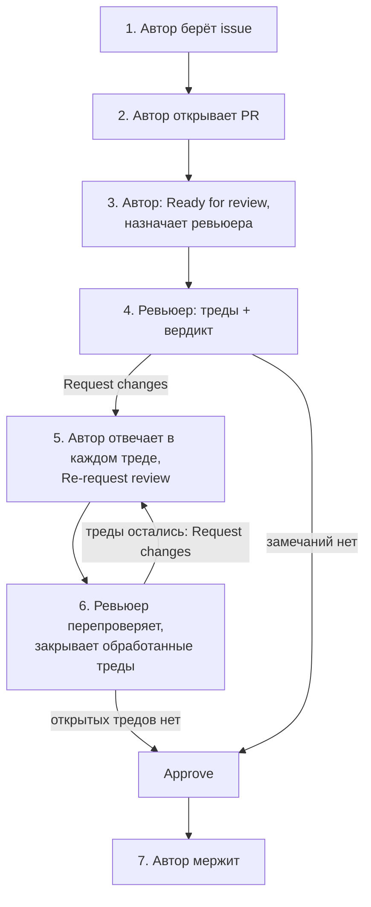

# Процесс работы с задачами и PR (команда 6)

| | |
|---|---|
| Статус | действует для `dmc-268-api-t6` и `dmc-268-ui-t6`; меняется только через PR в этот файл |
| Владелец | техлид спринта |
| Связанные документы | [`.agents/rules/git-workflow.md`](../.agents/rules/git-workflow.md) — ветки, коммиты, оформление PR |
| Задача | [#28](https://github.com/larchanka-training/dmc-268-api-t6/issues/28) |

Здесь записано, кто, что и когда делает на пути от issue до мержа, чтобы вопросы о процессе решались ссылкой на этот документ, а не спором. Как называть ветки, писать коммиты и оформлять тело PR — в `git-workflow.md`, здесь это не повторяется. Файл канонический для обоих репозиториев; в `dmc-268-ui-t6` лежит `docs/CONTRIBUTING.md` со ссылкой сюда.

---

## 1. Роли

| Роль | Кто | Отвечает за |
|---|---|---|
| Автор | разработчик, открывший PR | код; ответ в каждом треде; мерж |
| Ревьюер | участник из поля Reviewers PR, не автор | треды; закрытие тредов; вердикт Request changes или Approve |
| Техлид | техлид спринта, сейчас @axyi | решение споров в тредах; снятие чужого Request changes |

Агенты (Claude Code и другие) работают от имени автора и соблюдают те же правила.

## 2. Путь задачи

| # | Кто | Что делает | Статус issue на доске | Кому уходит уведомление |
|---|---|---|---|---|
| 1 | Автор | Назначает себя в Assignees issue и создаёт ветку по `git-workflow.md` | Todo → In Progress (вручную) | — |
| 2 | Автор | Открывает PR; пока работа не готова, PR остаётся Draft. В теле PR — `Closes #N` на issue из этого же репо или `Refs owner/repo#N` на issue из другого | In Progress (GitHub ставит сам, когда к issue привязан PR) | — |
| 3 | Автор | Работа готова, CI зелёный: нажимает Ready for review и назначает ревьюера в Reviewers | On Review (вручную) | ревьюеру: запрос ревью |
| 4 | Ревьюер | Оставляет каждое замечание отдельным тредом на строке кода и отправляет всё одним Submit review с вердиктом (§4) | On Review | автору: отправлено ревью |
| 5 | Автор | Отвечает в каждом треде (§3). Когда ответ есть во всех открытых тредах, нажимает Re-request review (🔄 рядом с именем ревьюера) | On Review | ревьюеру: повторный запрос ревью |
| 6 | Ревьюер | Перепроверяет: закрывает (Resolve) обработанные треды, в необработанных отвечает, при необходимости открывает новые. Остались открытые треды — Request changes, возврат к шагу 5. Открытых нет — Approve | On Review | автору: отправлено ревью |
| 7 | Автор | Мержит, когда есть Approve, все треды закрыты и CI зелёный. Способ мержа — по `git-workflow.md` | Done (GitHub ставит сам, когда issue закрывается) | — |

Про доску:

- Если после привязки PR GitHub вернул issue в In Progress, поставьте On Review ещё раз.
- `Closes #N` закрывает issue автоматически при мерже. `Refs owner/repo#N` issue не закрывает: автор закрывает его вручную, когда смержены все связанные PR.
- Если задача требует PR в обоих репо, во всех её PR пишется `Refs`, даже в PR из репо самой issue: иначе `Closes` закроет issue раньше, чем смержится второй PR. Поле Linked pull requests на доске при этом пустое, поэтому In Progress и On Review автор ставит вручную; Done выставится сам, когда автор закроет issue.
- Отдельного статуса «на доработке» нет. Перенос карточки не отправляет уведомлений, а о ходе ревью участники узнают из событий PR (§5).

## 3. Треды

- **Одно замечание — один тред** на строке или файле. Комментарий в общей ленте PR закрыть нельзя, поэтому всё, что требует действия, пишется тредом.
- **Автор отвечает в каждом треде.** Молча править или молча пропускать замечание нельзя:
  - если автор согласен, он правит и пишет в ответе коммит: «Исправлено в `abc1234`»;
  - если не согласен, объясняет почему и ничего не меняет.
- **Автор тред не закрывает**, даже если согласен и уже исправил. Закрывает ревьюер: только он знает, снято ли замечание.
- Ревьюер закрывает тред, если исправление его устраивает, если его убедил аргумент автора или если спор решил техлид (§6).
- Тред, который открыл не ревьюер, а другой участник, закрывает тот, кто его открыл.
- Замечание, которое можно не исправлять, ревьюер начинает с `nit:`. Автор может не править, но ответить обязан.
- Отвечайте кнопкой Add single comment или отправьте все ответы одним Submit review. Незавершённый review (Start a review без Submit) никто, кроме автора ответа, не видит.

## 4. Вердикты ревью

| Вердикт | Когда ставить | Что даёт |
|---|---|---|
| Request changes | есть хотя бы один тред, который нужно исправить | блокирует мерж, пока тот же ревьюер не поставит Approve или техлид не снимет вердикт |
| Approve | открытых тредов нет | нужен для мержа, минимум один; себе Approve автор поставить не может |
| Comment | только вопросы, вердикта пока нет | мерж не блокирует и не разрешает |

Если ревьюер оставил замечания, которые нужно исправить, он ставит Request changes, а не Comment.

После Approve автор больше ничего не меняет в PR, кроме rebase на `main`. Если нужно ещё что-то изменить, он снова нажимает Re-request review: GitHub сохраняет Approve и после новых коммитов.

## 5. Кто получает уведомления

| Действие | Кто получает уведомление |
|---|---|
| Назначение ревьюера в Reviewers | ревьюер |
| Submit review с любым вердиктом | автор PR и все подписчики PR |
| Ответ в треде | все подписчики PR: автор, участники обсуждения, те, кто следит за репо |
| Re-request review | ревьюер |
| `@упоминание` | тот, кого упомянули |
| Resolve треда | никто |
| Перенос карточки на доске | никто |

Если по действию уведомление не уходит, дождаться реакции нельзя: нужно выполнить следующий шаг из §2, который уведомление отправляет.

## 6. Спор

1. Автор не согласен и пишет аргументы в треде.
2. Ревьюер либо соглашается и закрывает тред, либо отвечает, почему настаивает.
3. Если после этого круга согласия нет, любой из двоих зовёт в тред техлида (`@axyi`). Техлид отвечает в том же треде, и его решение окончательное. Тред закрывает ревьюер.
4. Если техлид сам автор или ревьюер этого PR, спор выносится в командный чат, а итог записывается в тред.

Решение остаётся в треде, поэтому к тому же вопросу потом не возвращаются.

## 7. Что проверяет GitHub, а что держится на договорённости

Ruleset `main` одинаков в обоих репо, кроме CI-проверки: она обязательна только в api.

| Правило | Как соблюдается |
|---|---|
| В `main` попадают только PR: без прямого push, force push и удаления ветки | ruleset |
| CI `Python lint / type / test` зелёный | ruleset (только api) |
| Есть минимум один Approve, и не от автора | ruleset `required_approving_review_count: 1` + GitHub |
| Все треды закрыты | ruleset `required_review_thread_resolution` |
| Request changes блокирует мерж, чужой вердикт снимает только техлид | ruleset `dismissal_restriction` |
| Мерж только squash или rebase: merge commit GitHub не примет | ruleset `allowed_merge_methods` |
| Автор отвечает в каждом треде | договорённость |
| Тред закрывает ревьюер (или тот, кто открыл тред), но не автор PR | договорённость: GitHub разрешает закрыть тред автору PR и любому с правом записи, а права записи есть у всей команды |
| После Approve изменений нет, кроме rebase | договорённость |
| Мержит автор | договорённость |
| Статусы Todo → In Progress → On Review | вручную; Done GitHub ставит сам |

При смене техлида обновите `dismissal_restriction` в ruleset обоих репо и упоминания техлида в этом файле.
