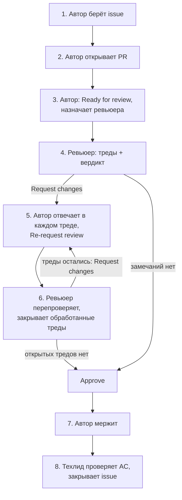

# Процесс работы с задачами и PR (команда 6)

| | |
|---|---|
| Статус | действует для `dmc-268-api-t6` и `dmc-268-ui-t6`; меняется только через PR в этот файл |
| Владелец | техлид спринта |
| Связанные документы | [`.agents/rules/git-workflow.md`](../.agents/rules/git-workflow.md) — ветки, коммиты, оформление PR |
| Задача | [#28](https://github.com/larchanka-training/dmc-268-api-t6/issues/28), [#56](https://github.com/larchanka-training/dmc-268-api-t6/issues/56) |

Здесь записано, кто, что и когда делает на пути от issue до мержа и приёмки, чтобы вопросы о процессе решались ссылкой на этот документ, а не спором. Как называть ветки, писать коммиты и оформлять тело PR — в `git-workflow.md`, здесь это не повторяется. Файл канонический для обоих репозиториев; в `dmc-268-ui-t6` лежит `docs/CONTRIBUTING.md` со ссылкой сюда.

---

## 1. Роли

| Роль | Кто | Отвечает за |
|---|---|---|
| Автор | разработчик, открывший PR | код; ответ в каждом треде; мерж |
| Ревьюер | участник из поля Reviewers PR, не автор | треды; закрытие тредов; вердикт Request changes или Approve |
| Техлид | техлид спринта, сейчас @axyi | решение споров в тредах; снятие чужого Request changes; приёмка задач: проверяет AC и закрывает issue; вместо техлида это делает участник, которого техлид назначил принимающим (комментарием в issue) |

Агенты (Claude Code и другие) работают от имени автора и соблюдают те же правила.

## 2. Путь задачи


```mermaid
flowchart TD
  take["1. Автор берёт issue"] --> pr["2. Автор открывает PR"]
  pr --> ready["3. Автор: Ready for review,<br/>назначает ревьюера"]
  ready --> review["4. Ревьюер: треды + вердикт"]
  review -->|Request changes| answer["5. Автор отвечает в каждом треде,<br/>Re-request review"]
  answer --> recheck["6. Ревьюер перепроверяет,<br/>закрывает обработанные треды"]
  recheck -->|треды остались: Request changes| answer
  recheck -->|открытых тредов нет| approve["Approve"]
  review -->|замечаний нет| approve
  approve --> merge["7. Автор мержит"]
  merge --> accept["8. Техлид проверяет AC,<br/>закрывает issue"]
```

| # | Кто | Что делает | Статус issue на доске | Кому уходит уведомление |
|---|---|---|---|---|
| 1 | Автор | Назначает себя в Assignees issue и создаёт ветку по `git-workflow.md` | Todo → In Progress (вручную) | — |
| 2 | Автор | Открывает PR; пока работа не готова, PR остаётся Draft. В теле PR — `Refs #N` на issue из этого же репо или `Refs owner/repo#N` на issue из другого. Закрывающие ключевые слова (`Closes`, `Fixes`, `Resolves` и их формы) запрещены в теле PR и в коммитах, а PR не привязывается к issue в панели Development: issue закрывает техлид на шаге 8 | In Progress | — |
| 3 | Автор | Работа готова, CI зелёный: нажимает Ready for review и назначает ревьюера в Reviewers | On Review (вручную) | ревьюеру: запрос ревью |
| 4 | Ревьюер | Оставляет каждое замечание отдельным тредом на строке кода и отправляет всё одним Submit review с вердиктом (§4) | On Review | автору: отправлено ревью |
| 5 | Автор | Отвечает в каждом треде (§3). Когда ответ есть во всех открытых тредах, нажимает Re-request review (🔄 рядом с именем ревьюера) | On Review | ревьюеру: повторный запрос ревью |
| 6 | Ревьюер | Перепроверяет: закрывает (Resolve) обработанные треды, в необработанных отвечает, при необходимости открывает новые. Остались открытые треды — Request changes, возврат к шагу 5. Открытых нет — Approve | On Review | автору: отправлено ревью |
| 7 | Автор | Мержит, когда есть Approve на текущей голове PR, ветка на текущем `main`, все треды закрыты, CI зелёный и тело PR описывает весь PR. Способ мержа — по `git-workflow.md`. Мерж issue не закрывает | On Review | — |
| 8 | Техлид или назначенный им | Проверяет AC и закрывает issue по правилам [приёмки](#приёмка-задачи) | Done (ставит workflow «Item closed», когда issue закрыт) | подписчикам issue: issue закрыт |

Про доску:

- PR к issue не привязывается (шаг 2), поэтому поле Linked pull requests на доске пустое: In Progress и On Review автор ставит вручную.
- `Refs` issue не закрывает. Done ставит workflow «Item closed», когда техлид закрывает issue; перенос карточки в Done issue не закрывает — workflow «Auto-close issue» в Project 12 выключен.
- Отдельного статуса «на доработке» нет. Перенос карточки не отправляет уведомлений, а о ходе ревью участники узнают из событий PR (§5).

### Приёмка задачи

Задача сдана, когда issue закрыт по правилам ниже. Смёрженный PR и карточка в Done сдачей не считаются.

| Вопрос | Правило | Признак |
|---|---|---|
| Кто закрывает | Техлид или участник, которого техлид назначил принимающим (комментарием в issue). Автор, мерж и перенос карточки не должны закрывать issue | issue в состоянии `CLOSED`, у последнего закрытия `actor` — техлид или назначенный, `closer` — `null` (команда 1) |
| Когда | Все PR задачи смёржены; в issue нет замечаний без ответа | в выводе команды 2 среди PR задачи нет `open`; закрытые без мержа (`closed null`) не считаются; какие из ссылающихся PR относятся к задаче, решает принимающий по их `Refs`; на каждое замечание в комментариях issue есть ответ |
| Чем | Все чекбоксы в теле issue (AC и DoD) отмечены; чекбоксы отмечает принимающий при проверке. Закрывающий комментарий даёт на каждый AC доказательство: PR, коммит, прогон или скриншот | команда 3 выводит `0` неотмеченных и больше `0` чекбоксов всего; закрывающий комментарий называет каждый AC |

- Задача из нескольких частей сдаётся по частям: каждая часть — отдельный PR с `Refs`, а issue закрывается после проверки всех частей.
- Если issue закрылся не по правилу — мержем, переносом карточки или через связь в панели Development, — техлид переоткрывает его, возвращает карточку в In Progress или On Review и пишет комментарием, что осталось.
- **Ловушка Development.** PR, вручную привязанный к issue в панели Development, закрывает issue при мерже, даже если в теле PR стоит `Refs` (в спринте 2 так закрылся #35 мержем #45). Перед мержем команда 4 должна вывести `0`; иначе убирают ключевое слово из тела PR или отвязывают PR в панели Development (какой из двух случаев — покажет команда 4 с `closingIssuesReferences(first: 10, userLinkedOnly: true)`: так она считает только ручные связи).

Команды запускаются из клона репозитория; `N` — номер issue или PR.

```bash
# 1. Состояние issue и кто чем закрыл его последним (ожидается CLOSED <техлид> null).
#    closer: null — вручную, PullRequest — мерж PR (в том числе через связь Development),
#    ProjectV2 — перенос карточки, Commit — коммит. OPEN — issue не закрыт или переоткрыт
gh api graphql -F owner='{owner}' -F repo='{repo}' -F n=N -f query='
  query($owner: String!, $repo: String!, $n: Int!) {
    repository(owner: $owner, name: $repo) { issue(number: $n) { state
      timelineItems(itemTypes: [CLOSED_EVENT], last: 1) { nodes { ... on ClosedEvent {
        actor { login } closer { __typename } } } } } } }' \
  --jq '.data.repository.issue as $i | $i.timelineItems.nodes[0]
        | "\($i.state) \(.actor.login) \(.closer.__typename)"'

# 2. PR, которые ссылаются на issue: состояние и время мержа (ожидается: среди PR задачи
#    нет open; closed null — закрыт без мержа)
gh api 'repos/{owner}/{repo}/issues/N/timeline' --paginate \
  --jq '.[] | select(.event == "cross-referenced") | .source.issue | select(.pull_request)
        | "\(.repository.full_name)#\(.number) \(.state) \(.pull_request.merged_at)"'

# 3. Чекбоксы в теле issue (AC и DoD): неотмеченные и всего (ожидается 0 и больше 0)
gh issue view N --json body --jq '[.body | scan("(?m)^ *[-*] \\[([ xX])\\]")[0]]
  | "\(map(select(. == " ")) | length) \(length)"'

# 4. Сколько issue закроет мерж PR по телу PR и связи Development (ожидается 0)
gh api graphql -F owner='{owner}' -F repo='{repo}' -F n=N -f query='
  query($owner: String!, $repo: String!, $n: Int!) {
    repository(owner: $owner, name: $repo) { pullRequest(number: $n) {
      closingIssuesReferences(first: 10) { totalCount } } } }' \
  --jq '.data.repository.pullRequest.closingIssuesReferences.totalCount'

# 4б. Коммиты PR с закрывающим ключевым словом (ожидается 0); команда 4 их не видит
gh pr view N --json commits --jq '[.commits[] | "\(.messageHeadline)\n\(.messageBody)"
  | select(test("(?i)\\b(close[sd]?|fix(e[sd])?|resolve[sd]?)\\b:?\\s+([\\w.-]+/[\\w.-]+)?#[0-9]+"))] | length'
```

## 3. Треды

- **Одно замечание — один тред** на строке или файле. Комментарий в общей ленте PR закрыть нельзя, поэтому всё, что требует действия, пишется тредом.
- **Автор отвечает в каждом треде.** Молча править или молча пропускать замечание нельзя:
  - если автор согласен, он правит и пишет в ответе коммит: «Исправлено в `abc1234`»;
  - если не согласен, объясняет почему и ничего не меняет.
- **Автор тред не закрывает**, даже если согласен и уже исправил. Закрывает ревьюер: только он знает, снято ли замечание.
- Ревьюер закрывает тред, если исправление его устраивает, если его убедил аргумент автора или если спор решил техлид (§6).
- Тред, который открыл не ревьюер, а другой участник, закрывает тот, кто его открыл.
- Замечание, которое можно не исправлять, ревьюер начинает с `nit:`. Автор может не править, но ответить обязан.
- Отвечайте кнопкой Add single comment или отправьте все ответы одним Submit review. Незавершённый review (Start a review без Submit) никто, кроме автора ответа, не видит.

## 4. Вердикты ревью

| Вердикт | Когда ставить | Что даёт |
|---|---|---|
| Request changes | есть хотя бы один тред, который нужно исправить | блокирует мерж, пока тот же ревьюер не поставит Approve или техлид не снимет вердикт |
| Approve | открытых тредов нет | нужен для мержа, минимум один; себе Approve автор поставить не может |
| Comment | только вопросы, вердикта пока нет | мерж не блокирует и не разрешает |

Если ревьюер оставил замечания, которые нужно исправить, он ставит Request changes, а не Comment.

Push, меняющий дифф PR (новые коммиты, rebase или Update branch после изменений в `main`), снимает Approve: ruleset отклоняет устаревшие одобрения. Договорённость команды строже: Approve должен стоять на текущей голове PR (команда 6 из §2), поэтому после любого push в ветку автор снова нажимает Re-request review, и для мержа нужен новый Approve.

## 5. Кто получает уведомления

| Действие | Кто получает уведомление |
|---|---|
| Назначение ревьюера в Reviewers | ревьюер |
| Submit review с любым вердиктом | автор PR и все подписчики PR |
| Ответ в треде | все подписчики PR: автор, участники обсуждения, те, кто следит за репо |
| Re-request review | ревьюер |
| `@упоминание` | тот, кого упомянули |
| Resolve треда | никто |
| Перенос карточки на доске | никто |

Если по действию уведомление не уходит, дождаться реакции нельзя: нужно выполнить следующий шаг из §2, который уведомление отправляет.

## 6. Спор

1. Автор не согласен и пишет аргументы в треде.
2. Ревьюер либо соглашается и закрывает тред, либо отвечает, почему настаивает.
3. Если после этого круга согласия нет, любой из двоих зовёт в тред техлида (`@axyi`). Техлид отвечает в том же треде, и его решение окончательное. Тред закрывает ревьюер.
4. Если техлид сам автор или ревьюер этого PR, спор выносится в командный чат, а итог записывается в тред.

Решение остаётся в треде, поэтому к тому же вопросу потом не возвращаются.

## 7. Что проверяет GitHub, а что держится на договорённости

Ruleset `main` одинаков в обоих репо, кроме CI-проверки: она обязательна только в api.

| Правило | Как соблюдается |
|---|---|
| В `main` попадают только PR: без прямого push, force push и удаления ветки | ruleset |
| CI `Python lint / type / test` зелёный | ruleset (только api) |
| Есть минимум один Approve, и не от автора | ruleset `required_approving_review_count: 1` + GitHub |
| Все треды закрыты | ruleset `required_review_thread_resolution` |
| Request changes блокирует мерж, чужой вердикт снимает только техлид | ruleset `dismissal_restriction` |
| Мерж только squash или rebase: merge commit GitHub не примет | ruleset `allowed_merge_methods` |
| Автор отвечает в каждом треде | договорённость |
| Тред закрывает ревьюер (или тот, кто открыл тред), но не автор PR | договорённость: GitHub разрешает закрыть тред автору PR и любому с правом записи, а права записи есть у всей команды |
| После Approve изменений нет, кроме rebase | договорённость |
| Мержит автор | договорённость |
| Статусы Todo → In Progress → On Review | вручную; Done GitHub ставит сам |

При смене техлида обновите `dismissal_restriction` в ruleset обоих репо и упоминания техлида в этом файле.
