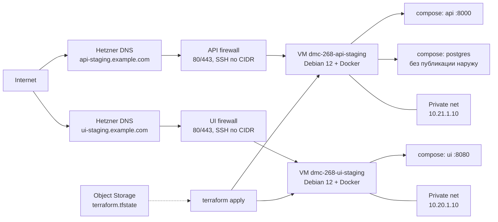

# Инфраструктура — API (команда 6)

| | |
|---|---|
| Статус | рабочий каркас Hetzner + Terraform |
| Владелец | инфраструктура (роль 3) |
| Связанные документы | [CICD.md](CICD.md), [SECRETS.md](SECRETS.md) |

В этом репозитории живёт **вся** инфраструктура staging: два независимых Terraform-стека для API и UI. CI/CD приложений — в своих репозиториях (`dmc-268-api-t6`, `dmc-268-ui-t6`).

| Стек | Каталог | Сеть | VM / каталог на сервере |
|---|---|---|---|
| API staging | `terraform/api-staging/` | `10.21.0.0/16` | `/opt/dmc-268-api` |
| UI staging | `terraform/ui-staging/` | `10.20.0.0/16` | `/opt/dmc-268-ui` |

На каждой VM — Docker и Compose. API-стенд: bootstrap-контейнер до первого выката, затем FastAPI и PostgreSQL. UI-стенд: bootstrap nginx до первого выката, затем статический UI в nginx.

---

## 1. Архитектура



| Ресурс | Зачем один / как устроен |
|---|---|
| 2× `cx22` в `nbg1` | API и UI на отдельных VM: изоляция, независимый rollback |
| Private networks `10.21.0.0/16` и `10.20.0.0/16` | Разные CIDR для API и UI; статические private IP `10.21.1.10` и `10.20.1.10` |
| Firewall (на каждый стек) | Вход: ICMP, 80, 443; SSH только из `ssh_allowed_cidrs`. Postgres наружу не открыт |
| Primary IPv4/IPv6 | Адреса живут отдельно от VM: rebuild сервера не ломает DNS |
| SSH keys | Обязательный ключ CI; опционально ключ оператора |
| Cloud-init | Docker CE + Compose, каталог `/opt/dmc-268-api` или `/opt/dmc-268-ui`, bootstrap на `:80` |
| DNS | Опциональная зона Hetzner Cloud + A/AAAA + reverse DNS (отдельные записи `api-staging` / `ui-staging`) |
| State | S3-совместимый backend в Hetzner Object Storage; отдельные ключи `api-staging/` и `ui-staging/` |

Отдельный bastion, load balancer и managed Postgres на staging не нужны.

---

## 2. Terraform

Два root-модуля в `terraform/api-staging/` и `terraform/ui-staging/`. CI делает `fmt` / `validate` / lint для **обоих**, но **не вызывает apply**.

| Файл (в каждом стеке) | Содержание |
|---|---|
| `versions.tf` | Terraform ≥ 1.8, provider `hcloud` ~> 1.54, backend `s3` |
| `providers.tf` | Токен: `var.hcloud_token` или `HCLOUD_TOKEN` |
| `variables.tf` / `outputs.tf` | Входы и выходы стенда |
| `network.tf` | Network + subnet |
| `firewall.tf` | Правила входа |
| `ssh.tf` | Ключи CI и оператора |
| `primary_ip.tf` | Стабильные публичные адреса |
| `server.tf` | VM + private NIC |
| `dns.tf` | Зона / lookup, A, AAAA, PTR |
| `templates/cloud-init.yaml.tftpl` | Docker и bootstrap |
| `environments/*.example` | Образцы tfvars и backend |

Отличия стеков: CIDR, имя VM, `image_repository`, health URL (`/healthcheck` vs `/health`), DNS record name.

---

## 3. Инструкция по запуску Terraform

CI проверяет `fmt` / `validate` / lint и **не вызывает apply**. Стенд поднимает оператор — **отдельно для каждого стека**.

### 3.1. Один раз: remote state

Hetzner не даёт Terraform Cloud. State — в **Object Storage** (S3 API). Bucket нельзя создать этим же root-модулем: backend читается до apply.

1. В консоли Hetzner создать bucket (например `dmc-268-tfstate`) и S3-ключи.
2. Скопировать `environments/staging.backend.hcl.example` → `environments/staging.backend.hcl` в нужном стеке (файл в gitignore).
3. Поправить `bucket` и `endpoints.s3` (`nbg1` / `fsn1` / `hel1`). Ключ state: `api-staging/terraform.tfstate` или `ui-staging/terraform.tfstate`.

### 3.2. Apply (API staging)

```bash
export HCLOUD_TOKEN=...
export AWS_ACCESS_KEY_ID=...
export AWS_SECRET_ACCESS_KEY=...
export AWS_REQUEST_CHECKSUM_CALCULATION=when_required
export AWS_RESPONSE_CHECKSUM_VALIDATION=when_required

STACK=terraform/api-staging
cp ${STACK}/environments/staging.tfvars.example ${STACK}/environments/staging.tfvars
# заполнить ssh_public_key и ssh_allowed_cidrs; при необходимости dns_zone

terraform -chdir=${STACK} init -backend-config=environments/staging.backend.hcl
terraform -chdir=${STACK} plan  -var-file=environments/staging.tfvars
terraform -chdir=${STACK} apply -var-file=environments/staging.tfvars
```

### 3.3. Apply (UI staging)

Те же переменные окружения. Каталог стека — `terraform/ui-staging/`:

```bash
STACK=terraform/ui-staging
cp ${STACK}/environments/staging.tfvars.example ${STACK}/environments/staging.tfvars

terraform -chdir=${STACK} init -backend-config=environments/staging.backend.hcl
terraform -chdir=${STACK} plan  -var-file=environments/staging.tfvars
terraform -chdir=${STACK} apply -var-file=environments/staging.tfvars
```

Дождаться cloud-init (Docker + bootstrap на `:80`). Полезные outputs:

```bash
terraform -chdir=${STACK} output ssh_host
terraform -chdir=${STACK} output health_url
terraform -chdir=${STACK} output staging_ipv4
```

- output `ssh_host` API-стека → GitHub variable `STAGING_HOST` в репозитории **dmc-268-api-t6**
- output `ssh_host` UI-стека → GitHub variable `STAGING_HOST` в репозитории **dmc-268-ui-t6**

Дальше выкат — CICD.md в соответствующем репозитории. Секреты API — [SECRETS.md](SECRETS.md).

Проверка без backend (как в CI):

```bash
for stack in terraform/api-staging terraform/ui-staging; do
  terraform -chdir="${stack}" init -backend=false -input=false
  terraform -chdir="${stack}" validate
done
```

---

## 4. Cloud-init и bootstrap

После первого boot (на каждой VM):

1. Ставятся Docker CE, containerd, Compose plugin.
2. Создаётся `/opt/dmc-268-api` или `/opt/dmc-268-ui`.
3. Запускается `nginx:1.27-alpine` как bootstrap-контейнер на `:80`.

Пока CI не выкатил приложение, VM уже отвечает по HTTP. `deploy.sh` снимает bootstrap, чтобы порт 80 занял Compose.

`user_data` в lifecycle игнорируется: правка cloud-init не пересоздаёт VM.

---

## 5. DNS

По умолчанию зона не создаётся (`dns_zone = ""`): стенд доступен по IPv4 из output `staging_ipv4`.

Чтобы включить DNS, в `staging.tfvars`:

```hcl
dns_zone        = "example.com"
create_dns_zone = true
dns_record_name = "api-staging"
```

Terraform создаст зону, записи `A`/`AAAA` на Primary IP и PTR. Делегируйте домен на `dns_nameservers`.

Если зона уже есть в проекте Hetzner:

```hcl
dns_zone        = "example.com"
create_dns_zone = false
```

`STAGING_HOST` в GitHub Environment — output `ssh_host` (FQDN или IPv4).

---

## 6. Variables и outputs

Обязательные variables: `ssh_public_key`, `ssh_allowed_cidrs`. Остальное имеет defaults (`nbg1`, `cx22`, CIDR стека, …).

Полезные outputs: `staging_ipv4`, `staging_ipv6`, `staging_private_ip`, `dns_fqdn`, `dns_nameservers`, `health_url`, `ssh_host`, `server_id`, `network_id`, `firewall_id`.

Полный список — `variables.tf` и `outputs.tf` в каждом стеке.

---

## 7. Удаление инфраструктуры

Снимает VM, сеть, firewall, SSH-ключи, Primary IP, DNS-записи и зону, если её создавал этот модуль. Том PostgreSQL на диске VM уничтожается вместе с сервером.

```bash
export HCLOUD_TOKEN=...
export AWS_ACCESS_KEY_ID=...
export AWS_SECRET_ACCESS_KEY=...
export AWS_REQUEST_CHECKSUM_CALCULATION=when_required
export AWS_RESPONSE_CHECKSUM_VALIDATION=when_required

STACK=terraform/api-staging  # или terraform/ui-staging
terraform -chdir=${STACK} init -backend-config=environments/staging.backend.hcl
terraform -chdir=${STACK} destroy -var-file=environments/staging.tfvars
```

После destroy:

1. Bucket Object Storage и файл state **остаются**. Удалить bucket в консоли Hetzner, когда state больше не нужен.
2. Образы в GHCR (`:sha`, `:staging`, `:staging-previous`) Terraform не трогает — удалить в GitHub Packages при необходимости.
3. GitHub Environment `staging` (secrets/variables) сбросить или удалить, чтобы повторный workflow не ходил на несуществующий хост.
4. Если домен делегировали на `dns_nameservers`, снять NS у регистратора.

Не удаляйте VM руками в консоли, пока state жив: следующий `apply`/`destroy` разъедется с облаком.
