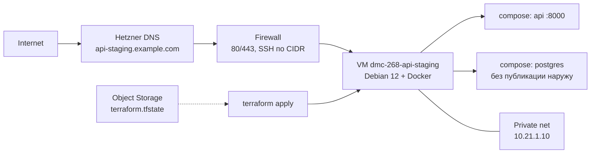

# Инфраструктура — API (команда 6)

| | |
|---|---|
| Статус | рабочий каркас Hetzner + Terraform |
| Владелец | инфраструктура (роль 3) |
| Связанные документы | [CICD.md](CICD.md), [SECRETS.md](SECRETS.md) |

Staging — одна VM в Hetzner Cloud. На ней Docker и Compose: до первого выката CI отвечает bootstrap-контейнер, после выката — FastAPI и PostgreSQL. Сеть отделена от UI-стенда (`10.21.0.0/16` против `10.20.0.0/16`).

---

## 1. Архитектура



| Ресурс | Зачем один / как устроен |
|---|---|
| 1× `cx22` в `nbg1` | Staging не делит API и БД по машинам: меньше стоимость и проще rollback |
| Private network `10.21.0.0/16` + subnet `10.21.1.0/24` | Изоляция от UI; статический адрес VM `10.21.1.10` |
| Firewall | Вход: ICMP, 80, 443; SSH только из `ssh_allowed_cidrs`. Postgres наружу не открыт |
| Primary IPv4/IPv6 | Адреса живут отдельно от VM: rebuild сервера не ломает DNS |
| SSH keys | Обязательный ключ CI; опционально ключ оператора |
| Cloud-init | Docker CE + Compose, каталог `/opt/dmc-268-api`, bootstrap-контейнер на `:80` |
| DNS | Опциональная зона Hetzner Cloud + A/AAAA + reverse DNS |
| State | S3-совместимый backend в Hetzner Object Storage |

Отдельный bastion, load balancer и managed Postgres на staging не нужны.

---

## 2. Terraform

Файлы в `terraform/`. CI делает `fmt` / `validate` / lint, но **не вызывает apply**.

| Файл | Содержание |
|---|---|
| `versions.tf` | Terraform ≥ 1.8, provider `hcloud` ~> 1.54, backend `s3` |
| `providers.tf` | Токен: `var.hcloud_token` или `HCLOUD_TOKEN` |
| `variables.tf` / `outputs.tf` | Входы и выходы стенда |
| `network.tf` | Network + subnet |
| `firewall.tf` | Правила входа |
| `ssh.tf` | Ключи CI и оператора |
| `primary_ip.tf` | Стабильные публичные адреса |
| `server.tf` | VM + private NIC |
| `dns.tf` | Зона / lookup, A, AAAA, PTR |
| `templates/cloud-init.yaml.tftpl` | Docker и bootstrap |
| `environments/*.example` | Образцы tfvars и backend |

---

## 3. Инструкция по запуску Terraform

CI проверяет `fmt` / `validate` / lint и **не вызывает apply**. Стенд поднимает оператор.

### 3.1. Один раз: remote state

Hetzner не даёт Terraform Cloud. State — в **Object Storage** (S3 API). Bucket нельзя создать этим же root-модулем: backend читается до apply.

1. В консоли Hetzner создать bucket (например `dmc-268-api-tfstate`) и S3-ключи.
2. Скопировать `environments/staging.backend.hcl.example` → `environments/staging.backend.hcl` (файл в gitignore).
3. Поправить `bucket` и `endpoints.s3` (`nbg1` / `fsn1` / `hel1`).

### 3.2. Apply

```bash
export HCLOUD_TOKEN=...
export AWS_ACCESS_KEY_ID=...
export AWS_SECRET_ACCESS_KEY=...
export AWS_REQUEST_CHECKSUM_CALCULATION=when_required
export AWS_RESPONSE_CHECKSUM_VALIDATION=when_required

cp terraform/environments/staging.tfvars.example terraform/environments/staging.tfvars
# заполнить ssh_public_key и ssh_allowed_cidrs; при необходимости dns_zone

terraform -chdir=terraform init -backend-config=environments/staging.backend.hcl
terraform -chdir=terraform plan  -var-file=environments/staging.tfvars
terraform -chdir=terraform apply -var-file=environments/staging.tfvars
```

Дождаться cloud-init (Docker + bootstrap на `:80`). Полезные outputs:

```bash
terraform -chdir=terraform output ssh_host
terraform -chdir=terraform output health_url
terraform -chdir=terraform output staging_ipv4
```

`ssh_host` записать в GitHub variable `STAGING_HOST`. Дальше выкат — [CICD.md](CICD.md). Секреты — [SECRETS.md](SECRETS.md).

Проверка без backend (как в CI):

```bash
terraform -chdir=terraform init -backend=false -input=false
terraform -chdir=terraform validate
```

---

## 4. Cloud-init и bootstrap

После первого boot:

1. Ставятся Docker CE, containerd, Compose plugin.
2. Создаётся `/opt/dmc-268-api`.
3. Запускается `nginx:1.27-alpine` как `dmc-268-api-bootstrap` на `:80`.

Пока CI не выкатил API, VM уже отвечает по HTTP. `deploy.sh` снимает bootstrap, чтобы порт 80 занял Compose.

`user_data` в lifecycle игнорируется: правка cloud-init не пересоздаёт VM.

---

## 5. DNS

По умолчанию зона не создаётся (`dns_zone = ""`): стенд доступен по IPv4 из output `staging_ipv4`.

Чтобы включить DNS, в `staging.tfvars`:

```hcl
dns_zone        = "example.com"
create_dns_zone = true
dns_record_name = "api-staging"
```

Terraform создаст зону, записи `A`/`AAAA` на Primary IP и PTR. Делегируйте домен на `dns_nameservers`.

Если зона уже есть в проекте Hetzner:

```hcl
dns_zone        = "example.com"
create_dns_zone = false
```

`STAGING_HOST` в GitHub Environment — output `ssh_host` (FQDN или IPv4).

---

## 6. Variables и outputs

Обязательные variables: `ssh_public_key`, `ssh_allowed_cidrs`. Остальное имеет defaults (`nbg1`, `cx22`, `10.21.0.0/16`, …).

Полезные outputs: `staging_ipv4`, `staging_ipv6`, `staging_private_ip`, `dns_fqdn`, `dns_nameservers`, `health_url`, `ssh_host`, `server_id`, `network_id`, `firewall_id`.

Полный список — `terraform/variables.tf` и `terraform/outputs.tf`.

---

## 7. Удаление инфраструктуры

Снимает VM, сеть, firewall, SSH-ключи, Primary IP, DNS-записи и зону, если её создавал этот модуль. Том PostgreSQL на диске VM уничтожается вместе с сервером.

```bash
export HCLOUD_TOKEN=...
export AWS_ACCESS_KEY_ID=...
export AWS_SECRET_ACCESS_KEY=...
export AWS_REQUEST_CHECKSUM_CALCULATION=when_required
export AWS_RESPONSE_CHECKSUM_VALIDATION=when_required

terraform -chdir=terraform init -backend-config=environments/staging.backend.hcl
terraform -chdir=terraform destroy -var-file=environments/staging.tfvars
```

После destroy:

1. Bucket Object Storage и файл state **остаются**. Удалить bucket в консоли Hetzner, когда state больше не нужен.
2. Образы в GHCR (`:sha`, `:staging`, `:staging-previous`) Terraform не трогает — удалить в GitHub Packages при необходимости.
3. GitHub Environment `staging` (secrets/variables) сбросить или удалить, чтобы повторный workflow не ходил на несуществующий хост.
4. Если домен делегировали на `dns_nameservers`, снять NS у регистратора.

Не удаляйте VM руками в консоли, пока state жив: следующий `apply`/`destroy` разъедется с облаком.
