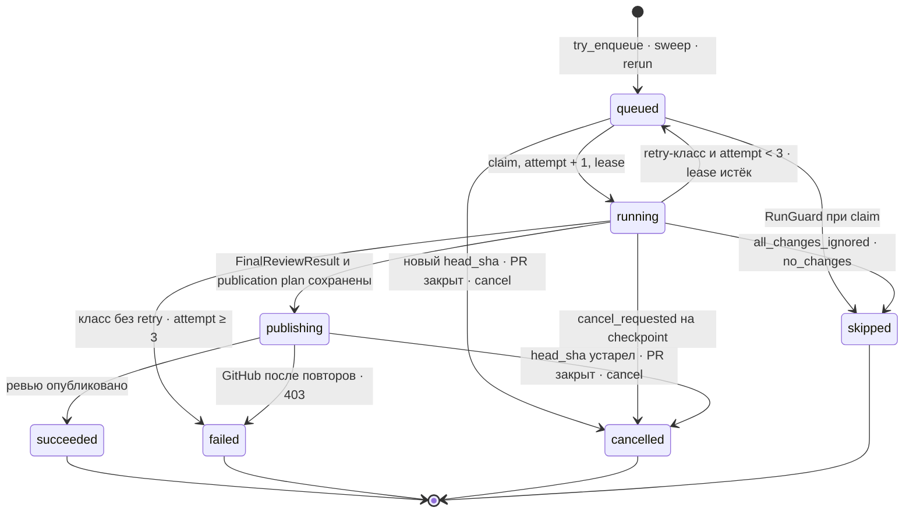

# PIPELINE_SPEC — жизненный цикл Run и политика сбоев (команда 6)

| | |
|---|---|
| Статус | Базовый контракт утверждён в PR #36 (#20); проектные изменения #107 согласованы пользователем 2026-10-09 и вынесены на review документации. Реализация новых контрактов этим документом не заявляется |
| Владелец | техлид (роль 1) |
| Область действия | Жизненный цикл `Run` от триггера до check-run: состояния, фазы, таймауты, retry, сбои, триггер Р-10, версионирование выхода LLM, якорь находки, итоговый результат и доставка публикации. Детали контекста и Write-Back — в спецификациях #107, HTTP API — в OpenAPI |
| Связь с SD и #107 | [`SYSTEM_DESIGN.md`](SYSTEM_DESIGN.md) задаёт архитектуру, этот документ — жизненный цикл и сбои. Для новых policy/context/verifier/publication контрактов каноничны [`RULES_FORMAT_SPEC.md`](RULES_FORMAT_SPEC.md) и [`CONTEXT_AND_VERIFICATION_SPEC.md`](CONTEXT_AND_VERIFICATION_SPEC.md); приведённые здесь целевые положения синхронизированы с ними. Непересмотренные триггеры, состояния и инфраструктурные правила сохраняются |
| Машиночитаемые контракты | Текущие: `review/schemas/review-output.schema.json` (legacy v1), `contracts/schemas/review.{run,publish}.v1.schema.json`, `contracts/examples/*.json`, `contracts/openapi.yaml`. ReviewOutput v2, verifier schema, новые snapshots/manifests/results и API-поля ещё требуют реализации и согласованного обновления схем; документация их наличия не обещает. Проверки контрактов — §16 |
| Метки решений | **[техлид]** — решение техлида в #20; **[дефолт]** — дефолт, утверждённый вместе с планом #20; решением становится после аппрува этого PR |

---

## 1. Состояния и переходы

Набор состояний Р-14 не меняется (D5 [техлид]): `queued | running | publishing | succeeded | failed | cancelled | skipped` — PG enum `run_state` и Zod `RunStatus`. Этапы работы — фазы внутри `running` (§2). Диаграмма уточняет SD §6.4.



| # | Из → в | Триггер | Кто | Guard | Побочные эффекты: сообщение · check-run |
|---|---|---|---|---|---|
| T1 | `[*]` → `queued` | `pull_request.labeled` (`ai-review`) и `reopened`, `check_suite` / `workflow_run.completed`, `pull_request.synchronize` → `try_enqueue` | webhook-worker (#52) | условие Р-10 (§8) ∧ нет активного Run по PR (Р-2) ∧ нет Run с `trigger = webhook` для `(PR, head_sha)` | INSERT `runs` (`attempt = 0`, `available_at = now`), после commit — `review.run/v1` в `review.run.{engine}` · check-run не создаётся |
| T2 | `[*]` → `queued` | sweep «2 мин без CI» → тот же `try_enqueue` | worker, leader-цикл (#34) | `wait_for_ci = auto` ∧ ни чужих check suites (кроме `queued` без check run), ни статусов коммита ≥ 2 мин (§8.3) ∧ guard T1 | как T1 |
| T3 | `[*]` → `queued` | `POST /api/runs/{id}/rerun` | portal-api (#34) | PR открыт [дефолт] ∧ нет активного Run по PR, иначе `409`; флаг и CI не проверяются | новый Run на текущий `head_sha`, `trigger = rerun`, AMQP priority 9 · check-run не создаётся |
| T4 | `queued` → `running` | доставка `review.run/v1` | worker | RunGuard: `state = queued` ∧ `available_at ≤ now` ∧ ¬`cancel_requested` ∧ `head_sha` актуален ∧ PR открыт | одним UPDATE: `attempt += 1`, `lease_until = now + 5 мин`, `worker_id`; `started_at` при первой попытке · check-run `in_progress` (создаётся при `attempt = 1`) |
| T5 | `queued` → `skipped` | RunGuard при claim | worker | `repo_disabled` / `rule_not_matched` / `budget_paused` (§6) | `error_code` = причина, ack · check-run сразу `completed/skipped`, при `repo_disabled` не создаётся |
| T6 | `queued` → `cancelled` | `synchronize` (новый `head_sha`), `pull_request.closed`, `POST /api/runs/{id}/cancel`; то же, найденное RunGuard при claim | webhook-worker, portal-api, worker | — | `error_code` = `superseded` / `pr_closed` / `cancelled_by_user`; исходное сообщение остаётся в брокере; при `attempt ≥ 1` webhook-worker (#52) и portal-api после commit публикуют сигнал закрытия — `review.run/v1` в `review.run.{engine}` с AMQP priority 9 [дефолт] · check-run (если `attempt ≥ 1`) закрывает RunGuard при доставке сигнала; T6, найденный RunGuard при claim, закрывает его в той же доставке, без сигнала; при `attempt = 0` нет ни check-run, ни сигнала |
| T7 | `running` → `running` | heartbeat раз в 60 с; смена движка (§5.3) | worker | heartbeat шлётся, пока `now` < дедлайна текущей попытки (§3) [дефолт]; UPDATE по своему `worker_id` ∧ `state = running`; 0 строк → воркер бросает работу без записей | `lease_until = now + 5 мин`; при fallback — действие `engine.fallback`, `engine = fast` |
| T8 | `running` → `publishing` | сохранены `FinalReviewResult` и publication plan (§2, §11) | worker | ¬`cancel_requested` ∧ `head_sha`/diff актуальны ∧ все final findings получили `supported` | Итоговые findings/coverage/summary/verdict, выбранный `review_event` и immutable payloads фиксируются до outbox публикации; `lease_until = now + 5 мин`; после commit — `review.publish/v1`, после confirm — ack `review.run` |
| T9 | `running` → `queued` | сбой класса с retry (§6) | worker | `attempt < 3` | `available_at = now + задержка` (§4.2), `lease_until = null`; копия сообщения в `reviews.retry`, после confirm — ack · check-run остаётся `in_progress` |
| T10 | `running` → `failed` | сбой класса без retry или `attempt ≥ 3` | worker | — | `error_code`, `error_message`, `finished_at`; попытки исчерпаны → `nack(requeue=false)` → `reviews.dlq`, иначе ack · check-run `neutral` (§7) |
| T11 | `running` → `cancelled` | checkpoint после snapshot/уровня контекста, перед каждым LLM-вызовом и сохранением результата | worker | `cancel_requested` или обнаружено устаревание | причина по PG/VCS: PR закрыт → `pr_closed`, `head_sha`/diff устарел → `superseded`, иначе `cancelled_by_user`; ack · check-run `cancelled` |
| T12 | `running` → `queued` | реконсилер | portal-api, leader-цикл | `lease_until < now` ∧ `attempt < 3` | повторная публикация `review.run/v1`; попытка засчитывается при следующем claim |
| T13 | `running` → `failed` | реконсилер | portal-api, leader-цикл | `lease_until < now` ∧ `attempt ≥ 3` | `error_code = lease_expired`; публикация `review.run/v1`, чтобы RunGuard закрыл check-run · `neutral` через RunGuard |
| T14 | `publishing` → `succeeded` | Подтверждённый POST или восстановлена собственная операция по marker/payload (§5.2) | publisher (MVP — worker) | `head_sha`/diff актуальны ∧ ¬`cancel_requested`, сверено после отправки | remote receipts и точный mapping finding → comment, `findings.published = true`, `finished_at`, ack · check-run `neutral` с сохранённым итогом (§7) |
| T15 | `publishing` → `cancelled` | до или после POST обнаружены устаревшие head/diff, закрытие PR либо отмена; недопустимый commit подтверждён сверкой VCS | publisher | — | причина как в T11; уже созданные remote IDs сохраняются, новый POST запрещён; ack · check-run `cancelled` |
| T16 | `publishing` → `failed` | сбои публикации (§5.2) | publisher | — | `github_publish_failed` / `github_forbidden` / `publication_payload_too_large` / `publication_outcome_unknown` / `legacy_publication_unresolved`, ack · check-run `neutral`; при неизвестном исходе повторная отправка заблокирована |
| T17 | `publishing` (без смены) | реконсилер | portal-api | `lease_until < now` | повторная доставка `review.publish/v1`; consumer восстанавливает операцию по run/head/snapshot/payload (§5.2), а не слепо повторяет POST |
| T18 | `queued` (без смены) | реконсилер | portal-api | `available_at < now − 10 мин` | повторная публикация `review.run/v1` в `review.run.{engine}`. Run в retry-очереди имеет `available_at` в будущем и не трогается |
| T19 | `running` → `skipped` | фильтрация согласованного VCS inventory | worker | все изменения исключены либо diff достоверно пуст | `error_code = all_changes_ignored` / `no_changes`, `verdict = null`, 0 LLM-вызовов; commit/NOTIFY и ack · существующий check-run завершается `skipped` |

Правила для всех переходов:

- **SSE.** Создание Run и каждая смена `state` — `NOTIFY run_updated` в той же транзакции (D12); T7, T17 и T18 состояние не меняют и уведомления не шлют [дефолт]. Payload — JSON в snake_case, как сообщения очереди: `{"run_id": "<uuid>", "workspace_id": "<uuid>", "status": "<run_state>"}` (PostgreSQL принимает payload короче 8000 байт); `workspace_id` позволяет portal-api раздать событие подписчикам Workspace этого Run (Р-7) без SELECT на каждое событие [техлид]. Шлют webhook-worker (T1, T6), worker и portal-api (#34). Наружу portal-api отдаёт только SSE `run.updated` = `RunUpdatedEvent {runId, status}` из `contracts/openapi.yaml`; `workspace_id` наружу не выходит.
- **Сначала commit, потом сообщение.** Публикация в RabbitMQ — после commit, с publisher confirms; ack входящего сообщения — после confirm исходящего (SD §7.1). Вызовы GitHub и LLM — вне транзакции БД.
- **RunGuard решает по PG** (SD §6.3). Если Run терминален и `attempt ≥ 1`, RunGuard идемпотентно доводит check-run до итогового conclusion (§7) и делает ack; эта проверка идёт первой. Иначе, если Run не в `queued` или `available_at > now`, доставка подтверждается ack без работы. Так закрываются check-run'ы Run, завершённых без воркера (T6, T13): сигнал T6 и повторная публикация T13 доставляют закрытие, не дожидаясь retry-очереди, а более поздняя копия того же Run подтверждается ack идемпотентно.
- **Publisher в MVP.** Пока отдельного сервиса `publisher` нет (#34), очередь `review.publish` потребляет отдельный consumer в процессе worker. T8 и T17 идут через настоящее сообщение `review.publish/v1`, T14–T16 выполняет этот consumer. Целевая идентичность #107 включает run/head/snapshot/result и точный payload; старый `findings_hash` остаётся диагностикой, не ключом дедупликации (§5.2).

### 1.1 Происхождение Run в API (#112)

`RunSession` (а значит, и `RunDetail`) отдаёт два поля, которые пишутся при создании Run и больше не меняются. Они есть в списке `GET /api/runs`, в `GET /api/runs/{id}` и в ответах `rerun` и `cancel`.

| Поле | Значения и формат | Что означает |
|---|---|---|
| `trigger` | `webhook \| manual \| rerun \| dry_run`, тот же enum, что в `review.run/v1` (§12) | `webhook`: Run создан `try_enqueue` по событию GitHub или sweep (T1, T2); `rerun`: Run создан `POST /api/runs/{id}/rerun` (T3). `manual` и `dry_run` зарезервированы, таких Run сейчас никто не создаёт |
| `createdAt` | RFC 3339 в UTC с суффиксом `Z`, например `2026-09-25T10:00:00Z`; не бывает `null` | время вставки строки `runs`, то есть переход `[*]` → `queued`. По нему же отсортирован список и построен курсор |

Что по ним можно установить:

- **Чем запущен Run:** вебхуком или кнопкой «Перезапустить». Раньше это было видно только в БД.
- **Сколько Run ждал в очереди:** `startedAt − createdAt`. `startedAt` ставится при первом claim и равен `null`, пока Run не взят воркером, поэтому Run в `queued` раньше не имел в API ни одной отметки времени.
- **Какое событие его породило, приблизительно:** `createdAt` вместе с PR и `headSha` сопоставляется со временем доставки в Recent Deliveries или с `webhook_events.received_at`.

Чего они не дают:

- Историю переходов `queued → running → publishing → …`: она по-прежнему видна только в SSE и в `run_actions` (§2).
- Доказательство связи с конкретной доставкой: совпадение по времени, PR и head остаётся косвенным.

**`delivery_id` в `RunSession` не добавляется, решение отложено (#112).** Причины: связи `webhook_events → runs` в БД нет; Run создаётся из состояния PR, и к одному Run могут вести несколько доставок (`labeled`, `check_suite`, `workflow_run`), а у Run от sweep и от rerun доставки нет вовсе. Поле потребовало бы миграции и правила, какая из доставок считается источником. Это отдельный объём: задача заводится, когда приёмке или поддержке понадобится точная связь «доставка → Run».

---

## 2. Фазы внутри `running` и трейс `run_actions`

Фазы — D5 [техлид]: новых состояний нет, каждая фаза видна в инспекторе трейса как записи `run_actions`. Ниже целевая последовательность #107; имена новых действий — проектный контракт. Legacy runs продолжают закреплённый старый pipeline; новые запускаются целиком с новым профилем после миграций, схем и API/UI (CONTEXT_AND_VERIFICATION_SPEC §8.3).

| Фаза | `tool` | Состояние | Кто | Что делает | Checkpoint |
|---|---|---|---|---|---|
| снимок политики | `policy.snapshot` | `running` | worker | закреплённые при enqueue версии, документы `.review/rules.md` и корневой `AGENTS.md` из `policy_base_sha`, defaults/model/prompt profiles; полный immutable snapshot по RULES_FORMAT_SPEC §7 | до следующих стадий |
| загрузка и фильтрация diff | `vcs.fetch_diff` | `running` | worker, `VcsProvider` | согласованные inventory/provider refs, DiffMap, ignore по обоим путям rename/copy; исходный patch для UI сохраняется, запрещённый `review_patch=null`; пустой/исключённый scope → T19 | после фазы |
| общие конвенции | `llm.repo_conventions`, `llm.call` только при generation | `running` | worker | разрешённые исходники исключительно base; cache hit или отсутствие источников не вызывает LLM; policy guard действует и при чтении кэша | перед вызовом |
| сборка контекста | `context.build` | `running` | worker, `ContextProvider` | L0–L4, бюджет и coverage; summary в trace, точные показанные excerpts/manifest — отдельные записи PG | после каждого уровня |
| фиксация отправки | `context.manifest` | `running` | worker | final pre-send policy guard, точный manifest для conventions/review/verifier и каждого repair/fallback; запрет на незаписанные/исключённые sources | перед каждым LLM-вызовом |
| ревью моделью | `llm.call` — **одна запись на фактический generation-вызов**; `llm.review_output` — принятый валидный ответ | `running` | worker → LLM Gateway | ReviewOutput v2, checkpoint принятого ответа/candidates/manifest; лимиты и downstream reserve §4.5 | до вызова и после checkpoint |
| детерминированные проходы | `review.postprocess` | `running` | worker | schema → координаты всех строк → evidence/manifest → политика, lint и точные дубли; frozen candidate IDs/digests, без публичного сырого summary | перед verifier |
| смысловая проверка | `llm.verify`, `llm.call` | `running` | worker, `VerifyCandidates` | один обязательный batch всех оставшихся кандидатов; supported/contradicted/insufficient_context; пустой набор не вызывает verifier | до вызова |
| итог | `review.finalize` | `running` | worker, `BuildFinalResult` | атомарно сохранить decisions, `FinalReviewResult`, supported findings, coverage, backend summary, verdict/event и точный publication plan | перед T8 |
| публикация | `github.publish_review` | `publishing` | publisher (MVP — consumer `review.publish` в worker) | восстановить/отправить immutable operation, сохранить remote receipts и check-run; одна запись на HTTP-попытку | перед новым POST и после ответа |
| смена движка | `engine.fallback` | `running` | worker | событие, не фаза: deep → fast (§5.3) | — |

Существующие имена `llm.review_output`, `llm.repo_conventions` сохраняются. Принятый reviewer response — checkpoint для возобновления с verifier, но не разрешение на публикацию. Единственный источник нового публичного результата — сохранённый `FinalReviewResult`; retry публикации не вызывает модель. Снимки/manifest/result фиксируются короткими транзакциями с проверкой lease; ни одна транзакция не охватывает сеть.

Summary-only определяется после ignore: **более 3 000 добавленных и удалённых разрешённых строк** либо неподтверждённая полнота VCS inventory (`diff_inventory_incomplete`). Ровно 3 000 строк остаются обычным review. Backend строит одну сводку по разрешённой файловой статистике, **0 LLM-вызовов** (включая conventions/verifier), без L1–L4 анализа и inline. Исходный доступный patch для UI сохраняется, `review_patch=null`. Run заканчивается `succeeded`, `summaryOnly: true`, `coverage.status=partial`, `verdict=null`, check-run `neutral`; список файлов не служит доказательством дефекта. Это отличается от T19 с достоверно пустым/исключённым scope (CONTEXT_AND_VERIFICATION_SPEC §2.3).

| `tool` | `request` (JSONB, только метаданные, ≤ 64 КБ) | `response` |
|---|---|---|
| `policy.snapshot` | `{policy_base_sha, pinned_versions}` | `{policy_snapshot_id, digest, document_presence, ignore_counts}`; полные документы — в снимке |
| `vcs.fetch_diff` | `{pr_number, head_sha, base_sha}` | `{files: [{filename, status, additions, deletions, too_large}], total_lines, summary_only}`; патчи не дублируются — они в снимке (Р-15) |
| `context.build` | `{engine, token_limit, policy_snapshot_id, diff_snapshot_id}` | summary: `{files: [{path, levels_present, priority}], omitted_files, budget: {limit, used}, coverage_reasons}` |
| `llm.repo_conventions` | `{policy_base_sha, policy_snapshot_id, cache_key}` | `{files: [...], provenance, cache_status}`; источник всегда base |
| `context.manifest` | `{call_id, stage, policy_snapshot_id, diff_snapshot_id}` | `{manifest_id, digest, block_count, input_tokens}`; точные блоки — в manifest/evidence storage |
| `llm.call` | `{stage: conventions \| review \| verification, kind: primary \| retry \| repair \| fallback, model, call_no, attempt, timeout_s, prompt_version_id, rule_version_id, policy_snapshot_id, manifest_id, input_tokens_estimate, paid_metadata_error?: true}`; optional `fx` — при использовании курса (§4.5) | raw ответ либо `{error: {class, http_status, message}}`; токены/стоимость — `usage_events`; содержимое не становится публичным summary |
| `llm.review_output` | `{accepted_call_id, manifest_id, schema_version}` | принятый `ReviewOutput` (§9), привязанный к checkpoint |
| `review.postprocess` | `{accepted_call_id, min_confidence}` | `{candidate_ids, dropped: [{candidate_id, drop_reason}], coverage_reasons}` |
| `llm.verify` | `{candidate_ids, accepted_call_id, manifest_id}` | валидированные решения verifier, сохраняемые с итогом; схема — CONTEXT_AND_VERIFICATION_SPEC §7.2 |
| `review.finalize` | `{accepted_review_call_id, accepted_verifier_call_id}` | `{result_id, result_digest, publication_plan_id, verdict, severity_counts, coverage}` |
| `github.publish_review` | `{head_sha, publication_key, operation_key, payload_digest, review_event, inline_count, try}` | `{github_review_id, remote_receipts, delivery_state}` либо `{error: {http_status, message}}` |
| `engine.fallback` | `{from: "deep", to: "fast", reason: daily_budget \| sandbox_timeout}` | `null` |

**Размер `response`** (D1, §14). Сериализованный JSON до 64 КБ включительно хранится в `run_actions.response`. Больший ответ — строка отдельной таблицы PG (таблица и миграция — #34): `run_actions.response_ref` хранит её id, `response = null` (CHECK `ck_run_actions_response_location` уже есть). UI читает тело через `GET /api/runs/{id}/actions/{index}/response`. Предел строки — 1 МиБ на всю сериализованную запись, включая обёртку [дефолт]. Больший диагностический ответ заменяется обёрткой `{"truncated": true, "original_bytes": N, "text": "<начало сериализованного JSON>"}`: `text` — самый длинный префикс сериализованного ответа, обрезанный по границе символа UTF-8, при котором сериализованная обёртка с экранированным `text` не превышает 1 МиБ. У `request` ссылки нет: туда пишутся только метаданные. Эта обрезка диагностического trace не распространяется на обязательные документы политики, evidence/manifest, принятый checkpoint, итог и payload: они сохраняются полностью в целевом хранилище из RULES_FORMAT_SPEC §7 и CONTEXT_AND_VERIFICATION_SPEC §8.3.

---

## 3. Таймауты

| Что | Значение | Где | При превышении |
|---|---|---|---|
| Ack вебхука | p95 < 500 мс (SD §13) | webhook-api | — |
| HTTP-запрос к GitHub | 10 с | webhook-worker (проекция и `try_enqueue`), worker, publisher | класс «5xx / таймаут» (§5.2) |
| `vcs.fetch_diff` | своего лимита нет; ориентир — DiffEngine p95 ≤ 40 с на весь движок (SD §13) | worker | принудительный дедлайн попытки: watchdog прерывает фазу (ниже) |
| `policy.snapshot`, `context.build`, `review.postprocess`, `review.finalize` | общий дедлайн попытки; AST имеет собственные ограничители CONTEXT_AND_VERIFICATION_SPEC §3.4 | worker | watchdog прерывает фазу (ниже) |
| LLM-вызов fast / deep | 90 с / 300 с; verifier всегда ≤90 с | LLM Gateway | класс «таймаут» (§5.1), downstream reserve обязателен |
| Дедлайн fast | 8 мин от claim каждой попытки (2 × p95 SD §13) | worker: watchdog на всю попытку в `running`; досрочно — перед вызовом и на checkpoint | `deadline_exceeded` |
| SandboxEngine (deep, фаза 3) | 10 мин (SD §13); после fallback — новый дедлайн fast, 8 мин | worker, deep-пул | `engine.fallback` (§5.3) |
| `github.publish_review` | не более 4 безопасных HTTP-попыток/чтений восстановления: паузы 2 с, 8 с, 30 с (или `Retry-After` ≤60 с в общем дедлайне) | publisher | `github_publish_failed` либо `publication_outcome_unknown`; timeout не разрешает слепой повтор POST |
| Lease / heartbeat | 5 мин / 60 с | worker в `running`, heartbeat — только до дедлайна текущей попытки (T7); в `publishing` действует lease из T8, публикация короче его | реконсилер: T12, T13, T17 |
| `consumer_timeout` | 45 мин (SD §7.1) | RabbitMQ | канал закрывается, сообщение возвращается; RunGuard решает по PG |
| Реконсилер | раз в 5 мин (SD §6.4) | portal-api, лидер `pg_advisory_lock` | T12, T13, T17, T18 |
| `queued` без доставки | 10 мин после `available_at` | реконсилер | T18 |
| Sweep триггера | раз в 30 с (D2) | worker, лидер `pg_advisory_lock` (#34) | T2 |
| Ожидание CI при `wait_for_ci = auto` | 2 мин | sweep | старт без CI |
| Задержки retry | 30 с / 2 мин / 10 мин | `reviews.retry` | §4.2 |

**Дедлайн попытки и зависания.** Механизмов два, итоги у них разные. Первый — дедлайн принудительный [дефолт]: воркер ведёт попытку в `running` под watchdog с текущим дедлайном. Для fast это 8 мин от claim; для deep — 10 мин SandboxEngine, по их истечении `engine.fallback` (§5.3) и новый дедлайн fast 8 мин. Когда истекает дедлайн fast, watchdog прерывает работу в любой фазе, в том числе внутри `context.build` и `review.postprocess`: Run → `failed`, `deadline_exceeded` (T10), retry нет, check-run `neutral`. Проверки перед вызовом и на checkpoint остаются: они лишь завершают попытку раньше, если остатка не хватит на следующий вызов. У внешних вызовов внутри фаз свои лимиты (HTTP GitHub 10 с, LLM 90 / 300 с); watchdog покрывает локальную работу и зависания. Второй — heartbeat не продлевает lease после дедлайна текущей попытки (T7) [дефолт]. Если завис весь процесс (заблокирован event loop, работа не реагирует на отмену), встают и watchdog, и heartbeat: lease истекает, реконсилер применяет T12 / T13 (`lease_expired` после 3 попыток), а не `deadline_exceeded`. Верхняя граница `running` на попытку — дедлайн + lease 5 мин + период реконсилера 5 мин: fast 8 + 5 + 5 = 18 мин, deep 10 + 8 + 5 + 5 = 28 мин (граница heartbeat сдвигается вместе с дедлайном при fallback); обе меньше `consumer_timeout` 45 мин.

В новом профиле admission перед reviewer резервирует его окно, один verifier call и 10 с локального завершения; перед verifier — 90 с и 10 с. Каждый recovery требует своё окно с сохранением downstream резерва; conventions его не расходуют. Недостаток окон даёт `verification_deadline_exceeded`, без непроверенной публикации. Deep передаёт кандидаты не позднее чем за 100 с до своего дедлайна либо переходит в fast с новым дедлайном и сохранёнными общими cost/call limits (CONTEXT_AND_VERIFICATION_SPEC §7.4). После checkpoint reviewer повтор продолжает с verifier; после сохранённого FinalReviewResult смысловые LLM-вызовы не повторяются.

---

## 4. Retry и backoff

### 4.1 Доменный счётчик и AMQP x-attempt (D13 [дефолт])

- `runs.attempt` — единственный доменный счётчик попыток: `0` при INSERT, `+1` в том же UPDATE, что T4. Предел — 3 попытки. Отдельный счётчик `x-attempt` в AMQP считает любые исключения, вылетевшие из обработчика, в обеих очередях (`review.run.*` и `review.publish`); гибель процесса не считается (SD §6.8, §7.3).
- `attempt` в `review.run/v1` — номер попытки с 1, которую ожидает отправитель: `runs.attempt + 1` на момент публикации, в том числе повторной. Его ставит каждая публикация (T1–T3, T6, T9, T12, T13, T18); копия в T9 публикуется с новым значением. Поле информационное: при расхождении прав `runs.attempt`.
- `x-death` — только диагностика (из какой очереди, когда, сколько раз). Решения по нему не принимаются; это уточняет SD §7.2.
- Истёкший lease тоже тратит попытку (T12, T13). Если воркер падает на одном Run раз за разом, Run приходит в `failed` (`lease_expired`) после 3 попыток.
- Классы без retry (§6) ведут в `failed` при любом `attempt`.

### 4.2 Задержки

| Ситуация | Задержка | Очередь |
|---|---|---|
| сбой попытки 1 | 30 с | `retry.30s.{engine}` |
| сбой попытки 2 | 2 мин | `retry.2m.{engine}` |
| rate limit: `llm_rate_limited`, GitHub 403/429 с `Retry-After` | не меньше 2 мин; `Retry-After` > 2 мин → 10 мин | `retry.2m.{engine}` / `retry.10m.{engine}` |
| сбой попытки 3 | — | T10: `failed`, копия в `reviews.dlq` |

`{engine}` — текущий `runs.engine`; после `engine.fallback` это `fast`.

### 4.3 Возврат из retry-очереди — требование к топологии SD §7.1 (реализует #34)

RabbitMQ пересылает dead-letter с исходным routing key, если у очереди не задан `x-dead-letter-routing-key`. В топологии SD §7.1 сообщение из `retry.30s` вернулось бы в `reviews` с ключом `retry.30s`, а привязки для него нет — сообщение потерялось бы. Поэтому retry-очередь заводится на каждую пару «задержка, цель»:

| Очередь (= routing key в `reviews.retry`) | `x-message-ttl`, мс | `x-dead-letter-exchange` | `x-dead-letter-routing-key` |
|---|---|---|---|
| `retry.30s.fast`, `retry.2m.fast`, `retry.10m.fast` | 30 000 / 120 000 / 600 000 | `reviews` | `review.run.fast` |
| `retry.30s.deep`, `retry.2m.deep`, `retry.10m.deep` | 30 000 / 120 000 / 600 000 | `reviews` | `review.run.deep` |

- TTL задан на очереди, а не на сообщении, поэтому в очереди одной задержки сообщения истекают по порядку.
- Аргументы очереди после объявления не меняются. #34 объявляет их сразу в таком виде, иначе понадобятся удаление и повторное объявление.
- Свойство `priority` (rerun — 9) при dead-letter сохраняется.
- У `review.publish` retry-очереди нет: публикация повторяется внутри процесса (§5.2).

### 4.4 DLQ

- В `reviews.dlq` (через `reviews.dlx`, хранение 7 дней, SD §7.1) попадают три вида сообщений. Первый — сообщение Run, исчерпавшего попытки: T10 делает `nack(requeue=false)` после commit `failed`. Второй — сообщение с незнакомой мажорной версией `schema` или не проходящее `contracts/schemas/*` (SD §7.2). Третий — сообщение из `review.run.*` или `review.publish`, исчерпавшее три неожиданные ошибки обработчика (`MAX_UNEXPECTED_RETRIES = 3`, заголовок `x-attempt`, SD §7.3); такой отказ сам по себе не переводит Run в `failed`.
- `runs.attempt` и AMQP `x-attempt` — независимые бюджеты: первый увеличивается при доменном claim, второй — при исключении, вышедшем из обработчика. `x-death` — диагностика, в бюджет неожиданных сбоев не входит. Копия после неожиданной ошибки публикуется в `reviews` с исходным routing key доставки (`review.run.{fast,deep}` или `review.publish`).
- Сбои классов без retry подтверждаются ack без DLQ: причина уже записана в PG (`error_code`, `run_actions`).
- DLQ читает оператор. Реконсилер её не разбирает. При исчерпании доменных попыток Run уже `failed` и повторяется через rerun; при невалидном сообщении или неожиданных ошибках оператор сначала сверяет PG и логи: Run может отсутствовать или остаться в прежнем состоянии.

### 4.5 Лимиты вызовов и стоимости

- На попытку — не больше **4 фактических generation-вызовов**, на Run — **12** при максимуме трёх доменных попыток. Общий лимит включает conventions, reviewer, обязательный verifier и все repair/fallback; `call_no` сквозной. Cache miss обычно занимает C→R→V и оставляет один recovery, cache hit — R→V и два. До дополнительного вызова сохраняется по одному слоту для каждой ещё не начатой обязательной стадии; verifier reserve освобождается только после детерминированного пустого набора кандидатов. Неиспользованные слоты не разрешают новый поиск. Максимальные цепочки §5.1 ограничены этими резервами: reviewer не получает все четыре слота. Скрытые generation retries SDK и transport retry, который мог начать generation, учитываются консервативно; только ротация после доказанного отказа авторизации не считается generation. Исчерпание слотов сохраняет исходный класс последней ошибки и не превращает invalid output в retryable unavailable (CONTEXT_AND_VERIFICATION_SPEC §7.3).
- Стоимость проверяется **до** каждого вызова: сумма `usage_events.cost_usd` по Run за все попытки **+ upper_bound(next_call) + reserved_remaining_calls** не должна превышать fast $0.50 / deep $3. Оценка использует вход и максимум выхода по цене закреплённого профиля. До формирования кандидатов резерв verifier считается по максимально разрешённому envelope с 10 кандидатами; затем может уменьшаться. Для recovery отдельная admission-проверка, гарантированного денежного резерва на repair нет. Сначала сокращается необязательный контекст; если обязательные стадии всё ещё не помещаются — `verification_budget_exceeded`, без непроверенных findings даже в deep. Для маршрута `api.eurouter.ai` шлюз перед чтением ledger получает пригодный курс ЕЦБ и использует его для верхней границы известной EUR-цены; каждый вызов получает один снимок курса. Если курс недоступен или цена при нём непредставима, LLM-запрос не отправляется, этот вызов не оплачивается, а ошибка `llm_unavailable` допускает retry прогона (для стадии verifier — `verification_unavailable`). Дедлайн и downstream reserve повторно проверяются после ожидания ЕЦБ и чтения ledger. Граница покрывает опубликованные цены маршрутов и оценочные токены, но не будущую смену цен или ошибку оценки токенов.
- Курс — последний пригодный дневной USD за EUR из CSV ЕЦБ `EXR/D.USD.EUR.SP00.A` (SECRETS §1), без env-переменной и встроенного значения. Кэш процесса обновляется через час и использует последний проверенный курс не более 7 календарных дней от даты наблюдения по UTC. После сбоя запроса с пригодным курсом в кэше следующий запрос — не раньше чем через 5 минут. Без пригодного курса (холодный старт или курс старше 7 дней) пауза — 10 с (`COLD_FAILURE_BACKOFF_SECONDS`), короче задержки первого retry прогона (30 с, §4.2): иначе все три попытки попадали бы в 5-минутную паузу, и прогон уходил бы в `failed` и DLQ, даже если ЕЦБ восстановился раньше. Кэш у каждого процесса worker свой, поэтому повтор может попасть в другой процесс со своим холодным кэшем и своей паузой. Если обновление не удалось и пригодный курс остался, `stale_cache=true`. В метаданных запроса каждого использовавшего курс `llm.call` находятся `fx.source`, `fx.observation_date`, `fx.rate_usd_per_eur`, `fx.stale_cache`; сырой ответ провайдера в `response` не меняется. Тот же набор виден по вызовам в CLI JSON и ручном `LLM live run` Step Summary.
- После оплаченного ответа шлюз сохраняет сумму `usage.cost` и `usage.cost_currency` отдельно до расчёта `LlmUsage`: USD записывает как USD, EUR умножает на курс, закреплённый за этим вызовом, затем один раз округляет до 6 знаков для `usage_events.cost_usd`. Для другого endpoint необходимость курса может выясниться только после оплаченного EUR-ответа: шлюз запрашивает его тогда же, без повторного LLM-вызова. Если `cost_currency` отсутствует, прежняя трактовка как USD сохраняется с предупреждением без содержимого ответа и ключей. Без `usage.cost` шлюз оценивает USD по цене модели.
- При неизвестной валюте, некорректной стоимости или счётчиках токенов, недоступном курсе для уже оплаченного EUR-ответа либо невозможности представить результат в USD оплаченный ответ не теряется: сырой ответ остаётся в `llm.call`, корректные счётчики токенов сохраняются, а неизвестные заменяются предварительной оценкой входа, максимумом выхода и нулём чтения кэша. В `usage_events.cost_usd` записывается консервативная оценка по цене модели без скидки на кэш, не меньше предварительного резерва входа и максимума выхода. Если сумма `usage.cost` и валюта пригодны, при ошибке других метаданных берётся максимум этой суммы в USD и оценки; невалидная или непредставимая сумма в этот максимум не входит. Шлюз добавляет `paid_metadata_error: true` только в метаданные `request` записи `llm.call` для такого оплаченного ответа (в остальных вызовах поле отсутствует), завершает вызов явной ошибкой `llm_invalid_output` без repair, fallback и retry прогона; исходную EUR-сумму он никогда не записывает как USD. Если watchdog отменит ожидание курса после оплаченного ответа, запись консервативной стоимости и сырого ответа завершается перед распространением отмены, без второго LLM-вызова.
- Входные токены: fast 60 000, deep 150 000 (SD §13). Превышение по предварительному подсчёту — класс «переполнение контекста».

---

## 5. Сбои и деградация

### 5.1 Классы сбоев LLM

Fallback-модель — вторая модель шлюза с тем же strict structured output (D7): `mistral-small-3.2-24b` при основной `mistral-small-4` (OQ-2, §14, SD §15). Модели/маршруты/schema profiles закрепляются в snapshot; пригодность нового verifier отдельно проверяется при реализации. Если запрос не помещается в окно fallback, она не вызывается. Все количества повторов ниже — верхние пределы **при наличии свободного слота, стоимости и времени после downstream резерва** (§4.5). Пауза/повтор/fallback не расходуют резерв обязательных стадий. Итог смешанной цепочки сохраняет класс последнего вызова: 429 и затем invalid output дают terminal invalid output, а не retry из-за исчерпания слотов.

| Класс | Обнаружение | Попытки и backoff | Repair / fallback / контекст | Итог Run, `error_code` | Автор PR (check-run) | UI |
|---|---|---|---|---|---|---|
| Таймаут | нет ответа за 90 с / 300 с | 1 повтор в шлюзе через 2 с + jitter до 1 с | fallback 1 раз, затем retry прогона (§4.2) | `failed`, `llm_timeout` после 3 попыток | `neutral` «AI-ревью не выполнено» + текст §6; ревью нет | `failed` + `errorCode`; каждый вызов — `llm.call` |
| 429 | HTTP 429 после ротации ключей в шлюзе (#33) | 1 повтор: ждать `Retry-After`, если ≤ 30 с; без заголовка `Retry-After` — 2 с + jitter до 1 с; `Retry-After` > 30 с — сразу fallback | fallback 1 раз, retry прогона с задержкой ≥ 2 мин | `failed`, `llm_rate_limited` | то же | то же |
| 402 | HTTP 402 от модели | тот же запрос не повторяется, ключи не ротируются | fallback 1 раз, если настроен и помещается в контекст; если последний ответ — 402, retry прогона нет | `failed`, `llm_payment_required` после первой попытки | `neutral` «AI-ревью не выполнено» + текст §6; ревью нет | `failed` + `errorCode`; каждый вызов — `llm.call` |
| 5xx / соединение | HTTP 5xx, отказ или обрыв соединения | 2 повтора: 2 с, 8 с (+ jitter до 1 с) | fallback 1 раз, retry прогона | `failed`, `llm_unavailable` | то же | то же |
| Невалидный или нестрогий JSON | не JSON; вывод обрезан по длине; нарушена `review-output.schema.json` или семантика §9 (`InvalidReviewOutput`) | тот же запрос не повторяется | 1 repair-вызов той же модели с ошибками валидатора, затем fallback 1 раз; если repair-переписка (ответ модели + ошибки) не помещается в лимит контекста, repair пропускается и сразу идёт fallback с исходным запросом; retry прогона нет | `failed`, `llm_invalid_output` | то же | то же; ответ модели — в `response` записи `llm.call` |
| Переполнение контекста | предварительный подсчёт > лимита, HTTP 400 о длине или 413 | тот же размер не повторяется | Сокращается только необязательный контекст по CONTEXT_AND_VERIFICATION_SPEC §4.1; новый вызов требует новый manifest и свободный слот. Документы политики, обязательный verifier envelope и ID не усекаются | `failed`, `llm_context_overflow`, `policy_prompt_budget_exceeded` либо `verification_context_overflow` по причине; retry нет | `neutral`, без ревью | `failed` + `errorCode` |
| Бюджет прогона | spent + next + обязательный резерв превышают лимит (§4.5) | вызов не делается | сокращение необязательного контекста | `failed`, `verification_budget_exceeded`, если обязательные стадии не помещаются; общая ошибка legacy/прочего бюджета — `budget_exceeded`. Deep может публиковать только уже сохранённый подтверждённый FinalReviewResult | `neutral`; непроверенных кандидатов нет | сохранённые coverage/ошибка |
| Дедлайн | нет окна вызова и downstream резерва; истёк watchdog (§3) | вызов не делается; watchdog прерывает работу | — | `failed`, `verification_deadline_exceeded` при admission, `deadline_exceeded` при общем watchdog | `neutral`, без непроверенной публикации | `failed` + `errorCode` |

Для verifier используются отдельные итоговые коды: invalid schema/семантика/ID/refs → `verification_invalid_output` без retry; временные timeout/5xx/rate limit после доступного восстановления → `verification_unavailable` с bounded retry run (30 с/2 мин, Retry-After учитывается). Неуспешный verifier запрещает публикацию любого кандидата этого набора. Provider code остаётся в trace. Ошибки оплаченных metadata сохраняют существующую terminal-политику §4.5; резерв не разрешает повторить уже оплаченный ответ.

### 5.2 Сбои GitHub

| Сбой | Фаза | Обнаружение | Попытки | Итог Run, `error_code` | Автор PR | UI |
|---|---|---|---|---|---|---|
| 5xx / таймаут / лимит | `vcs.fetch_diff` | HTTP 5xx, таймаут 10 с, 403/429 с `Retry-After` или `X-RateLimit-Remaining: 0` | retry прогона (§4.2) | `failed`, `diff_fetch_failed` после 3 попыток | check-run `neutral` | `failed` |
| Нет доступа | `vcs.fetch_diff`, `github.publish_review` | 403 без признаков лимита; 404 на PR или репозиторий | нет | `failed`, `github_forbidden` | check-run `neutral`, если его удалось обновить | `failed` |
| Запрос достоверно не отправлен / подтверждённый rate limit | `github.publish_review` | доказанный transport rejection либо 429/лимитный 403 | до 3 безопасных повторов с паузами 2 с, 8 с, 30 с; `Retry-After ≤60 с` заменяет паузу в дедлайне, больший планируется отложенно | после бюджета `failed`, `github_publish_failed` | check-run `neutral` | сохранённые delivery state и попытки |
| Timeout/reset после возможной отправки, неоднозначный 5xx | `github.publish_review` | возможен side effect | поиск своей операции с полной пагинацией; слепой POST запрещён | если исход не восстановлен в бюджете — `failed`, `publication_outcome_unknown` | check-run `neutral`; существование remote review неизвестно | явный unknown, автоматическая повторная отправка блокируется |
| Подтверждённые неверные path/line/side/range | `github.publish_review` | структурированная coordinates error при неизменном diff и достоверном отказе исходной операции | один заранее сохранённый body-only вариант тех же supported findings, собственные payload digest/key, без применяемых suggestions | `succeeded` только при подтверждённом успехе варианта | одно ревью, подтверждённые находки в теле | тот же result_id и фактически выбранный вариант |
| Недопустимый commit/diff refs | `github.publish_review` | структурированная ошибка и сверка VCS подтверждают устаревание | нет | `cancelled`, `superseded` | check-run `cancelled` | `cancelled`; ранее полученные remote IDs сохраняются |
| 400/422 по body/event/schema, spam/abuse или неизвестная validation error | `github.publish_review` | endpoint + structured fields/codes; один HTTP-код 422 недостаточен | нет координатного fallback; подтверждённый rate limit классифицируется отдельно | `failed`, `github_publish_failed` | check-run `neutral` | причина в trace |
| 401 | `github.publish_review` | подтверждённый отказ авторизации | одно обновление токена, безопасный повтор; затем access failure | `failed`, `github_forbidden` | check-run `neutral`, если доступен | `failed` |

Ошибка при обновлении check-run состояние Run не меняет: пишется лог и метрика.

**План доставки #107.** Канонические формулы и marker заданы в CONTEXT_AND_VERIFICATION_SPEC §10: `publication_key` включает provider/repository/PR, `run_id`, `head_sha`, `diff_snapshot_id`, `final_result_digest`; `operation_key` — ключ публикации, ordinal и точный `payload_digest`. Публикационный план с основным и body-only вариантом фиксируется до T8. При retry запрещены новый LLM-вызов, пересборка summary текущим шаблоном, изменение event/координат или повторное хеширование старого `findings_hash` как идентичности. Rerun одного head, включая пустые findings, получает собственный ключ.

Перед каждым новым POST publisher сверяет отмену, открытость PR, head/diff и ищет собственную операцию. Совпадение требует ожидаемого bot/app, PR, head, marker и точного payload; чтение всех страниц обязательно. `lookup_incomplete` и отсутствие marker после неоднозначной отправки не доказывают неуспеха. После POST сохраняются remote IDs и явный mapping по marker/координатам/body, затем повторно сверяется актуальность. Push между GET и POST оставляет публикацию на исходном head, а Run становится cancelled; созданные IDs не теряются. Lease не заменяет серверную идемпотентность и не обещает exactly-once. Для `publication_outcome_unknown` допустима последующая сверка чтением без автоматического повторного POST.

Legacy marker `<!-- ai-review findings_hash=… -->` не используется для новых runs. Старый незавершённый publishing восстанавливается по сохранённому payload и remote IDs; legacy marker принимается только вместе с bot/head/body/event/полным набором координат и однозначной принадлежностью run. Иначе `legacy_publication_unresolved`, без присвоения чужого review или новой публикации. GitLab остаётся отдельной будущей реализацией; его несколько операций и частичные receipts определены в CONTEXT_AND_VERIFICATION_SPEC §9.5 и §10.

Компактная backend `summary_text` ограничена 4 000 Unicode-символов; supported general findings добавляются в полное тело review сверх сводки. Перед первым POST выбранного варианта (включая body-only fallback) publisher сверяет все готовые payload и markers с лимитами закреплённого профиля VCS-адаптера, где явно заданы единицы и пределы. Превышение → `failed/publication_payload_too_large` до отправки этого варианта, без усечения findings или пересборки плана. При подготовке `suggestion_unrenderable` позволяет убрать только применяемый блок, сохранив подтверждённое замечание.

### 5.3 Деградация deep → fast (SD §13)

`deep` относится к фазе 3: до неё API принимает для репозитория только `fast`, а реконсилер не публикует в `review.run.deep` (#52). Таблица ниже описывает поведение фазы 3.

| Причина | Когда проверяется | Что происходит | `runs.engine` | Итог |
|---|---|---|---|---|
| Остаток дневного бюджета Workspace < лимита deep ($3) | при claim deep-Run | Run выполняется как fast тем же воркером deep-пула | → `fast` | путь fast; не `failed` |
| Таймаут SandboxEngine, 10 мин | в фазе движка deep | тот же Run продолжается как fast; дедлайн fast отсчитывается от fallback | → `fast` | путь fast; не `failed` |
| Остаток дневного бюджета < лимита fast ($0.50) | при claim любого Run | Run не запускается | — | `skipped`, `budget_paused` |

Оба fallback пишут действие `engine.fallback` (§2). Это заменяет формулировку SD §13 «failed с фоллбэком на fast»: `failed` терминален. Retry после fallback идёт в `retry.*.fast`.

---

## 6. Каталог `error_code`

`runs.error_code` (`String(100)`, Zod `errorCode: string | null`): для `failed` — причина сбоя, для `cancelled` и `skipped` — причина завершения, в остальных состояниях — `null`. Новые коды миграции не требуют. Технические детали пишутся в `error_message` и `run_actions`, в check-run они не попадают. Для `llm_payment_required` публичный check-run показывает только нейтральный текст: код остаётся в `runs.error_code` и UI, но не выводится в summary check-run. Для `failed` к тексту добавляется ссылка на прогон в UI.

| `error_code` | Состояние | Класс | Retry | Текст автору PR (summary check-run) |
|---|---|---|---|---|
| `llm_timeout` | `failed` | LLM | да: шлюз, fallback, прогон | Модель не ответила вовремя. Прогон можно перезапустить из UI. |
| `llm_rate_limited` | `failed` | LLM | да | Провайдер модели ограничил частоту запросов. Перезапустите прогон позже. |
| `llm_payment_required` | `failed` | LLM | fallback, если настроен; ротации ключей, повтора той же модели и retry прогона нет | AI-ревью временно недоступно. |
| `llm_unavailable` | `failed` | LLM | да | Провайдер модели недоступен. |
| `llm_invalid_output` | `failed` | LLM | repair и fallback; прогон — нет | Модель вернула ответ не по контракту. |
| `llm_context_overflow` | `failed` | LLM | сокращение только необязательного контекста по §5.1; прогон — нет | PR не помещается в контекст модели. |
| `budget_exceeded` | `failed` | локальный бюджет Run (§4.5) | нет | Превышен лимит стоимости прогона. |
| `deadline_exceeded` | `failed` | время | нет | Прогон не уложился в лимит времени. |
| `diff_fetch_failed` | `failed` | GitHub | да: прогон | Не удалось получить дифф из GitHub. |
| `github_forbidden` | `failed` | GitHub | нет | У GitHub App нет доступа к репозиторию или PR. |
| `github_publish_failed` | `failed` | GitHub | до 3 безопасных повторов §5.2; прогон — нет | Не удалось завершить публикацию ревью в GitHub. |
| `publication_payload_too_large` | `failed` | payload | нет; выбранный вариант не отправляется | Результат превышает лимит публикации VCS. |
| `publication_outcome_unknown` | `failed` | доставка | только последующая сверка чтением, автоматический повтор POST запрещён | Исход публикации не удалось подтвердить. Требуется сверка. |
| `legacy_publication_unresolved` | `failed` | legacy-доставка | нет автоматического POST | Не удалось однозначно восстановить прежнюю публикацию. |
| `verification_context_overflow` | `failed` | verifier | нет | Обязательные данные проверки не помещаются в контекст. |
| `verification_invalid_output` | `failed` | verifier | bounded repair/fallback по §4.5; прогон — нет | Проверяющий вернул ответ не по контракту. |
| `verification_unavailable` | `failed` | verifier | да, сохранённые candidates/manifest checkpoint; максимум 3 попытки | Проверяющий временно недоступен. |
| `verification_budget_exceeded` | `failed` | бюджет | нет | Бюджета недостаточно для обязательной проверки. |
| `verification_deadline_exceeded` | `failed` | время | нет | Недостаточно времени для обязательной проверки. |
| `snapshot_integrity_error` | `failed` | diff/контекст | нет | Сохранённый снимок проверки не прошёл проверку целостности. |
| `lease_expired` | `failed` | инфраструктура | да: реконсилер | Обработка прервалась 3 раза подряд. |
| `internal_error` | `failed` | прочее | да: прогон | Внутренняя ошибка сервиса. |
| `superseded` | `cancelled` | отмена | — | В PR новый коммит — ревью будет для него. |
| `cancelled_by_user` | `cancelled` | отмена | — | Прогон отменён из UI. |
| `pr_closed` | `cancelled` | отмена | — | PR закрыт. |
| `repo_disabled` | `skipped` | отбор | — | — (check-run не создаётся) |
| `rule_not_matched` | `skipped` | отбор | — | PR не прошёл правило отбора репозитория. |
| `budget_paused` | `skipped` | бюджет | — | Дневной бюджет исчерпан, ревью на паузе. |
| `all_changes_ignored` | `skipped` | политика после claim | — | Все изменения исключены из AI-ревью. |
| `no_changes` | `skipped` | достоверно пустой diff после claim | — | Нет изменений для AI-ревью. |

«Retry: да» означает T9 при `attempt < 3`. `summary_only` — не код: такой Run заканчивается `succeeded` с `summaryOnly: true` (§2).

Полный каталог policy-кодов и безопасная диагностика `source_path`, `policy_base_sha`, nullable line/column/limit/actual заданы в [RULES_FORMAT_SPEC §9](RULES_FORMAT_SPEC.md#9-ошибки-и-наблюдаемость); все эти коды входят в контракт pipeline:

| Коды | Исход и retry |
|---|---|
| `policy_document_too_large`, `policy_document_decode_error`, `policy_document_control_character`, `policy_document_type_unsupported` | failed без retry; точная причина документа, без полного содержимого в публичном сообщении |
| `policy_ignore_block_duplicate`, `policy_ignore_block_nested`, `policy_ignore_block_unclosed`, `policy_ignore_info_invalid`, `policy_ignore_pattern_invalid`, `policy_ignore_limit_exceeded`, `policy_path_invalid`, `policy_match_budget_exceeded`, `policy_prompt_budget_exceeded` | failed без retry; правила не заменяются пустыми и не усекаются |
| `policy_access_denied`, `policy_revision_unavailable`, `policy_snapshot_integrity_error`, `policy_context_violation` | failed без retry; никакой смены закреплённой ревизии/профиля; context violation останавливает отправку |
| `policy_fetch_transient`, `policy_rate_limited` | T9 с общими лимитами/дедлайном, затем failed после 3 попыток; Retry-After учитывается |

Достоверно отсутствующий документ — `presence=missing`, не ошибка; ошибка доступа/чтения — не missing. `ast_*`, `insufficient_context` и технические drops отражают coverage reasons, сами по себе не переводят Run в failed; их влияние на полноту — CONTEXT_AND_VERIFICATION_SPEC §8.1/§8.4. Непроверенные кандидаты не становятся публичным результатом.

---

## 7. Check-run бота (SD §8.3)

Один check-run на Run (`external_id = run_id`). Он создаётся при первом claim (T4), следующие попытки его обновляют. `conclusion: failure` не используется никогда: бот не блокирует merge.

| Итог Run | `status` / `conclusion` | Заголовок | Summary |
|---|---|---|---|
| выполняется | `in_progress` | AI-ревью выполняется | попытка N из 3 |
| `succeeded` | `completed` / `neutral` | AI-ревью: `blocking` / `attention` / `clean` (§11); partial с verdict null — «AI-ревью: проверка неполная»; summary-only — «AI-ревью: только сводка» | сохранённые summary/counts/coverage и размещение из одного result/варианта; summary-only — превышен лимит либо неполон список diff; неполнота не называется clean |
| `failed` | `completed` / `neutral` | AI-ревью не выполнено | текст §6 и ссылка; обычно `error_code`, для `llm_payment_required` код скрыт. При verification failure новых findings нет; при publication_outcome_unknown существование удалённой публикации не утверждается |
| `cancelled` | `completed` / `cancelled` | AI-ревью отменено | причина §6; до первого claim check-run'а нет |
| `skipped` | `completed` / `skipped` | AI-ревью пропущено | причина §6; T5 создаёт сразу завершённым (кроме repo_disabled), T19 завершает созданный при claim check-run; verdict null |

Check-run Run, завершённого без воркера (T6 после первого claim, T13), закрывает RunGuard при доставке сигнала T6 или повторной публикации T13 (§1). Сигнал T6 ждёт не TTL retry-очереди, а только ближайшего свободного consumer пула (`prefetch_count=1`): priority 9 ставит его в голову очереди (`x-max-priority=10` на `review.run.*`, SD §7.1). Напрямую в T6 check-run не закрывается [техлид, #56, 04.10.2026]: у portal-api нет ключа App (SD §8.3; §15, вопрос 1), а webhook-worker ключ App имеет, но check-run не трогает. Состояние check-run пишет только RunGuard вместе с путём worker → publisher (выше): закрытие из T6 гонялось бы с claim и публикацией.

---

## 8. Триггер (Р-10, D2)

### 8.1 Условие

`try_enqueue(pr)` (#11) — одна функция для обработчиков вебхуков и для sweep в worker (§8.3). Она решает по состоянию, а не по последнему событию (SD §6.1). Run создаётся, когда выполнены все условия:

| Условие | Проверка |
|---|---|
| На PR стоит лейбл `ai-review` | `code_changes.ai_review_labeled` — наш флаг (§8.2) [техлид, #37] |
| CI зелёный для `head_sha` | REST в момент `try_enqueue`, порядок событий не важен [дефолт]: (а) `GET /repos/{owner}/{repo}/commits/{head_sha}/check-suites` — каждый чужой suite (все, кроме suite нашего App, `app.id`, и suites в `queued` с `latest_check_runs_count = 0` [техлид, #72]) имеет `status = completed` и `conclusion ∈ {success, neutral, skipped}`; (б) `GET /repos/{owner}/{repo}/commits/{head_sha}/status` — combined status `success` или статусов нет (`total_count = 0`; SD §8.2, события `status`); (в) CI есть: хотя бы один чужой suite, кроме `queued` без check run, или статус. При `wait_for_ci = never` проверка не выполняется; при `auto` и отсутствии CI через 2 мин — T2 |
| Нет активного Run по PR | Р-2 |
| Нет Run с `trigger = webhook` для `(PR, head_sha)` | повторные `check_suite.completed` по тому же sha второго прогона не создают; повторить можно только через rerun |

Свой suite исключается из условия. GitHub создаёт его для App с `checks: write`, а завершается он только нашим check-run — без исключения условие ждало бы само себя. Сам check-run бот ставит по-прежнему (§7). `ci_status` в `code_changes` — кэш событий, решение принимается по REST.

Чужой suite `queued` без check run (`status = queued` ∧ `latest_check_runs_count = 0`) тоже исключается из условия и не считается признаком «CI есть» [техлид, #72]. GitHub создаёт suite на каждый push для каждой App с `checks: write`, а пока App не создаст в нём check run, suite остаётся `queued` и не присылает `completed`: ни одно событие не запустило бы повторную проверку, и PR завис бы навсегда. Признак приходит в том же ответе check-suites. `in_progress` и `completed` учитываются всегда, при любом числе check run (`completed` — по `conclusion`), а `queued` с хотя бы одним check run блокирует, как раньше. Нет поля `latest_check_runs_count` в ответе — запуски считаются возможными (подставляется 1), и `queued` блокирует, как до #72: защитное правило, его не убирают [техлид, #80]. Исключение действует и на единственный CI: при `auto`, если к проверке sweep не раньше чем через 2 мин после постановки лейбла или пуша его suite всё ещё `queued` без check run, (в) не выполнено, и sweep (§8.3) запускает ревью до CI; при `always` Run не создаётся до `completed` [техлид, #80]. Отвергнутые варианты, обоснование и оба остаточных риска раннего ревью — SD §6.1.

| `wait_for_ci` | Поведение |
|---|---|
| `always` | ждать зелёного CI без срока; пока нет ни чужих suites (кроме `queued` без check run), ни статусов, Run не создаётся |
| `auto` | как `always`, но если через 2 мин после постановки лейбла или пуша нет ни чужих suites (кроме `queued` без check run), ни статусов — старт без CI (§8.3), в том числе когда единственный CI всё ещё `queued` без check run: ревью до CI (SD §6.1) |
| `never` | достаточно лейбла |

### 8.2 Флаг и повторное ревью после пуша

| Событие | `ai_review_labeled` | Действие |
|---|---|---|
| `labeled`, `label.name == "ai-review"` | `true` | `try_enqueue` |
| Бот опубликовал ревью | не меняется | бот лейбл не снимает, флаг остаётся [техлид, #37] |
| `synchronize` | не меняется | активный Run отменяется (`superseded`), `try_enqueue` для нового `head_sha` — авто-повтор, пока PR открыт [техлид] |
| `unlabeled`, `label.name == "ai-review"`, не от нашего бота | `false`, если лейбла на PR больше нет (флаг сверяется с текущими лейблами PR) | новые Run не создаются; активный Run доработает |
| `labeled` / `unlabeled` от самого бота (`sender.type == "Bot"`, логин `GITHUB_APP_BOT_LOGIN`) | не меняется | игнорируется (Р-9) |
| `pull_request.closed` | сверяется с текущими лейблами PR: лейбл остался — флаг остаётся [техлид, #56] | активный Run отменяется (`pr_closed`); новые Run не создаются, пока PR закрыт: кандидаты триггера и sweep фильтруют `state = open` |
| `reopened` | сверяется с текущими лейблами PR | `try_enqueue`; окно sweep отсчитывается заново, только если флаг стал `true` (§8.3) [техлид]; если лейбл стоял всё время, `ai_review_labeled_at` и `ci_status` того же `head_sha` сохраняются [техлид, #56] |

Бота нельзя запросить ревьюером: `POST /repos/{owner}/{repo}/pulls/{pull_number}/requested_reviewers` с `<slug>[bot]` отвечает 201 с пустым `requested_reviewers`, событие `review_requested` не приходит, а GraphQL `requestReviews` принимает только `User` (проверено на staging App, [#37](https://github.com/larchanka-training/dmc-268-api-t6/issues/37#issuecomment-5874776355)). Поэтому триггер — лейбл `ai-review`. Ставить и снимать лейблы может только участник с правом triage и выше ([GitHub Docs](https://docs.github.com/en/issues/using-labels-and-milestones-to-track-work/managing-labels)): внешний автор PR не запустит ревью и не потратит бюджет LLM. События `labeled` / `unlabeled` приходят в подписке `pull_request`, новых прав App не нужно; сам лейбл App создаёт при подключении репозитория (SD §6.9, OQ-8).

### 8.3 Sweep «2 мин без CI»

- **Где:** #34 реализует leader-цикл worker (лидер через `pg_advisory_lock`) с периодом 30 с [дефолт] и вызывает предоставленный #38 `SweepNoCi`. У worker уже есть ключ App (SD §8.3), поэтому REST-проверка не требует новых секретов. Реконсилер portal-api с периодом 5 мин sweep не заменяет.
- **Кандидаты:** #38 выбирает короткой транзакцией PR: открыт ∧ `ai_review_labeled` ∧ репозиторий включён ∧ `wait_for_ci = auto` ∧ `ci_status` пуст ∧ нет активного Run по PR ∧ нет Run с `trigger = webhook` для `(PR, head_sha)` ∧ прошло ≥ 2 мин с более позднего из `ai_review_labeled_at` и `head_first_seen_at`. `check_suite` и `status` текущего `head_sha` обновляют `ci_status` как кэш; изменение head или состояния лейбла очищает его.
- **Действие:** после завершения транзакции #38 вызывает обычный `try_enqueue(pr)` без `allow_no_ci`; окончательное решение всё так же принимает GitHub REST в `DetermineCiEligibility`. Если результат не `ENQUEUED`, #38 помечает кандидата исключённым до изменения head или состояния лейбла, чтобы sweep не повторял REST-запрос каждые 30 с. #34 владеет только лидер-циклом и его расписанием.

---

## 9. Выход LLM: `ReviewOutput`

Целевой **ReviewOutput v2** по CONTEXT_AND_VERIFICATION_SPEC §6.1 сохраняет `{findings: [≤10], summary: {problem, done_well, effort}}`, координаты `path/start_line/line` без `side` (внутренне RIGHT) и остальные существующие поля, добавляя каждой finding обязательные **1–8 `evidence_refs`** вида `{block_id,start_line,end_line}`. Все поля обязательны, nullable-поля сохраняют ключ, лишние поля запрещены. SHA и source roles модель не генерирует: backend разрешает их по manifest принятого call. Каждый evidence range должен целиком присутствовать в допустимом кодовом блоке; candidate/previous_output/модельные конвенции доказательством не являются.

Атрибуция v2: `rule_name = ".review/rules.md" | "AGENTS.md" | "service-defaults:<ID>" | null`, где ID — stable check из закреплённого набора; значение задаётся реальным основанием, не случайным именем файла. Обязательного custom-prefix в body нет; backend строит отображение на основании разрешённых `requirement_refs` verifier (RULES_FORMAT_SPEC §8.2). Нельзя чинить ложную атрибуцию приписыванием префикса. Модельное summary сохраняется только как diagnostic output; все публичные поверхности используют backend summary (§11).

Новая версия схемы, Pydantic, prompt profile, fixtures/eval и storage вводятся согласованно. Будущая v3 добавляет явный `side` сквозь API/storage/hash/eval; для LEFT `suggestion=null`. Старому ответу v1 не приписываются evidence или успешный verifier.

Обязательный отдельный verifier для непустого набора имеет собственную strict-схему из [CONTEXT_AND_VERIFICATION_SPEC §7.2](CONTEXT_AND_VERIFICATION_SPEC.md#72-ответ): ровно одно решение `supported|contradicted|insufficient_context` на каждый входной candidate ID, без новых/дублированных ID, валидные evidence refs своего manifest и requirement refs. Невалидна вся выдача, а не только неудобные решения. Verifier оценивает исходный текст, severity, якорь и suggestion; он не переписывает их и не создаёт findings. Только supported поступает в финальный результат. Предел inline применяется после verifier, излишек supported переносится в тело, не теряя counts.

**Текущая реализация / legacy v1.** `review/schemas/review-output.schema.json` (draft 2020-12) и Pydantic `ReviewOutput` (`app/modules/reviews/application/review_output.py`) задают существующую форму без evidence; её проверяет `tests/test_review_output_schema.py`. `review/prompts/review.system.v2.md` — версия нынешнего prompt, не признак внедрённого ReviewOutput v2. Существующая семантика ниже описывает legacy-путь и корпус `tests/fixtures/review_output/`; строка о custom-prefix не переносится в новый профиль:

| Правило | Нормализуется в шлюзе (после JSON Schema) | Pydantic напрямую | `validate_findings.py` (eval, #30) |
|---|---|---|---|
| `start_line == line` | заменяет `start_line` на `null` для однострочной находки | отвергает сырой ответ | отвергает сырой ответ |
| `start_line > line` | отвергает | отвергает | отвергает |
| `title` — одна строка без точки в конце | отвергает нарушение | отвергает | отвергает |
| порядок: severity по убыванию, затем confidence по убыванию | стабильно сортирует находки | отвергает сырой ответ | отвергает сырой ответ |
| `summary.problem` — 1 предложение, `done_well` — 1–2 | отвергает нарушение | отвергает | отвергает |
| `rule_name` ↔ префикс `body` «According to custom instructions in '<rule_name>' (» | не проверяет — постпроцессор чинит (lint-filter, шаг 6) | не проверяет | отвергает |

В legacy-пути нормализация выполняется только после проверки JSON Schema: находки проверяются с исходным индексом, затем стабильно сортируются; сырой ответ остаётся в `llm.call`. Прямой `parse_review_output`/Pydantic и `review/scripts/validate_findings.py` строги к сырому ответу. `LLM live run` проверяет нормализованное `.output` и потому не измеряет исходные нарушения порядка или равенства строк. В v2 безопасная нормализация `start_line==line` в null и порядка возможна до freeze candidate IDs; принятый reviewer output далее проходит координаты/evidence/фильтры/verifier, а не сразу публикацию. Invalid output не равен успешному пустому review.

**`suggestion`:**

- Это готовая замена ровно строк `start_line..line` новой версии файла; при `start_line = null` — одной строки `line`. Код должен встать на место этих строк без правок: без прозы, без маркеров диффа (`+`, `-`, `@@`) и без ограждения ```` ``` ````. Блок ```` ```suggestion ```` добавляет публикатор (SD §8.3).
- `null`, если готовой замены нет.
- Применяемый блок публикуется только у supported inline-находки, **все** строки которой существуют, показаны и лежат в одном полном hunk на RIGHT. Пустая строка — удаление диапазона, `null` — отсутствие замены. General finding не получает применяемый suggestion; исходный кандидат остаётся в диагностике.
- Неверный диапазон нельзя обрезать до последней/соседней строки с прежним suggestion. При невозможности корректного rendering подтверждённое замечание публикуется без применяемой замены с `suggestion_unrenderable` (CONTEXT_AND_VERIFICATION_SPEC §9.3).
- Сторону LEFT модель v2 не производит; будущая v3 требует для неё `suggestion=null`.

**Structured output: текущая schema v1 и исторические прогоны #46.** Строгий режим требует, чтобы все ключи были обязательными, а `additionalProperties` — `false`. Текущая v1 schema этому соответствует: nullable-поля заданы типом `[..., "null"]`. Условие для `start_line` и остальная семантика схемой не выражаются. После ответа шлюз применяет legacy-нормализацию из таблицы выше, затем проверяет Pydantic; остальные нарушения относятся к классу «невалидный JSON» (§5.1). Поддержку ключевых слов существующей схемы проверял ручной workflow `LLM live run` (`.github/workflows/llm-live-run.yml`) в рамках OQ-2; исторический результат — SD §15. Шлюз отправляет схему без `$`-аннотаций на любом уровне, без отдельной вручную написанной копии provider schema. Итог #46: strict `json_schema` приняли маршруты Mistral AI (`mistral-small-4`), OVHcloud и Scaleway (`mistral-small-3.2-24b`, `qwen3-coder`, `qwen3.6`), Lyceum (`deepseek-v4-flash`) и Infercom (`gemma-4`); `minimax-m3` отвечал HTTP 400 «does not support JSON schema mode», несмотря на `response_format` в каталоге EUrouter. Strict подтверждён только для маршрута обслуженного вызова; шлюз не отправляет `require_parameters`. В этих прогонах v1 схема принимала `start_line == line`, неверный порядок и два предложения в `summary.problem`: legacy gateway нормализует первые два случая, последнее направляет на repair либо отвергает у fallback. Эти результаты не подтверждают поддержку ReviewOutput v2 или verifier schema: их ещё нужно реализовать, синхронизировать с Pydantic и отдельно проверить на закреплённых маршрутах.

---

## 10. Якорь находки (D6)

Канон v2 — `path`, `start_line`, `line`; внутренняя сторона RIGHT, обе стороны сохраняются в DiffMap заранее. Формулы ниже сохраняют проекцию БД/API, но новая реализация обязана проверить каждый элемент диапазона в **одном файле, ревизии, стороне и полном hunk**, разрешение policy и фактическую видимость по manifest. Канонические формулы обхода unified diff, identity rename/copy, нулевых hunks, CRLF/EOF и адаптеров GitHub/GitLab — CONTEXT_AND_VERIFICATION_SPEC §9. Проверки только концов диапазона недостаточно. Поля БД и Zod не переименовываются; поддержка LEFT требует отдельной v3 миграции.

| Слой | Поля | Правило |
|---|---|---|
| LLM (`ReviewOutput`), датасет #30 | `path`, `start_line`, `line` | `start_line = null` — одна строка, иначе `start_line < line`; стороны нет |
| БД `findings` | `file_path`, `line_start`, `line_end`, `side` | `file_path = path`; `line_start = start_line ?? line`; `line_end = start_line != null ? line : null`; `side = RIGHT` (постпроцессор) |
| API / Zod (`ReviewComment`, `FindingView`) | `file`, `oldLine`, `newLine`, `endLine` (+ `side` в `FindingView`) | `file = file_path`; `newLine = side == RIGHT ? line_start : null`; `oldLine = side == LEFT ? line_start : null`; `endLine = line_end` |
| GitHub `POST /pulls/{n}/reviews` | `path`, `line`, `side`, `start_line?`, `start_side?` | `commit_id = Run.head_sha`; `path` из provider filename; `line = line_end ?? line_start`; start-поля только для диапазона, `start_side=side`; `position` не используется |

| Случай | LLM | БД (`line_start, line_end, side`) | API |
|---|---|---|---|
| одна строка 42 | `start_line: null, line: 42` | `42, null, RIGHT` | `newLine: 42, oldLine: null, endLine: null` |
| диапазон 10–14 | `start_line: 10, line: 14` | `10, 14, RIGHT` | `newLine: 10, oldLine: null, endLine: 14` |

UI рисует диапазон `[newLine ?? oldLine, endLine ?? newLine ?? oldLine]`; у однострочной находки `endLine = null`.

Полностью показанный существующий RIGHT-диапазон вне hunk/через несколько hunks может получить `general_only` и пройти verifier для общего текста. Несуществующая/непоказанная строка либо неизвестный путь отбрасываются; evidence из другого файла ложный якорь не исправляют. Нельзя переносить координаты на ближайшую строку или другую сторону. Deletion-only finding без реального RIGHT-якоря в v2 получает `left_anchor_unsupported` и partial coverage; удалённый код при этом может быть evidence. GitLab и LEFT остаются целевыми отдельными реализациями.

---

## 11. Вердикт и бейджи (D3)

- **Правило #107.** Только итоговые supported findings, inline и general, определяют counts/verdict: critical/high → `blocking`; иначе medium/low → `attention`, включая partial coverage. Только info/пусто дают `clean` лишь при `coverage.status=complete`; partial/none дают `null`. API для ещё не succeeded, failed/cancelled/skipped всегда отдаёт `null`. Summary-only всегда partial/null. Полнота относится к разрешённому scope, исключённые строки не включаются в reviewed; неизвестный счётчик — null, не 0. Технические drops и insufficient context отражаются в coverage (CONTEXT_AND_VERIFICATION_SPEC §8).
- **Где считается.** Backend сохраняет единый immutable `FinalReviewResult` до T8: supported findings, coverage, verdict/counts, детерминированный summary, result digest и publication plan. API, VCS body и check-run используют один result_id и выбранный вариант размещения; чтение не пересчитывает «пусто → clean». Модель verdict не назначает. Прежняя функция по `drop_reason/published` остаётся только legacy-проекцией и не заменяет новый итог.
- **Run detail.** Существующие поля `verdict`, `severityCounts`, `summary {problem, doneWell, effort}` и findings сохраняются. Целевые дополнительные coverage/result bindings требуют обновления OpenAPI/Zod до активации нового профиля. Summary backend описывает только подтверждённые замечания и фактический scope/неполноту; исходный model summary остаётся raw diagnostic output без публичного fallback. Старые runs получают `verification_mode=legacy`, compatibility `coverage=null` («неизвестно»), без выдуманной проверки. В списке PR `latestRun.verdict` берётся из того же сохранённого итога.
- **Бейджи** — только группировка в UI: Critical = `critical` + `high`, Warning = `medium` + `low`, Info = `info`. API отдаёт пять уровней.
- **`review_event`** [дефолт]: `Repository.reviewEvent = REQUEST_CHANGES` ∧ `verdict = blocking` → `REQUEST_CHANGES`, иначе `COMMENT`. По умолчанию `reviewEvent = COMMENT` (D8).

---

## 12. Сообщения очереди

Топология и общие правила — SD §7.1–§7.2, маршрут retry — §4.3. Таблица фиксирует существующий wire v1. Для нового профиля consumer читает закреплённую версию поведения и publication plan по `run_id`; поля legacy message не заменяют snapshot/result/operation identity. Пока очередь остаётся v1, её schema и диагностический findings_hash могут сохраняться: новый payload/ключ доставки берётся из журнала, не вычисляется из этого hash. Расширение wire-полей требует отдельной версии схемы и согласованного обновления consumer; документационный PR очередь не меняет.

| Сообщение | JSON Schema | Фикстура | Кто → кому |
|---|---|---|---|
| `review.run/v1` | `contracts/schemas/review.run.v1.schema.json` | `contracts/examples/review.run.v1.json` | webhook-worker (T1, T6), worker (sweep, T2), portal-api (T3, T6, реконсилер) → worker |
| `review.publish/v1` | `contracts/schemas/review.publish.v1.schema.json` | `contracts/examples/review.publish.v1.json` | worker (T8), реконсилер (T17) → publisher (MVP — consumer `review.publish` в процессе worker) |

Фикстуры — строгий JSON вместо jsonc из SD §7.2. Что изменилось по сравнению с SD §7.2:

| Поле | SD §7.2 | Контракт |
|---|---|---|
| `message_id`, `run_id`, `workspace_id`, `repo.id`, `rule_version_id`, `prompt_version_id` | `"b3c1…"`, `"ws_…"`, `"r_…"`, `"rv_7"` | UUID без префиксов, как в БД; в `review.run/v1` `message_id = run_id` (схемой не выражается — указано в `description`) |
| `message_id` в `review.publish/v1` | `"pub_b3c1…"` | UUID, детерминированно выводится из `run_id`, `head_sha` и `findings_hash` |
| `findings_hash` | `"sha256:…"` | 64 hex в нижнем регистре без префикса, как `comments.findings_hash CHAR(64)` |
| `head_sha`, `base_sha` | `"a3f9…"` | 40 hex |
| `attempt` | попытки считает `x-death` | номер попытки с 1, которую ожидает отправитель: `runs.attempt + 1` на момент публикации, в том числе повторной; поле информационное: при расхождении прав `runs.attempt` (§4.1) |
| `trigger` | `webhook \| manual \| rerun \| dry_run` | enum тот же; sweep и реконсилер сохраняют исходный `trigger`; `manual` и `dry_run` зарезервированы, эндпоинтов для них нет |
| приоритет | «priority 9» у rerun (SD §12) | свойство AMQP, а не поле: rerun и сигнал закрытия T6 — 9, остальные — 0 |

---

## 13. Термин куратора → канон

Имена куратора встречаются только в этой таблице. В коде, схемах и остальных документах — только канон.

| Термин куратора (карточки спринта 2) | Канон | Где в каноне | Задача |
|---|---|---|---|
| `ReviewJob` | сущность `Run`, API-представление `RunSession` | SD §11, §12; `contracts/openapi.yaml` | #34, ui#57, #30 |
| стадии `FETCHING_DIFF` / `PARSING_CONTEXT` / `LLM_PROCESSING` | фазы внутри `running`: `vcs.fetch_diff` / `context.build` / `llm.call` в `run_actions.tool`; новых состояний нет | §2 (D5) | #11, #33, #34, ui#57 |
| `COMPLETED` | `succeeded` (Р-14); `completed` — только статусы GitHub | SD §1, §6.4; §1 | ui#50, ui#57 |
| очередь на Redis с DLQ | RabbitMQ (Р-1): `review.run.*`, `reviews.retry`, `reviews.dlq`; Redis — только кэш (SD §10) | SD §7; §4 | #34, #35 |
| `GET /api/v1/reviews/{id}` | `GET /api/runs/{id}` → `RunDetail`; префикс `/api` без версии (D9) | `contracts/openapi.yaml`, SD §12 | #34, ui#57 |
| список PR | `GET /api/repos/{id}/pulls` → `{items: PullRequestSummary[], nextCursor}` (D11) | `contracts/openapi.yaml` | #34 |
| бейджи Critical / Warning / Info | пять уровней severity; три бейджа — группировка в UI | §11 | ui#57 |
| «общий скор / вердикт» | `verdict: blocking \| attention \| clean \| null`, сохраняется backend вместе с coverage; скора нет | §11 (D3, #107) | #34, ui#57, #30 (`expected_verdict`) |
| Diff Suggestion; предлагаемый diff-fix (карточка техлида) | `suggestion` находки: замена строк `start_line..line`; `null` — замены нет | §9 | #33, ui#57 |
| запуск по `opened` / `synchronize` | конъюнкция Р-10: стоит лейбл `ai-review` ∧ CI зелёный; `synchronize` отменяет устаревший Run и запускает авто-повтор | §8 (D2) | #11 |
| «GitHub / GitLab» (карточки Инженера 1 и Инженера 3) | в v1 только GitHub; GitLab — порт `VcsProvider` без реализации (Р-11) | SD §1, §8.1 | #11, ui#50 |
| LLM Gateway с провайдерами и fallback | LLM Gateway (SD §5): ротация ключей внутри шлюза, fallback-модель по §5.1, strict structured output (D7) | §4.5, §5 | #33 |
| хранилище секретов | env из CI; перечень и правила — `docs/SECRETS.md` (роль 3) | SD §13, `docs/SECRETS.md` | #35 |
| инфраструктура DevOps: PostgreSQL и Redis | PostgreSQL 17 + RabbitMQ + Redis (D1) | §14, SD §10, §14 | #35 |
| «Применить Terraform» (карточка DevOps) | окружение staging — курсовой VPS вне Terraform; стеки `terraform/` остаются задокументированной альтернативой, CI продолжает их проверять, apply не требуется | `docs/INFRASTRUCTURE.md` | #35 |
| «по пушу в main/develop» (карточка DevOps) | ветки `develop` нет, базовая ветка — `main`; `main` выкатывается на staging, prod вне спринта | `docs/CICD.md` | #35 |
| «Docker-образы бэкенда, воркеров» (карточка DevOps) | образ один: воркер запускается из того же образа, что `api`, своей командой (#34); per-service образы — вместе с разделением на сервисы (#16), не в этом спринте | SD §14 | #34, #35 |
| Finding «от Теклида» (карточка LLM Gateway) | Обёртка `ReviewOutput`, не `Finding[]`: текущая schema — v1; целевая v2 с evidence и отдельной verifier schema требует реализации | §9 | #33, #30, #107 |

---

## 14. Решения

| Вопрос | Решение | Источник |
|---|---|---|
| Р-10 / OQ-1 — триггер и повторное ревью | **закрыт**: конъюнкция Р-10 подтверждена; триггер — лейбл `ai-review`, потому что бота нельзя запросить ревьюером ([#37](https://github.com/larchanka-training/dmc-268-api-t6/issues/37#issuecomment-5874776355)); после пуша — авто-повтор, пока PR открыт и стоит лейбл (флаг `ai_review_labeled`, §8). #38 владеет портом выбора и `SweepNoCi`, #34 — advisory-lock leader-циклом и периодом 30 с. | D2 [техлид]; лейбл вместо запроса ревьюера — [техлид] по #37; определение «зелёного CI» (check suites без своего и combined status `success` или пусто) — REST в `try_enqueue`; guard включает отсутствие webhook Run на `(PR, head_sha)` |
| OQ-2 — модель и бюджет | **закрыт** (#33, пара переназначена в #46): основная `mistral-small-4`, fallback `mistral-small-3.2-24b`; контекст ≥ 60 000 токенов и стоимость fast ≤ $0.50 проверены по каталогу EUrouter, strict `json_schema` у обеих подтверждён на обслуживших маршрутах прогонами workflow `LLM live run` (#46). Первый ответ валиден у `mistral-small-4` в 2 из 3 на ветке #46 (4 из 7 всего), у `mistral-small-3.2-24b` — в 2 из 3 (2 из 4); причина repair в артефактах ветки не сохраняется, в пробах с сырым ответом это была только семантика §9. Подробности — SD §15 | D7 [техлид]; выбор — #33 |
| OQ-3 — `review_event` по умолчанию | **закрыт**: `COMMENT`; поле `reviewEvent` в `Repository`; `REQUEST_CHANGES` — только при `reviewEvent = REQUEST_CHANGES` ∧ `blocking` (§11) | D8, D3 [дефолт] |
| Инфраструктура MVP | PostgreSQL 17 + RabbitMQ + Redis, S3 отложено. В legacy PG хранит summary ContextPayload и большие тела trace отдельно; webhook payload — JSONB, крупные кэш-блобы — `cached_file_blobs`. Для #107 PG дополнительно сохраняет полный policy snapshot, manifests с точными evidence excerpts, candidates/decisions, immutable final result и publication plan (§2); прежнее «только summary» не распространяется на новые доказательства | D1 [техлид, пересмотрено 27.09.2026]; #107 |
| Политика/контекст/проверка/доставка #107 | Целевые §2, §4.5, §5, §9–§11; канон деталей — RULES_FORMAT_SPEC и CONTEXT_AND_VERIFICATION_SPEC. Новые профили включаются после миграций, schema/API/UI и требуемых проверок; legacy runs не получают synthetic verified status | Согласовано пользователем 09.10.2026; реализация отдельно |
| Контракт авторизации | GitHub App user authorization без OAuth scopes; `state` генерирует и хранит SPA. `POST /api/auth/github/callback {code}` → access JWT (15 мин, Bearer) и refresh в httpOnly-cookie (30 дней, ротация, `Path=/api/auth`). Дальше — `POST /api/auth/refresh`, `GET /api/auth/me`, `POST /api/auth/logout`; SSE — fetch-стрим с Bearer. Полный контракт — SD §12 и `contracts/openapi.yaml`, реализация — #11 | D4 [техлид]; access-токен в памяти, подпись в auth-api и проверка публичным ключом в portal-api, граница Workspace по Р-7 — [дефолт] |
| Стадии, вердикт, якорь, retry | §2, §11, §10, §4 | D5, D3 [техлид]; имена `run_actions.tool` в стиле main — [дефолт]; D6 [техлид, формулы — дефолт]; D13 [дефолт] |
| Rerun (T3) | `POST /api/runs/{id}/rerun` создаёт новый Run на текущий `head_sha`; флаг и CI не проверяются. `409`, если у PR есть активный Run или PR закрыт (§1) | `409` при активном Run и при закрытом PR — [дефолт] |
| Происхождение Run в API | `RunSession` отдаёт `trigger` и `createdAt` (§1.1); `delivery_id` не добавляется, решение отложено до отдельной задачи | #112, #106 часть 7 |

---

## 15. Открытые вопросы

| # | Вопрос | Предложение | Кто решает |
|---|---|---|---|
| 1 | Где работает sweep (§8.3): для REST-проверки нужен installation-токен, а ключ App по SD §8.3 есть только у webhook-worker, worker и publisher | **закрыт**: leader-цикл worker, тот же `try_enqueue` (§8.3) [дефолт] | #34 |
| 2 | REST-вызов check-suites внутри обработчика вебхука может не уложиться в ack p95 < 500 мс (SD §13) | **закрыт**: обработчик REST не вызывает — ack = проверка HMAC и одна вставка квитанции в `webhook_events` (`ON CONFLICT (delivery_id) DO NOTHING`); проекция и `try_enqueue` выполняются в `webhook-worker` после ответа 202 — это и есть запасной вариант строки (SD §6.1; `try_enqueue` из доставки подключён в #52). Замер 04.10.2026 (локальный контейнер на Ryzen 7 PRO 4750U, Docker 29.8.1; `scripts/webhook_smoke.py --count 100`, запросы последовательно, новое TCP-соединение на каждый): p50 5,6–5,8 мс, p95 6,5–7,0 мс, max ≤ 8 мс в трёх прогонах; это не staging, но запас до 500 мс — два порядка | #11; замер — #56 |
| 3 | Статусы коммитов (`status`, SD §8.2) в условии «CI зелёный» | **закрыт**: combined status `success` или статусов нет (§8.1) [дефолт] | #11 |
| 4 | Приходит ли `review_request_removed` после ревью бота (§8.2) | **закрыт**: не применимо — бота нельзя запросить ревьюером, флаг снимает `unlabeled` (§8.2, #37) | #11 |
| 5 | Владелец таблицы тел ответов > 64 КБ и её миграции (§2) | **закрыт**: #34 [дефолт] | #34 |

---

## 16. Проверки

Ниже сохранены команды и ожидаемые результаты существующих проверок контрактов; их выполнение в документационной работе #107 не заявляется. По указанию пользователя проверки не запускались. Команды запускаются из корня репозитория; существующие contract tests не требуют БД и входят в required check `Python lint / type / test` (`uv run pytest`). Текущие схемы/тесты покрывают legacy-путь, а не ещё не реализованный новый профиль. При реализации #107 потребуются согласованное обновление схем/корпуса и сценарии [TEST_PLAN.md](TEST_PLAN.md), RULES_FORMAT_SPEC §11 и CONTEXT_AND_VERIFICATION_SPEC §11.

| Контракт | Команда | Что проверяет |
|---|---|---|
| Выход LLM, одна выдача | `uv run python review/scripts/validate_findings.py review/examples/findings.sample.json` | форма по схеме и семантика §9: `OK ReviewOutput 5 items`, при нарушении — exit 1 |
| `ReviewOutput`: схема ↔ Pydantic ↔ скрипт | `uv run pytest tests/test_review_output_schema.py` | одинаковый вердикт трёх проверок на корпусе `tests/fixtures/review_output/` |
| Схема правил и примеры `review/` | `uv run pytest tests/test_review_artifacts.py` | `review/rules/schema.json`; примеры прогоняются через скрипт |
| Сообщения очереди | `uv run pytest tests/test_contract_schemas.py` | фикстуры проходят схемы, мутации (id с префиксом, `sha256:`, лишние ключи) отвергаются |
| HTTP API | `uv run pytest tests/test_openapi_contract.py` | валидность OAS 3.1; пути FastAPI есть в спеке; ответы соответствуют схемам; enum `RunStatus` совпадает с Zod. Линт — `npx --yes @redocly/cli@2.57.0 lint contracts/openapi.yaml`, тот же вызов локально и в CI (job `OpenAPI lint`, входит в `needs` у `push-image`): 0 проблем; правила — `redocly.yaml` (`extends: recommended-strict` превращает предупреждения в ошибки), осознанные исключения — `.redocly.lint-ignore.yaml` |
| Спека и ответы API ↔ Zod UI | `uv run pytest tests/test_ui_zod_contracts.py tests/test_openapi_contract.py` | ответы API проходят JSON Schema Zod-контракта; 13 общих DTO из `UI_ZOD_COMPONENTS` совпадают со снимком поле в поле, вместе с вложенными: ключи, `required`, `additionalProperties`, тип, nullable, границы, `format`, `enum`; порча спеки валит тест |
| Имена канона | `git grep -nE 'ReviewJob\|COMPLETED\|/api/v1' -- contracts review/schemas` | вывод пустой |

Снимок `tests/fixtures/ui_zod_contracts.json` — JSON Schema 13 Zod-схем ui (`z.toJSONSchema`, режим output). CI сверяет закоммиченный снимок и ui не клонирует, поэтому снимок перегенерируют после каждой правки контракта в ui: в чистом чекауте ui `main` выполнить `pnpm install`, затем из корня api — `DMC_268_UI_DIR=<ui checkout after pnpm install> node tests/generate_ui_zod_contracts.mjs` и перенести sha из `provenance.commit` в `UI_CONTRACT_COMMIT` (`tests/test_ui_zod_contracts.py`). Генератор отказывается работать, если в чекауте есть незакоммиченные правки отслеживаемых файлов (неотслеживаемые на снимок не влияют); `OUTPUT_PATH` задаёт другой файл вывода. Node ≥ 22.22, как `engines` ui, в сборке с type stripping: официальная сборка Node подходит, у дистрибутивной проверить `node -p process.features.typescript` (нужно `strip` или `transform`). Новый общий DTO добавляют в два места: `sources` генератора и `UI_ZOD_COMPONENTS` (`test_ui_zod_snapshot_covers_the_shared_dtos` падает, если они разошлись).

Чего сверка не видит:
- `.refine` / `.superRefine` не выгружаются в JSON Schema, поэтому не сверяются `RepositoryUpdate.minProperties: 1` (в ui — refine в `UpdateRepositorySchema`) и правило «задан `oldLine` или `newLine`» у `ReviewComment` и `FindingView`;
- `pattern` не сравнивается: в снимке это выгрузка `format` (`uuid`, `date-time`), а `format` сравнивается;
- тип значений record (`additionalProperties: {…}`) и `additionalProperties` объекта без `properties` (`RunAction.request`) не сравниваются;
- схема без типа («любой JSON», `RunAction.response`; в Zod — `anyOf: [{}, null]`) считается nullable, её содержимое не сравнивается; объединение из нескольких не-null схем не сравнивается и считается расхождением;
- в снимок не входят query-схемы (`RunListQuerySchema`, `FileSliceQuerySchema`) и `RefreshResponseSchema` (ответ `POST /api/auth/refresh`).
