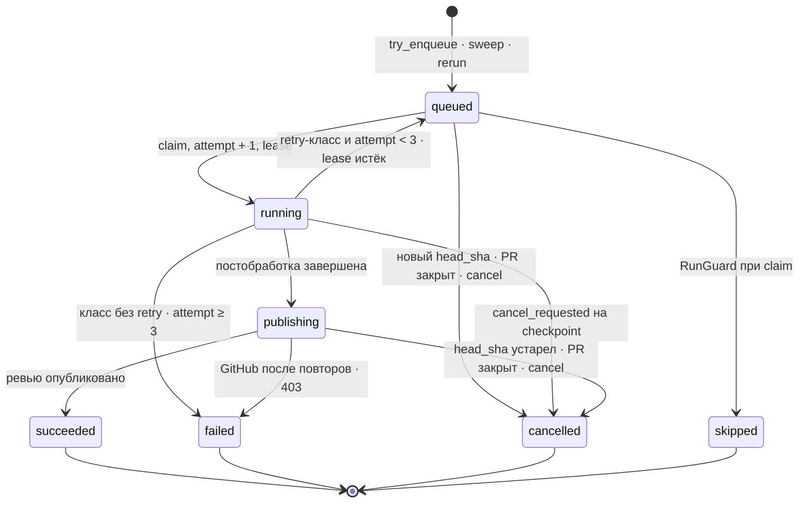

# PIPELINE_SPEC — жизненный цикл Run и политика сбоев (команда 6)

| | |
|---|---|
| Статус | **утверждён командой** — PR #36 (#20) |
| Владелец | техлид (роль 1) |
| Область действия | Жизненный цикл `Run` от триггера до check-run: состояния и переходы, фазы внутри `running`, таймауты, retry, сбои LLM и GitHub, каталог `error_code`, триггер Р-10, контракт выхода LLM, якорь находки, вердикт, сообщения очереди. Архитектура, топология, сборка контекста, кэш и HTTP API здесь не описываются |
| Связь с SD | [`SYSTEM_DESIGN.md`](SYSTEM_DESIGN.md) — канон архитектуры, этот документ — контракт жизненного цикла и сбоев. SD §6.4 и §7 ссылаются сюда. Здесь стоят ссылки на разделы SD, их текст не копируется. При расхождении по жизненному циклу и сбоям прав этот документ, по архитектуре — SD |
| Машиночитаемые контракты | `review/schemas/review-output.schema.json` (выход LLM), `contracts/schemas/review.{run,publish}.v1.schema.json` и `contracts/examples/*.json` (очередь), `contracts/openapi.yaml` (HTTP API). Все появляются в этом же PR; проверки — §16 |
| Метки решений | **[техлид]** — решение техлида в #20; **[дефолт]** — дефолт, утверждённый вместе с планом #20; решением становится после аппрува этого PR |

---

## 1. Состояния и переходы

Набор состояний Р-14 не меняется (D5 [техлид]): `queued | running | publishing | succeeded | failed | cancelled | skipped` — PG enum `run_state` и Zod `RunStatus`. Этапы работы — фазы внутри `running` (§2). Диаграмма уточняет SD §6.4.



| # | Из → в | Триггер | Кто | Guard | Побочные эффекты: сообщение · check-run |
|---|---|---|---|---|---|
| T1 | `[*]` → `queued` | `pull_request.labeled` (`ai-review`) и `reopened`, `check_suite` / `workflow_run.completed`, `pull_request.synchronize` → `try_enqueue` | webhook-api (#11) | условие Р-10 (§8) ∧ нет активного Run по PR (Р-2) ∧ нет Run с `trigger = webhook` для `(PR, head_sha)` | INSERT `runs` (`attempt = 0`, `available_at = now`), после commit — `review.run/v1` в `review.run.{engine}` · check-run не создаётся |
| T2 | `[*]` → `queued` | sweep «2 мин без CI» → тот же `try_enqueue` | worker, leader-цикл (#34) | `wait_for_ci = auto` ∧ ни чужих check suites, ни статусов коммита ≥ 2 мин (§8.3) ∧ guard T1 | как T1 |
| T3 | `[*]` → `queued` | `POST /api/runs/{id}/rerun` | portal-api (#34) | PR открыт [дефолт] ∧ нет активного Run по PR, иначе `409`; флаг и CI не проверяются | новый Run на текущий `head_sha`, `trigger = rerun`, AMQP priority 9 · check-run не создаётся |
| T4 | `queued` → `running` | доставка `review.run/v1` | worker | RunGuard: `state = queued` ∧ `available_at ≤ now` ∧ ¬`cancel_requested` ∧ `head_sha` актуален ∧ PR открыт | одним UPDATE: `attempt += 1`, `lease_until = now + 5 мин`, `worker_id`; `started_at` при первой попытке · check-run `in_progress` (создаётся при `attempt = 1`) |
| T5 | `queued` → `skipped` | RunGuard при claim | worker | `repo_disabled` / `rule_not_matched` / `budget_paused` (§6) | `error_code` = причина, ack · check-run сразу `completed/skipped`, при `repo_disabled` не создаётся |
| T6 | `queued` → `cancelled` | `synchronize` (новый `head_sha`), `pull_request.closed`, `POST /api/runs/{id}/cancel`; то же, найденное RunGuard при claim | webhook-api, portal-api, worker | — | `error_code` = `superseded` / `pr_closed` / `cancelled_by_user`; сообщение остаётся в брокере · check-run (если `attempt ≥ 1`) закрывает RunGuard при доставке |
| T7 | `running` → `running` | heartbeat раз в 60 с; смена движка (§5.3) | worker | UPDATE по своему `worker_id` ∧ `state = running`; 0 строк → воркер бросает работу без записей | `lease_until = now + 5 мин`; при fallback — действие `engine.fallback`, `engine = fast` |
| T8 | `running` → `publishing` | постобработка (`review.postprocess`) завершена | worker | ¬`cancel_requested` ∧ `head_sha` актуален | `findings`, вердикт → `review_event` (§11), `lease_until = now + 5 мин`; после commit — `review.publish/v1`, после confirm — ack `review.run` |
| T9 | `running` → `queued` | сбой класса с retry (§6) | worker | `attempt < 3` | `available_at = now + задержка` (§4.2), `lease_until = null`; копия сообщения в `reviews.retry`, после confirm — ack · check-run остаётся `in_progress` |
| T10 | `running` → `failed` | сбой класса без retry или `attempt ≥ 3` | worker | — | `error_code`, `error_message`, `finished_at`; попытки исчерпаны → `nack(requeue=false)` → `reviews.dlq`, иначе ack · check-run `neutral` (§7) |
| T11 | `running` → `cancelled` | checkpoint: после каждого уровня контекста и перед каждым LLM-вызовом (SD §5) | worker | `cancel_requested` | причина по PG: PR закрыт → `pr_closed`, `head_sha` устарел → `superseded`, иначе `cancelled_by_user`; ack · check-run `cancelled` |
| T12 | `running` → `queued` | реконсилер | portal-api, leader-цикл | `lease_until < now` ∧ `attempt < 3` | повторная публикация `review.run/v1`; попытка засчитывается при следующем claim |
| T13 | `running` → `failed` | реконсилер | portal-api, leader-цикл | `lease_until < now` ∧ `attempt ≥ 3` | `error_code = lease_expired`; публикация `review.run/v1`, чтобы RunGuard закрыл check-run · `neutral` через RunGuard |
| T14 | `publishing` → `succeeded` | `POST /pulls/{n}/reviews` → 2xx, в том числе после переноса 422 в тело (§5.2) | publisher (MVP — worker) | `head_sha` актуален ∧ ¬`cancel_requested`; `findings_hash` уже опубликован → только переход и ack | `comments`, `findings.published = true`, `finished_at`, ack · check-run `neutral` с вердиктом (§7) |
| T15 | `publishing` → `cancelled` | перед POST: `head_sha` устарел, PR закрыт или `cancel_requested`; 422 «commit не в PR» | publisher | — | причина как в T11, ack · check-run `cancelled` |
| T16 | `publishing` → `failed` | сбои публикации (§5.2) | publisher | — | `github_publish_failed` / `github_forbidden`, ack · check-run `neutral` |
| T17 | `publishing` (без смены) | реконсилер | portal-api | `lease_until < now` | повторная публикация `review.publish/v1` (идемпотентна по `findings_hash`, Р-5) |
| T18 | `queued` (без смены) | реконсилер | portal-api | `available_at < now − 10 мин` | повторная публикация `review.run/v1` в `review.run.{engine}`. Run в retry-очереди имеет `available_at` в будущем и не трогается |

Правила для всех переходов:

- **SSE.** Создание Run и каждая смена `state` — `NOTIFY run_updated` в той же транзакции (D12); T7, T17 и T18 состояние не меняют и уведомления не шлют [дефолт]. Payload — JSON в snake_case, как сообщения очереди: `{"run_id": "<uuid>", "workspace_id": "<uuid>", "status": "<run_state>"}` (PostgreSQL принимает payload короче 8000 байт); `workspace_id` позволяет portal-api раздать событие подписчикам Workspace этого Run (Р-7) без SELECT на каждое событие [техлид]. Шлют webhook-api (T1, T6 — #11), worker и portal-api (#34). Наружу portal-api отдаёт только SSE `run.updated` = `RunUpdatedEvent {runId, status}` из `contracts/openapi.yaml`; `workspace_id` наружу не выходит.
- **Сначала commit, потом сообщение.** Публикация в RabbitMQ — после commit, с publisher confirms; ack входящего сообщения — после confirm исходящего (SD §7.1). Вызовы GitHub и LLM — вне транзакции БД.
- **RunGuard решает по PG** (SD §6.3). Если Run не в `queued` или `available_at > now`, доставка подтверждается ack без работы. Если Run терминален и `attempt ≥ 1`, RunGuard идемпотентно доводит check-run до итогового conclusion (§7) и делает ack. Так закрываются check-run'ы Run, завершённых без воркера (T6, T13).
- **Publisher в MVP.** Пока отдельного сервиса `publisher` нет (#34), очередь `review.publish` потребляет отдельный consumer в процессе worker. T8 и T17 идут через настоящее сообщение `review.publish/v1`, T14–T16 выполняет этот consumer; идемпотентность по `findings_hash` и переходы те же.

---

## 2. Фазы внутри `running` и трейс `run_actions`

Фазы — D5 [техлид]: новых состояний нет, каждая фаза видна в инспекторе трейса как записи `run_actions`. Имена `tool` [дефолт] следуют точечному стилю, который уже пишет код на main.

| Фаза | `tool` | Состояние | Кто | Что делает | Checkpoint |
|---|---|---|---|---|---|
| загрузка диффа | `vcs.fetch_diff` | `running` | worker, `VcsProvider.get_diff` (#11; тип диффа — `ChangedFile` / `DiffLine` из кода на main) | `GET /pulls/{n}` и `/files`, снимок диффа в PG (Р-15); дифф > 3 000 строк → summary-only (SD §13) | после фазы |
| сборка контекста | `context.build`; `llm.repo_conventions` — вызов модели для конвенций репозитория (есть на main) | `running` | worker, `ContextProvider` | L0–L4 и `BudgetAllocator` (SD §9); в PG — summary `ContextPayload` | после каждого уровня |
| ревью моделью | `llm.call` — **одна запись на вызов провайдера** (`kind`: primary, retry, repair, fallback); `llm.review_output` — принятый валидный ответ, одна запись на Run | `running` | worker → LLM Gateway (#33) | вызовы модели по политике §5.1 | перед каждым вызовом |
| постобработка | `review.postprocess` | `running` | worker, `FindingsPostProcessor` | фильтр `review/postprocess/lint-filter.md`, запись `findings`, вердикт и `review_event` (§11), `findings_hash` | перед T8 |
| публикация | `github.publish_review` | `publishing` | publisher (MVP — consumer `review.publish` в worker) | `POST /pulls/{n}/reviews` и check-run; одна запись на HTTP-попытку | перед POST |
| смена движка | `engine.fallback` | `running` | worker | событие, не фаза: deep → fast (§5.3) | — |

Записи `llm.call` — скоуп #33; `vcs.fetch_diff`, `context.build`, `review.postprocess`, `github.publish_review`, `engine.fallback` — #34. Имена, которые уже пишет код на main (`llm.review_output`, `llm.repo_conventions`), сохраняются, и `llm.review_output` остаётся маркером идемпотентности публикации.

Summary-only (дифф > 3 000 строк, SD §13) — это не `skipped`. `context.build` и построчные вызовы модели пропускаются, публикуется одна сводка, Run заканчивается `succeeded` с `summaryOnly: true`.

| `tool` | `request` (JSONB, только метаданные, ≤ 64 КБ) | `response` |
|---|---|---|
| `vcs.fetch_diff` | `{pr_number, head_sha, base_sha}` | `{files: [{filename, status, additions, deletions, too_large}], total_lines, summary_only}`; патчи не дублируются — они в снимке (Р-15) |
| `context.build` | `{engine, token_limit}` | summary `ContextPayload`: `{files: [{path, level_used, priority}], omitted_files, budget: {limit, used}}` |
| `llm.repo_conventions` | `{}` (как на main) | `{files: [...]}` из `RepoConventionsDraft` (review/README.md) |
| `llm.call` | `{kind: primary \| retry \| repair \| fallback, model, call_no, attempt, timeout_s, prompt_version_id, rule_version_id, input_tokens_estimate}` | ответ провайдера как есть, в том числе невалидный, или `{error: {class, http_status, message}}`; токены и стоимость — в `usage_events` (Р-8) |
| `llm.review_output` | `{}` (как на main) | принятый `ReviewOutput`, прошедший схему и Pydantic (§9) |
| `review.postprocess` | `{min_confidence, max_inline}` | `{inline, body_only, dropped: [{index, drop_reason}], verdict, severity_counts, findings_hash}` |
| `github.publish_review` | `{head_sha, findings_hash, review_event, inline_count, try}` | `{github_review_id}` или `{error: {http_status, message}}` |
| `engine.fallback` | `{from: "deep", to: "fast", reason: daily_budget \| sandbox_timeout}` | `null` |

**Размер `response`** (D1, §14). Сериализованный JSON до 64 КБ включительно хранится в `run_actions.response`. Больший ответ — строка отдельной таблицы PG (таблица и миграция — #34): `run_actions.response_ref` хранит её id, `response = null` (CHECK `ck_run_actions_response_location` уже есть). UI читает тело через `GET /api/runs/{id}/actions/{index}/response`. Предел строки — 1 МиБ на всю сериализованную запись, включая обёртку [дефолт]. Больший ответ заменяется обёрткой `{"truncated": true, "original_bytes": N, "text": "<начало сериализованного JSON>"}`: `text` — самый длинный префикс сериализованного ответа, обрезанный по границе символа UTF-8, при котором сериализованная обёртка с экранированным `text` не превышает 1 МиБ. У `request` ссылки нет: туда пишутся только метаданные.

---

## 3. Таймауты

| Что | Значение | Где | При превышении |
|---|---|---|---|
| Ack вебхука | p95 < 500 мс (SD §13) | webhook-api | — |
| HTTP-запрос к GitHub | 10 с | webhook-api (`try_enqueue`), worker, publisher | класс «5xx / таймаут» (§5.2) |
| `vcs.fetch_diff` | своего лимита нет; ориентир — DiffEngine p95 ≤ 40 с на весь движок (SD §13) | worker | дедлайн |
| `context.build`, `review.postprocess` | своего лимита нет | worker | дедлайн |
| LLM-вызов fast / deep | 90 с / 300 с | LLM Gateway (#33) | класс «таймаут» (§5.1) |
| Дедлайн fast | 8 мин от claim каждой попытки (2 × p95 SD §13) | worker, перед вызовом и на checkpoint | `deadline_exceeded` |
| SandboxEngine (deep, фаза 3) | 10 мин (SD §13); после fallback — новый дедлайн fast, 8 мин | worker, deep-пул | `engine.fallback` (§5.3) |
| `github.publish_review` | 4 HTTP-попытки: паузы 2 с, 8 с, 30 с (или `Retry-After` ≤ 60 с) | publisher | `github_publish_failed` |
| Lease / heartbeat | 5 мин / 60 с | worker в `running`; в `publishing` действует lease из T8, публикация короче его | реконсилер: T12, T13, T17 |
| `consumer_timeout` | 45 мин (SD §7.1) | RabbitMQ | канал закрывается, сообщение возвращается; RunGuard решает по PG |
| Реконсилер | раз в 5 мин (SD §6.4) | portal-api, лидер `pg_advisory_lock` | T12, T13, T17, T18 |
| `queued` без доставки | 10 мин после `available_at` | реконсилер | T18 |
| Sweep триггера | раз в 30 с (D2) | worker, лидер `pg_advisory_lock` (#34) | T2 |
| Ожидание CI при `wait_for_ci = auto` | 2 мин | sweep | старт без CI |
| Задержки retry | 30 с / 2 мин / 10 мин | `reviews.retry` | §4.2 |

---

## 4. Retry и backoff

### 4.1 Один счётчик (D13 [дефолт])

- `runs.attempt` — единственный счётчик попыток: `0` при INSERT, `+1` в том же UPDATE, что T4. Предел — 3 попытки.
- `attempt` в `review.run/v1` — номер попытки с 1, которую ожидает отправитель: `runs.attempt + 1` на момент публикации, в том числе повторной. Его ставит каждая публикация (T1–T3, T9, T12, T13, T18); копия в T9 публикуется с новым значением. Поле информационное: при расхождении прав `runs.attempt`.
- `x-death` — только диагностика (из какой очереди, когда, сколько раз). Решения по нему не принимаются; это уточняет SD §7.2.
- Истёкший lease тоже тратит попытку (T12, T13). Если воркер падает на одном Run раз за разом, Run приходит в `failed` (`lease_expired`) после 3 попыток.
- Классы без retry (§6) ведут в `failed` при любом `attempt`.

### 4.2 Задержки

| Ситуация | Задержка | Очередь |
|---|---|---|
| сбой попытки 1 | 30 с | `retry.30s.{engine}` |
| сбой попытки 2 | 2 мин | `retry.2m.{engine}` |
| rate limit: `llm_rate_limited`, GitHub 403/429 с `Retry-After` | не меньше 2 мин; `Retry-After` > 2 мин → 10 мин | `retry.2m.{engine}` / `retry.10m.{engine}` |
| сбой попытки 3 | — | T10: `failed`, копия в `reviews.dlq` |

`{engine}` — текущий `runs.engine`; после `engine.fallback` это `fast`.

### 4.3 Возврат из retry-очереди — требование к топологии SD §7.1 (реализует #34)

RabbitMQ пересылает dead-letter с исходным routing key, если у очереди не задан `x-dead-letter-routing-key`. В топологии SD §7.1 сообщение из `retry.30s` вернулось бы в `reviews` с ключом `retry.30s`, а привязки для него нет — сообщение потерялось бы. Поэтому retry-очередь заводится на каждую пару «задержка, цель»:

| Очередь (= routing key в `reviews.retry`) | `x-message-ttl`, мс | `x-dead-letter-exchange` | `x-dead-letter-routing-key` |
|---|---|---|---|
| `retry.30s.fast`, `retry.2m.fast`, `retry.10m.fast` | 30 000 / 120 000 / 600 000 | `reviews` | `review.run.fast` |
| `retry.30s.deep`, `retry.2m.deep`, `retry.10m.deep` | 30 000 / 120 000 / 600 000 | `reviews` | `review.run.deep` |

- TTL задан на очереди, а не на сообщении, поэтому в очереди одной задержки сообщения истекают по порядку.
- Аргументы очереди после объявления не меняются. #34 объявляет их сразу в таком виде, иначе понадобятся удаление и повторное объявление.
- Свойство `priority` (rerun — 9) при dead-letter сохраняется.
- У `review.publish` retry-очереди нет: публикация повторяется внутри процесса (§5.2).

### 4.4 DLQ

- В `reviews.dlq` (через `reviews.dlx`, хранение 7 дней, SD §7.1) попадают два вида сообщений. Первый — сообщение Run, исчерпавшего попытки: T10 делает `nack(requeue=false)` после commit `failed`. Второй — сообщение с незнакомой мажорной версией `schema` или не проходящее `contracts/schemas/*` (SD §7.2).
- Сбои классов без retry подтверждаются ack без DLQ: причина уже записана в PG (`error_code`, `run_actions`).
- DLQ читает оператор. Реконсилер её не разбирает: Run уже `failed`, повторить его можно только через rerun.

### 4.5 Лимиты вызовов и стоимости

- На попытку — не больше 4 вызовов провайдера (записей `llm.call`) всего, включая основной. Как класс сбоя их тратит, задаёт §5.1: таймаут — основной + повтор + fallback; 5xx — основной + 2 повтора + fallback; невалидный JSON — основной + repair + fallback. На Run — не больше 12. Ротация ключей внутри шлюза (#33) вызовом не считается.
- Стоимость проверяется **до** каждого вызова: сумма `usage_events.cost_usd` по Run за все попытки (включая вызов конвенций, если он был) плюс оценка следующего вызова (входные токены и максимум выхода по цене модели) не должна превышать лимит прогона: fast $0.50, deep $3 (SD §13). Иначе срабатывает класс «бюджет».
- Входные токены: fast 60 000, deep 150 000 (SD §13). Превышение по предварительному подсчёту — класс «переполнение контекста».

---

## 5. Сбои и деградация

### 5.1 Классы сбоев LLM

Fallback-модель — вторая модель шлюза с тем же strict structured output (D7); какая именно — OQ-2 (§14).

| Класс | Обнаружение | Попытки и backoff | Repair / fallback / контекст | Итог Run, `error_code` | Автор PR (check-run) | UI |
|---|---|---|---|---|---|---|
| Таймаут | нет ответа за 90 с / 300 с | 1 повтор в шлюзе через 2 с + jitter до 1 с | fallback 1 раз, затем retry прогона (§4.2) | `failed`, `llm_timeout` после 3 попыток | `neutral` «AI-ревью не выполнено» + текст §6; ревью нет | `failed` + `errorCode`; каждый вызов — `llm.call` |
| 429 | HTTP 429 после ротации ключей в шлюзе (#33) | ждать `Retry-After`, если ≤ 30 с, 1 раз; иначе сразу fallback | fallback 1 раз, retry прогона с задержкой ≥ 2 мин | `failed`, `llm_rate_limited` | то же | то же |
| 5xx / соединение | HTTP 5xx, отказ или обрыв соединения | 2 повтора: 2 с, 8 с (+ jitter до 1 с) | fallback 1 раз, retry прогона | `failed`, `llm_unavailable` | то же | то же |
| Невалидный или нестрогий JSON | не JSON; вывод обрезан по длине; нарушена `review-output.schema.json` или семантика §9 (`InvalidReviewOutput`) | тот же запрос не повторяется | 1 repair-вызов той же модели с ошибками валидатора, затем fallback 1 раз; retry прогона нет | `failed`, `llm_invalid_output` | то же | то же; ответ модели — в `response` записи `llm.call` |
| Переполнение контекста | предварительный подсчёт > лимита SD §13 или HTTP 400 провайдера о длине контекста | вызов того же размера не повторяется | 1 пересборка на уровень ниже: снимается последний добавленный уровень в обратном порядке SD §9 (L3 → L2 → L4, L1 остаётся); fallback и retry прогона нет. Пока контекст состоит только из L1 (спринт 2), пересборки нет — шлюз сразу возвращает `llm_context_overflow`; пересборка включается вместе с ContextProvider L2–L4 [техлид] | `failed`, `llm_context_overflow` | то же | то же; `context.build` дважды — после включения пересборки |
| Бюджет прогона | сумма и оценка превышают лимит (§4.5) | вызов не делается | — | fast: `failed`, `budget_exceeded`; deep: публикуется сделанное (SD §13), `succeeded` | fast: как выше; deep: ревью, в check-run «прервано по бюджету» | fast: `failed`; deep: `succeeded` |
| Дедлайн | перед вызовом осталось меньше таймаута вызова; на checkpoint дедлайн истёк (§3) | вызов не делается | — | `failed`, `deadline_exceeded` | как в первой строке | `failed` + `errorCode` |

### 5.2 Сбои GitHub

| Сбой | Фаза | Обнаружение | Попытки | Итог Run, `error_code` | Автор PR | UI |
|---|---|---|---|---|---|---|
| 5xx / таймаут / лимит | `vcs.fetch_diff` | HTTP 5xx, таймаут 10 с, 403/429 с `Retry-After` или `X-RateLimit-Remaining: 0` | retry прогона (§4.2) | `failed`, `diff_fetch_failed` после 3 попыток | check-run `neutral` | `failed` |
| Нет доступа | `vcs.fetch_diff`, `github.publish_review` | 403 без признаков лимита; 404 на PR или репозиторий | нет | `failed`, `github_forbidden` | check-run `neutral`, если его удалось обновить | `failed` |
| 5xx / таймаут / вторичный лимит | `github.publish_review` | как в первой строке | 3 повтора в процессе: 2 с, 8 с, 30 с; `Retry-After` ≤ 60 с заменяет паузу | `failed`, `github_publish_failed` | check-run `neutral`, ревью нет | `failed`; каждая попытка — `github.publish_review` |
| 422 на координатах | `github.publish_review` | 422: строка комментария вне диффа | 1 повтор: все inline переносятся в тело ревью (SD §8.3), `findings.inline_comment = false` | `succeeded` | одно ревью, находки в теле | `succeeded`; две записи `github.publish_review` |
| 422 на устаревшем commit | `github.publish_review` | 422: `commit_id` не относится к PR (был новый пуш) | нет | `cancelled`, `superseded` | check-run `cancelled` | `cancelled` |

Ошибка при обновлении check-run состояние Run не меняет: пишется лог и метрика.

### 5.3 Деградация deep → fast (SD §13)

| Причина | Когда проверяется | Что происходит | `runs.engine` | Итог |
|---|---|---|---|---|
| Остаток дневного бюджета Workspace < лимита deep ($3) | при claim deep-Run | Run выполняется как fast тем же воркером deep-пула | → `fast` | путь fast; не `failed` |
| Таймаут SandboxEngine, 10 мин | в фазе движка deep | тот же Run продолжается как fast; дедлайн fast отсчитывается от fallback | → `fast` | путь fast; не `failed` |
| Остаток дневного бюджета < лимита fast ($0.50) | при claim любого Run | Run не запускается | — | `skipped`, `budget_paused` |

Оба fallback пишут действие `engine.fallback` (§2). Это заменяет формулировку SD §13 «failed с фоллбэком на fast»: `failed` терминален. Retry после fallback идёт в `retry.*.fast`.

---

## 6. Каталог `error_code`

`runs.error_code` (`String(100)`, Zod `errorCode: string | null`): для `failed` — причина сбоя, для `cancelled` и `skipped` — причина завершения, в остальных состояниях — `null`. Новые коды миграции не требуют. Технические детали пишутся в `error_message` и `run_actions`, в check-run они не попадают. Для `failed` к тексту добавляется ссылка на прогон в UI.

| `error_code` | Состояние | Класс | Retry | Текст автору PR (summary check-run) |
|---|---|---|---|---|
| `llm_timeout` | `failed` | LLM | да: шлюз, fallback, прогон | Модель не ответила вовремя. Прогон можно перезапустить из UI. |
| `llm_rate_limited` | `failed` | LLM | да | Провайдер модели ограничил частоту запросов. Перезапустите прогон позже. |
| `llm_unavailable` | `failed` | LLM | да | Провайдер модели недоступен. |
| `llm_invalid_output` | `failed` | LLM | repair и fallback; прогон — нет | Модель вернула ответ не по контракту. |
| `llm_context_overflow` | `failed` | LLM | пересборка контекста — с L2–L4, пока только L1 её нет; прогон — нет | PR не помещается в контекст модели. |
| `budget_exceeded` | `failed` | бюджет | нет | Превышен лимит стоимости прогона. |
| `deadline_exceeded` | `failed` | время | нет | Прогон не уложился в лимит времени. |
| `diff_fetch_failed` | `failed` | GitHub | да: прогон | Не удалось получить дифф из GitHub. |
| `github_forbidden` | `failed` | GitHub | нет | У GitHub App нет доступа к репозиторию или PR. |
| `github_publish_failed` | `failed` | GitHub | 3 повтора публикации; прогон — нет | GitHub не принял ревью. |
| `lease_expired` | `failed` | инфраструктура | да: реконсилер | Обработка прервалась 3 раза подряд. |
| `internal_error` | `failed` | прочее | да: прогон | Внутренняя ошибка сервиса. |
| `superseded` | `cancelled` | отмена | — | В PR новый коммит — ревью будет для него. |
| `cancelled_by_user` | `cancelled` | отмена | — | Прогон отменён из UI. |
| `pr_closed` | `cancelled` | отмена | — | PR закрыт. |
| `repo_disabled` | `skipped` | отбор | — | — (check-run не создаётся) |
| `rule_not_matched` | `skipped` | отбор | — | PR не прошёл правило отбора репозитория. |
| `budget_paused` | `skipped` | бюджет | — | Дневной бюджет исчерпан, ревью на паузе. |

«Retry: да» означает T9 при `attempt < 3`. `summary_only` — не код: такой Run заканчивается `succeeded` с `summaryOnly: true` (§2).

---

## 7. Check-run бота (SD §8.3)

Один check-run на Run (`external_id = run_id`). Он создаётся при первом claim (T4), следующие попытки его обновляют. `conclusion: failure` не используется никогда: бот не блокирует merge.

| Итог Run | `status` / `conclusion` | Заголовок | Summary |
|---|---|---|---|
| выполняется | `in_progress` | AI-ревью выполняется | попытка N из 3 |
| `succeeded` | `completed` / `neutral` | AI-ревью: `blocking` / `attention` / `clean` (§11); summary-only — «AI-ревью: только сводка» | `severityCounts`, сколько находок inline и сколько в теле, ссылка на прогон; summary-only — «PR слишком большой: только сводка»; deep по бюджету — «прервано по бюджету» |
| `failed` | `completed` / `neutral` | AI-ревью не выполнено | `error_code`, текст §6, ссылка; ревью и inline-комментариев нет |
| `cancelled` | `completed` / `cancelled` | AI-ревью отменено | причина §6; до первого claim check-run'а нет |
| `skipped` | `completed` / `skipped` | AI-ревью пропущено | причина §6; создаётся сразу завершённым, при `repo_disabled` не создаётся |

Check-run Run, завершённого без воркера (T6 после первого claim, T13), закрывает RunGuard при доставке (§1).

---

## 8. Триггер (Р-10, D2)

### 8.1 Условие

`try_enqueue(pr)` (#11) — одна функция для обработчиков вебхуков и для sweep в worker (§8.3). Она решает по состоянию, а не по последнему событию (SD §6.1). Run создаётся, когда выполнены все условия:

| Условие | Проверка |
|---|---|
| На PR стоит лейбл `ai-review` | `code_changes.reviewer_requested` — наш флаг (§8.2) [техлид, #37] |
| CI зелёный для `head_sha` | REST в момент `try_enqueue`, порядок событий не важен [дефолт]: (а) `GET /repos/{owner}/{repo}/commits/{head_sha}/check-suites` — каждый чужой suite (все, кроме suite нашего App, `app.id`) имеет `status = completed` и `conclusion ∈ {success, neutral, skipped}`; (б) `GET /repos/{owner}/{repo}/commits/{head_sha}/status` — combined status `success` или статусов нет (`total_count = 0`; SD §8.2, события `status`); (в) CI есть: хотя бы один чужой suite или статус. При `wait_for_ci = never` проверка не выполняется; при `auto` и отсутствии CI через 2 мин — T2 |
| Нет активного Run по PR | Р-2 |
| Нет Run с `trigger = webhook` для `(PR, head_sha)` | повторные `check_suite.completed` по тому же sha второго прогона не создают; повторить можно только через rerun |

Свой suite исключается из условия. GitHub создаёт его для App с `checks: write`, а завершается он только нашим check-run — без исключения условие ждало бы само себя. Сам check-run бот ставит по-прежнему (§7). `ci_status` в `code_changes` — кэш событий, решение принимается по REST.

| `wait_for_ci` | Поведение |
|---|---|
| `always` | ждать зелёного CI без срока; пока нет ни чужих suites, ни статусов, Run не создаётся |
| `auto` | как `always`, но если через 2 мин после постановки лейбла или пуша нет ни чужих suites, ни статусов — старт без CI (§8.3) |
| `never` | достаточно лейбла |

### 8.2 Флаг и повторное ревью после пуша

| Событие | `reviewer_requested` | Действие |
|---|---|---|
| `labeled`, `label.name == "ai-review"` | `true` | `try_enqueue` |
| Бот опубликовал ревью | не меняется | бот лейбл не снимает, флаг остаётся [техлид, #37] |
| `synchronize` | не меняется | активный Run отменяется (`superseded`), `try_enqueue` для нового `head_sha` — авто-повтор, пока PR открыт [техлид] |
| `unlabeled`, `label.name == "ai-review"`, `sender` — человек | `false` | новые Run не создаются; активный Run доработает |
| `labeled` / `unlabeled` от самого бота | не меняется | игнорируется (Р-9) |
| `pull_request.closed` | `false` | активный Run отменяется (`pr_closed`) |
| `reopened` | есть ли `ai-review` в `pull_request.labels` | `try_enqueue`; окно sweep отсчитывается заново, если флаг стал `true` (§8.3) [техлид] |

Бота нельзя запросить ревьюером: `POST /repos/{owner}/{repo}/pulls/{pull_number}/requested_reviewers` с `<slug>[bot]` отвечает 201 с пустым `requested_reviewers`, событие `review_requested` не приходит, а GraphQL `requestReviews` принимает только `User` (проверено на staging App, [#37](https://github.com/larchanka-training/dmc-268-api-t6/issues/37#issuecomment-5874776355)). Поэтому триггер — лейбл `ai-review`. Ставить и снимать лейблы может только участник с правом triage и выше ([GitHub Docs](https://docs.github.com/en/issues/using-labels-and-milestones-to-track-work/managing-labels)): внешний автор PR не запустит ревью и не потратит бюджет LLM. События `labeled` / `unlabeled` приходят в подписке `pull_request`, новых прав App не нужно; сам лейбл App создаёт при подключении репозитория (SD §6.9, OQ-8).

### 8.3 Sweep «2 мин без CI»

- **Где:** leader-цикл сервиса worker (лидер через `pg_advisory_lock`), раз в 30 с [дефолт]; реализует #34. У worker уже есть ключ App (SD §8.3), поэтому REST-проверка не требует новых секретов. Реконсилер portal-api с периодом 5 мин sweep не заменяет.
- **Кандидаты:** PR открыт ∧ `reviewer_requested` ∧ `wait_for_ci = auto` ∧ нет Run для `(PR, head_sha)` ∧ прошло ≥ 2 мин с более позднего из двух моментов: `reviewer_requested` стал `true`, появился `head_sha`. Отметки времени в `code_changes` добавляет #11.
- **Действие:** тот же `try_enqueue(pr, allow_no_ci = true)`, что у вебхуков (#11). Функция повторяет REST-проверку: если появился чужой suite или статус, ждём результата; если нет — T2.

---

## 9. Выход LLM: `ReviewOutput`

Форма — `review/schemas/review-output.schema.json` (draft 2020-12, появляется в этом PR); это единственный источник формы. Pydantic `ReviewOutput` (`app/modules/reviews/application/review_output.py`) повторяет её 1:1, совпадение проверяет `tests/test_review_output_schema.py`. Промпт — `review/prompts/review.system.v1.md` §7–§10.

- `{findings: [≤ 10], summary: {problem, done_well, effort}}`. Все ключи обязательны. `start_line`, `suggestion`, `rule_name` допускают `null`, но ключ присутствует всегда. Лишних ключей нет ни на одном уровне.
- `side` и SHA в выходе нет: сторону ставит постпроцессор (всегда `RIGHT`), SHA берётся из `Run.head_sha`.

Семантика, которую JSON Schema не выражает (набор кейсов закреплён корпусом `tests/fixtures/review_output/`):

| Правило | Pydantic (рантайм) | `validate_findings.py` (eval, #30) |
|---|---|---|
| `start_line < line` | отвергает | отвергает |
| `title` — одна строка без точки в конце | отвергает | отвергает |
| порядок: severity по убыванию, затем confidence по убыванию | отвергает | отвергает |
| `summary.problem` — 1 предложение, `done_well` — 1–2 | отвергает | отвергает |
| `rule_name` ↔ префикс `body` «According to custom instructions in '<rule_name>' (» | не проверяет — постпроцессор чинит (lint-filter, шаг 6) | отвергает |

**`suggestion`:**

- Это готовая замена ровно строк `start_line..line` новой версии файла; при `start_line = null` — одной строки `line`. Код должен встать на место этих строк без правок: без прозы, без маркеров диффа (`+`, `-`, `@@`) и без ограждения ```` ``` ````. Блок ```` ```suggestion ```` добавляет публикатор (SD §8.3).
- `null`, если готовой замены нет.
- Публикуется только у inline-находки, строки которой лежат внутри hunk (lint-filter, шаг 4). Находка в теле ревью публикуется без `suggestion`.
- Сторону `LEFT` модель не производит: `suggestion` всегда заменяет строки новой версии.

**Structured output провайдеров.** Строгий режим требует, чтобы все ключи были обязательными, а `additionalProperties` — `false`. Схема этому уже соответствует: nullable-поля заданы типом `[..., "null"]`. `start_line < line` и остальная семантика схемой не выражаются. Они проверяются после ответа (Pydantic), нарушение относится к классу «невалидный JSON» (§5.1). Какие ключевые слова схемы поддерживает конкретный провайдер, проверяет #33 в рамках OQ-2 (D7: strict structured output у основной и fallback-модели). Вторая схема руками не пишется: авторитетны `review-output.schema.json` и Pydantic.

---

## 10. Якорь находки (D6)

Канон — `path`, `start_line`, `line` (+ `side`): в JSON Schema, SD §5 и §11 и в датасете #30 [техлид]. БД и Zod не переименовываются. Формулы — [дефолт]:

| Слой | Поля | Правило |
|---|---|---|
| LLM (`ReviewOutput`), датасет #30 | `path`, `start_line`, `line` | `start_line = null` — одна строка, иначе `start_line < line`; стороны нет |
| БД `findings` | `file_path`, `line_start`, `line_end`, `side` | `file_path = path`; `line_start = start_line ?? line`; `line_end = start_line != null ? line : null`; `side = RIGHT` (постпроцессор) |
| API / Zod (`ReviewComment`, `FindingView`) | `file`, `oldLine`, `newLine`, `endLine` (+ `side` в `FindingView`) | `file = file_path`; `newLine = side == RIGHT ? line_start : null`; `oldLine = side == LEFT ? line_start : null`; `endLine = line_end` |
| GitHub `POST /pulls/{n}/reviews` | `path`, `line`, `side`, `start_line?` | `line = line_end ?? line_start`; `start_line = line_start` только при `line_end != null` |

| Случай | LLM | БД (`line_start, line_end, side`) | API |
|---|---|---|---|
| одна строка 42 | `start_line: null, line: 42` | `42, null, RIGHT` | `newLine: 42, oldLine: null, endLine: null` |
| диапазон 10–14 | `start_line: 10, line: 14` | `10, 14, RIGHT` | `newLine: 10, oldLine: null, endLine: 14` |

UI рисует диапазон `[newLine ?? oldLine, endLine ?? newLine ?? oldLine]`; у однострочной находки `endLine = null`.

---

## 11. Вердикт и бейджи (D3)

- **Правило** [техлид]. Считается по находкам Run с `drop_reason IS NULL`: это inline-находки и находки в теле ревью; после публикации — ровно те, у которых `published = true`. Есть `critical` или `high` → `blocking`; иначе есть `medium` или `low` → `attention`; иначе (только `info` или пусто) → `clean`.
- **Где считается.** Одна чистая функция вызывается в постобработке (`review.postprocess`, до T8 — от вердикта зависит `review_event`) и в portal-api при чтении run detail. Отдельной колонки нет. `ReviewOutput` и промпт не меняются: модель вердикт не выдаёт.
- **Run detail** (`RunDetail` в `contracts/openapi.yaml`): `verdict: blocking | attention | clean | null`, `severityCounts {critical, high, medium, low, info}` по тому же набору находок, `summary {problem, doneWell, effort} | null`, `findings` с `suggestion` и `confidence`. `verdict = null`, пока Run не `succeeded`, и у summary-only прогона. В списке PR (D11) — `latestRun.verdict`.
- **Бейджи** — только группировка в UI: Critical = `critical` + `high`, Warning = `medium` + `low`, Info = `info`. API отдаёт пять уровней.
- **`review_event`** [дефолт]: `Repository.reviewEvent = REQUEST_CHANGES` ∧ `verdict = blocking` → `REQUEST_CHANGES`, иначе `COMMENT`. По умолчанию `reviewEvent = COMMENT` (D8).

---

## 12. Сообщения очереди

Топология и общие правила — SD §7.1–§7.2, маршрут retry — §4.3.

| Сообщение | JSON Schema | Фикстура | Кто → кому |
|---|---|---|---|
| `review.run/v1` | `contracts/schemas/review.run.v1.schema.json` | `contracts/examples/review.run.v1.json` | webhook-api (T1), worker (sweep, T2), portal-api (T3, реконсилер) → worker |
| `review.publish/v1` | `contracts/schemas/review.publish.v1.schema.json` | `contracts/examples/review.publish.v1.json` | worker (T8), реконсилер (T17) → publisher (MVP — consumer `review.publish` в процессе worker) |

Фикстуры — строгий JSON вместо jsonc из SD §7.2. Что изменилось по сравнению с SD §7.2:

| Поле | SD §7.2 | Контракт |
|---|---|---|
| `message_id`, `run_id`, `workspace_id`, `repo.id`, `rule_version_id`, `prompt_version_id` | `"b3c1…"`, `"ws_…"`, `"r_…"`, `"rv_7"` | UUID без префиксов, как в БД; в `review.run/v1` `message_id = run_id` (схемой не выражается — указано в `description`) |
| `message_id` в `review.publish/v1` | `"pub_b3c1…"` | UUID, детерминированно выводится из `run_id`, `head_sha` и `findings_hash` |
| `findings_hash` | `"sha256:…"` | 64 hex в нижнем регистре без префикса, как `comments.findings_hash CHAR(64)` |
| `head_sha`, `base_sha` | `"a3f9…"` | 40 hex |
| `attempt` | попытки считает `x-death` | номер попытки с 1, которую ожидает отправитель: `runs.attempt + 1` на момент публикации, в том числе повторной; поле информационное: при расхождении прав `runs.attempt` (§4.1) |
| `trigger` | `webhook \| manual \| rerun \| dry_run` | enum тот же; sweep и реконсилер сохраняют исходный `trigger`; `manual` и `dry_run` зарезервированы, эндпоинтов для них нет |
| приоритет | «priority 9» у rerun (SD §12) | свойство AMQP, а не поле: rerun — 9, остальные — 0 |

---

## 13. Термин куратора → канон

Имена куратора встречаются только в этой таблице. В коде, схемах и остальных документах — только канон.

| Термин куратора (карточки спринта 2) | Канон | Где в каноне | Задача |
|---|---|---|---|
| `ReviewJob` | сущность `Run`, API-представление `RunSession` | SD §11, §12; `contracts/openapi.yaml` | #34, ui#57, #30 |
| стадии `FETCHING_DIFF` / `PARSING_CONTEXT` / `LLM_PROCESSING` | фазы внутри `running`: `vcs.fetch_diff` / `context.build` / `llm.call` в `run_actions.tool`; новых состояний нет | §2 (D5) | #11, #33, #34, ui#57 |
| `COMPLETED` | `succeeded` (Р-14); `completed` — только статусы GitHub | SD §1, §6.4; §1 | ui#50, ui#57 |
| очередь на Redis с DLQ | RabbitMQ (Р-1): `review.run.*`, `reviews.retry`, `reviews.dlq`; Redis — только кэш (SD §10) | SD §7; §4 | #34, #35 |
| `GET /api/v1/reviews/{id}` | `GET /api/runs/{id}` → `RunDetail`; префикс `/api` без версии (D9) | `contracts/openapi.yaml`, SD §12 | #34, ui#57 |
| список PR | `GET /api/repos/{id}/pulls` → `{items: PullRequestSummary[], nextCursor}` (D11) | `contracts/openapi.yaml` | #34 |
| бейджи Critical / Warning / Info | пять уровней severity; три бейджа — группировка в UI | §11 | ui#57 |
| «общий скор / вердикт» | `verdict: blocking \| attention \| clean`, выводится на сервере; скора нет | §11 (D3) | #34, ui#57, #30 (`expected_verdict`) |
| Diff Suggestion; предлагаемый diff-fix (карточка техлида) | `suggestion` находки: замена строк `start_line..line`; `null` — замены нет | §9 | #33, ui#57 |
| запуск по `opened` / `synchronize` | конъюнкция Р-10: стоит лейбл `ai-review` ∧ CI зелёный; `synchronize` отменяет устаревший Run и запускает авто-повтор | §8 (D2) | #11 |
| «GitHub / GitLab» (карточки Инженера 1 и Инженера 3) | в v1 только GitHub; GitLab — порт `VcsProvider` без реализации (Р-11) | SD §1, §8.1 | #11, ui#50 |
| LLM Gateway с провайдерами и fallback | LLM Gateway (SD §5): ротация ключей внутри шлюза, fallback-модель по §5.1, strict structured output (D7) | §4.5, §5 | #33 |
| хранилище секретов | env из CI; перечень и правила — `docs/SECRETS.md` (роль 3) | SD §13, `docs/SECRETS.md` | #35 |
| инфраструктура DevOps: PostgreSQL и Redis | PostgreSQL 17 + RabbitMQ + Redis (D1) | §14, SD §10, §14 | #35 |
| «Применить Terraform» (карточка DevOps) | окружение staging — курсовой VPS вне Terraform; стеки `terraform/` остаются задокументированной альтернативой, CI продолжает их проверять, apply не требуется | `docs/INFRASTRUCTURE.md` | #35 |
| «по пушу в main/develop» (карточка DevOps) | ветки `develop` нет, базовая ветка — `main`; `main` выкатывается на staging, prod вне спринта | `docs/CICD.md` | #35 |
| «Docker-образы бэкенда, воркеров» (карточка DevOps) | образ один: воркер запускается из того же образа, что `api`, своей командой (#34); per-service образы — вместе с разделением на сервисы (#16), не в этом спринте | SD §14 | #34, #35 |
| Finding «от Теклида» (карточка LLM Gateway) | `ReviewOutput` по `review/schemas/review-output.schema.json`, а не `Finding[]` | §9 | #33, #30 |

---

## 14. Решения

| Вопрос | Решение | Источник |
|---|---|---|
| Р-10 / OQ-1 — триггер и повторное ревью | **закрыт**: конъюнкция Р-10 подтверждена; триггер — лейбл `ai-review`, потому что бота нельзя запросить ревьюером ([#37](https://github.com/larchanka-training/dmc-268-api-t6/issues/37#issuecomment-5874776355)); после пуша — авто-повтор, пока PR открыт и стоит лейбл (флаг `reviewer_requested`, §8) | D2 [техлид]; лейбл вместо запроса ревьюера — [техлид] по #37; определение «зелёного CI» (check suites без своего и combined status `success` или пусто), проверка через REST, sweep раз в 30 с в leader-цикле worker — [дефолт] |
| OQ-2 — модель и бюджет | владелец — исполнитель #33 (lama2x2), срок 01.10.2026. Требования: strict structured output у основной и fallback-модели, контекст ≥ 60 000 токенов, стоимость fast ≤ $0.50 за прогон | D7 [техлид] |
| OQ-3 — `review_event` по умолчанию | **закрыт**: `COMMENT`; поле `reviewEvent` в `Repository`; `REQUEST_CHANGES` — только при `reviewEvent = REQUEST_CHANGES` ∧ `blocking` (§11) | D8, D3 [дефолт] |
| Инфраструктура MVP | PostgreSQL 17 + RabbitMQ + Redis. Объектное хранилище (S3) отложено после MVP. Вместо него: тела ответов > 64 КБ — отдельная таблица PG (§2, миграция — #34); полный `ContextPayload` не хранится, в PG — только summary; payload вебхука — JSONB в PG (миграция — #11); блобы > 256 КБ — `cached_file_blobs` в PG | D1 [техлид, пересмотрено 27.09.2026] |
| Контракт авторизации | GitHub App user authorization без OAuth scopes; `state` генерирует и хранит SPA. `POST /api/auth/github/callback {code}` → access JWT (15 мин, Bearer) и refresh в httpOnly-cookie (30 дней, ротация, `Path=/api/auth`). Дальше — `POST /api/auth/refresh`, `GET /api/auth/me`, `POST /api/auth/logout`; SSE — fetch-стрим с Bearer. Полный контракт — SD §12 и `contracts/openapi.yaml`, реализация — #11 | D4 [техлид]; access-токен в памяти, подпись в auth-api и проверка публичным ключом в portal-api, граница Workspace по Р-7 — [дефолт] |
| Стадии, вердикт, якорь, retry | §2, §11, §10, §4 | D5, D3 [техлид]; имена `run_actions.tool` в стиле main — [дефолт]; D6 [техлид, формулы — дефолт]; D13 [дефолт] |
| Rerun (T3) | `POST /api/runs/{id}/rerun` создаёт новый Run на текущий `head_sha`; флаг и CI не проверяются. `409`, если у PR есть активный Run или PR закрыт (§1) | `409` при активном Run и при закрытом PR — [дефолт] |

---

## 15. Открытые вопросы

| # | Вопрос | Предложение | Кто решает |
|---|---|---|---|
| 1 | Где работает sweep (§8.3): для REST-проверки нужен installation-токен, а ключ App по SD §8.3 есть только у webhook-api, worker и publisher | **закрыт**: leader-цикл worker, тот же `try_enqueue` (§8.3) [дефолт] | #34 |
| 2 | REST-вызов check-suites внутри обработчика вебхука может не уложиться в ack p95 < 500 мс (SD §13) | #11 измеряет на staging; если не укладывается — `try_enqueue` после ответа 202, страховка — sweep | #11 |
| 3 | Статусы коммитов (`status`, SD §8.2) в условии «CI зелёный» | **закрыт**: combined status `success` или статусов нет (§8.1) [дефолт] | #11 |
| 4 | Приходит ли `review_request_removed` после ревью бота (§8.2) | **закрыт**: не применимо — бота нельзя запросить ревьюером, флаг снимает `unlabeled` (§8.2, #37) | #11 |
| 5 | Владелец таблицы тел ответов > 64 КБ и её миграции (§2) | **закрыт**: #34 [дефолт] | #34 |

---

## 16. Проверки

Команды запускаются из корня репозитория. Тесты не требуют БД и входят в required check `Python lint / type / test` (`uv run pytest`). Политику §1–§8 проверяют тесты реализаций (#11, #33, #34); этот PR фиксирует схемы.

| Контракт | Команда | Что проверяет |
|---|---|---|
| Выход LLM, одна выдача | `uv run python review/scripts/validate_findings.py review/examples/findings.sample.json` | форма по схеме и семантика §9: `OK ReviewOutput 5 items`, при нарушении — exit 1 |
| `ReviewOutput`: схема ↔ Pydantic ↔ скрипт | `uv run pytest tests/test_review_output_schema.py` | одинаковый вердикт трёх проверок на корпусе `tests/fixtures/review_output/` |
| Схема правил и примеры `review/` | `uv run pytest tests/test_review_artifacts.py` | `review/rules/schema.json`; примеры прогоняются через скрипт |
| Сообщения очереди | `uv run pytest tests/test_contract_schemas.py` | фикстуры проходят схемы, мутации (id с префиксом, `sha256:`, лишние ключи) отвергаются |
| HTTP API | `uv run pytest tests/test_openapi_contract.py` | валидность OAS 3.1; пути FastAPI есть в спеке; ответы соответствуют схемам; enum `RunStatus` совпадает с Zod. Локально дополнительно — `npx @redocly/cli lint contracts/openapi.yaml` |
| Ответы API ↔ Zod UI | `uv run pytest tests/test_ui_zod_contracts.py` | DTO проходят JSON Schema Zod-контракта |
| Имена канона | `git grep -nE 'ReviewJob\|COMPLETED\|/api/v1' -- contracts review/schemas` | вывод пустой |

После мержа ui#57 (владелец — #34 [дефолт]): `tests/generate_ui_zod_contracts.mjs` выгружает также Zod-схемы run detail и находки; снимок `tests/fixtures/ui_zod_contracts.json` перегенерируется, хэш коммита ui обновляется в `provenance.commit` снимка и в проверке `_generated_schemas` (`tests/test_ui_zod_contracts.py`); `RunDetail` и `FindingView` добавляются в `test_component_schemas_mirror_the_ui_zod_contract`.
