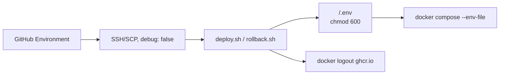

# Secrets — API (команда 6)

| | |
|---|---|
| Статус | перечень и правила обращения |
| Владелец | инфраструктура (роль 3) |
| Связанные документы | [CICD.md](CICD.md), [INFRASTRUCTURE.md](INFRASTRUCTURE.md) |

Секреты живут в GitHub (organization, repository, Environment `staging`) или в окружении оператора. В git, образ и логи CI они не попадают. Цель выката (курсовой VPS или Terraform-хост) выбирается автоматически — [CICD.md](CICD.md#8-курсовой-vps-и-edge-прокси).

---

## 1. Перечень

### Organization — курсовой VPS

Заданы курсом на уровне организации, одинаковы в репозиториях API и UI.

| Имя | Тип | Зачем |
|---|---|---|
| `VPS_DMC268_IP_T6` | variable | IPv4 курсового VPS, SSH на порт 22 |
| `VPS_DMC268_U` | secret | SSH-пользователь (`root`) |
| `VPS_DMC268_P` | secret | SSH-пароль; уходит только на VPS, никогда на Terraform-хост |
| `AI_DMC268_T6` | secret | LLM-ключ приложения; зарезервирован для app, CI его не использует |

### Repository — variables

| Variable | Обязателен | Пример |
|---|---|---|
| `STAGING_SSH_FINGERPRINT` | да, для обеих целей | `SHA256:…` host key VPS (`ssh-keyscan -p 22 <VPS_DMC268_IP_T6> \| ssh-keygen -lf - -E sha256`). Значение в Environment `staging` перекрывает repository |
| `APP_DOMAIN` | да, для курсового VPS | `dmc268-t6.axyi.ru` — базовый домен маршрутов edge-прокси |

### GitHub Environment `staging` — secrets

Только то, что даёт доступ к машине, реестру или данным.

| Secret | Обязателен | Куда уходит | Зачем |
|---|---|---|---|
| `STAGING_SSH_KEY` | да, для Terraform-хоста | SCP/SSH на VM | приватный ключ к `hcloud_ssh_key.ci` |
| `POSTGRES_PASSWORD` | нет | `<APP_DIR>/.env` на хосте | пароль PostgreSQL. Если не задан, `deploy.sh` генерирует его при первом выкате и хранит в `.env` (0600). После инициализации тома пароль не менять: Postgres его не перечитывает |

`GITHUB_TOKEN` выдаёт Actions сам. В репозиторий его не кладут. Push в GHCR — `packages: write`; pull на staging — `packages: read`.

### GitHub Environment `staging` — variables

Публичные или низкорисковые значения. Их видно в логах — это нормально.

| Variable | Обязателен | Пример |
|---|---|---|
| `STAGING_HOST` | для Terraform-хоста | IPv4 или FQDN из Terraform output `ssh_host`; пусто → выкат на курсовой VPS |
| `STAGING_SSH_PORT` | для Terraform-хоста | `22022` — Terraform output `ssh_port`; без него jobs с SSH падают первым шагом |
| `STAGING_SSH_FINGERPRINT` | да | SHA256 host key fingerprint для `appleboy/scp-action` и `appleboy/ssh-action`, формат `SHA256:<43 символа base64>`. С пустым значением appleboy принимает любой host key, поэтому jobs с SSH падают первым шагом |
| `STAGING_SSH_USER` | для Terraform-хоста | `root` после cloud-init |
| `STAGING_HEALTH_URL` | нет | иначе `http://$STAGING_HOST/healthcheck` |
| `POSTGRES_USER` | нет | иначе `app` |
| `POSTGRES_DB` | нет | иначе `app` |

### Только локально у оператора

CI **не** делает `terraform apply`. Эти значения в GitHub Actions не заводят.

| Secret | Зачем |
|---|---|
| `HCLOUD_TOKEN` | Hetzner Cloud API |
| `AWS_ACCESS_KEY_ID` / `AWS_SECRET_ACCESS_KEY` | Object Storage, remote state |
| приватный SSH-ключ оператора | ручной вход на VM |

---

## 2. Хранение в CI/CD

1. Settings → Environments → **staging**.
2. Secrets: `STAGING_SSH_KEY` (только для Terraform-хоста), при желании `POSTGRES_PASSWORD`. Для курсового VPS environment secrets не нужны — хватает organization secrets и repository variables.
3. Variables: хост, SSH-порт, SHA256 SSH fingerprint, SSH-пользователь, опционально health URL и имя БД.

   Fingerprint после `terraform apply` (формат appleboy — строка `SHA256:…` из вывода):

   ```bash
   ssh-keyscan -p "${STAGING_SSH_PORT}" -H "${STAGING_HOST}" 2>/dev/null | ssh-keygen -lf - -E sha256
   ```
4. Protection rules: **Deployment branches and tags** → только `main`. Workflow Rollback и сам пропускает jobs вне `refs/heads/main`, но branch policy закрывает доступ к secrets environment для любого другого workflow и ветки.
   Required reviewers — решение при настройке environment. `deploy-staging`, `promote-staging` и `rollback` ссылаются на `staging`, поэтому каждый выкат запросит подтверждение дважды (deploy и promotion), а job, ожидающий подтверждения, возможно, держит группу `staging-deploy` и блокирует rollback (не проверено). Рекомендация для staging: без required reviewers; контроль — branch policy `main` и review PR.
5. Actions → General: **Allow GitHub Actions to create and approve pull requests** не нужен. Secret scanning и push protection — включить.

Jobs `deploy-staging`, `promote-staging` (CI/CD) и workflow Rollback ссылаются на `environment: staging`. Без значений environment пайплайн не выкатит стенд. `promote-staging` нужен environment ради SSH-чтения `.deploy-state` (про required reviewers — п. 4).

SSH на Terraform-хосте открыт миру намеренно: у GitHub-hosted runners нет стабильных egress IP. Защита — нестандартный порт (`STAGING_SSH_PORT`), вход только по ключу и fail2ban; подробности и break-glass — [INFRASTRUCTURE.md](INFRASTRUCTURE.md#41-ssh-доступ). Курсовой VPS общий: там порт 22 и пароль, sshd и firewall не меняем.

`ACTIONS_STEP_DEBUG` / `ACTIONS_RUNNER_DEBUG` для environment `staging` не включать: отладочные логи могут повторить переданные на SSH переменные.

---

## 3. Передача на staging



1. Runner забирает secret/var только в job с `environment: staging`.
2. `appleboy/ssh-action` с `debug: false` передаёт в скрипт одноразовый `GITHUB_TOKEN` и, если задан, `POSTGRES_PASSWORD`. SSH-пароль VPS передаётся только как `password` действия, в скрипт он не попадает.
3. `deploy.sh` пишет `.env` с `umask 077` и `chmod 600`; без `POSTGRES_PASSWORD` генерирует пароль один раз на свежем хосте и отказывается генерировать, если `.env` или том Postgres уже есть. Пароль в stdout не печатается.
4. Compose читает `.env` на VM. Postgres слушает только docker-сеть.
5. `GITHUB_TOKEN` нужен лишь для pull. Логин идёт во временный `DOCKER_CONFIG` (`mktemp -d`), а не в `/root/.docker/config.json`: выкаты API и UI под общим root не мешают друг другу. После последнего pull — `docker logout`, при выходе каталог удаляется; `unset GHCR_TOKEN`.

Rollback пароль из GitHub не шлёт повторно: читает уже лежащий `.env`.

---

## 4. Git

В репозитории нет живых секретов. Игнор:

- `.env`, `*.tfvars`, `*.backend.hcl`, `*.tfstate*`
- ключи (`*.pem`, `id_rsa`, `id_ed25519`, `.aws/`)
- `credentials`, `credentials.json`

В git только `*.example`. Локально:

```bash
cp .env.example .env
cp terraform/api-staging/environments/staging.tfvars.example terraform/api-staging/environments/staging.tfvars
cp terraform/api-staging/environments/staging.backend.hcl.example terraform/api-staging/environments/staging.backend.hcl
```

PR и `main` гоняют Gitleaks (`--redact`) и Trivy scanner `secret`. Находка останавливает выкат.

---

## 5. Логи CI

| Мера | Как |
|---|---|
| Маскирование | GitHub скрывает значения `secrets.*` и `GITHUB_TOKEN` |
| Нет `set -x` | `set +o xtrace` в SSH-скрипте и на VM |
| Нет debug SSH | `debug: false` у appleboy |
| Нет echo пароля | скрипты печатают только image ref |
| Login в реестр | пароль в stdin, stdout login глушится |
| Gitleaks | `--redact`, чтобы находка не продублировала секрет |

Не делайте `echo "$POSTGRES_PASSWORD"`, `env`, `cat .env` в workflow.

---

## 6. Permissions

Workflow по умолчанию: `contents: read`. Расширение точечное.

| Job / workflow | Permissions | Почему |
|---|---|---|
| `secret-scan`, terraform, docker build/scan | `contents: read` | только checkout |
| `push-image` | `contents: read`, `packages: write`, `actions: read` | push в GHCR; `actions: read` — скачать artifact образа, прошедшего Trivy |
| `deploy-staging` | `contents: read`, `packages: read` | pull образа на VM (одноразовый `GITHUB_TOKEN`) |
| `promote-staging` (CI/CD) | `contents: read`, `packages: write` | `:staging-previous` ← `:staging`, `:staging` ← проверенный digest после health check; по SSH только читает `.deploy-state`, токен на VM не передаётся |
| Rollback staging: `rollback` | `contents: read`, `packages: read` | pull образа на VM |
| Rollback staging: `promote-staging` | `contents: read`, `packages: write` | синхронизировать `:staging` с откатанным образом |

`security-events`, `id-token`, `pull-requests` не выдаются; `actions: read` есть только у `push-image`. `packages: write` — только у jobs `promote-staging`, на VM этот токен не уходит. `HCLOUD_TOKEN` в Actions нет — apply вне CI.
