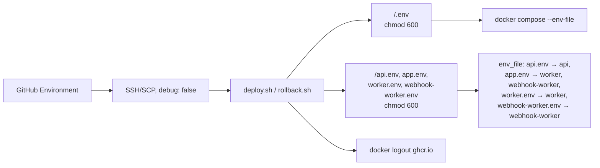

# Secrets — API (команда 6)

| | |
|---|---|
| Статус | перечень и правила обращения |
| Владелец | инфраструктура (роль 3) |
| Связанные документы | [CICD.md](CICD.md), [INFRASTRUCTURE.md](INFRASTRUCTURE.md) |

Секреты живут в GitHub (organization, repository, Environment `staging`) или в окружении оператора. В git, образ и логи CI они не попадают. Цель выката (курсовой VPS или Terraform-хост) выбирается автоматически — [CICD.md](CICD.md#8-курсовой-vps-и-edge-прокси).

---

## 1. Перечень

### Organization — курсовой VPS

Заданы курсом на уровне организации, одинаковы в репозиториях API и UI.

| Имя | Тип | Зачем |
|---|---|---|
| `VPS_DMC268_IP_T6` | variable | IPv4 курсового VPS, SSH на порт 22 |
| `VPS_DMC268_U` | secret | SSH-пользователь (`root`) |
| `VPS_DMC268_P` | secret | SSH-пароль; уходит только на VPS, никогда на Terraform-хост |
| `AI_DMC268_T6` | secret | LLM-ключ приложения (EUrouter): на staging — `LLM_API_KEYS` в контейнере `worker` (ниже); в CI — ещё ручной workflow `LLM live run` (`workflow_dispatch`), required-проверки его не используют |
| `AI_DMC268_URL` | variable | endpoint LLM-провайдера: на staging — `LLM_BASE_URL` в контейнере `worker` |

### Repository — variables

| Variable | Обязателен | Пример |
|---|---|---|
| `STAGING_SSH_FINGERPRINT` | да, для обеих целей | `SHA256:…` host key VPS (`ssh-keyscan -p 22 <VPS_DMC268_IP_T6> \| ssh-keygen -lf - -E sha256`). Значение в Environment `staging` перекрывает repository. При переключении между курсовым VPS и Terraform-хостом fingerprint нужно обновить: у хостов разные ключи, и при несовпадении jobs с SSH падают (fail-closed) |
| `APP_DOMAIN` | да, для курсового VPS | `dmc268-t6.axyi.ru` — базовый домен маршрутов edge-прокси |
| `LLM_MODEL` | для ревью моделью | `mistral-small-4` (OQ-2, SD §15). Основная модель в repository variable; только `worker` |
| `LLM_FALLBACK_MODEL` | нет | `mistral-small-3.2-24b` (OQ-2, SD §15). Значение передаётся только в `worker.env`; пустое или незаданное значение исключает fallback |

Repository variable `LLM_EUR_TO_USD_RATE` удалена 06.10 после проверки нового пути на staging: worker и workflow `LLM live run` её не читают, в `worker.env` она не попадает; курс вручную обновлять не нужно.

### GitHub Environment `staging` — secrets

Доступ к машине, реестру и данным, а также секреты приложения.

| Secret | Обязателен | Куда уходит | Зачем |
|---|---|---|---|
| `STAGING_SSH_KEY` | да, для Terraform-хоста | SCP/SSH на VM | приватный ключ к `hcloud_ssh_key.ci` |
| `POSTGRES_PASSWORD` | нет | `<APP_DIR>/.env` на хосте | пароль PostgreSQL. Если не задан, `deploy.sh` генерирует его при первом выкате и хранит в `.env` (0600). После инициализации тома пароль не менять: Postgres его не перечитывает |

Секреты приложения. GitHub не принимает имена секретов и variables с префиксом `GITHUB_` (HTTP 422), поэтому секреты App заведены как `GH_*`, а в контейнере у них имена из `.env.example`. Сопоставление делает шаг «Bundle application secrets» в `deploy-staging`; тем же путём идут organization secret `AI_DMC268_T6`, organization variable `AI_DMC268_URL` и `vars.GH_APP_BOT_LOGIN`, `vars.LLM_MODEL`, `vars.LLM_FALLBACK_MODEL`. Последние два задаются на уровне repository и могут быть переопределены в Environment `staging`. Незаданное значение в контейнер не попадает совсем, а не приходит пустой строкой.

**Ограничение на значения:** без одинарной кавычки `'` и без `\` в конце. Значения пишутся в env-файл в одинарных кавычках (§3, п. 5), и `deploy.sh` такие значения отклоняет: выкат останавливается до изменений на хосте. На первом выкате после #35, пока в `.env` хоста нет `RABBITMQ_PASSWORD`, следующий за этим авто-откат падает с `RABBITMQ_PASSWORD is required` — стек не тронут, прогон красный. Завершающий перевод строки значения срезается; разбору PEM это безразлично.

Каждый контейнер получает только env-файлы своей роли (`deploy/scripts/env-file.sh`, `deploy/compose/staging.yml`):

| Env-файл на хосте | Переменные | Контейнеры |
|---|---|---|
| `api.env` | `GITHUB_WEBHOOK_SECRET`, `GITHUB_CLIENT_ID`, `GITHUB_CLIENT_SECRET`, `AUTH_JWT_PRIVATE_KEY`, `AUTH_JWT_PUBLIC_KEY` | `api` |
| `app.env` | `GITHUB_APP_ID`, `GITHUB_APP_PRIVATE_KEY` | `worker`, `webhook-worker` |
| `worker.env` | `LLM_API_KEYS`, `LLM_BASE_URL`, `LLM_MODEL`, `LLM_FALLBACK_MODEL` (fallback — только при непустом значении) | `worker` |
| `webhook-worker.env` | `GITHUB_APP_BOT_LOGIN` | `webhook-worker` |

| Secret | Тип значения | Переменная в контейнере | Контейнеры | Зачем |
|---|---|---|---|---|
| `GH_APP_ID` | число | `GITHUB_APP_ID` | `worker`, `webhook-worker` | App ID staging App `dmc268-t6-reviewer` (#37) |
| `GH_APP_PRIVATE_KEY` | многострочный PEM | `GITHUB_APP_PRIVATE_KEY` | `worker`, `webhook-worker` | подпись JWT App для installation token. В `api` не уходит: процесс API его не читает, а PEM App не должен лежать в контейнере, смотрящем в интернет |
| `GH_WEBHOOK_SECRET` | строка | `GITHUB_WEBHOOK_SECRET` | `api` | проверка подписи вебхуков. Без него `POST /webhooks/github` отвечает 503; с ним API сохраняет квитанцию и отвечает 202, а разбирает квитанции контейнер `webhook-worker` (`app.webhook_worker`) |
| `GH_CLIENT_ID` | строка | `GITHUB_CLIENT_ID` | `api` | user authorization App (auth-api, #11); отличается от App ID |
| `GH_CLIENT_SECRET` | строка | `GITHUB_CLIENT_SECRET` | `api` | обмен OAuth-кода (auth-api, #11) |
| `AUTH_JWT_PRIVATE_KEY` | многострочный PEM (RSA) | `AUTH_JWT_PRIVATE_KEY` | `api` | подпись локального access JWT |
| `AUTH_JWT_PUBLIC_KEY` | многострочный PEM (RSA) | `AUTH_JWT_PUBLIC_KEY` | `api` | проверка access JWT |
| `AI_DMC268_T6` (organization) | строка, ключи через запятую | `LLM_API_KEYS` | `worker` | ключи LLM-шлюза (§1, «LLM-шлюз») |
| `AI_DMC268_URL` (organization variable, берётся из `vars.`) | URL | `LLM_BASE_URL` | `worker` | endpoint LLM-шлюза |

`AUTH_JWT_ISSUER` (`dmc-268-api`) и `AUTH_JWT_AUDIENCE` (`dmc-268-ui`) — не секреты: они фиксированы в `deploy/compose/staging.yml`. Домен cookie refresh не настраивается: cookie host-only с `Path=/api/auth`, а UI и API работают с одного origin `staging-ui.<APP_DOMAIN>` (маршрут `/api/*` в `deploy/edge/Caddyfile`).

Пара ключей JWT создаётся один раз и заводится в Environment `staging`:

```bash
openssl genpkey -algorithm RSA -pkeyopt rsa_keygen_bits:2048 -out jwt.pem
openssl rsa -in jwt.pem -pubout -out jwt.pub
gh secret set AUTH_JWT_PRIVATE_KEY --env staging -R larchanka-training/dmc-268-api-t6 < jwt.pem
gh secret set AUTH_JWT_PUBLIC_KEY --env staging -R larchanka-training/dmc-268-api-t6 < jwt.pub
rm jwt.pem jwt.pub
```

Смена пары разлогинивает всех: ранее выданные access JWT перестают проверяться.

### Генерируются на хосте

В GitHub не заводятся. `deploy.sh` создаёт их при первом выкате (48 hex-символов), хранит в `<APP_DIR>/.env` (0600) и переиспользует при каждом выкате и откате.

| Имя | Куда уходит | Примечание |
|---|---|---|
| `RABBITMQ_PASSWORD` (пользователь `RABBITMQ_USER`, по умолчанию `app`) | контейнер `rabbitmq`; `RABBITMQ_URL` в `api`, `worker` и `webhook-worker` | RabbitMQ, как Postgres, применяет учётные данные только на пустом томе `rabbitmq-data`. Если том есть, а пароля в `.env` нет, `deploy.sh` отказывается генерировать новый |
| `REDIS_PASSWORD` | контейнер `redis`; `REDIS_URL` в `api` | Redis — кэш без тома (лимит 128 MB, `allkeys-lru`): новый пароль только сбрасывает кэш. Кэш по SD §10, `REDIS_URL` приложение пока не читает |

`GITHUB_TOKEN` выдаёт Actions сам. В репозиторий его не кладут. Push в GHCR — `packages: write`; pull на staging — `packages: read`.

### GitHub Environment `staging` — variables

Публичные или низкорисковые значения. Их видно в логах — это нормально.

| Variable | Обязателен | Пример |
|---|---|---|
| `STAGING_HOST` | для Terraform-хоста | IPv4 или FQDN из Terraform output `ssh_host`; пусто → выкат на курсовой VPS |
| `STAGING_SSH_PORT` | для Terraform-хоста | `22022` — Terraform output `ssh_port`; без него jobs с SSH падают первым шагом |
| `STAGING_SSH_FINGERPRINT` | да | SHA256 host key fingerprint для `appleboy/scp-action` и `appleboy/ssh-action`, формат `SHA256:<43 символа base64>`. С пустым значением appleboy принимает любой host key, поэтому jobs с SSH падают первым шагом |
| `STAGING_SSH_USER` | для Terraform-хоста | `root` после cloud-init |
| `STAGING_HEALTH_URL` | нет | иначе `http://$STAGING_HOST/healthcheck` |
| `POSTGRES_USER` | нет | иначе `app` |
| `POSTGRES_DB` | нет | иначе `app` |
| `GH_APP_BOT_LOGIN` | да: без него `webhook-worker` не стартует, выкат откатывается | `dmc268-t6-reviewer[bot]` — логин бота App. В контейнере `GITHUB_APP_BOT_LOGIN`, только у `webhook-worker` (`app/webhook_worker.py`). Префикс `GH_`, потому что GitHub не принимает `GITHUB_` и у variables; берётся из `vars.`, а не из `secrets.` |
| `LLM_MODEL` | нет, переопределение repository | `mistral-small-4` (OQ-2, SD §15). В контейнере только у `worker`; обычное значение задано на уровне repository |
| `LLM_FALLBACK_MODEL` | нет, переопределение repository | `mistral-small-3.2-24b`. Только `worker`. Чтобы отключить fallback, удалите repository variable и это переопределение: значение Environment перекрывает repository, а незаданная variable приходит в `vars` пустой строкой, и `LLM_FALLBACK_MODEL` не попадает в `worker.env` |

### LLM-шлюз — переменные приложения (#33)

Читает `LlmSettings.from_env` (`app/modules/reviews/infrastructure/llm/settings.py`). Секрет здесь — только ключи; остальное — конфигурация. На staging `LLM_API_KEYS` (из organization secret `AI_DMC268_T6`), `LLM_BASE_URL` (из organization variable `AI_DMC268_URL`), `LLM_MODEL` и непустой `LLM_FALLBACK_MODEL` (repository variables или переопределения Environment) приходят в `worker` через `worker.env` (§1, таблица env-файлов). Остальные `LLM_*` на staging берут дефолты, если они есть.

| Переменная | Секрет | Обязательна | Значение |
|---|---|---|---|
| `LLM_API_KEYS` | **да** | для EUrouter | ключи через запятую; при 401/403/429 шлюз переходит к следующему (ротация вызовом не считается). Для self-hosted без авторизации — пусто |
| `LLM_MODEL` | нет | да | основная модель, `mistral-small-4` (OQ-2, SD §15) |
| `LLM_FALLBACK_MODEL` | нет | нет | fallback-модель, `mistral-small-3.2-24b`; пусто — без fallback |
| `LLM_FALLBACK_API_KEYS` | **да** | для известной fallback-модели на другом endpoint | ключи наследуются только вместе с endpoint: если fallback идёт на тот же base URL, что и основная, — `LLM_API_KEYS`; на другой хост ключи основной не уходят никогда |
| `LLM_BASE_URL`, `LLM_FALLBACK_BASE_URL` | нет | для неизвестной модели | OpenAI-совместимый endpoint; для моделей из `KNOWN_MODELS` — их собственный (`https://api.eurouter.ai/api/v1`), неизвестная fallback-модель без своего URL берёт URL основной. С ключами — только `https`, кроме локальных хостов: `localhost`, `127.0.0.1`, `::1`, `host.docker.internal`, `*.localhost`, `*.local`, `*.internal`. Compose-сервис (`http://ollama:11434/v1`) или адрес RFC 1918 по `http` работает только без ключей |
| `LLM_CONTEXT_WINDOW` (и `LLM_FALLBACK_CONTEXT_WINDOW`) | нет | для неизвестной модели | окно модели в токенах |
| `LLM_PROVIDER`, `LLM_MAX_OUTPUT_TOKENS`, `LLM_PRICE_INPUT_PER_MTOK`, `LLM_PRICE_OUTPUT_PER_MTOK`, `LLM_PRICE_CACHE_READ_PER_MTOK`, `LLM_EXTRA_BODY` (и те же `LLM_FALLBACK_*`) | нет | нет | дефолты: провайдер `self-hosted`, резерв на ответ 8000, цена 0, тело `{}`. **Цена 0 у удалённой модели — лимит стоимости прогона видит только `usage.cost` провайдера**; шлюз пишет предупреждение, для hosted-модели цены задавать обязательно. Метка провайдера идёт в `usage_events`, цены — USD за 1 млн токенов, `LLM_EXTRA_BODY` — доп. поля тела запроса (JSON). `LLM_EXTRA_BODY` переопределяет `temperature` и `max_tokens`, `null` убирает ключ — для reasoning-моделей, например `{"temperature": null, "max_tokens": null, "max_completion_tokens": 8000}`; `model`, `messages` и строгий `response_format` не переопределяются |
| `LLM_STRUCTURED_OUTPUT` | нет | нет | `json_schema` (по умолчанию). `prompt_json` — только локальные и self-hosted модели в dev и eval, требует `LLM_ALLOW_PROMPT_JSON=1`; на staging и prod не задаётся (D7) |

Для двух известных моделей на штатном EUrouter endpoint цены `KNOWN_MODELS` служат нижней USD-границей: основная — $0.56125 / $2.35725 / $0.56125, fallback — $0.2245 / $0.449 / $0.2245 за миллион входных / выходных / прочитанных из кэша токенов. Перед каждым вызовом известного EUrouter-маршрута шлюз получает курс ЕЦБ и берёт покомпонентный максимум этой границы, EUR-цены самой дорогой известной ветки × полученный курс и заданной через `LLM_PRICE_*` цены. Более низкая env-цена на штатном endpoint границу не уменьшает; для другого явно заданного endpoint применяется его цена. Эффективная цена используется перед вызовом для проверки бюджета и при консервативном учёте оплаченного ответа с непригодными данными о стоимости (SD §15, PIPELINE_SPEC §4.5).

Шлюз распознаёт эквивалентные записи штатного endpoint (регистр имени хоста, явный порт `:443`, завершающий `/`) одинаково для цены, метки провайдера и наследования ключей. Для известной модели имя хоста должно содержать только ASCII: Unicode-варианты точки могут быть преобразованы HTTP-клиентом в штатный EUrouter host уже после проверки цены. Другой путь или порт на хосте EUrouter для известной модели отклоняется при чтении настроек, чтобы не обходить ценовую границу. Разные хосты не наследуют ключи друг от друга. Если полученный курс настолько велик, что цена максимального вызова не представима с точностью 6 знаков, вызов завершается `llm_unavailable` до обращения к провайдеру.

**Источник и доступ.** Worker и ручной `LLM live run` читают один последний дневной курс USD за EUR из CSV ЕЦБ: [`EXR/D.USD.EUR.SP00.A`](https://data-api.ecb.europa.eu/service/data/EXR/D.USD.EUR.SP00.A) с `lastNObservations=1&format=csvdata`. Это количество USD за 1 EUR, его не инвертируют. Отдельный HTTP-клиент не передаёт ЕЦБ ключ LLM или заголовок Authorization; staging-worker нужен исходящий HTTPS (TCP 443) к `data-api.ecb.europa.eu`. В Compose worker использует обычную сеть проекта без `internal: true`; доступ с хоста и контейнера следует проверить после выката. Никакой ежедневной ручной правки курса нет.

**Кэш и инцидент.** В каждом процессе первый нуждающийся в курсе вызов загружает CSV с общим пределом 5 с; одновременные вызовы ждут один запрос. Успешный курс обновляется не чаще раза в час, сбой обновления сдерживается 5 минут. После сбоя последний проверенный курс можно использовать только до 7 календарных дней от даты наблюдения по UTC; такой ответ помечается `stale_cache=true`, а лог содержит источник и дату без тела ответа или ключей. Дата получения не продлевает срок. Worker запускается и при недоступном ЕЦБ. Если пригодного курса нет, следующий вызов маршрута `api.eurouter.ai` завершается до LLM-запроса как retryable `llm_unavailable`, без стоимости этого вызова. Проверить DNS/HTTPS к ЕЦБ, дату наблюдения и предупреждение обновления кэша; вручную подставлять курс через env не следует. Для другого endpoint с оплаченным EUR-ответом курс запрашивается после ответа: если получить его не удалось, шлюз сохраняет сырой `llm.call` и известные токены, начисляет консервативную USD-оценку и завершает вызов `llm_invalid_output` без нового платного запроса. USD-стоимость проходит без пересчёта, а отсутствие `cost_currency` трактуется как USD с предупреждением (PIPELINE_SPEC §4.5).

**Проверка стоимости.** Каждый `llm.call`, использовавший курс, содержит `request.fx` с `source`, `observation_date`, `rate_usd_per_eur` и `stale_cache`; тот же набор виден для каждого вызова в JSON CLI и в GitHub Step Summary ручного `LLM live run`, включая сбой после оплаченного ответа. Сырой ответ провайдера хранится отдельно без изменения, а `usage_events.cost_usd` остаётся суммой в USD. Required CI работает без сети и ключей: HTTP ЕЦБ и LLM в тестах подменён; живую проверку выполняют вручную после выката.

Ключи не попадают в логи, тексты исключений, `run_actions` и `usage_events`: транспорт вычищает их из текстов ошибок провайдера, у `ModelProfile` ключи скрыты из `repr` — это проверяет `tests/test_llm_gateway.py::test_keys_never_reach_logs_exceptions_or_the_trace`. Required CI работает без сети и без LLM-ключей: все тесты шлюза идут на фейковом HTTP-транспорте; живой прогон — вручную (README, раздел «LLM gateway»).

### Только локально у оператора

CI **не** делает `terraform apply`. Эти значения в GitHub Actions не заводят.

| Secret | Зачем |
|---|---|
| `HCLOUD_TOKEN` | Hetzner Cloud API |
| `AWS_ACCESS_KEY_ID` / `AWS_SECRET_ACCESS_KEY` | Object Storage, remote state |
| приватный SSH-ключ оператора | ручной вход на VM |

---

## 2. Хранение в CI/CD

Для GitHub App callback сервису также нужны следующие переменные окружения. Их значения
задаются только в менеджере секретов или локальном `.env`; в репозиторий не записываются.

| Имя | Назначение |
|---|---|
| `GITHUB_CLIENT_ID` | Client ID GitHub App для обмена кода; отличается от `GITHUB_APP_ID` |
| `GITHUB_CLIENT_SECRET` | Client secret GitHub App для обмена кода |
| `AUTH_JWT_PRIVATE_KEY` | PEM RSA private key для подписи локального access JWT |
| `AUTH_JWT_PUBLIC_KEY` | Соответствующий PEM RSA public key для проверки JWT |
| `AUTH_JWT_ISSUER` | Фиксированное значение `iss` (`dmc-268-api`) |
| `AUTH_JWT_AUDIENCE` | Фиксированное значение `aud` (`dmc-268-ui`) |

OAuth-код и client secret отправляются в теле POST запроса к GitHub, а не в URL.
GitHub user access token используется только для чтения профиля и установок во время
callback; в PostgreSQL хранится только хеш локального refresh token.

1. Settings → Environments → **staging**.
2. Secrets: `STAGING_SSH_KEY` (только для Terraform-хоста), при желании `POSTGRES_PASSWORD`, секреты приложения из §1. Для выката на курсовой VPS из environment secrets обязательны только `GH_APP_ID` и `GH_APP_PRIVATE_KEY`, остальное дают organization secrets и repository variables. Если нет хотя бы одного из них или variable `GH_APP_BOT_LOGIN` (п. 3), стенд не поднимается: `webhook-worker` получает эти значения как `GITHUB_APP_ID`, `GITHUB_APP_PRIVATE_KEY` и `GITHUB_APP_BOT_LOGIN` из `app.env` и `webhook-worker.env` (`deploy/compose/staging.yml`) и без любого из них не стартует (`app/webhook_worker.py`), `up --wait` не проходит, и `deploy.sh` откатывает выкат. `worker` без App ID и ключа стартует с предупреждением, но выкат всё равно падает на `webhook-worker`. Без секретов `api` (`GH_WEBHOOK_SECRET`, `GH_CLIENT_ID`, `GH_CLIENT_SECRET`, `AUTH_JWT_PRIVATE_KEY`, `AUTH_JWT_PUBLIC_KEY`) стенд поднимается, отключается только их функция: без `GH_WEBHOOK_SECRET` `POST /webhooks/github` отвечает 503, без `GH_CLIENT_ID`, `GH_CLIENT_SECRET` или `AUTH_JWT_PRIVATE_KEY` вход отвечает 503, без `AUTH_JWT_PUBLIC_KEY` — каждый эндпоинт с авторизацией.
3. Variables: хост, SSH-порт, SHA256 SSH fingerprint, SSH-пользователь, логин бота App `GH_APP_BOT_LOGIN` (обязателен, п. 2), опционально health URL и имя БД.

   Fingerprint после `terraform apply` (формат appleboy — строка `SHA256:…` из вывода):

   ```bash
   ssh-keyscan -p "${STAGING_SSH_PORT}" -H "${STAGING_HOST}" 2>/dev/null | ssh-keygen -lf - -E sha256
   ```
4. Protection rules: **Deployment branches and tags** → только `main`. Workflow Rollback и сам пропускает jobs вне `refs/heads/main`, но branch policy закрывает доступ к secrets environment для любого другого workflow и ветки.
   Required reviewers — решение при настройке environment. `deploy-staging`, `promote-staging` и `rollback` ссылаются на `staging`, поэтому каждый выкат запросит подтверждение дважды (deploy и promotion), а job, ожидающий подтверждения, возможно, держит группу `staging-deploy` и блокирует rollback (не проверено). Рекомендация для staging: без required reviewers; контроль — branch policy `main` и review PR.
5. Actions → General: **Allow GitHub Actions to create and approve pull requests** не нужен. Secret scanning и push protection — включить.

Jobs `deploy-staging`, `promote-staging` (CI/CD) и workflow Rollback ссылаются на `environment: staging`. Без значений environment пайплайн не выкатит стенд. `promote-staging` нужен environment ради SSH-чтения `.deploy-state` (про required reviewers — п. 4).

SSH на Terraform-хосте открыт миру намеренно: у GitHub-hosted runners нет стабильных egress IP. Защита — нестандартный порт (`STAGING_SSH_PORT`), вход только по ключу и fail2ban; подробности и break-glass — [INFRASTRUCTURE.md](INFRASTRUCTURE.md#41-ssh-доступ). Курсовой VPS общий: там порт 22 и пароль, sshd и firewall не меняем.

`ACTIONS_STEP_DEBUG` / `ACTIONS_RUNNER_DEBUG` для environment `staging` не включать: отладочные логи могут повторить переданные на SSH переменные.

---

## 3. Передача на staging


```mermaid
flowchart LR
  gha["GitHub Environment"] --> ssh["SSH/SCP, debug: false"]
  ssh --> script["deploy.sh / rollback.sh"]
  script --> envfile["<APP_DIR>/.env\nchmod 600"]
  script --> appenv["<APP_DIR>/api.env, app.env,\nworker.env, webhook-worker.env\nchmod 600"]
  envfile --> compose["docker compose --env-file"]
  appenv --> compose2["env_file: api.env → api,\napp.env → worker, webhook-worker,\nworker.env → worker,\nwebhook-worker.env → webhook-worker"]
  script --> logout["docker logout ghcr.io"]
```

1. Runner забирает secret/var только в job с `environment: staging`.
2. `appleboy/ssh-action` с `debug: false` передаёт в скрипт одноразовый `GITHUB_TOKEN`, бандл секретов приложения `APP_SECRETS_B64` (п. 5) и, если задан, `POSTGRES_PASSWORD`. SSH-пароль VPS передаётся только как `password` действия, в скрипт он не попадает.
3. `deploy.sh` пишет `.env` с `umask 077` и `chmod 600`; без `POSTGRES_PASSWORD` генерирует пароль один раз на свежем хосте и отказывается генерировать, если `.env` или том Postgres уже есть. Пароль в stdout не печатается.
4. Compose читает `.env` на VM. Postgres, RabbitMQ и Redis слушают только docker-сеть проекта, `ports:` у них нет.
5. Секреты приложения шаг «Bundle application secrets» собирает в одну строку `APP_SECRETS_B64`: base64 от строк `ИМЯ=<base64 значения>`, только для заданных секретов. Строка маскируется (`::add-mask::`) и уходит через `envs:` SSH-действия; многострочные PEM так не ломаются в SSH и shell. На хосте `write_app_env_files` (`env-file.sh`) раскладывает значения по allowlist в файлы получателей (§1, таблица env-файлов), в одинарных кавычках — Compose читает их буквально, без подстановки `$`, обратный слэш остаётся обратным слэшем (кроме позиции перед кавычкой). Поэтому имя вне allowlist, значение с `'` или с `\` в конце валят выкат до любых изменений на хосте: бандл проверяется раньше, чем перезаписывается `.env` (ограничение на значения — §1).
6. `GITHUB_TOKEN` нужен лишь для pull. Логин идёт во временный `DOCKER_CONFIG` (`mktemp -d`), а не в `/root/.docker/config.json`: выкаты API и UI под общим root не мешают друг другу. После последнего pull — `docker logout`, при выходе каталог удаляется; `unset GHCR_TOKEN`.

Rollback ничего из GitHub не шлёт повторно: пароли Postgres, RabbitMQ и Redis берёт из лежащего `.env`, а env-файлы секретов не трогает — откатанные контейнеры стартуют с теми же секретами. Секреты не привязаны к образу: откат образа не возвращает предыдущие значения секретов.

---

## 4. Git

В репозитории нет живых секретов. Игнор:

- `.env`, `*.tfvars`, `*.backend.hcl`, `*.tfstate*`
- ключи (`*.pem`, `id_rsa`, `id_ed25519`, `.aws/`)
- `credentials`, `credentials.json`

В git только `*.example`. Локально:

```bash
cp .env.example .env
cp terraform/api-staging/environments/staging.tfvars.example terraform/api-staging/environments/staging.tfvars
cp terraform/api-staging/environments/staging.backend.hcl.example terraform/api-staging/environments/staging.backend.hcl
```

PR и `main` гоняют Gitleaks (`--redact`) и Trivy scanner `secret`. Находка останавливает выкат.

---

## 5. Логи CI

| Мера | Как |
|---|---|
| Маскирование | GitHub скрывает значения `secrets.*` и `GITHUB_TOKEN` |
| Нет `set -x` | `set +o xtrace` в SSH-скрипте и на VM |
| Нет debug SSH | `debug: false` у appleboy |
| Нет echo пароля | скрипты печатают только image ref |
| Login в реестр | пароль в stdin, stdout login глушится |
| Gitleaks | `--redact`, чтобы находка не продублировала секрет |

Не делайте `echo "$POSTGRES_PASSWORD"`, `env`, `cat .env` в workflow.

Имена переменных в контейнере без значений — не через `env | cut -d= -f1`: строки многострочного PEM не содержат `=` и печатаются целиком. Безопасно:

```bash
cd /opt/dmc-268-api-staging
docker compose -p dmc-268-api-staging -f compose.yml -f compose.edge.yml --env-file .env \
  exec -T api python -c "import os; print(' '.join(sorted(os.environ)))"
```

---

## 6. Permissions

Workflow по умолчанию: `contents: read`. Расширение точечное.

| Job / workflow | Permissions | Почему |
|---|---|---|
| `secret-scan`, terraform, docker build/scan | `contents: read` | только checkout |
| `push-image` | `contents: read`, `packages: write`, `actions: read` | push в GHCR; `actions: read` — скачать artifact образа, прошедшего Trivy |
| `deploy-staging` | `contents: read`, `packages: read` | pull образа на VM (одноразовый `GITHUB_TOKEN`) |
| `promote-staging` (CI/CD) | `contents: read`, `packages: write` | `:staging-previous` ← `:staging`, `:staging` ← проверенный digest после health check; по SSH только читает `.deploy-state`, токен на VM не передаётся |
| Rollback staging: `rollback` | `contents: read`, `packages: read` | pull образа на VM |
| Rollback staging: `promote-staging` | `contents: read`, `packages: write` | синхронизировать `:staging` с откатанным образом |

`security-events`, `id-token`, `pull-requests` не выдаются; `actions: read` есть только у `push-image`. `packages: write` — только у jobs `promote-staging`, на VM этот токен не уходит. `HCLOUD_TOKEN` в Actions нет — apply вне CI.
