# SYSTEM_DESIGN — AI Code Reviewer (команда 6)

| | |
|---|---|
| Статус | Базовый дизайн утверждён командой — PR #36 (#20); целевые дополнения #107 согласованы пользователем 2026-10-09, GitHub review этих дополнений ещё требуется |
| Владелец | техлид (роль 1) |
| Связанные документы | `BACKEND_ARCHITECTURE.md` (роль 6, ERD), [`PIPELINE_SPEC.md`](PIPELINE_SPEC.md) (жизненный цикл Run, retry, сбои), [`contracts/openapi.yaml`](../contracts/openapi.yaml) (HTTP API), [`FRONTEND_ARCHITECTURE.md`](https://github.com/larchanka-training/dmc-268-ui-t6/blob/main/docs/FRONTEND_ARCHITECTURE.md) (роль 5, Zod-контракты), [`TEST_PLAN.md`](TEST_PLAN.md) (роль 2, quality gates), инфраструктура (роль 3) |
| Нумерация решений | `Р-1…Р-15`; `Р-1…Р-9` — общие с [`TEST_PLAN.md`](TEST_PLAN.md), не менять |

**Продукт.** GitHub App, который ревьюит pull request с лейблом `ai-review`. После зелёного CI бот публикует одно ревью с inline-комментариями прямо в PR. Web UI показывает прогоны, трейс действий агента, метрики и расход.

**Целевой контракт #107.** Формат правил и границу доверия определяет
[RULES_FORMAT_SPEC.md](RULES_FORMAT_SPEC.md), контекст, проверку и VCS write-back —
[CONTEXT_AND_VERIFICATION_SPEC.md](CONTEXT_AND_VERIFICATION_SPEC.md). Ниже эти
решения внесены в соответствующие разделы. Новые схемы, таблицы, API/UI-поля и
runtime-профиль требуют отдельной реализации; существующие JSON Schema/OpenAPI
и код этим документационным изменением не обновлены. Исторические результаты
и явно отмеченные сведения о текущем runtime не подтверждают выполнение #107.

**Стек (зафиксирован).** Backend: Python 3.13, FastAPI, SQLAlchemy 2, Alembic, PostgreSQL 17, RabbitMQ, Redis, uv, ruff, mypy strict; объектного хранилища в MVP нет (S3 — после MVP, §10). Frontend: React 19, Vite 8, TypeScript 6, pnpm, Zustand + TanStack Query, Zod, Vitest 5. Инфра: Docker Compose; staging — курсовой VPS за edge-прокси Caddy (Terraform / Hetzner — альтернативная цель, [CICD.md](CICD.md) §8).

---

## 1. Решения

| # | Решение | Причина |
|---|---|---|
| Р-1 | Транспорт задач — **RabbitMQ** (durable, persistent, ack после фиксации состояния). **Источник истины — PostgreSQL**: брокер доставляет указатель на задачу, состояние живёт в БД | Микросервисы → общая БД как очередь становится антипаттерном; RabbitMQ даёт ack/DLQ/приоритеты; отмена и схлопывание не выражаются в брокере — поэтому состояние в БД |
| Р-2 | Один активный прогон на PR: ключ `(installation_id, repo_id, pr_number)`; новый пуш отменяет предыдущий прогон, побеждает последний `head_sha` | Иначе 10 пушей = 10 ревью и 10× цена. Разные PR, ветки, репозитории — параллельны |
| Р-3 | Два движка за одним контрактом `ReviewOutput` (§5): **DiffEngine** (без диска, ≤ 40 с) и **SandboxEngine** (контейнер, ≤ 10 мин). v1 = DiffEngine | Движок будет меняться; всё ниже контракта об этом не знает |
| Р-4 | Сандбокс: `--network=none`, без токенов внутри, клон монтирует контроллер снаружи | Промпт-инъекция в диффе — штатная ситуация |
| Р-5 | GitHub: **один** review batch на run. Идентичность включает run/head/diff/final result и digest точного payload; после неоднозначной отправки — recovery без слепого POST. В тело допускаются только подтверждённые находки с существующим показанным якорем (§8.4) | Повтор доставки не создаёт новое ревью и не присваивает результат другого run; `findings_hash` недостаточен |
| Р-6 | Неизменяемые `rule_version_id`, `prompt_version_id` и policy snapshot на run: оба base-документа, ignore, defaults, профили моделей/парсеров и checksums. Retry использует тот же снимок | Воспроизводимость правил, проверки и атрибуции |
| Р-7 | Арендатор = **Workspace** (роль 6), к которому привязана `ProviderInstallation`; права на репозитории — из провайдера, не из своей таблицы ролей | Своя модель ролей разъедется с GitHub |
| Р-8 | `usage_events` (токены, деньги, модель) — с первого вызова LLM, только вставка | Восстановить задним числом нельзя; основа для `CreditLedger` |
| Р-9 | Бот односторонний: публикует, на комментарии не отвечает; **обязательно** игнорирует собственные события | Скорость запуска; защита от цикла «бот → CI → бот» |
| Р-10 | Триггер — **конъюнкция двух событий в любом порядке**: на PR стоит лейбл `ai-review` ∧ CI успешен для текущего `head_sha`. Бота нельзя запросить ревьюером: GitHub отвечает 201 с пустым `requested_reviewers`, событие `review_requested` не приходит ([#37](https://github.com/larchanka-training/dmc-268-api-t6/issues/37#issuecomment-5874776355)). **После пуша — авто-повтор**, пока PR открыт и стоит лейбл (наш флаг `ai_review_labeled`): бот лейбл не снимает; флаг сверяется с текущими лейблами PR, поэтому его снимает `unlabeled` не от нашего бота, а закрытие PR флаг не трогает — новые Run для закрытого PR не создаются (решения техлида по #20, OQ-1, по #37 и #56). Условие «CI успешен» и sweep «2 мин без CI» — §6.1, [PIPELINE_SPEC](PIPELINE_SPEC.md) §8 | Решение мита; события независимы, порядок не гарантирован. Лейбл ставит только участник с правом triage и выше: внешний автор PR не запустит ревью и не потратит бюджет LLM |
| Р-11 | Провайдер VCS — за портом `VcsProvider`; v1 реализует только GitHub | ТЗ упоминает GitLab, роль 6 — Bitbucket; порт дешёвый, реализации — нет |
| Р-12 | Один monorepo и пять независимо собираемых сервисов (`portal-api`, `auth-api`, `webhook-api`, `worker`, `publisher`) с собственными зависимостями; у роли `webhook-api` второй процесс — `webhook-worker` (тот же образ, `python -m app.webhook_worker`, §4) | Изоляция релизов и зависимостей без потери единого lock-файла и локального окружения |
| Р-13 | **RAG не входит в MVP.** Worker получает контекст через порт `ContextProvider`: в MVP — детерминированный сборщик L1–L4, позднее — `RagContextProvider`, возвращающий тот же `ContextPayload` | В MVP нет затрат и операционных рисков embeddings/vector DB, но RAG подключается без изменения LLM, post-processing и публикации |
| Р-14 | Успешный прогон — статус **`succeeded`** везде: домен (`RunState.SUCCEEDED`), PG enum `run_state`, API, Zod фронтенда. Полный набор: `queued\|running\|publishing\|succeeded\|failed\|cancelled\|skipped` (§6.4); `completed` — только события и статусы GitHub (`check_suite`, `check_run`, `workflow_run`) | Одно имя от БД до UI без маппинга; код и миграция уже используют `succeeded` и `publishing` |
| Р-15 | Снимок диффа run хранится в **PostgreSQL** с ключом `(run_id, filename)` и отдельной неизменяемой `DiffMap`. Исходный доступный `patch` сохраняется для UI; `review_patch=null` для ignored и summary-only. Порог >3 000 добавленных/удалённых строк считается **после ignore** (§9); удаление каскадом с Workspace | UI сохраняет исходный diff; ограничения входа модели не стирают снимок и не смешивают разные runs одного head |

---

## 2. Границы ответственности

| Слой | Отвечает | Не отвечает |
|---|---|---|
| **Frontend** (`dmc-268-ui-t6`) | Экраны: обзор + лента прогонов, карточка прогона с диффом и инлайн-комментариями, инспектор трейса (`RunSession → RunAction`), репозитории и правила, метрики. Клиентское состояние (Zustand), серверный кэш (TanStack Query) | Не считает метрики, не парсит дифф вручную (сырой unified-diff `RawFileDiff` разбирает библиотека — `react-diff-view` / `gitdiff-parser` — за адаптером), не знает про провайдеров |
| **Backend** (`dmc-268-api-t6`) | Приём вебхуков, триггер, очередь, состояние прогонов, сборка контекста, вызов LLM, постобработка находок, публикация, метрики, авторизация, кэш | Не хранит код клиентов сверх сроков §10 (кэш блобов — 7 дней, снимки диффов и контексты — до удаления Workspace); не принимает решений о качестве кода — это LLM |
| **LLM-сервисы** | Общие конвенции по base; review → кандидаты; отдельный обязательный verifier → решения по каждому оставшемуся кандидату | Не ходят в GitHub, не имеют токенов; backend применяет технические фильтры и публикует только `supported` |

---

## 3. C4 — уровень 1: контекст

> Нотация C4, рендер через `flowchart`: родной `C4Context`/`C4Container` в Mermaid накладывает подписи рёбер друг на друга.

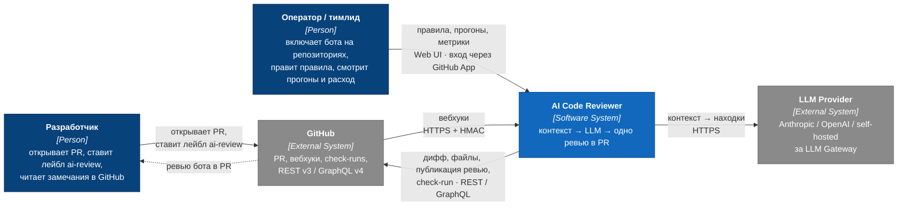
```mermaid
flowchart LR
  dev["<b>Разработчик</b><br/><i>[Person]</i><br/>открывает PR, ставит лейбл ai-review,<br/>читает замечания в GitHub"]
  op["<b>Оператор / тимлид</b><br/><i>[Person]</i><br/>включает бота на репозиториях,<br/>правит правила, смотрит прогоны и расход"]
  sys["<b>AI Code Reviewer</b><br/><i>[Software System]</i><br/>контекст → LLM → одно ревью в PR"]
  gh["<b>GitHub</b><br/><i>[External System]</i><br/>PR, вебхуки, check-runs,<br/>REST v3 / GraphQL v4"]
  llm["<b>LLM Provider</b><br/><i>[External System]</i><br/>Anthropic / OpenAI / self-hosted<br/>за LLM Gateway"]

  dev -->|"открывает PR,<br/>ставит лейбл ai-review"| gh
  gh -->|"вебхуки<br/>HTTPS + HMAC"| sys
  sys -->|"дифф, файлы, публикация ревью,<br/>check-run · REST / GraphQL"| gh
  sys -->|"контекст → находки<br/>HTTPS"| llm
  op -->|"правила, прогоны, метрики<br/>Web UI · вход через GitHub App"| sys
  gh -.->|"ревью бота в PR"| dev

  classDef person fill:#08427b,color:#fff,stroke:#052e56
  classDef system fill:#1168bd,color:#fff,stroke:#0b4884
  classDef ext fill:#8a8a8a,color:#fff,stroke:#5f5f5f
  class dev,op person
  class sys system
  class gh,llm ext
```

---

## 4. C4 — уровень 2: контейнеры

Диаграмма фиксирует целевую границу системы; развёртывание сервисов, включая одноразовый
`migrator`, — в §14.

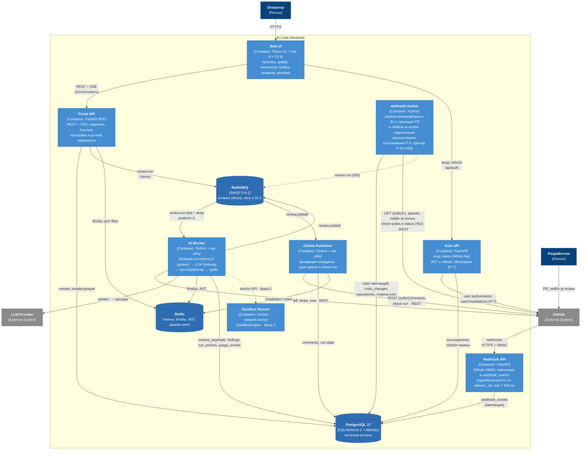
```mermaid
flowchart TB
  dev["<b>Разработчик</b><br/><i>[Person]</i>"]
  op["<b>Оператор</b><br/><i>[Person]</i>"]
  gh["<b>GitHub</b><br/><i>[External System]</i>"]
  llm["<b>LLM Provider</b><br/><i>[External System]</i>"]

  subgraph sys["AI Code Reviewer"]
    direction TB
    ui["<b>Web UI</b><br/><i>[Container: React 19 + Vite 8 + TS 6]</i><br/>прогоны, дифф, инспектор трейса,<br/>правила, метрики"]
    portal["<b>Portal API</b><br/><i>[Container: FastAPI BFF]</i><br/>REST + SSE, подписка, биллинг,<br/>настройки и ручной перезапуск"]
    auth["<b>Auth API</b><br/><i>[Container: FastAPI]</i><br/>вход через GitHub App,<br/>JWT и refresh, Workspace (Р-7)"]
    hook["<b>Webhook API</b><br/><i>[Container: FastAPI]</i><br/>GitHub HMAC, квитанция в webhook_events<br/>(идемпотентность по delivery_id), ack < 500 мс"]
    ww["<b>webhook-worker</b><br/><i>[Container: Python]</i><br/>разбор квитанций раз в 30 с: проекция PR<br/>и лейбла ai-review, подключение репозиториев,<br/>схлопывание Р-2, триггер Р-10 (#52)"]
    worker["<b>AI Worker</b><br/><i>[Container: Python + aio-pika]</i><br/>сборщик контекста (4 уровня) → LLM Gateway<br/>→ постобработка → трейс"]
    pub["<b>GitHub Publisher</b><br/><i>[Container: Python + aio-pika]</i><br/>валидация координат, одно ревью и check-run"]
    sandbox["<b>Sandbox Runner</b><br/><i>[Container: Docker, --network=none]</i><br/>SandboxEngine · фаза 3"]
    mq[("<b>RabbitMQ</b><br/><i>[AMQP 0-9-1]</i><br/>reviews (direct), retry и DLX")]
    pg[("<b>PostgreSQL 17</b><br/><i>[SQLAlchemy 2 + Alembic]</i><br/>источник истины")]
    redis[("<b>Redis</b><br/>токены, блобы, AST, дерево репо")]
  end

  dev -->|"PR, лейбл ai-review"| gh
  op -->|HTTPS| ui
  ui -->|"REST + SSE<br/>Zod-контракты"| portal
  ui -->|"вход, refresh<br/>/api/auth"| auth
  gh -->|"webhooks<br/>HTTPS + HMAC"| hook

  hook -->|"webhook_events<br/>(квитанция)"| pg
  ww -->|"claim квитанций, code_changes,<br/>repositories, отмена runs"| pg
  ww -->|"GET /pulls/{n}, дерево, лейбл ai-review,<br/>check-suites и status (#52) · REST"| gh
  ww -.->|"review.run (#52)"| mq
  portal -->|"чтение, конфигурация"| pg
  portal -->|"review.run<br/>(rerun)"| mq
  portal -->|"блобы для /files"| redis
  auth -->|"user authorization,<br/>/user/installations (Р-7)"| gh
  auth -->|"пользователи,<br/>refresh-токены"| pg

  mq -->|"review.run.fast / .deep<br/>prefetch=1"| worker
  worker -->|"diff, blobs, tree · REST"| gh
  worker -->|"промпт → находки"| llm
  worker -->|"блобы, AST"| redis
  worker -->|"context_payloads, findings,<br/>run_actions, usage_events"| pg
  worker -.->|"docker API · фаза 3"| sandbox
  worker -->|"review.publish"| mq

  mq -->|review.publish| pub
  pub -->|"POST /pulls/{n}/reviews,<br/>check-run · REST"| gh
  pub -->|"comments, run.state"| pg
  pub -->|"installation-токен"| redis

  classDef person fill:#08427b,color:#fff,stroke:#052e56
  classDef ext fill:#8a8a8a,color:#fff,stroke:#5f5f5f
  classDef cont fill:#438dd5,color:#fff,stroke:#2e6295
  classDef store fill:#2f6db3,color:#fff,stroke:#1f4f85
  class dev,op person
  class gh,llm ext
  class ui,portal,auth,hook,ww,worker,pub,sandbox cont
  class mq,pg,redis store
```

**Один monorepo, пять сервисов** (Р-12): `services/portal-api`, `services/auth-api`,
`services/webhook-api`, `services/worker`, `services/publisher`. Каждый собирается своим
Dockerfile и запускается отдельным контейнером; у роли `webhook-api` второй процесс из того же
образа — `webhook-worker` (`python -m app.webhook_worker`, ниже). PostgreSQL, RabbitMQ и Redis —
общая инфраструктура на переходном этапе. Объектного хранилища в MVP нет: всё, что §10 раньше
относил к S3, лежит в PostgreSQL (D1 по #20). Отдельного Event Collector нет:
`usage_events` пишет worker (LLM Gateway), метрики §12 строятся по ним.

Import path един для всех сервисов: процесс стартует из `services/<name>/app/main.py` —
HTTP-сервисы командой `uvicorn app.main:app`, consumers `worker` и `publisher` командой
`python -m app.main`; `app.main` только импортирует тонкий entrypoint
`app.entrypoints.<entry>` (`portal`, `auth`, `webhook`, `worker`, `publisher`).

Workspace-пакет `database-migrator` запускается Compose-сервисом `migrator` и не
входит в runtime-набор: это одноразовый job из profile `tools`, который применяется
до запуска сервисов и обращается только к PostgreSQL.

Диаграмма и раскладка выше — целевые. До разделения на сервисы (#16; скорее всего после
этого спринта, отдельным рефакторингом) `portal-api`, `auth-api` и `webhook-api` —
логические роли: их маршруты живут в одном FastAPI-приложении `app/main.py`, а `worker`
(в MVP — вместе с consumer `review.publish`, §7.1) запускается отдельным процессом из
того же образа. Отдельным процессом из того же образа запускается и `webhook-worker`
(`python -m app.webhook_worker`, Compose profile `webhooks`): он разбирает квитанции,
которые маршрут `webhook-api` записал в `webhook_events`, создаёт Run и публикует их в очередь
ревью, поэтому требует PostgreSQL, RabbitMQ (`RABBITMQ_URL`) и GitHub App (ID, приватный ключ,
логин бота) — [WEBHOOK_WORKER.md](WEBHOOK_WORKER.md).

---

## 5. C4 — уровень 3: компоненты AI Worker

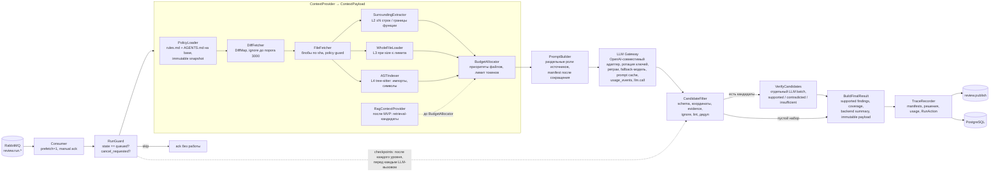
```mermaid
flowchart LR
  MQ[(RabbitMQ<br/>review.run.*)] --> C[Consumer<br/>prefetch=1, manual ack]
  C --> G[RunGuard<br/>state == queued?<br/>cancel_requested?]
  G -->|skip| ACK[ack без работы]
  G --> CC

  subgraph CC[ContextProvider → ContextPayload]
    direction TB
    M[PolicyLoader<br/>rules.md + AGENTS.md на base,<br/>immutable snapshot] --> D[DiffFetcher<br/>DiffMap, ignore до порога 3000]
    D --> F[FileFetcher<br/>блобы по sha, policy guard]
    F --> S[SurroundingExtractor<br/>L2 ±N строк / границы функции]
    F --> W[WholeFileLoader<br/>L3 при size ≤ лимита]
    F --> A[ASTIndexer<br/>L4 tree-sitter: импорты, символы]
    S & W & A --> B[BudgetAllocator<br/>приоритеты файлов, лимит токенов]
    R[RagContextProvider<br/>после MVP: retrieval-кандидаты] -. до BudgetAllocator .-> B
  end

  B --> P[PromptBuilder<br/>раздельные роли источников,<br/>manifest после сокращения]
  P --> L[LLM Gateway<br/>OpenAI-совместимый адаптер, ротация ключей,<br/>ретраи, fallback-модель, prompt cache,<br/>usage_events, llm.call]
  L --> PP[CandidateFilter<br/>schema, координаты, evidence,<br/>ignore, lint, дедуп]
  PP -->|есть кандидаты| V[VerifyCandidates<br/>отдельный LLM batch,<br/>supported / contradicted / insufficient]
  V --> FR[BuildFinalResult<br/>supported findings, coverage,<br/>backend summary, immutable payload]
  PP -->|пустой набор| FR
  FR --> T[TraceRecorder<br/>manifests, решения, usage, RunAction]
  T --> OUT[(review.publish)]
  T --> PG[(PostgreSQL)]
  G -.checkpoints: после каждого уровня,<br/>перед каждым LLM-вызовом.-> PP
```

Целевой ответ движка — **`ReviewOutput v2`**: до 10 кандидатов, прежние координаты
`path/start_line/line` с внутренней стороной `RIGHT`, обязательные `evidence_refs`
и атрибуция по RULES_FORMAT_SPEC. Список содержит 1–8 refs, каждый указывает на
показанный диапазон кода/сигнатуры из manifest принятого reviewer-call; metadata,
конвенции и предыдущий ответ доказательством не служат. Verifier имеет отдельную схему решений по
backend-generated `candidate_id` и не переписывает finding/suggestion.

Текущая [`review-output.schema.json`](../review/schemas/review-output.schema.json)
и Pydantic `ReviewOutput` — **legacy v1** до отдельной реализации v2; нынешние
проверки совпадения схем не подтверждают новый контракт. Сводка старой формы ниже
дополнена проектным `evidence_refs`; точный контракт v2 —
[CONTEXT_AND_VERIFICATION_SPEC §6–8](CONTEXT_AND_VERIFICATION_SPEC.md#6-кандидаты-и-детерминированные-проходы):

```python
class ReviewFinding:          # элемент ReviewOutput.findings
    path: str                 # якорь (D6): path / start_line / line
    start_line: int | None    # null — одна строка; иначе start_line < line
    line: int                 # строка новой версии файла
    severity: Literal["critical", "high", "medium", "low", "info"]
    category: Literal["security", "correctness", "performance", "readability"]
    title: str                # ≤ 80 символов, одна строка
    body: str                 # markdown, ≤ 1200 символов
    suggestion: str | None    # готовая замена строк start_line..line → ```suggestion
    confidence: float         # 0..1
    rule_name: str | None     # .review/rules.md | AGENTS.md | service-defaults:<ID> | null
    evidence_refs: list       # v2: 1–8 {block_id, start_line, end_line}, все строки показаны
```

`side` и SHA в v2 не генерирует модель: `RIGHT` и `Run.head_sha` закрепляет backend.
LEFT требует отдельной сквозной v3, а deletion-only без реального RIGHT-якоря
даёт `left_anchor_unsupported` и partial coverage. Публичный контракт — сохранённый
`FinalReviewResult`: только supported findings, coverage, verdict и backend summary.
Пустой итог при partial/none не означает `clean`; raw summary не публикуется.

**LLM Gateway** (#33) сохраняет общий OpenAI-совместимый адаптер, ротацию ключей,
usage ledger и ограниченное восстановление. Целевой профиль: основная
`mistral-small-4`, fallback `mistral-small-3.2-24b`, отдельный verifier prompt,
strict schema, `temperature=0`, tools выключены, выход verifier ≤8 000 токенов.
Пригодность профиля verifier требует отдельного baseline; старые D7-прогоны её
не подтверждают. Четыре generation-вызова на попытку и 12 на run общие для
conventions/review/verifier/repair/fallback. До повторного вызова резервируются
слоты, стоимость и время ещё не начатых обязательных стадий; резерв verifier
освобождается только для пустого набора после детерминированных фильтров.
На cache miss штатно C → R → V и один recovery; на hit R → V и два recovery.
Сбой verifier не разрешает публикацию кандидатов. Возможный generation при
transport retry учитывается консервативно; только доказанный отказ авторизации
не расходует generation slot. Последний guard и manifest строятся **после**
сокращений gateway, отдельно для repair/fallback. Документы политики не усекаются.
Все LLM/VCS HTTP — вне DB-транзакции; usage записывается отдельной короткой
транзакцией после provider call (PIPELINE_SPEC §4.5).

Fast deadline — 8 мин от claim, один LLM call ≤90 с. До reviewer остаётся время
для его вызова, verifier и 10 с локального завершения; до verifier — один call
и 10 с. Recovery сохраняет downstream reserve, иначе `verification_deadline_exceeded`.
Deep передаёт кандидаты verifier за ≥100 с до своего deadline либо переходит в fast
с общими лимитами расходов/вызовов. После accepted review сохраняются кандидаты
и manifest checkpoint: retry продолжает проверку того же набора. Accepted verifier
и final result фиксируются атомарно до outbox; повтор публикации не запускает LLM.

Verifier отвечает ровно по всем переданным ID, без неизвестных/пропущенных/повторных:
`supported|contradicted|insufficient_context`, короткая причина, refs собственного
manifest и requirement refs при атрибуции правила. Невалидный ответ целиком уходит
в ограниченный recovery; удобное подмножество решений не принимается. Недостаток
контекста отличается от опровержения. Contradicted не публикуется; insufficient
не публикуется и отмечает partial. Неверная suggestion отклоняет кандидата целиком.

---

## 6. Потоки данных

### 6.1 Триггер (Р-10): два события в любом порядке

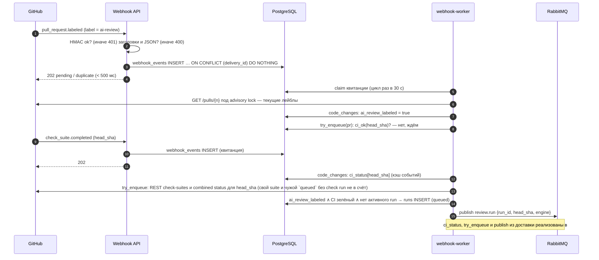
```mermaid
sequenceDiagram
  autonumber
  participant GH as GitHub
  participant WH as Webhook API
  participant PG as PostgreSQL
  participant WW as webhook-worker
  participant MQ as RabbitMQ

  GH->>WH: pull_request.labeled (label = ai-review)
  WH->>WH: HMAC ok? (иначе 401) заголовки и JSON? (иначе 400)
  WH->>PG: webhook_events INSERT … ON CONFLICT (delivery_id) DO NOTHING
  WH-->>GH: 202 pending / duplicate (< 500 мс)
  WW->>PG: claim квитанции (цикл раз в 30 с)
  WW->>GH: GET /pulls/{n} под advisory lock — текущие лейблы
  WW->>PG: code_changes: ai_review_labeled = true
  WW->>PG: try_enqueue(pr): ci_ok(head_sha)? — нет, ждём

  GH->>WH: check_suite.completed (head_sha)
  WH->>PG: webhook_events INSERT (квитанция)
  WH-->>GH: 202
  WW->>PG: code_changes: ci_status[head_sha] (кэш событий)
  WW->>GH: try_enqueue: REST check-suites и combined status для head_sha (свой suite и чужой `queued` без check run не в счёт)
  WW->>PG: ai_review_labeled ∧ CI зелёный ∧ нет активного run → runs INSERT (queued)
  WW->>MQ: publish review.run {run_id, head_sha, engine}
  Note over WW,MQ: ci_status, try_enqueue и publish из доставки реализованы в #52
```

Ответ 202 подтверждает только приём: HMAC и одна вставка квитанции в `webhook_events`, без REST-вызовов; проекцию события и `try_enqueue` выполняет `webhook-worker` после ответа ([WEBHOOK_WORKER.md](WEBHOOK_WORKER.md); `try_enqueue` из доставки реализован в #52). `try_enqueue` — одна функция, вызывается из обоих обработчиков и из sweep; условие проверяется по состоянию, а не по тому, какое событие пришло последним. «CI зелёный» (дефолт по #20): все check suites для `head_sha`, **кроме suite самого App** (`app.id`) и чужих suites в `queued` без единого check run (`latest_check_runs_count = 0`, решение #72 ниже), завершены с `success` / `neutral` / `skipped`, а combined status коммита — `success` или статусов нет; проверяется REST-запросами check-suites и status внутри `try_enqueue`. Свой suite исключён: GitHub создаёт его для App с `checks: write`, а завершает его только наш check-run (§8.3) — иначе условие ждало бы само себя. Если у репозитория нет CI (`wait_for_ci = auto` и ни одного чужого check suite, кроме `queued` без check run, или статуса для `head_sha` за 2 минуты) — прогон стартует по одному лейблу. Это правило реализует sweep раз в 30 с в leader-цикле `worker` (лидер через `pg_advisory_lock`, дефолт по #20): он вызывает тот же `try_enqueue`; реконсилер (раз в 5 мин, §6.4) его не заменяет. После пуша — авто-повтор, пока стоит лейбл `ai-review` (флаг `ai_review_labeled`, Р-10). Полное условие, `wait_for_ci` и жизненный цикл флага — [PIPELINE_SPEC](PIPELINE_SPEC.md) §8.

Проекция события одного PR сериализуется session advisory lock
`SqlAlchemyPullRequestProjectionLock` на AUTOCOMMIT-соединении. Ожидание захвата
ограничено `lock_timeout = 10s`. Таймаут dispatch квитанции — 240 с
(`ReceiveGitHubDelivery`, `_DISPATCH_TIMEOUT_SECONDS`): после него `asyncio.wait_for`
запускает отмену dispatch и ждёт её завершения. Lock освобождается в `finally`
при cleanup; ожидание отмены и DB unlock может увеличить фактическое удержание
сверх 240 с. Это таймаут dispatch, а не жёсткий предел времени удержания lock.
Сохранение проекции — отдельная короткая транзакция, GitHub-вызов её не охватывает
([WEBHOOK_WORKER.md](WEBHOOK_WORKER.md)).

**Чужой check suite `queued` без check run (решение #72).** Такой suite (`status = queued` ∧ `latest_check_runs_count = 0`) не блокирует условие «CI зелёный» и не считается признаком «CI есть» [техлид, #72]. GitHub на каждый push создаёт suite для каждой App с `checks: write`; если App не создаёт в нём check run, suite остаётся `queued` и никогда не пришлёт `completed`. Ни одно событие тогда не запустит повторную проверку (повтор идёт от `check_suite.completed`, `workflow_run.completed` и `status`), и PR завис бы навсегда. Признак приходит в том же ответе check-suites, отдельный запрос не нужен; решение по-прежнему принимается по состоянию, без таймеров. `in_progress` и `completed` учитываются всегда, при любом числе check run (`completed` — по `conclusion`), а `queued` хотя бы с одним check run блокирует, как раньше: гейт не ослаблен для чужого CI, который уже работает. Отвергнуты два варианта. (а) Оставить гейт как есть и записать «одна reviewer App на репозиторий» как условие среды: любое стороннее приложение с `checks: write`, не создающее запусков, блокировало бы ревью навсегда — это ограничение продукта, а не сред. (б) Игнорировать suites без запусков старше порога: порог требует повторной проверки по таймеру, а sweep её не делает — он берёт только PR в `auto` с пустым `ci_status` и исключает PR после первого отказа (PIPELINE_SPEC §8.3), так что пришлось бы менять зону #38. Условие «одна reviewer App на репозиторий» снято лишь для второй App, которая ещё не создала check run: её suite не блокирует запуск. Вторая App, у которой check run идёт (`in_progress`) или завершился `cancelled` (это вне `success|neutral|skipped`), по-прежнему блокирует гейт другой App на этом `head_sha`; это ограничение не меняется. **Остаточный риск:** ревью может стартовать раньше времени, если suite настоящего CI ещё без запусков (на песочнице `a6819f9f` — около 13 с, под нагрузкой GitHub — минуты), а другой чужой CI или статус коммита на том же `head_sha` уже зелёный. Если CI один, `always` ждёт `completed`, а `auto` ждёт `completed`, только если к первой проверке sweep не раньше чем через 2 минуты после постановки лейбла или пуша в suite этого CI уже есть хотя бы один check run. **Остаточный риск при одном CI и `auto`** [техлид, #80]: исключение #72 действует и на единственный настоящий CI. Если его suite и к этой проверке остаётся `queued` без запусков, гейт не видит ни чужих suites, ни статусов, то есть считает, что CI нет, и sweep «2 мин без CI» (PIPELINE_SPEC §8.3) запускает ревью до CI. Второго прогона `check_suite.completed` этого CI уже не создаст: Run с `trigger = webhook` для `(PR, head_sha)` есть (PIPELINE_SPEC §8.1). Ревью после CI на этом `head_sha` тогда возможно только через rerun (T3, PIPELINE_SPEC §1; CI он не проверяет, поэтому его запускают после завершения CI) или с новым пушем (PIPELINE_SPEC §8.2). При `always` гейт в том же случае отвечает `waiting_for_ci` и ждёт `completed`. **Защитное правило: нет счётчика — suite блокирует** [техлид, #80]. Исключение #72 срабатывает только при `latest_check_runs_count = 0` в ответе check-suites. Если поля в ответе нет, считается, что запуски могут быть: разбор ответа (`app/modules/reviews/infrastructure/github_ci.py`) и `CheckSuite` гейта (`app/modules/reviews/application/determine_ci_eligibility.py`) подставляют 1, и чужой suite в `queued` блокирует условие «CI зелёный» (`ci_blocked`), как до #72: PR ждёт `completed` этого suite, а не получает ревью раньше CI. Цена правила: если GitHub не пришлёт поле для suite, в котором запуски так и не появятся, такой suite блокирует, как до #72, и PR с ним снова зависает. Правило защитное, его не убирают; `in_progress` и `completed` учитываются при любом числе check run, и это правило не ослабляет для них гейт.

### 6.2 Прогон: быстрый путь

```mermaid
sequenceDiagram
  autonumber
  participant MQ as RabbitMQ
  participant W as AI Worker
  participant GH as GitHub
  participant R as Redis
  participant LLM as LLM Provider
  participant PG as PostgreSQL
  participant P as Publisher

  MQ->>W: review.run (run_id)
  W->>PG: run.state queued → running (lease, worker_id)
  W->>GH: policy documents по закреплённому base_sha
  W->>GH: GET /pulls/{n} + files (patch на файл)
  W->>PG: policy snapshot + run diff snapshot + DiffMap
  Note over W: ignore до подсчёта; все ignored → skipped; больше 3000 allowed строк → backend summary, без LLM (§9)
  W->>GH: base-tree для конвенций, head/diff_old trees для кода
  opt conventions cache miss и есть base-исходники
    W->>PG: manifest разрешённого base-input
    W->>LLM: общие conventions без PR/head-входов
    LLM-->>W: conventions с сохранённым provenance
  end
  loop файлы по приоритету, пока есть бюджет
    W->>R: blob(repo, sha)? AST(sha)?
    R-->>W: hit / miss
    W->>GH: GET /git/blobs/{sha} (при miss)
    W->>R: put blob, put AST
  end
  W->>PG: manifest + точные evidence excerpts каждого вызова
  W->>LLM: review с изолированными policy/code блоками
  LLM-->>W: ReviewOutput v2 (кандидаты + evidence_refs)
  Note over W: schema → координаты → evidence → ignore/lint/dedup
  opt непустой набор после фильтров
    W->>PG: manifest verifier, кандидаты и evidence
    W->>LLM: обязательный verifier
    LLM-->>W: решение по каждому candidate_id
  end
  W->>PG: final result, coverage, backend summary, точный publication plan
  W->>PG: cancel_requested? head_sha актуален?
  W->>MQ: review.publish {run_id} с закреплённым планом
  W->>MQ: ack review.run
  MQ->>P: review.publish
  P->>PG: lease + сохранённый payload и operation key
  P->>GH: свежие head/diff + recovery своих операций
  P->>GH: POST /pulls/{n}/reviews (одно ревью) + check-run completed
  P->>GH: проверить актуальность после POST
  P->>PG: remote receipts; succeeded либо cancelled при гонке
  P->>MQ: ack review.publish
```

### 6.3 Схлопывание (Р-2): пуш во время прогона

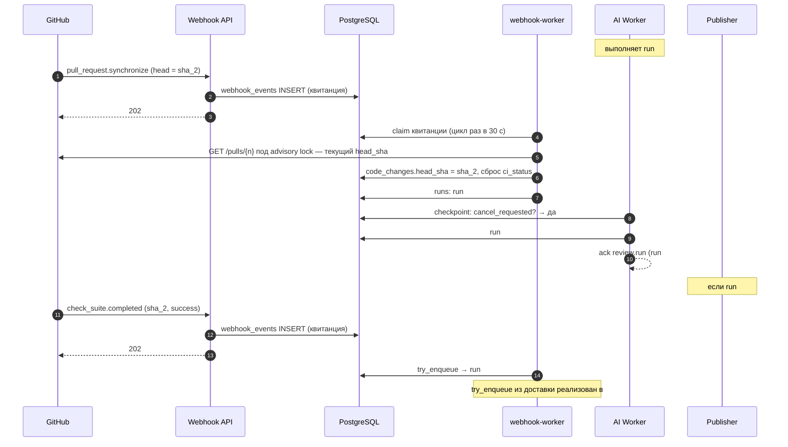
```mermaid
sequenceDiagram
  autonumber
  participant GH as GitHub
  participant WH as Webhook API
  participant PG as PostgreSQL
  participant WW as webhook-worker
  participant W as AI Worker
  participant P as Publisher

  Note over W: выполняет run#1 (sha_1)
  GH->>WH: pull_request.synchronize (head = sha_2)
  WH->>PG: webhook_events INSERT (квитанция)
  WH-->>GH: 202
  WW->>PG: claim квитанции (цикл раз в 30 с)
  WW->>GH: GET /pulls/{n} под advisory lock — текущий head_sha
  WW->>PG: code_changes.head_sha = sha_2, сброс ci_status
  WW->>PG: runs: run#1.cancel_requested = true
  W->>PG: checkpoint: cancel_requested? → да
  W->>PG: run#1.state → cancelled
  W-->>W: ack review.run (run#1), без публикации
  Note over P: если run#1 уже в review.publish — Publisher сверяет sha_1 ≠ head_sha и не постит
  GH->>WH: check_suite.completed (sha_2, success)
  WH->>PG: webhook_events INSERT (квитанция)
  WH-->>GH: 202
  WW->>PG: try_enqueue → run#2 (sha_2)
  Note over WW: try_enqueue из доставки реализован в #52
```

Сообщение run#1 в RabbitMQ удалить нельзя — поэтому решение всегда принимается по состоянию в БД (`RunGuard`), а брокер только доставляет.

### 6.4 Состояния Run

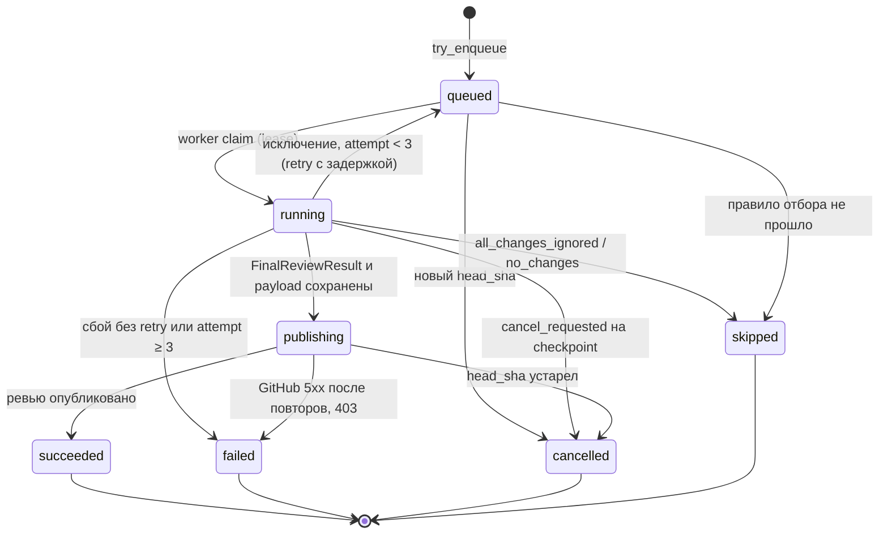
```mermaid
stateDiagram-v2
  [*] --> queued: try_enqueue
  queued --> running: worker claim (lease)
  queued --> cancelled: новый head_sha
  running --> cancelled: cancel_requested на checkpoint
  running --> publishing: FinalReviewResult и payload сохранены
  running --> skipped: all_changes_ignored / no_changes
  running --> failed: сбой без retry или attempt ≥ 3
  running --> queued: исключение, attempt < 3 (retry с задержкой)
  publishing --> succeeded: ревью опубликовано
  publishing --> cancelled: head_sha устарел
  publishing --> failed: GitHub 5xx после повторов, 403
  queued --> skipped: правило отбора не прошло
  succeeded --> [*]
  failed --> [*]
  cancelled --> [*]
  skipped --> [*]
```

Реконсилер (в `portal-api`, раз в 5 мин, лидер через `pg_advisory_lock`): `running` с истёкшим `lease_until` → `queued` + повторная публикация сообщения (при `attempt ≥ 3` — `failed`, `lease_expired`); `queued` старше 10 мин без сообщения → повторная публикация.

Источник по переходам (триггеры, guard'ы и побочные эффекты T1–T18), lease (5 мин, heartbeat 60 с), таймаутам и retry — [PIPELINE_SPEC](PIPELINE_SPEC.md) §1, §3, §4; при расхождении по жизненному циклу прав он.

### 6.5 Вход и сессия (D4)

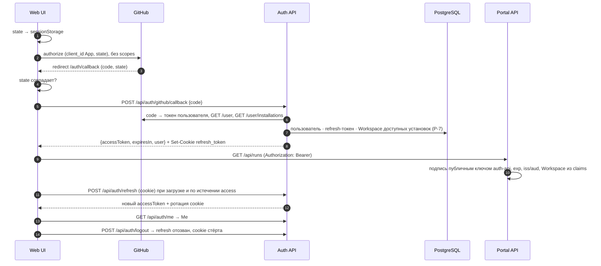
```mermaid
sequenceDiagram
  autonumber
  participant B as Web UI
  participant GH as GitHub
  participant A as Auth API
  participant PG as PostgreSQL
  participant P as Portal API

  B->>B: state → sessionStorage
  B->>GH: authorize (client_id App, state), без scopes
  GH-->>B: redirect /auth/callback (code, state)
  B->>B: state совпадает?
  B->>A: POST /api/auth/github/callback {code}
  A->>GH: code → токен пользователя, GET /user, GET /user/installations
  A->>PG: пользователь · refresh-токен · Workspace доступных установок (Р-7)
  A-->>B: {accessToken, expiresIn, user} + Set-Cookie refresh_token
  B->>P: GET /api/runs (Authorization: Bearer)
  P->>P: подпись публичным ключом auth-api, exp, iss/aud, Workspace из claims
  B->>A: POST /api/auth/refresh (cookie) при загрузке и по истечении access
  A-->>B: новый accessToken + ротация cookie
  B->>A: GET /api/auth/me → Me
  B->>A: POST /api/auth/logout → refresh отозван, cookie стёрта
```

Сроки токенов, cookie, claims и граница Workspace — §12; пути и схемы — `contracts/openapi.yaml`.

### 6.6 Чтение в UI и SSE

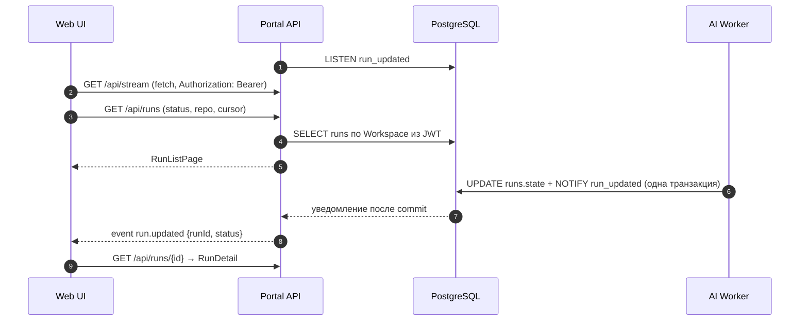
```mermaid
sequenceDiagram
  autonumber
  participant B as Web UI
  participant P as Portal API
  participant PG as PostgreSQL
  participant W as AI Worker

  P->>PG: LISTEN run_updated
  B->>P: GET /api/stream (fetch, Authorization: Bearer)
  B->>P: GET /api/runs (status, repo, cursor)
  P->>PG: SELECT runs по Workspace из JWT
  P-->>B: RunListPage
  W->>PG: UPDATE runs.state + NOTIFY run_updated (одна транзакция)
  PG-->>P: уведомление после commit
  P-->>B: event run.updated {runId, status}
  B->>P: GET /api/runs/{id} → RunDetail
```

Каждая смена статуса Run шлёт `NOTIFY run_updated` в своей транзакции (D12 — дефолт по #20; payload и отправители — PIPELINE_SPEC §1): уведомление приходит только после commit, и UI не видит незафиксированных состояний. Поток читается через `fetch` с Bearer — `EventSource` заголовки не передаёт. Мост LISTEN/NOTIFY → SSE — #34.

### 6.7 Перезапуск

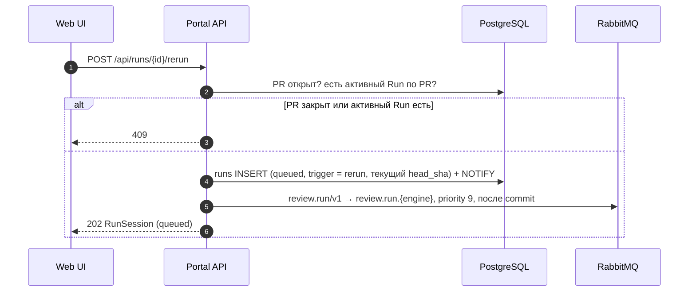
```mermaid
sequenceDiagram
  autonumber
  participant B as Web UI
  participant P as Portal API
  participant PG as PostgreSQL
  participant MQ as RabbitMQ

  B->>P: POST /api/runs/{id}/rerun
  P->>PG: PR открыт? есть активный Run по PR?
  alt PR закрыт или активный Run есть
    P-->>B: 409
  else
    P->>PG: runs INSERT (queued, trigger = rerun, текущий head_sha) + NOTIFY
    P->>MQ: review.run/v1 → review.run.{engine}, priority 9, после commit
    P-->>B: 202 RunSession (queued)
  end
```

Флаг `ai_review_labeled` и CI не проверяются; дальше — как §6.2 (PIPELINE_SPEC T3).

### 6.8 Retry и DLQ

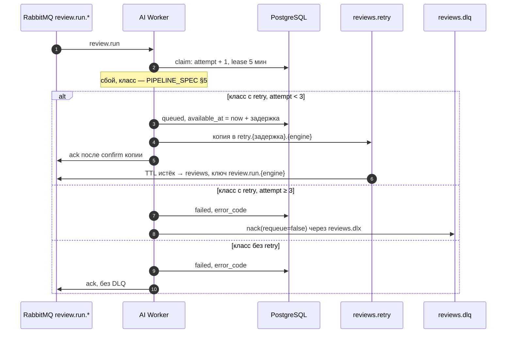
```mermaid
sequenceDiagram
  autonumber
  participant MQ as RabbitMQ review.run.*
  participant W as AI Worker
  participant PG as PostgreSQL
  participant RQ as reviews.retry
  participant DLQ as reviews.dlq

  MQ->>W: review.run
  W->>PG: claim: attempt + 1, lease 5 мин
  Note over W: сбой, класс — PIPELINE_SPEC §5
  alt класс с retry, attempt < 3
    W->>PG: queued, available_at = now + задержка
    W->>RQ: копия в retry.{задержка}.{engine}
    W->>MQ: ack после confirm копии
    RQ->>MQ: TTL истёк → reviews, ключ review.run.{engine}
  else класс с retry, attempt ≥ 3
    W->>PG: failed, error_code
    W->>DLQ: nack(requeue=false) через reviews.dlx
  else класс без retry
    W->>PG: failed, error_code
    W->>MQ: ack, без DLQ
  end
```

Доменный счётчик — `runs.attempt` (инкремент при claim в PostgreSQL), `x-death` — только диагностика. Отдельный счётчик `x-attempt` в AMQP считает любые исключения, вылетевшие из обработчика, в обеих очередях (`review.run.*` и `review.publish`); гибель процесса не считается (§7.3). Задержки 30 с → 2 мин (при rate limit — не меньше 2 мин); после 3 попыток — `failed` и копия в `reviews.dlq`; классы без retry (невалидный вывод модели, переполнение контекста, бюджет, дедлайн) ведут в `failed` сразу, без DLQ. Автор PR видит check-run `neutral` «AI-ревью не выполнено», ревью нет. Политика целиком — PIPELINE_SPEC §4–§7.

### 6.9 Подключение репозиториев: установка GitHub App (D10)

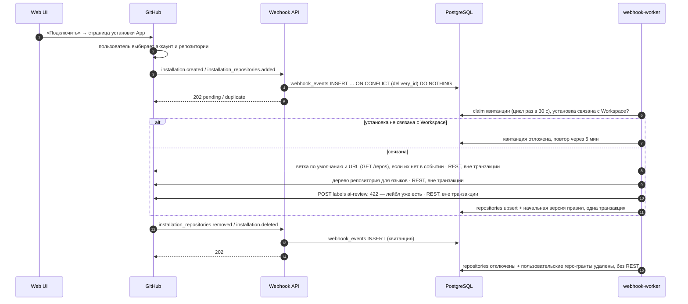
```mermaid
sequenceDiagram
  autonumber
  participant B as Web UI
  participant GH as GitHub
  participant WH as Webhook API
  participant PG as PostgreSQL
  participant WW as webhook-worker

  B->>GH: «Подключить» → страница установки App
  GH->>GH: пользователь выбирает аккаунт и репозитории
  GH->>WH: installation.created / installation_repositories.added
  WH->>PG: webhook_events INSERT … ON CONFLICT (delivery_id) DO NOTHING
  WH-->>GH: 202 pending / duplicate
  WW->>PG: claim квитанции (цикл раз в 30 с), установка связана с Workspace?
  alt установка не связана с Workspace
    WW->>PG: квитанция отложена, повтор через 5 мин
  else связана
    WW->>GH: ветка по умолчанию и URL (GET /repos), если их нет в событии · REST, вне транзакции
    WW->>GH: дерево репозитория для языков · REST, вне транзакции
    WW->>GH: POST labels ai-review, 422 — лейбл уже есть · REST, вне транзакции
    WW->>PG: repositories upsert + начальная версия правил, одна транзакция
  end
  GH->>WH: installation_repositories.removed / installation.deleted
  WH->>PG: webhook_events INSERT (квитанция)
  WH-->>GH: 202
  WW->>PG: repositories отключены + пользовательские repo-гранты удалены, без REST
```

Репозиторий подключается установкой App: `POST /api/repos` нет (D10), кнопка «Подключить» ведёт на установку App. После изменения выбранных в GitHub репозиториев пользователь нажимает «Обновить доступ»: повторный OAuth-вход без logout возвращает на `/repositories`. `ExchangeGitHubCode` вызывает `LinkGitHubInstallations`: по пользовательскому токену читает установки и их репозитории, связывает новые установки с Workspace, сохраняет актуальные пользовательские гранты и пробуждает отложенные квитанции. Это добавляет новую установку и новый репозиторий прежней установки, сохраняя по-прежнему разрешённые гранты. Refresh читает локальную идентичность; запросов к GitHub и обновления списка разрешённых репозиториев он не делает. Поэтому добавленный доступ появляется после повторного OAuth и проекции репозитория вебхуком, а не от одного refresh.

Отзыв доступа пользователя на стороне GitHub (без удаления репозитория из установки App) обнаруживается при следующем успешном OAuth-входе, в том числе через «Обновить доступ». До этой сверки прежние локальные гранты сохраняются: refresh читает локальную идентичность и не проверяет права в GitHub. Без повторного OAuth сессия ограничена абсолютным сроком refresh-семьи — 30 дней от входа; последний выпущенный access JWT может действовать ещё до 15 минут после этого срока ([§12](#12-контракт-api--ui)). Это принятая задержка отзыва пользовательского доступа [техлид, 07.10.2026, #101]; отзыв через события установки App описан ниже.

`installation_repositories.removed` удаляет гранты всех пользователей для перечисленных внешних repo ID в этой установке; `installation.deleted` удаляет все repo-гранты установки даже при пустом списке репозиториев в payload. Проекция отключает строки `repositories`, удаляет гранты и фиксирует маркер эффекта по `delivery_id` в одной транзакции. Маркер не позволяет повтору той же доставки снять доступ, восстановленный свежим OAuth после удаления, даже если финализация квитанции не удалась. Маркеры старше 30 дней удаляются только после удаления соответствующей квитанции (подробнее — [Retention в WEBHOOK_WORKER](WEBHOOK_WORKER.md#how-the-worker-handles-deliveries)). После commit проекции scoped-запросы закрывают доступ и со старым JWT, без ожидания refresh или его 15-минутного access TTL. До обработки квитанции сохраняется задержка очереди/повторов. Пользовательский `PATCH enabled=false` только выключает ревью: гранты и видимость репозитория сохраняются; `enabled` не является проверкой авторизации.

Удаление установки не удаляет Workspace, связь установки с ним и доступ пользователя к Workspace. До следующей OAuth-сверки удалённая установка остаётся пустой связью в `/api/auth/me`, а ID Workspace попадает и в свежий JWT при refresh. Доступ к её репозиториям уже отозван после commit проекции: наличие Workspace в JWT не заменяет repo-грант. Следующая OAuth-сверка удаляет пользовательский доступ к Workspace, если GitHub больше не возвращает соответствующую установку.

Успешная проекция `installation.created` или `installation_repositories.added` устанавливает `enabled=true`, в том числе при повторной обработке и пробуждении отложенной квитанции воркером или после OAuth-сверки. Ручное выключение ревью не сохраняется после такой проекции, даже если репозиторий не удалялся и не добавлялся заново. Этот флаг сам по себе не возвращает пользовательский доступ: для него нужны актуальные repo-гранты после OAuth-сверки.

Гонка removal с OAuth защищена блокировкой установки и отметкой отзыва `GitHubInstallationAccessRevocation`: снимок, начатый до отзыва или одновременно с ним, не восстанавливает соответствующие repo-гранты. Отметка привязана к установке и внешнему repo ID (ID `0` означает всю установку); она не запрещает новый доступ навсегда: более свежий OAuth-снимок может вновь подтвердить его у GitHub. Поколение пользовательского снимка отдельно не позволяет более старому callback перезаписать новый. Сетевые вызовы происходят вне DB-транзакций.

На `main` доставка для установки без Workspace подтверждается ответом 202, а `webhook-worker` откладывает её квитанцию: три попытки разбора с интервалом 5 мин, затем она ждёт, пока установку не свяжут с Workspace. События установки (`installation`, `installation_repositories`) уже связанной установки `webhook-worker` также возобновляет на каждом ежечасном проходе, если квитанция отложена не менее 45 мин назад и получена не более 7 дней назад, — то есть примерно раз в час. При подключении репозитория App создаёт в нём лейбл `ai-review` — триггер Р-10: `webhook-worker` вызывает `POST /repos/{owner}/{repo}/labels` вне транзакции; эндпоинт относится к правам Issues, поэтому у App есть `issues: write` (добавлено 03.10.2026 по #37). Ответ 422 (лейбл уже есть) — успех; другая ошибка логируется и подключение не отменяет [дефолт], кроме сбоя токена установки: он касается всей установки, поэтому этот репозиторий в попытке не сохраняется, ещё не начатые репозитории события пропускаются, начатые доходят до конца, и все прочитанные сохраняются; затем доставка откладывается (GitHub не ответил на запрос токена) или проваливается (некорректный ответ или ключ App, которым нельзя подписать), а повтор переигрывает событие целиком (WEBHOOK_WORKER.md, «Installation token failures»). Лейбл, удалённый мейнтейнером, вернётся только при повторном подключении репозитория (OQ-8).

---

## 7. Очередь: RabbitMQ

### 7.1 Топология

| Exchange | Тип | Routing key | Очередь | Потребитель | Свойства |
|---|---|---|---|---|---|
| `reviews` | direct | `review.run.fast` | `review.run.fast` | AI Worker (fast pool) | durable, `x-max-priority=10`, DLX → `reviews.dlx` |
| `reviews` | direct | `review.run.deep` | `review.run.deep` | AI Worker (deep pool), фаза 3: до неё очередь только объявляется, потребителя нет (#52) | то же; отдельный пул — чтобы сандбокс не блокировал быстрые |
| `reviews` | direct | `review.publish` | `review.publish` | GitHub Publisher (в MVP — consumer в процессе worker) | durable, DLX |
| `reviews.retry` | direct | `retry.{30s,2m,10m}.{fast,deep}` | с тем же именем | — | `x-message-ttl`, `x-dead-letter-exchange=reviews`, `x-dead-letter-routing-key=review.run.{engine}` (отложенный повтор без плагина; PIPELINE_SPEC §4.3) |
| `reviews.dlx` | fanout | — | `reviews.dlq` | оператор | хранение 7 дней |

Параметры: сообщения `delivery_mode=2`, publisher confirms включены, `prefetch_count=1` на run-очередях (задачи длинные и неравные), ack **только после** фиксации состояния в PostgreSQL, `consumer_timeout=45min` (попытка в `running` — не дольше 28 мин с учётом lease и реконсилера, PIPELINE_SPEC §3). Retry, lease и таймауты — PIPELINE_SPEC §3–§4.

Пока отдельного сервиса `publisher` нет, очередь `review.publish` потребляет отдельный
consumer в worker. Текущий wire envelope — `review.publish/v1`; новый профиль
разрешает его `run_id` в сохранённый publication plan. `findings_hash` остаётся
legacy/диагностическим полем и не определяет идентичность нового write-back (§8.4).

### 7.2 Форматы сообщений

Сообщение — **указатель**, не данные: без диффов, без payload'ов. Всё, что нужно воркеру, он читает из БД и GitHub по идентификаторам. Так сообщение остаётся < 1 КБ, а состояние — единым.

Форма сообщений — JSON Schema, пример — строгая JSON-фикстура; фикстуры и отказ на мутациях проверяет `tests/test_contract_schemas.py`.

| Сообщение | Схема · фикстура | Кто → кому | Поля |
|---|---|---|---|
| `review.run/v1` | [`contracts/schemas/review.run.v1.schema.json`](../contracts/schemas/review.run.v1.schema.json) · [`contracts/examples/review.run.v1.json`](../contracts/examples/review.run.v1.json) | webhook-worker (#52), Portal API (rerun, реконсилер), worker (sweep) → AI Worker | `schema`, `message_id` (= `run_id`, ключ идемпотентности), `run_id`, `workspace_id`, `installation_id`, `repo {id, provider, external_id, full_name}`, `pr {number, head_sha, base_sha, base_ref}`, `engine`, `rule_version_id`, `prompt_version_id`, `trigger`, `attempt`, `requested_at` |
| `review.publish/v1` | [`contracts/schemas/review.publish.v1.schema.json`](../contracts/schemas/review.publish.v1.schema.json) · [`contracts/examples/review.publish.v1.json`](../contracts/examples/review.publish.v1.json) | AI Worker, реконсилер → GitHub Publisher (в MVP — consumer в worker) | Текущий envelope: `schema`, `message_id`, `run_id`, `head_sha`, `findings_hash`, `review_event`; в новом профиле authoritative payload/identity загружаются по run_id, не восстанавливаются из текущей конфигурации |

ID — UUID без префиксов, как в БД; `findings_hash` — 64 hex; приоритет (rerun — 9) — свойство AMQP, а не поле. Отличия от прежних примеров этого раздела — PIPELINE_SPEC §12.

Правила: заголовок `schema` версионируется, потребитель отвергает в DLQ незнакомую мажорную версию и сообщение, не прошедшее схему; `message_id` = детерминированный id из БД, повторная доставка безопасна; доменные попытки считает счётчик `runs.attempt` (инкремент при claim), `x-death` — только диагностика; отдельный заголовок `x-attempt` считает любые исключения, вылетевшие из обработчика, в обеих очередях (`review.run.*` и `review.publish`), гибель процесса не считается (§7.3); исчерпание трёх доменных попыток переводит Run в `failed` с `error_code`, а исчерпание трёх неожиданных ошибок отправляет сообщение в `reviews.dlq` без гарантии изменения состояния Run (PIPELINE_SPEC §4).

### 7.3 Реализация (#34): отступления

Этот раздел фиксирует существующий runtime до внедрения #107. В частности,
head-входы общего conventions cache и публикация raw summary ниже — legacy,
а не разрешённые варианты целевых контрактов §5, §9–11.

- `consumer_timeout=45min` не задаётся аргументом очереди: RabbitMQ 4 отклоняет `x-consumer-timeout` для classic-очереди (`PRECONDITION_FAILED`). Это настройка брокера (`consumer_timeout` в `rabbitmq.conf`, по умолчанию 30 мин). Попытка в `running` занимает не больше 18 мин (PIPELINE_SPEC §3), поэтому дефолта хватает; значение 45 мин задаётся конфигурацией брокера при деплое (#35).
- `budget_paused` (PIPELINE_SPEC §5.3): `workspaces.daily_budget_usd = 0` означает «лимит не задан», проверка остатка идёт только при положительном лимите. Остаток считается по `usage_events.cost_usd` за текущие сутки UTC.
- `rule_not_matched`: правила отбора PR в схеме пока нет. RunGuard спрашивает порт `RunSelectionRule`, текущая реализация пропускает любой PR; условия отбора подключаются к этому порту отдельной задачей.
- Идемпотентность публикации (Р-5): в тело ревью добавляется скрытый маркер `<!-- ai-review findings_hash=... -->`. Перед `POST /pulls/{n}/reviews` publisher ищет ревью с этим маркером и при находке не публикует повторно.
- Check-run называется `AI Review`, ссылка на прогон строится из `PORTAL_URL` (`{PORTAL_URL}/runs/{run_id}`); без `PORTAL_URL` ссылки нет.
- Без `GITHUB_APP_ID` и `GITHUB_APP_PRIVATE_KEY` worker стартует, но diff получить не может: доставленный `review.run/v1` завершает Run как `failed` / `github_forbidden` без retry.
- Rerun (T3) пишет Run с `message_published_at = null` и снимает пометку после confirm, но в replay лидер-цикла worker не попадает: выборка outbox из #11 рассчитана на Run с `trigger = webhook` и лейблом `ai-review`. Неотправленный rerun переотправляет реконсилер (T18, через 10 мин).
- Ответ `review.postprocess` дополнительно хранит `summary` из `ReviewOutput`: `llm.review_output` больше 1 МиБ усекается (D1), а run detail берёт сводку из маленького `review.postprocess`.
- Scope для portal обязателен: например, `SqlAlchemyRunRepository`, `SqlAlchemyRerunStore`, `SqlAlchemyRerunUnitOfWork` и `SqlAlchemyCancelRunUnitOfWork` сразу отклоняют отсутствие `AuthScope` (`ValueError`). Для доверенных внутренних вызовов обход доступен только явным `allow_unscoped=True`; scoped rerun использует тот же DB-предикат видимости, что чтение Run.
- `POST /api/runs/{id}/rerun` отвечает 422, если у репозитория нет активной версии правил или промпта: это не конфликт T3 (409 только для активного Run или закрытого PR).
- `GET /api/runs/{id}` отдаёт `RunDetail`; `author`, `headRef` и `baseRef` в `PullRequestRef` заполняются только в нём, список `GET /api/runs` отдаёт `RunSession` без них. Zod-схема UI допускает оба ответа: с ui#59 (`4369e02`) эти поля `nullable().optional()`; снимок Zod-схем ui (`tests/fixtures/ui_zod_contracts.json`) сверяется со спекой поле в поле, порядок перегенерации — PIPELINE_SPEC §16; коммит ui, с которого он снят, — в `provenance.commit` и `UI_CONTRACT_COMMIT`.
- Worker собирает LLM Gateway (#33) один раз на процесс, а модели ревью и конвенций на каждую попытку с её `RunCallContext` (дедлайн, номер попытки, версии). AGENTS.md читается на `base_sha`, дерево и файлы для конвенций читаются на `head_sha` через blob, метаданные PR берутся из GitHub. Без `LLM_MODEL` worker стартует с предупреждением, а Run завершается `failed` / `llm_unavailable` с сообщением о том, что шлюз не настроен (#52). `llm_unavailable` ретраится (`RETRYABLE_ERROR_CODES`), поэтому Run проходит все три попытки, и сообщение видно в `runs.error_message` только после третьей. Локальные модели: таймаут вызова fast фиксирован, 90 с (`GatewayPolicy.call_timeout_s`, из env не задаётся), и reasoning-модели на локальном железе в него обычно не укладываются; LM Studio с gpt-oss отвечает 400 на строгую схему (`json_schema`), ему нужны `LLM_STRUCTURED_OUTPUT=prompt_json` и `LLM_ALLOW_PROMPT_JSON=1` (README, «LLM gateway»).
- Перед `POST /pulls/{n}/reviews` publisher сверяет голову PR в GitHub: push, который webhook-worker ещё не записал в PostgreSQL, превращает публикацию в `cancelled` / `superseded` (T15), а не в ревью на старый коммит (#52).
- `deep` (SandboxEngine) относится к фазе 3: `PATCH /api/repos/{id}` принимает только `fast`, реконсилер не публикует в `review.run.deep`, очередь только объявляется (#52).
- Installation-токены кэшируются в памяти процесса (`InMemoryInstallationAccessTokenCache`: `app/webhook_worker.py:133`, `app/worker.py:409`): каждый процесс выпускает свой токен и держит его до `expires_at` из ответа GitHub минус 60 с. Цель — Redis `token:{installation_id}` (§8.3, §10); перенос в Redis — бэклог, #62.
- **Лимит повторов AMQP и маршрутизация в DLQ при неожиданных ошибках (#54).** Очереди `review.run.*` объявлены как классические очереди RabbitMQ из-за несовместимости `x-max-priority` с кворум-очередями брокера. Classic-очереди RabbitMQ не выставляют заголовок `x-delivery-count`. Доменные повторы отслеживаются через `runs.attempt` в PostgreSQL и проявляются в AMQP через `x-death` после возвращения из exchange `reviews.retry` и очередей задержки `retry.{30s,2m,10m}.{fast,deep}` (§6.8, §7.2). Для защиты от необработанных исключений потребителя вводится второй, отдельный счётчик повторов через заголовок `x-attempt`: он считает любые исключения, вылетевшие из обработчика, в обеих очередях (`review.run.*` и `review.publish`); гибель процесса не считается. При возникновении исключения обработчик воркера выполняет confirmed-перепубликацию копии сообщения с инкрементированным заголовком `x-attempt: attempts` через exchange `reviews` с последующим подтверждением `ack()` исходной доставки. Если перепубликация завершается ошибкой (сбой соединения или брокера), воркер перехватывает исключение и выполняет fallback на `nack(requeue=True)`. Заголовок `x-death` отложенных очередей не расходует бюджет неожиданных сбоев. Некорректные или повреждённые заголовки попыток логируются с уровнем `WARNING` и fallback на 1. При достижении порога `MAX_UNEXPECTED_RETRIES = 3` сообщение маршрутизируется в `reviews.dlq` через `nack(requeue=False)`, в лог пишется `ERROR` с полным `exc_info=True`, а локальный кэш попыток процесса очищается. Локальное fallback-состояние ограничено 1024 записями (`MAX_LOCAL_RETRY_ENTRIES`) с TTL 300 с от последнего сохранения (`LOCAL_RETRY_TTL_SECONDS`); истёкшие записи удаляются лениво при следующем обращении retry к состоянию, при заполнении вытесняются старейшие. Успешная confirmed-перепубликация и ack оригинала очищают локальную запись; ошибка publish или ack сохраняет ограниченный fallback. Между процессами счётчик переносит заголовок `x-attempt`. Без `message_id` локальный ключ — стабильный SHA-256 routing key и тела сообщения. Остаточные риски: 1) внезапная гибель процесса (SIGKILL, OOM-killer) не считается счётчиком, так как обработчик не успевает выполнить перепубликацию до падения процесса; 2) если копия опубликована, а `ack` оригинала упал, в очереди окажутся и оригинал, и копия; это безопасно благодаря идемпотентности обработчиков (Р-5, §7.2).

---

## 8. Взаимодействие с VCS

### 8.1 Порт `VcsProvider` (Р-11)

```python
class VcsProvider(Protocol):
    def verify_webhook(self, headers: Mapping[str, str], body: bytes) -> WebhookEvent: ...
    async def get_pull_request(self, repo: RepoRef, number: int) -> PullRequest: ...
    async def get_diff(self, repo: RepoRef, number: int) -> list[RawFilePatch]: ...   # unified diff на файл
    async def get_blob(self, repo: RepoRef, blob_sha: str) -> bytes: ...
    async def get_tree(self, repo: RepoRef, ref: str) -> list[TreeEntry]: ...
    async def get_ci_status(self, repo: RepoRef, sha: str) -> CiStatus: ...
    async def upsert_check_run(self, repo: RepoRef, sha: str, status: CheckRun) -> str: ...
    async def post_review(self, repo: RepoRef, number: int, review: ReviewPayload) -> str: ...
    async def list_feedback(self, repo: RepoRef, number: int) -> list[FeedbackSignal]: ...   # после MVP
```

v1 — `GitHubProvider`. `GitLabProvider` (MR `changes`, `discussions`, `pipeline` events, bot-user token) и `BitbucketProvider` — по портy, без реализации.

### 8.2 GitHub: события и права

| Событие | Действия | Что делаем |
|---|---|---|
| `pull_request` | `opened`, `reopened`, `synchronize`, `edited` | upsert `code_changes`; `synchronize` → сброс `ci_status`, `cancel_requested` активного Run |
| `pull_request` | `labeled` / `unlabeled` | `ai_review_labeled = true/false`, только если `label.name == "ai-review"`; события самого бота отбрасывает Р-9 (§8.3); на `closed` и `reopened` флаг сверяется с текущими лейблами PR (PIPELINE_SPEC §8.2) |
| `pull_request` | `closed` | отмена активного Run |
| `check_suite`, `workflow_run` | `completed` | `ci_status[head_sha]` (кэш) → `try_enqueue`; «зелёный» = все suites для sha, **кроме suite самого App** и чужих `queued` suites без check run, завершены с `success` / `neutral` / `skipped` — проверяется REST-запросом в `try_enqueue` (§6.1) |
| `status` | — | для репозиториев со сторонним CI через commit status; combined status `success` или пусто — часть условия «CI зелёный» |
| `pull_request_review_thread` | `resolved`, `unresolved` | **после MVP**: `feedback_signals` |
| `installation`, `installation_repositories` | `created`, `deleted`, `added`, `removed` | синхронизация `repositories`; при подключении — создание лейбла `ai-review` (§6.9) |

Права App (repository): `pull_requests: write`, `checks: write`, `contents: read`, `metadata: read`, `issues: write` (создание лейбла `ai-review`, §6.9), `actions: read` (событие `workflow_run`), `statuses: read` (событие `status` и combined status в PIPELINE_SPEC §8.1). Бот **не** имеет `contents: write`. Прав организации и аккаунта нет. События `labeled` / `unlabeled` приходят в подписке `pull_request`, поэтому триггер Р-10 новых прав не требует; лейбл `ai-review` App создаёт сам при подключении репозитория (§6.9), `POST /repos/{owner}/{repo}/labels` требует `issues: write`, а не `pull_requests: write` ([GitHub Docs](https://docs.github.com/en/rest/authentication/permissions-required-for-github-apps), OQ-8). Регистрация App и полный список настроек — #37.

### 8.3 Правила работы с API

| Правило | Как |
|---|---|
| Ответ на вебхук < 500 мс | Проверка размера тела запроса (лимит 413 при превышении `MAX_WEBHOOK_PAYLOAD_BYTES = 10 MB` потоково до вычисления хэша, #54), затем проверка HMAC (`X-Hub-Signature-256`, `hmac.compare_digest`), заголовков и JSON, одна вставка квитанции в `webhook_events` — всё; никакой работы в обработчике: REST-вызовы и проекция — в `webhook-worker` после ответа (§6.1) |
| Идемпотентность | `webhook_events.delivery_id UNIQUE` (`X-GitHub-Delivery`); GitHub **не** ретраит доставки сам — приёмник обязан быть доступен |
| Игнор собственных событий (Р-9) | Маршрут по `sender` не фильтрует: квитанция сохраняется, ответ — 202. `webhook-worker` пропускает событие лейбла `ai-review` (`labeled` / `unlabeled`), если `sender.type == "Bot"` ∧ `sender.login` совпадает с `GITHUB_APP_BOT_LOGIN` без учёта регистра, и помечает квитанцию разобранной (`projected_at`). В событиях бота `sender` — пользователь `<slug>[bot]`, и его id не равен App ID (staging: App ID `5111033`, `dmc268-t6-reviewer[bot]` — `335108304`, #37). App ID остаётся в `iss` App JWT и в исключении своего check suite по `app.id` (PIPELINE_SPEC §8.1) |
| Installation-токен | живёт 1 ч; Redis `token:{installation_id}`, TTL 50 мин (сейчас — в памяти процесса, отступление §7.3); private key App — только в env `webhook-worker`/`worker`/`publisher` |
| Rate limit | 5000 req/ч на installation; `X-RateLimit-Remaining` в метрики; `403/429` + `Retry-After` — повторы по PIPELINE_SPEC §5.2; вторичные лимиты — не более 1 мутации/сек |
| Дифф | `GET /pulls/{n}/files` с полной пагинацией и сверкой версии; отсутствие/усечение patch не считается нулевым diff. `DiffMap` различает complete/missing/truncated/malformed/binary/unsupported/metadata_only |
| Файлы | Точный путь разрешается в дереве закреплённой ревизии, затем `GET /git/blobs/{sha}`; policy — base, RIGHT — head, LEFT — подтверждённый diff_old. Кэш 7 дней; текущая ветка не заменяет недоступный снимок |
| Дерево | `GET /git/trees/{revision_sha}?recursive=1`; усечённый ответ не доказывает отсутствие пути. Требуется полный целевой обход; policy guard повторяется на каждом использовании |
| Публикация (Р-5) | Один `POST /pulls/{n}/reviews` с сохранённым payload: `commit_id=head_sha`, `event`, `body`, `comments[{path,line,side:"RIGHT",start_line?,start_side?,body}]`. Диапазон должен целиком входить в один hunk одной стороны. В body — только supported general-only и находки сверх inline cap, без применяемой suggestion |
| Check-run | `in_progress` при claim; `neutral` для succeeded/failed, `skipped` для исключённого scope, `cancelled` для отмены. `blocking`/`attention` определяются supported severity; `clean` допустим только при complete coverage. Partial без значимых findings и summary-only имеют `verdict=null` и явное сообщение о неполноте; API, review и check-run читают один сохранённый final result |
| Обратная связь | **после MVP** (`FeedbackSignal`): `pull_request_review_thread.resolved` — вебхук; реакции — poll `GET /pulls/comments/{id}/reactions` раз в час по комментариям бота за 7 дней |

### 8.4 Координаты, GitLab и надёжная публикация (#107)

`DiffMap/v1` хранит old/new path, blob/revision, provider diff refs и hunks с
обеими однобазовыми координатами. В `@@ -A[,B] +C[,D] @@` пропущенный count = 1,
явный 0 остаётся пустым диапазоном; context двигает оба курсора, `-` только old,
`+` только new, `No newline` не создаёт строку. Счётчики и все строки диапазона
проверяются; mapping не ищет похожую строку и не использует GitHub `position`.
DiffMap описывает доступный diff, а видимость каждой evidence-строки отдельно
подтверждается manifest фактически отправленного вызова. Вне hunk general-only
допустим лишь для существующего полностью показанного RIGHT-диапазона; ложный
якорь отбрасывается, а не превращается в общий комментарий.

GitHub требует `start_side` вместе с многострочным `start_line`. LEFT проектируется
в v3 и не получает suggestion. GitLab — отдельный последующий адаптер: закрепляет
diff version и `base_sha/start_sha/head_sha`, old/new API paths и line cursors,
строит `position`/`line_range`/`line_code`, не копирует GitHub JSON. Старый код
GitLab берётся из `base_commit_sha`, а не `start_commit_sha`; точные формулы и
ограничения suggestions — CONTEXT_AND_VERIFICATION_SPEC §9. Включение GitLab
и LEFT требует сквозных изменений storage/API/eval, не заявлено этим документом.

Перед `publishing` сохраняются final result и каждый точный payload. Ключ публикации
включает provider/repository/PR, run_id, head_sha, diff_snapshot_id и final result
digest; ключ операции — также ordinal и payload digest. Backend-marker включает
run/head/op/payload. Recovery проверяет ожидаемого bot/app, PR/MR, все эти поля
и точный payload с полной пагинацией; одного findings_hash или marker недостаточно.
Новый run того же head получает новый ключ; повтор доставки не вызывает LLM снова.

Перед каждым новым POST проверяются отмена, открытость PR/MR, актуальные head/diff
и уже опубликованные операции. После POST сохраняются remote IDs и явное
соответствие findings/comments, затем повторно читается актуальность. При гонке
с push публикация остаётся связанной с исходным head, IDs не теряются, run становится
cancelled; удаление/dismiss для сокрытия гонки не выполняется. HTTP находится вне
транзакций, lease и фиксация результатов — в коротких транзакциях.

Timeout или неоднозначный 5xx после возможной отправки означает `outcome_unknown`:
восстановление по журналу/маркеру, без слепого повторного POST. Если исход неизвестен
после бюджета восстановления, `failed/publication_outcome_unknown` блокирует
автоматическую повторную отправку. Только явный отказ координат при актуальном
diff допускает один сохранённый body-only вариант тех же supported findings;
произвольный 400/422, ошибка доступа, stale diff или unknown outcome его не разрешают.
GitLab хранит receipt каждой discussion отдельно и не повторяет успешные операции.

---

## 9. Сборщик контекста: 4 уровня

Цель — обеспечить проверяемое происхождение каждого показанного фрагмента в
пределах бюджета. Контекст фиксирует `policy_base_sha=Run.base_sha`, `head_sha`
и отдельный подтверждённый `diff_old_sha`: base политики может отличаться от
старой стороны patch. Manifest каждого вызова содержит `levels_present` и точные
показанные диапазоны; одного максимального `level_used` недостаточно для вывода
о видимости кода. Нормативная детализация — CONTEXT_AND_VERIFICATION_SPEC §2–5.

### Граница MVP и будущего RAG

Worker зависит от `ContextProvider`, возвращающего контекст по закреплённым
policy/diff snapshots. В целевом детерминированном профиле используются L0–L4,
`IgnorePolicy`, `DiffMap`, `BudgetAllocator` и manifest. Built-in exclusions и
`review-ignore` применяются до сборки, подсчёта порога и любых conventions-вызовов.
Недоступный patch разрешённого текстового файла отражает неполноту, не ignore.

**RAG не реализуется в MVP:** нет embedding-модели, vector DB, фоновой индексации всего репозитория и отдельного ingestion worker. После MVP `RagContextProvider` сможет добавить кандидаты контекста **после Diff/AST-анализа и до `BudgetAllocator`**. Кандидаты проходят те же allowlist путей, лимиты размера и токенов, записываются в trace с причиной выбора и в итоге дают тот же `ContextPayload`. Поэтому LLM Gateway, постобработка, хранение результатов и Publisher от способа retrieval не зависят.

### L0 — политика, метаданные и конвенции

Только `.review/rules.md` и корневой `AGENTS.md` читаются целиком из
`policy_base_sha`. Обычный Markdown не компилируется в правила; заголовки Security,
Performance, Style рекомендованы. Единственное машинное расширение — top-level
fenced `review-ignore` в `.review/rules.md`. Лимиты: 64 KiB на документ, 12 000
rendered tokens суммарно, 256 масок; профиль CommonMark/matcher закреплён в снимке.
Ошибки чтения, формата или переполнение не подменяются отсутствующим/усечённым
файлом. Изменения этих документов в head являются кодом diff, не действующей политикой.

Приоритет конкретного противоречия: обязательные ограничения сервиса → rules →
AGENTS → наблюдаемые конвенции/код → версионированные defaults. Источники из
репозитория сохраняют роль недоверенных данных; им нельзя менять schema, evidence,
verifier, инструменты или адресата публикации. Defaults не отключаются языком репозитория,
отсутствием секции или несовпадением structured priority rule. Backend передаёт
отдельные типизированные/экранированные блоки, проверяет provenance до каждого
вызова и не исполняет команды/ссылки документов; keyword-фильтр не заменяет эту
границу. Семантическую применимость правил независимо оценивают review и verifier.

Ignore исключает файл из всех L1–L4, trees/lists, retrieval и conventions-входов;
старый и новый путь rename/copy проверяются вместе, deny-set не даёт вернуть файл
через импорт под новым именем. В модельных списках исключённые пути заменяются
счётчиком. Только два действующих base policy-документа читаются в своей policy-роли
независимо от масок; их code-копия такого исключения не получает.

```python
class PrMeta(BaseModel):
    title: str; body: str | None; author: str; branch: str; base_ref: str
    labels: list[str]; files_changed: int; additions: int; deletions: int
    is_draft: bool; is_fork: bool

class RepoConventions(BaseModel):         # шаг «конвенции репозитория» (роль 7)
    key_patterns: list[str]               # наблюдения только по разрешённой base-выборке
    recommendations: list[str]
    languages: dict[str, int]             # состав отфильтрованного base-tree, не текущего PR
```

Policy documents хранятся отдельно от производных конвенций. На cache miss выбираются
до 10 source-файлов из base в лексикографическом порядке пути, суммарно ≤128 KiB,
≤300 начальных строк каждого. Title/body PR, changed paths, head-tree и head-код
в общий вызов запрещены; отдельного PR-specific conventions call v1 нет. Нет
исходников — `conventions_not_applicable` без вызова; сбой непустого вызова после
разрешённого recovery даёт failed/retry по классу ошибки, не пустые конвенции (§5).

### L1 — Diff разрешённых изменений

**Порог — >3 000 добавленных и удалённых строк после ignore**; ровно 3 000 допускает
обычную сборку. 4 000 исключённых + 50 разрешённых строк дают анализ 50 строк.
Все изменения ignored → `running → skipped/all_changes_ignored`, пустой diff →
`no_changes`; в обоих случаях LLM calls=0, verdict=null, check-run skipped.
Неизвестные/неполные счётчики VCS дают `summary_only/diff_inventory_incomplete`.
Summary-only строит backend по разрешённой статистике **без LLM**, L1–L4 и inline:
`succeeded`, coverage partial, verdict=null, check-run neutral. Исходный доступный
`patch` сохраняется для UI, очищается только `review_patch`; роль code не может
вернуть запрещённый patch через другой источник. Snapshot использует
`(run_id, filename)`; повтор попытки читает тот же снимок, rerun получает новый.

Ниже — обзор внутренних типов сборщика, не разрешение сериализовать объект целиком
в LLM. Prompt получает только прошедший guard `review_patch` и разрешённые блоки.
UI получает `RawFileDiff {filename,patch}`, где patch — исходный raw_patch (§12),
и строит клиентские FileDiff/DiffLine библиотекой за адаптером.

```python
class DiffLine(BaseModel):
    type: Literal["context", "added", "removed"]
    old_line: int | None; new_line: int | None; content: str

class Hunk(BaseModel):
    header: str                           # "@@ -12,7 +12,9 @@ def foo"
    old_start: int; old_lines: int; new_start: int; new_lines: int
    lines: list[DiffLine]

class FileDiff(BaseModel):
    path: str; old_path: str | None
    status: Literal["added", "modified", "removed", "renamed", "copied", "changed", "unchanged"]
    language: str | None                  # по расширению
    blob_sha: str | None                  # новая версия (None для removed)
    hunks: list[Hunk]
    raw_patch: str | None                 # исходный доступный UI patch
    review_patch: str | None              # null для ignored/summary-only
    patch_state: str                      # complete/missing/truncated/malformed/binary/unsupported/metadata_only
    diff_snapshot_id: str                 # revisions и hunks с обеими координатами — в DiffMap
    is_binary: bool; is_generated: bool; is_too_large: bool
    tokens_est: int
```

Текущий built-in фильтр generated — `_is_generated` в
[`vcs_diff.py`](../app/modules/reviews/application/vcs_diff.py): регистр пути игнорируется;
имя файла входит в `_LOCK_FILES` (`package-lock.json`, `pnpm-lock.yaml`, `yarn.lock`,
`bun.lock`, `bun.lockb`, `cargo.lock`, `gemfile.lock`, `poetry.lock`, `uv.lock`,
`pipfile.lock`, `composer.lock`, `go.sum`), либо заканчивается на `.min.js`/`.pb.go`,
либо путь начинается с корневого `dist/`, либо `.snap` лежит под `__snapshots__/`,
либо имя содержит `snapshot` под каталогом `migrations/`. Эти файлы исключаются из
входа модели с причиной `generated` (TC-07). Локали автоматически не исключаются;
`review-ignore` добавляется отдельным слоем целевого профиля и не заменяет built-ins.
Семь значений status соответствуют `FileStatus` в `prompt_builder.py` и CHECK
снимков диффа (миграция 0026).

### L2 — Surrounding (по умолчанию для всех source-файлов)

```python
class LineRange(BaseModel):
    start: int; end: int                  # исходные строки закреплённой revision/side
    lines: list[str]
    reason: Literal["hunk_window", "enclosing_symbol"]

class Surrounding(BaseModel):
    path: str; revision: str; side: str
    ranges: list[LineRange]               # окна ±N вокруг ханков, пересечения слиты
    window: int                           # N, по умолчанию 30
```

По умолчанию окно ±30. При наличии AST выбирается минимальный объемлющий символ,
только если целиком помещается в лимит фрагмента ≤200 строк/2 000 токенов;
иначе остаётся обычное окно. Частичный символ не маркируется полным. RIGHT читается
на head, LEFT только на diff_old; диапазоны разных ревизий не объединяются.

### L3 — Whole File (по бюджету, топ-K файлов)

```python
class WholeFile(BaseModel):
    path: str; blob_sha: str; language: str | None
    content: str; loc: int; tokens_est: int
    truncated: bool                       # для полного L3 всегда false; усечение — отдельный L2 excerpt
```

Условия: файл — source, `loc ≤ 1500` и `tokens_est ≤ 12 000`; иначе L2 с окном
до ±80 и общим лимитом фрагмента. Тесты/конфиги получают L3 только когда все
разрешённые изменения относятся к ним. L3 заменяет дублирующие RIGHT-окна L2,
но сохраняет L1 provenance и старые строки patch.

### L4 — AST / Imports (source-файлы языков с парсером)

AST v1: tree-sitter для `.py/.pyi` и `.ts/.tsx`, отдельная TSX-грамматика;
JavaScript и остальные языки остаются L1–L3. Версии runtime/grammar/query/resolver
закрепляются в `ast_profile_version` и lockfile при реализации. Индексируются
разрешённые изменённые файлы и одна степень непосредственно используемых импортов.
RIGHT разрешается по head-tree, LEFT — по diff_old-tree; политика всегда из base.
Вставка между символами — module-level change, не произвольно соседняя функция.

```python
class ImportRef(BaseModel):
    module: str; names: list[str]
    resolved_path: str | None
    resolution: str                       # resolved/external/ambiguous/dynamic/excluded/unsupported/missing
    resolution_profile_version: str

class Symbol(BaseModel):
    name: str; kind: Literal["function", "method", "class", "variable", "type"]
    path: str; revision: str; blob_sha: str; start_line: int; end_line: int
    signature_ranges: list; docstring_ranges: list  # точные исходные диапазоны
    signature: str                        # "def foo(a: int, *, b: str = '') -> Result"
    docstring: str | None

class SymbolContext(BaseModel):
    path: str
    imports: list[ImportRef]
    changed_symbols: list[Symbol]         # символы, чьи диапазоны пересекают ханки
    referenced_symbols: list[Symbol]      # определения того, что вызывается из изменённого кода (из других файлов)
    exported_symbols: list[str]           # что этот файл отдаёт наружу — для оценки радиуса поражения
```

Python v1 разрешает явные относительные и однозначные абсолютные imports из root/src;
TypeScript/TSX — однозначные относительные статические imports. Aliases, dynamic
imports, package exports и цепочки barrel re-export не разворачиваются; внешние
зависимости не скачиваются. Stub не считается runtime-телом. `referenced_symbols`
показывает сигнатуру/docstring, что не доказывает поведение непоказанного тела.

Лимиты: blob ≤256 KiB с UTF-8, parser ≤1 с CPU/файл и ≤5 с/попытку, 128 MiB памяти;
≤50 изменённых +20 импортированных AST-файлов, ≤10 imported symbols/файл и ≤100/run;
L4 ≤8 000 токенов, фрагмент ≤200 строк/2 000 токенов. Парсер без сети/исполнения
репозитория. Timeout, неоднозначность, ERROR/MISSING дают точные L1/L2 вместо
догадок, с причиной неполноты. Если отсутствующее расширение необходимо для
кандидата, verifier возвращает insufficient_context и coverage становится partial.
Само отсутствие AST для языка не означает failed. Отказ обязательного diff/VCS
снимка не маскируется AST fallback. Координаты tree-sitter переводятся из byte/row
в исходные однобазовые строки с учётом exclusive end.

### Сборка и бюджет

```python
class FileContext(BaseModel):
    diff: FileDiff
    surrounding: Surrounding | None
    whole_file: WholeFile | None
    symbols: SymbolContext | None
    levels_present: list[int]             # manifest фиксирует реальный набор уровней
    priority: float                       # для инспектора: почему этот файл получил больше

class ContextPayload(BaseModel):          # сущность роли 6
    run_id: str
    policy_snapshot_id: str; diff_snapshot_id: str
    pr: PrMeta
    conventions: RepoConventions
    files: list[FileContext]
    omitted_files: list[str]              # только разрешённые непоместившиеся пути
    excluded_files_count: int             # исключённые пути модели не перечисляются
    budget: dict                          # {"limit": 60000, "used": 48210, "engine": "fast"}
```

Алгоритм `BudgetAllocator` (детерминированный):

1. Приоритет = `source/other(1.0) | test(0.6) | config(0.4)` × `ln(additions + deletions + 1)` × `1.5` при совпадении хотя бы одного **структурированного** priority rule, иначе ×1.0. Совпадения не перемножаются; tie-break — canonical path по Unicode code points. Свободный Markdown не преобразуется в маски и не меняет вес.

   Для glob с `{a,b}` раскрытие ограничено 256 единицами работы (рассмотренный кандидат или созданная альтернатива). Если хотя бы один include/exclude pattern правила превышает лимит, всё правило для данного пути считается неприменимым: множитель `1.5` не даётся, остаётся базовый вес типа файла. Превышение лимита у exclude также не может ошибочно повысить приоритет файла.
2. L1 разрешённых файлов получает первый бюджет. Сохраняются целые hunks, затем явно усечённый префикс последнего hunk с исходными координатами; пропуски отражаются в manifest/coverage. Полная доступная DiffMap не переписывается под prompt.
3. L4 `changed_symbols` + `referenced_symbols` всем source-файлам с парсером (дёшево: сигнатуры).
4. L2 всем source-файлам по приоритету.
5. L3 — сверху вниз по приоритету, пока `used ≤ limit`.
6. После последнего сокращения и escaping — policy/provenance guard, затем manifest отдельного фактического review/conventions/verifier/repair/fallback call. Manifest содержит source roles, snapshot, SHA, origin paths, side, точные shown ranges, hashes и omissions; точные evidence excerpts сохраняются в PG. Ссылки результата разрешаются только по manifest его принятого вызова, не родительского ответа.

Лимит всего входа с system/schema/framing: fast ≤60 000, deep ≤150 000 и не больше
окна конкретной модели минус output reserve. Полные policy/defaults/system и
обязательные verifier-кандидаты резервируются первыми; policy overflow — ошибка,
не усечение. PR body ≤4 000 токенов, конвенции ≤4 000, trees/lists ≤2 000; сокращения
маркируются. Непоказанная строка не становится evidence через одну лишь DiffMap.
Обычный stdout содержит только IDs/digests/счётчики, не клиентский код.

Глубокий путь (фаза 3) может собирать дополнения через инструменты сандбокса,
но сохраняет те же snapshots, ignore/provenance guards, manifest и обязательный
verifier. Исчерпание бюджета не разрешает публикацию незавершённых кандидатов.

---

## 10. Стратегия кэширования контекстов

| Что | Ключ | Где | TTL / инвалидация | Зачем |
|---|---|---|---|---|
| Installation-токен | `installation_id` | Redis (сейчас — в памяти процесса, отступление §7.3) | 50 мин | лимит 1 ч у GitHub |
| Блоб файла | `(repo_id, blob_sha)` | Redis ≤ 256 КБ, иначе PostgreSQL (`cached_file_blobs`) | 7 дней; содержимое неизменяемо по sha | один и тот же файл в серии пушей |
| AST-факты файла | `(repository_id, blob_sha, language, grammar_version, query_version)` | Redis | 7 дней; без run-specific разрешения | повторный guard перед использованием |
| Разрешённые импорты | `(repository_id, revision_tree_sha, importer_blob_sha, resolver_version)` | Redis | ≤7 дней; повторный policy guard | не смешивать head/diff_old или разрешения разных runs |
| Дерево репозитория | `(repository_id, revision_sha)` | Redis | 1 ч; фильтрация перед каждым использованием | base-конвенции и правильная сторона импортов |
| `RepoConventions` | Полный digest base-input/provenance, политика и версии (ниже) | PostgreSQL + Redis | immutable для ключа; TTL не заменяет provenance | старый head-influenced cache не переиспользуется |
| Снимок диффа run (Р-15) | `(run_id, filename)` + diff_snapshot_id | PG: исходный доступный UI patch отдельно от review_patch/DiffMap | до удаления Workspace (каскад) | собственный снимок каждого run |
| Контекст и доказательства | `call_id`/manifest_id + workspace-scoped content digest | PG: manifest и deduplicated точные excerpts; полный rendered prompt не обязателен | до удаления Workspace | аудит не зависит от TTL Redis |
| Результат прогона | `run_id UNIQUE` + final result digest и snapshot bindings | PostgreSQL | immutable после publishing | retry доставки читает сохранённый итог; между head/run результаты не переносятся |
| Промпт у провайдера | стабильные версионированные блоки с раздельными source roles | prompt caching провайдера | зависит от provider profile | кэш не повышает доверие документа/конвенций |

Ключ `repo-conventions-v2` включает repository_id, policy_base_sha, digest всех
окончательных rendered messages и показанного base-tree, каждую source entry
`path/blob_sha/shown_ranges/excerpt_sha256`, policy/ignore digests, matcher,
defaults/conventions-prompt checksums, model/output-schema/selector/truncator/
tokenizer profiles (точная формула — CONTEXT_AND_VERIFICATION_SPEC §4.2).
Manifest и фактическая модель/маршрут сохраняются вместе с выводом. Одних SHA
AGENTS или выбранных файлов недостаточно. Legacy cache без base-only provenance
даёт cache miss; происхождение задним числом не выдумывается. При гонке побеждает
первая успешно сохранённая валидная запись. Собранный контекст v1 не кэшируется.

Что **не** кэшируем: блобы клиента дольше 7 дней; ответы LLM между разными
head/run по одному diff/findings hash; ничего в сандбоксе. Снимки политики/diff,
manifests, excerpts и результаты — данные аудита run до удаления Workspace.

Тела ответов инструментов больше 64 КБ лежат в отдельной таблице PostgreSQL, на строку которой указывает `RunAction.response_ref` (PIPELINE_SPEC §2; таблица и миграция — #34); payload вебхуков — JSONB в `webhook_events` (колонка `payload_s3_ref TEXT nullable` сохранена в таблице с CHECK-ограничением `payload IS NOT NULL OR payload_s3_ref IS NOT NULL` для будущего выноса в S3, миграция 20260928_0012). Это строки PostgreSQL: тела ответов инструментов хранятся до удаления Workspace и удаляются каскадом вместе со снимками, manifests, evidence и `RunAction`. Квитанции `webhook_events` (`WebhookEvent`) живут короче: завершённые (спроецированные, упавшие или отложенные навсегда) удаляются через 30 дней после завершения, чистку раз в час запускает `webhook-worker` ([WEBHOOK_WORKER.md](WEBHOOK_WORKER.md), Retention).

**Объектное хранилище (S3) — после MVP** (D1 по #20): MinIO community архивирован, его образы удалены с Docker Hub 11.09.2026. Обязательные excerpts/manifests #107 уже проектируются в PG и не ждут S3. Когда S3 вернётся для крупных объектов, use case удаления Workspace должен удалять их по ссылкам до каскада — S3 каскадов не знает.

---

## 11. Данные (согласование с ERD роли 6)

Базовые сущности — из `BACKEND_ARCHITECTURE.md`; здесь поля целевого дизайна.
Дополнения #107 ниже — требования к будущим миграциям и API, не описание уже
существующих таблиц. Полные структуры — RULES_FORMAT_SPEC §7–8 и
CONTEXT_AND_VERIFICATION_SPEC §5–8, §10.

| Сущность (роль 6) | Требуемые поля |
|---|---|
| `Workspace` | арендатор (Р-7); дневной бюджет |
| `ProviderInstallation` | `provider`, `external_id`, `metadata` (JSON); токены App в БД не сохраняются (installation-токен — только кэш Redis, §8.3; сейчас — в памяти процесса, отступление §7.3); шифрование в MVP не заявлено — OQ-7 |
| `Repository` | `enabled`, `default_engine`, `wait_for_ci: auto\|always\|never`, `review_event`, `max_comments` |
| `CodeChange` (PR) | `number`, `head_sha`, `base_sha`, `ai_review_labeled` (стоит лейбл `ai-review`, Р-10), `ci_status` (jsonb по sha), `state` |
| `Run` | `head_sha`, `base_sha`, `state` (§6.4), `engine`, `rule_version_id`, `prompt_version_id`, `attempt`, `available_at`, `lease_until`, `cancel_requested`, `worker_id`, `trigger`, `error_code`, `error_message`; дополнительно закреплённые policy/diff/profile/result bindings. `summaryOnly` — явный итог режима, не вывод из `patch=null` |
| Контекст | §9; manifest каждого фактического call, source roles/revisions/ranges/hashes и PG evidence excerpts (§10); summary не заменяет доказательства |
| `Finding` | итоговая проекция supported кандидатов для API; `file_path`, `line_start=start_line ?? line`, `line_end=line`, `side=RIGHT` v2, run/candidate bindings и размещение. Diagnostic drops хранятся отдельно; revision разрешается по закреплённому run/manifest |
| `Comment` | `finding_id`, remote review/comment/discussion IDs, связь с publication item/operation key; `findings_hash` только диагностика |
| `CreditLedger` | потребитель `usage_events`, не источник |
| **Добавить:** `WebhookEvent` | `delivery_id UNIQUE`, `event`, `action`, `payload` (JSONB в PostgreSQL), `payload_s3_ref` (TEXT nullable, CHECK `payload IS NOT NULL OR payload_s3_ref IS NOT NULL` для будущего S3-оффлоада), `received_at` |
| **Добавить:** `RuleVersion`, `PromptVersion` | неизменяемые (Р-6) |
| **Добавить:** `UsageEvent` | `run_id`, `model`, `tokens_in/out`, `cache_read_tokens`, `cost_usd` — только вставка (Р-8) |
| **Добавить:** `RunAction` | `run_id`, `index`, `tool` (каталог — PIPELINE_SPEC §2), `request jsonb`, `response jsonb?` (≤ 64 КБ) или `response_ref` (> 64 КБ — id строки отдельной таблицы PG, PIPELINE_SPEC §2), `started_at`, `duration_ms` — Zod `RunAction` фронта |
| Снимок диффа (Р-15) | ключ `(run_id, filename)`; исходный доступный `patch`, отдельно `review_patch`, patch_state и rename/copy provenance; `run_diff_maps` хранит immutable revisions/provider refs/hunks/digest |
| **#107:** `run_policy_snapshots` | один immutable snapshot на run: документы/absence, checksums, ignore и версии профилей; retry его не заменяет |
| **#107:** `context_manifests`, `context_evidence_blobs` | manifest по call_id и workspace-scoped dedup точных excerpts; источник refs accepted call |
| **#107:** `review_candidates`, `verification_results` | исходный v2 finding, candidate_id/digest, решения фильтров; решение verifier по каждому переданному ID и resolved refs |
| **#107:** `final_review_results` | run_id UNIQUE, версия, supported findings, counts, coverage, verdict, backend summary и digest; immutable после publishing |
| **#107:** `publication_plans/items` | точные payloads, keys/ordinals, отдельные body-only variants, receipts и состояние доставки; явный finding → remote comment mapping |
| **После MVP:** `FeedbackSignal` | `finding_id`, `kind: resolved\|line_changed\|reaction`, `value`, `at` |

В MVP всё хранится в PostgreSQL (D1): raw prompt целиком не обязателен, но точные
excerpts и manifests обязательны для нового профиля. Ответы инструментов до 64 КБ —
в `run_actions.response`, больше — по `response_ref`. Данные доступны только
Workspace и удаляются вместе с ним (§10); завершённые webhook-квитанции — через
30 дней. Legacy terminal runs получают `verification_mode=legacy`, `coverage=null`
в compatibility-проекции, без выдуманных evidence и подтверждения verifier. Начатые
legacy runs завершаются своим профилем; новый включается целиком после миграций
storage/API/UI, без смешивания версий внутри run.

---

## 12. Контракт API ↔ UI

Zod-схемы фронта (роль 5) и бэкенд описывают одни и те же DTO. `RunSession` — API-представление сущности `Run` (§11; в задании — `ReviewJob`): одна сущность, не отдельная таблица.

**Источник истины — [`contracts/openapi.yaml`](../contracts/openapi.yaml)** (OpenAPI 3.1): пути, параметры, схемы, коды ответа и ошибки. `x-service` на операции называет сервис, `x-status: planned` + `x-issue` помечают ещё не реализованное. Совпадение с FastAPI и ответами проверяет `tests/test_openapi_contract.py`, с Zod — `test_component_schemas_mirror_the_ui_zod_contract` там же (13 общих DTO поле в поле) и `tests/test_ui_zod_contracts.py` (ответы API по JSON Schema Zod). Ниже — только сводка.

**Планируемое расширение #107:** RunDetail/RunSession/latestRun получают coverage,
resultVersion и verificationMode из сохранённого final result. Эти поля ещё нужно
одновременно добавить в OpenAPI, backend и UI; существующие схемы остаются
источником истины текущего wire-протокола. Coverage нового результата —
`complete|partial|none` с причинами и известными счётчиками; неизвестное число —
null, не 0. У legacy coverage=null. `blocking` = supported critical/high,
`attention` = supported medium/low; только info/пусто дают `clean` лишь при complete,
иначе verdict=null. До succeeded и при failed/skipped/cancelled verdict также null.
API, VCS и check-run показывают один backend summary из supported findings и scope;
raw модельная похвала/неподтверждённые дефекты в публичную сводку не переносятся.

Провод — **camelCase** (Ф-10): `defaultEngine`, `waitForCi`, `maxComments`, `reviewEvent`; snake_case — только в БД (и во внутренних сообщениях очереди, §7.2). Префикс `/api` без версии.

| Группа | Операции | Сервис | Главное |
|---|---|---|---|
| Прогоны | `GET /api/runs`, `GET /api/runs/{id}`, `…/diff`, `…/files`, `…/comments`, `…/actions`, `…/actions/{index}/response` | `portal-api` | `RunListPage {items,nextCursor}`, семь состояний Р-14; detail = RunSession + verdict/summary/severityCounts/findings/budget и планируемые поля coverage/version выше. `/diff` сохраняет исходный доступный UI patch при ignored/summary-only; `patch=null` означает отсутствие исходного patch, не отсутствие AI-проверки. `/files` старше TTL → `404`/`410`; большие action bodies — через response endpoint |
| Действия с прогоном | `POST /api/runs/{id}/rerun`, `POST /api/runs/{id}/cancel` | `portal-api` | rerun — новый Run `queued`, `202`; PR закрыт или есть активный Run → `409` (§6.7); cancel идемпотентен |
| Поток | `GET /api/stream` | `portal-api` | SSE `run.updated {runId, status}`, один поток на вкладку, `fetch` с Bearer; между процессами — PG `LISTEN/NOTIFY` (D12 — дефолт по #20, §6.6) |
| Репозитории | `GET /api/repos`, `GET/PATCH /api/repos/{id}`, `GET /api/repos/{id}/pulls` | `portal-api` | подключение — установкой App (§6.9): `POST /api/repos` и PATCH коллекции нет (D10); `GET /api/repos` → `Repository[]`; PATCH — `enabled`, `defaultEngine`, `waitForCi` (`auto\|always\|never`), `maxComments` (1..10), `reviewEvent` (`COMMENT\|REQUEST_CHANGES`); pulls → `{items: PullRequestSummary[], nextCursor}` с `latestRun {id, status, verdict}` (D11 — дефолт по #20) |
| Правила, метрики | `GET/POST /api/repos/{id}/rules`, `POST /api/rules/{id}/preview`, `GET /api/metrics/summary` | `portal-api` | после MVP (`x-note` в спеке) |
| Вход и сессия | `POST /api/auth/github/callback`, `POST /api/auth/refresh`, `GET /api/auth/me`, `POST /api/auth/logout` | `auth-api` | ниже; поток — §6.5 |

**Контракт авторизации** (D4 — решение техлида по #20; хранение access в памяти, подпись в `auth-api` с проверкой публичным ключом и граница Workspace — дефолт по #20):

- **Вход** — GitHub App user authorization, без OAuth scopes. `state` генерирует SPA и хранит в `sessionStorage`; GitHub возвращает на SPA `/auth/callback`, SPA сверяет `state` и отправляет `POST /api/auth/github/callback {code}` → `AuthSession {accessToken, tokenType: "Bearer", expiresIn, user}` + cookie refresh.
- **Access** — JWT на 15 мин в заголовке `Authorization: Bearer` на всех `/api/*`, кроме callback, refresh и logout; SPA держит его в памяти, не в `localStorage`. Runtime OpenAPI (`/openapi.json`, `build_openapi` в `app/main.py`) ставит `bearerAuth` и ответы 401/503 по зависимостям роута, а не по префиксу `/api/`: операцию помечает `get_auth_scope` в дереве зависимостей, включая зависимости роутера и вложенные; публичный роут под `/api/` требований авторизации в документе не получает (`tests/test_runtime_openapi.py`).
- **Refresh** — ротируемый с абсолютным сроком семьи 30 дней от входа, cookie `refresh_token`: `HttpOnly; Secure; SameSite=Strict; Path=/api/auth`. `POST /api/auth/refresh` выдаёт новый access и новую cookie, `POST /api/auth/logout` отзывает refresh и стирает cookie. При загрузке SPA восстанавливает сессию: refresh, затем `GET /api/auth/me` (`Me` = `User` + `workspaces [{id, name, installationId}]`).
  - Обычная ротация и grace не продлевают семью. Эффективный deadline равен `min(family.expires_at, family.created_at + 30 дней)`, в том числе у старых семей, которым прежняя реализация продлевала `expires_at`; новая сессия получает этот deadline. При `now >= deadline`, истёкшей сессии или её отзыве refresh возвращает 401 до проверки grace. Новый OAuth-вход создаёт новую семью.
  - **Grace 15 секунд (#54):** ранее ротированный токен допускает повторный выпуск в пределах 15 секунд включительно. Под блокировкой семьи считаются неотозванные сессии с `created_at >= session.rotated_at`, исключая исходную сессию. `MAX_GRACE_REFRESH_SESSIONS = 5`: первичная ротация плюс до четырёх дополнительных выпусков; это верхняя граница, поскольку другие ротации в том же окне тоже расходуют лимит. Повтор после окна или при уже достигнутом лимите фиксирует отзыв всей семьи и возвращает 401.
  - Grace снижает число конфликтов параллельных запросов, но расширяет replay-окно: украденный ротированный токен внутри этих 15 секунд может получить параллельную живую цепочку. Абсолютный deadline сохраняется и для неё. Сервер не отличает такой повтор от легитимной вкладки.
  - **Принятое ограничение [техлид, #101]:** при одновременном восстановлении 6+ вкладок с одним refresh возможны отзыв семьи и разлогинивание; пользователь входит заново. Оставляем лимит 5. Его повышение лишь сдвинет границу и расширит replay-возможности; межвкладочная координация через Web Locks API возможна в будущем, текущая реализация её не обещает.
- **Claims** — `sub` (пользователь), id доступных Workspace, `iat` / `exp`, `iss` / `aud`. Подписывает `auth-api`; `portal-api` проверяет подпись публичным ключом `auth-api`, `exp`, `iss` и `aud`.
- **Граница Workspace (Р-7)** — `auth-api` при входе получает установки пользователя (`GET /user/installations`) и кладёт в токен только их Workspace; `portal-api` фильтрует каждый `/api/*` по этому claim. Пустой список Workspace — валидный claim (решение техлида 28.09.2026): `auth-api` выдаёт токен с `workspaces: []`, `portal-api` отвечает пустыми списками, UI показывает «Подключить»; 401 — только если claim Workspace нет или он битый. Своей таблицы ролей нет.
- **Scoped-доступ к данным** — `get_auth_scope` из `app.bootstrap.portal_auth` проверяет RS256 Bearer, а `repository_access_predicate(scope)` из `app.modules.workspaces.infrastructure.repository_access` пересекает Workspace claims с текущими `GitHubUserWorkspaceAccess` и `GitHubUserRepositoryAccess`, сверяя установку и внешний repo ID. Одного Workspace-гранта недостаточно. Предикат применяется до limit/cursor, чтения detail или изменения; чужой detail/mutation возвращает 404. Portal использует scoped FastAPI dependency `get_run_repository` либо явно переданный `AuthScope`. `ReviewsApiResources.run_repository()` без scope вызывает `ValueError`; обход для доверенного worker допустим только с явным `allow_unscoped=True`. `GET /api/auth/me` использует ту же Bearer-проверку; callback, refresh и logout имеют отдельные механизмы авторизации. SSE разрешает каждое выдаваемое событие через scoped-запрос, поэтому отзыв прекращает последующие события.
- **SSE** — `fetch`-стрим с тем же Bearer (`EventSource` заголовки не передаёт). Для поддержания соединения через промежуточные прокси-серверы (Caddy/nginx) сервер каждые 15 с отправляет комментарий `: keepalive\n\n` (`KEEPALIVE_INTERVAL_SECONDS = 15.0`). При наступлении срока истечения access JWT (`exp` из `AuthScope`) соединение автоматически закрывается сервером, побуждая клиент обновить токен и переподключиться.

---

## 13. Нефункциональные требования

| Область | Требование | Источник |
|---|---|---|
| Ack вебхука | p95 < 500 мс (внутренняя цель 200 мс) | [TEST_PLAN 2.2](TEST_PLAN.md#22-webhook-и-триггер-р-9-р-10) |
| DiffEngine | p95 ≤ 40 с чистого времени движка | [TEST_PLAN §5](TEST_PLAN.md#5-критерии-приёмки-и-отчётность) |
| Время до ревью (fast) | p50 ≤ 90 с, p95 ≤ 4 мин от выполнения триггера (очередь + движок + публикация) | этот документ |
| SandboxEngine (фаза 3; до неё API принимает только `fast`, #52) | жёсткий таймаут 10 мин, затем тот же Run продолжается как fast (действие `engine.fallback` в трейсе) — это не `failed` | Р-3, PIPELINE_SPEC §5.3 |
| Лимиты контекста | fast ≤60 000 входных токенов, deep ≤150 000 и окно модели минус output reserve; L3 ≤12 000; AST ≤50 изменённых +20 imported файлов. Порог >3 000 allowed changed lines после ignore → backend summary без LLM; UI patch сохраняется | §9 |
| Выход | ≤10 кандидатов v2 с evidence_refs, ≤10 inline по настройке; supported сверх inline cap — в body. Компактная backend `summary_text` ≤4 000 Unicode-символов; полное тело review дополнительно включает supported general findings. До первого POST выбранного варианта все payload сверяются с лимитами закреплённого профиля VCS-адаптера (явные единица и предел); превышение → `failed/publication_payload_too_large`, без усечения findings. `suggestion_unrenderable` позволяет убрать лишь применяемый блок. v2/verifier schemas требуют отдельной реализации | Р-5, §5; CONTEXT_AND_VERIFICATION_SPEC §8.2, §9.3, §10.1 |
| Пропускная способность v1 | 100 PR/день, 5 параллельных прогонов; масштаб — реплики `worker` | |
| Надёжность | ни одна задача не теряется: persistent-сообщения + состояние в PG + реконсилер 5 мин; приёмник вебхуков — отдельный процесс (GitHub не ретраит) | |
| Схлопывание | Перед каждым POST проверяются актуальные head/diff и отмена; при расхождении cancelled/superseded. После POST повторно проверяется актуальность, remote IDs сохраняются даже при cancelled. Окно GET–POST остаётся; нового head такое ревью не подтверждает | §8.4, TEST_PLAN §5 |
| Стоимость | fast $0.50, deep $3 на все попытки; до вызова учитываются usage + его оценка + резерв обязательных downstream стадий. Общие 4 вызова/попытку, 12/run, ≤3 попыток. Без завершённого verifier/final result публикация запрещена в обоих движках; verifier budget/deadline exhaustion → failed. Дневной бюджет Workspace → fast, затем skipped | Р-8, §5, PIPELINE_SPEC §4.5 |
| Качество | Ориентиры Precision ≥85 %, Critical Recall ≥75 %, Hallucination <3 %. Raw review и final pipeline измеряются раздельно по независимой ручной разметке; verifier rejection/unsupported acceptance, insufficient/partial/failure и стоимость требуют собственного baseline | TEST_PLAN §3, §5 |
| Безопасность | HMAC на вебхуках; секреты только через env из CI (роль 3); токены GitHub и LLM не попадают в сандбокс; сандбокс `--network=none`, non-root, read-only rootfs; PG/RabbitMQ/Redis — только внутренняя сеть | [TEST_PLAN 2.2](TEST_PLAN.md#22-webhook-и-триггер-р-9-р-10), [2.4](TEST_PLAN.md#24-sandboxengine-р-4-фаза-3), [2.6](TEST_PLAN.md#26-инфраструктура-и-безопасность) |
| Данные клиента | блобы ≤ 7 дней в кэше; диффы, контексты и тела ответов инструментов — до удаления Workspace, payload вебхуков — 30 дней после завершения квитанции; ни один прогон не логирует содержимое файлов в stdout | |
| Наблюдаемость | структурированные логи (JSON) с `run_id` во всех контейнерах; метрики: глубина очередей, длительность по этапам, `X-RateLimit-Remaining`, стоимость; self-hosted стек — отдельная задача | |

**Риск схлопывания.** Реализованная в #52 проверка head перед POST сохраняется;
целевой #107 добавляет идентичность diff и проверку актуальности после POST (§8.4).
GitHub не предоставляет атомарного сравнения head с созданием review: в окне GET–POST
может произойти push. Поэтому post-check не удаляет и не dismiss-ит публикацию:
он сохраняет remote IDs и отмечает run cancelled при устаревании, не объявляя
новый head проверенным. Историческое решение 05.10.2026 не делать post-GET заменено
этим правилом; запрет компенсирующего удаления/редактирования сохраняется.

---

## 14. Развёртывание v1

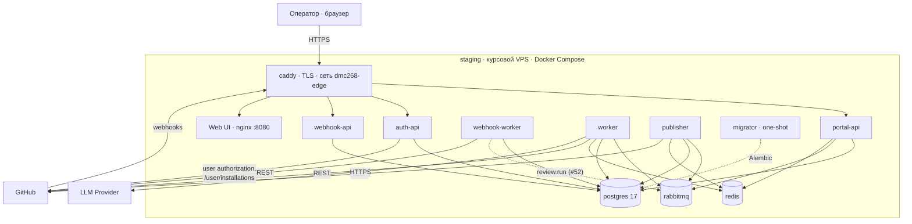
```mermaid
flowchart TB
  subgraph vps["staging · курсовой VPS · Docker Compose"]
    caddy[caddy · TLS · сеть dmc268-edge] --> portal[portal-api]
    caddy --> auth[auth-api]
    caddy --> hook[webhook-api]
    caddy --> ui[Web UI · nginx :8080]
    portal --> pg[(postgres 17)]
    hook --> pg
    ww[webhook-worker] --> pg
    ww -.->|"review.run (#52)"| mq[(rabbitmq)]
    portal --> mq
    worker[worker] --> mq
    publisher[publisher] --> mq
    worker --> pg
    publisher --> pg
    worker --> redis[(redis)]
    portal --> redis
    publisher --> redis
    auth --> pg
    migrator[migrator · one-shot] -.->|Alembic| pg
  end
  gh[GitHub] -->|webhooks| caddy
  op[Оператор · браузер] -->|HTTPS| caddy
  auth -->|"user authorization,<br/>/user/installations"| gh
  ww -->|REST| gh
  worker -->|REST| gh
  publisher -->|REST| gh
  worker -->|HTTPS| llm[LLM Provider]
```

Внешние порты — только у edge-прокси Caddy: 443 (80 — редирект на HTTPS). HTTP-сервисы и Web UI подключаются к docker-сети `dmc268-edge` по alias, без host-портов; Web UI — nginx-контейнер из репозитория UI (alias `ui-staging`, порт 8080). Маршруты edge-прокси текущего staging и альтернативная цель выката (Hetzner VM из Terraform роли 3, без edge-прокси) — [CICD.md](CICD.md) §8. Диаграмма — целевая раскладка Р-12, объектного хранилища в ней нет (§10). До разделения на сервисы (#16; скорее всего после этого спринта, отдельным рефакторингом) маршруты `portal-api`, `auth-api` и `webhook-api` живут в одном приложении `api`, а `worker` — отдельный процесс из того же образа (§4); сегодня на staging (`deploy/compose/staging.yml`) работают `api`, `worker` (очереди ревью, LLM), `webhook-worker` (разбор квитанций вебхуков; роль `webhook-api` на стороне обработки), разовый `bootstrap` (роль `migrator`), `postgres` 17, `rabbitmq` 4 и `redis` 8 — все, кроме `api`, только во внутренней сети, без `ports:`. Роль `publisher` выполняет `worker` (очередь `review.publish`). Воркеры без HTTP-порта сообщают о здоровье heartbeat-файлом, и `up --wait` выката ждёт их так же, как `api` ([CICD.md](CICD.md) §3). Edge-прокси знает только upstream `api-staging`: туда идут хост API и `/api/*` хоста UI, включая `/api/auth/*`. Маршрут на `auth-api` и переименование `api` → `portal-api` добавляются в CICD.md §8 вместе с разделением. Сандбокс (фаза 3) — отдельная VM с Docker-сокетом, недоступным из `portal-api`, `auth-api` и `webhook-api`.

**Один origin** (решение техлида по #20, 28.09): браузер обращается к `/api/*` на хосте UI — edge-прокси или nginx UI проксирует эти пути в API (для SSE без буферизации), поэтому CORS не нужен, а refresh-cookie `Path=/api/auth` (§12) работает в пределах одного origin. Хост API остаётся для healthcheck и вебхуков GitHub. Настроено в #35 маршрутом `handle /api/*` edge-прокси (`deploy/edge/Caddyfile`); Caddy отдаёт `text/event-stream` без буферизации.

---

## 15. Открытые вопросы для команды

| # | Вопрос | Предложение | Кто решает |
|---|---|---|---|
| OQ-1 | После первого ревью GitHub снимает бота из requested reviewers. Повторный пуш: ревьюим автоматически или ждём повторного назначения? | **закрыт**, вопрос потерял смысл: бота нельзя запросить ревьюером, триггер — лейбл `ai-review`, бот его не снимает ([#37](https://github.com/larchanka-training/dmc-268-api-t6/issues/37#issuecomment-5874776355), Р-10). После пуша — автоматически, пока PR открыт и лейбл стоит (решение техлида по #20). Определение «CI зелёный» и sweep «2 мин без CI» — дефолт по #20 (§6.1, PIPELINE_SPEC §8) | продукт / мит |
| OQ-2 | Модель для DiffEngine и размер бюджета | **закрыт [#46](https://github.com/larchanka-training/dmc-268-api-t6/issues/46)** (решение техлида, 05.10.2026): основная — `mistral-small-4`, fallback — `mistral-small-3.2-24b`; проверка по требованиям D7 и расчёт — таблица ниже. `gpt-4.1-mini` (выбор #33) из пары убран: провайдер недоступен аккаунту — HTTP 400 «No providers available for model 'gpt-4.1-mini' with given preferences» остаётся и при наличии кредитов, и без `response_format` ([run 37298451583](https://github.com/larchanka-training/dmc-268-api-t6/actions/runs/37298451583)), то есть это не отказ strict-режима; причина неизвестна: правил маршрутизации на организации и ключе нет (подтвердил куратор, 05.10.2026), а preferences шлюз не передаёт. Strict `json_schema` у обеих моделей подтверждён на обслуживших маршрутах (Mistral AI; OVHcloud и Scaleway — таблица ниже) workflow `LLM live run` на ветке `fix/46-oq2-live-run` @ `c3811b7`: в [run 37304578603](https://github.com/larchanka-training/dmc-268-api-t6/actions/runs/37304578603) оба шага — `calls == [primary]`. Из трёх прогонов с дефолтами ([37304499334](https://github.com/larchanka-training/dmc-268-api-t6/actions/runs/37304499334), [37304578603](https://github.com/larchanka-training/dmc-268-api-t6/actions/runs/37304578603), [37304646906](https://github.com/larchanka-training/dmc-268-api-t6/actions/runs/37304646906)) зелёный по обоим шагам — 1 из 3. Первый ответ валиден у `mistral-small-4` в 2 из 3 на ветке и в 4 из 7 по всем прогонам #46, где она основная; у `mistral-small-3.2-24b` — в 2 из 3 на ветке и в 2 из 4 всего; каждый repair дал валидный ответ. Причина repair в артефактах ветки не сохраняется: в пробах с выгрузкой сырого ответа это была только семантика PIPELINE_SPEC §9 — `start_line == line` у `mistral-small-4`, `summary.problem` из двух предложений у `mistral-small-3.2-24b`; в run 37304646906 итоговые находки содержат `start_line: null`, что согласуется с `start_line == line`. Буквальный D7 и отдельная оговорка о semantic repair по #46 определены ниже. Бюджет — лимиты §13 без изменений; дизайн модель-агностичен: модель меняется конфигурацией шлюза (`LLM_MODEL`, `LLM_FALLBACK_MODEL`) | #46 |
| OQ-3 | `review_event` по умолчанию: `COMMENT` или `REQUEST_CHANGES` при critical? | **закрыт** решением по #20: `COMMENT` по умолчанию, поле `reviewEvent` у репозитория; `REQUEST_CHANGES` — только при `reviewEvent = REQUEST_CHANGES` и вердикте `blocking` (PIPELINE_SPEC §11) | продукт |
| OQ-4 | Раскладка `.agents/` vs `docs/agents/` | **закрыт** решением роли 7 в [dmc-268-ui-t6#32](https://github.com/larchanka-training/dmc-268-ui-t6/issues/32): `.agents/` — источник истины, `.claude/{skills,agents}` — симлинки на него | роль 7 + техлид |
| OQ-5 | Event Collector как отдельный процесс — с какого порога | **закрыт Р-12**: отдельного collector нет, `usage_events` пишет worker | техлид |
| OQ-6 | Стековые PR (B на основе A): пуш в A меняет дифф B, событие приходит только по A | не решаем в v1, фиксируем как известный пробел | — |
| OQ-7 | Шифрование `ProviderInstallation` at rest | в MVP не заявлено: токены App не сохраняются, в `metadata` — только JSON-описание установки; вернуться, если в `metadata` появятся секреты | техлид + роль 6 |
| OQ-8 | Кто создаёт лейбл `ai-review` в подключённом репозитории | **закрыт** решением техлида: лейбл создаёт App при подключении репозитория (`installation.created`, `installation_repositories.added`, §6.9), ответ 422 на существующий лейбл — успех. `POST /repos/{owner}/{repo}/labels` требует `issues: write`, а не `pull_requests: write`: право добавлено App 03.10.2026 по #37 (§8.2, [GitHub Docs](https://docs.github.com/en/rest/authentication/permissions-required-for-github-apps)). Ограничение: лейбл, удалённый мейнтейнером, вернётся только при повторном подключении репозитория | техлид; реализация — #11 |

**Граница исторических свидетельств.** Прогоны, цены и описание текущего cache
ниже относятся к legacy review/conventions профилю #46/#53. Они сохраняются для
аудита, не подтверждают v2 evidence schema, base-only provenance или mandatory
verifier #107. В новом профиле четыре слота делятся также с verifier и резервируются
по §5; legacy схема «четыре для conventions/review» не применяется.

**Строгий D7 и оговорка #46.** Строгий результат D7 для одного проверяемого задания означает, что шлюз отправил `response_format: json_schema` с `strict: true`, первый ответ прошёл соответствующий валидатор и трейс содержит ровно `calls == [primary]`: без repair, retry или fallback. Это свидетельство относится только к фактически обслужившему маршруту провайдера. В #46 техлид отдельно принял выбор пары, когда один repair после принятой strict-схемы исправлял только семантическое правило PIPELINE_SPEC §9; такие случаи показываются отдельно как доля `N из M` и не выдаются за буквальный одновызовный D7. После мержа #46 [run 37342619900](https://github.com/larchanka-training/dmc-268-api-t6/actions/runs/37342619900) на `main` дал `calls == [primary]` в обоих review-шагах; `validate_findings.py` подтвердил `OK ReviewOutput 1 items` и `OK ReviewOutput 3 items`. Этот run ещё не содержал шагов конвенций.

**Production `commit_messages` — отложено.** После мержа PR [#64](https://github.com/larchanka-training/dmc-268-api-t6/pull/64) по #52 production-путь получает PR-метаданные через `GitHubRunSource.get_pull_request_meta`, а рендер `<commit_messages>` в prompt builder уже поддерживается #53. Однако этот source возвращает метаданные из `GET /pulls/{n}`; `HttpGitHubVcsProvider` не вызывает `GET /pulls/{n}/commits` и не заполняет `commit_messages`. Поэтому в production поле пока пустое и тег не попадает в промпт. Дополнительное чтение GitHub и его пагинацию откладываем, чтобы не менять зафиксированный вход оценки #53 перед первым baseline. Владелец follow-up — backend (роль 6); отдельная задача — [#82](https://github.com/larchanka-training/dmc-268-api-t6/issues/82). После #53 нужно добавить получение сообщений, ограничение объёма и проверку `<pr_meta>`. До включения этого пути нужно обновить golden prompt и static provenance; после включения — полностью переснять все ответы baseline и заново посчитать метрики, а не дописывать только изменившиеся кейсы.

**Закрытие OQ-2: проверка по D7.** Значения — каталог EUrouter (`GET https://api.eurouter.ai/api/v1/models` и `/endpoints`) на 05.10.2026; цены — за 1 млн токенов, по эндпоинтам и в их валюте. `KNOWN_MODELS` хранит в USD нижнюю границу цены самой дорогой известной ветки: Regolo для основной, GreenPT для fallback, с историческим курсом 1.1225. На известном EUrouter endpoint эффективная цена — покомпонентный максимум каталожной USD-границы, EUR-цены самой дорогой ветки × полученный перед вызовом курс ЕЦБ и значения из env; меньшее значение env границу не ослабляет. Для другого endpoint явно заданная цена env применяется без этой границы.

| Требование D7 | `mistral-small-4` (основная) | `mistral-small-3.2-24b` (fallback) |
|---|---|---|
| Strict structured output | шлюз шлёт `json_schema` со `strict: true` и схемой `review-output.schema.json` (без `$`-аннотаций); принял маршрут Mistral AI (`response.provider = mistral`) — workflow `LLM live run`, [run 37304578603](https://github.com/larchanka-training/dmc-268-api-t6/actions/runs/37304578603). Regolo и AKI.IO вызовов не обслуживали — не проверены | приняли маршруты Scaleway ([run 37304578603](https://github.com/larchanka-training/dmc-268-api-t6/actions/runs/37304578603)) и OVHcloud ([run 37304499334](https://github.com/larchanka-training/dmc-268-api-t6/actions/runs/37304499334)); GreenPT не проверен |
| Контекст ≥ 60 000 | 262 144 | 128 000 у Scaleway и GreenPT, 131 072 у OVHcloud; в `KNOWN_MODELS` — 128 000 |
| Цена вход / выход / чтение кэша | Mistral AI $0.165 / $0.66 / $0.0165; Regolo €0.50 / €2.10; AKI.IO €0.20 / €0.60. Нижняя граница `KNOWN_MODELS` для Regolo при 1.1225: $0.56125 / $2.35725 / $0.56125; неизвестная цена кэша считается полной ценой входа | OVHcloud €0.09 / €0.28; Scaleway €0.15 / €0.35; GreenPT €0.20 / €0.40. Нижняя граница `KNOWN_MODELS` для GreenPT при 1.1225: $0.2245 / $0.449 / $0.2245; неизвестная цена кэша считается полной ценой входа |
| Максимум одного вызова fast (52 000 вход + 8 000 выход) | Mistral AI $0.0139; Regolo €0.0428 = $0.048043 при 1.1225, $0.047953 при 1.1204 и $0.051360 при 1.20; AKI.IO €0.0152 = $0.0171 при 1.1225 | OVHcloud €0.0069 = $0.0078; Scaleway €0.0106 = $0.0119; GreenPT €0.0136 = $0.015266 при 1.1225, $0.015237 при 1.1204 и $0.016320 при 1.20 |
| Лимит прогона fast $0.50 | 4 вызова общие для конвенций и ревью в каждой попытке; за 3 попытки возможны 12 основных вызовов. 12 максимальных вызовов Regolo стоят €0.5136 ≈ $0.5765 при 1.1225; порог $0.50 — около 0.9735 USD/EUR, поэтому они не могут все пройти предварительную проверку лимита | Иллюстрация 9 основных Regolo + 3 fallback GreenPT: €0.426 ≈ $0.4782 при 1.1225; эта смесь пересекает $0.50 при курсе около 1.1737 USD/EUR. Это не гарантированный состав вызовов |

Курс 1.1225 USD/EUR в таблице — историческая оценка EUrouter для сравнения цен #46, не курс рантайма. Число 1.1204 за 05.10.2026 — также исторический пример [справочного курса ЕЦБ](https://www.lb.lt/en/daily-euro-foreign-exchange-reference-rates-published-by-the-european-central-bank), а не конфигурация staging. Текущий курс шлюз получает из CSV серии [`EXR/D.USD.EUR.SP00.A`](https://data-api.ecb.europa.eu/service/data/EXR/D.USD.EUR.SP00.A) с `lastNObservations=1&format=csvdata` и не инвертирует; env-переменная `LLM_EUR_TO_USD_RATE` больше не читается и не передаётся в worker или ручной workflow. Встроенного курса нет.

При курсе 1.1204 эффективная предварительная оценка сохраняет историческую USD-границу ($0.048043 за максимальный основной вызов и $0.015266 за fallback); при курсе выше 1.1225 она растёт вместе с EUR-ценой. Та же эффективная цена используется для консервативного учёта оплаченного ответа с непригодными данными о стоимости. Граница покрывает опубликованные цены маршрутов при полученном курсе и оценочных токенах, но не будущую смену цен и не ошибку эвристического подсчёта токенов; фактическую допустимую стоимость шлюз записывает по ответу провайдера в USD (§4.5).

Курс хранится в одном кэше на процесс: первый вызов маршрута `api.eurouter.ai` получает его до проверки бюджета и до запроса LLM, параллельные вызовы ждут тот же запрос. Успешная загрузка обновляется через час; после сбоя следующая попытка не раньше 5 минут, если пригодный курс есть, а без него — через 10 с (`COLD_FAILURE_BACKOFF_SECONDS`), раньше первого retry прогона (PIPELINE_SPEC §4.5). Последнее проверенное наблюдение годится не более 7 календарных дней по UTC, при использовании после неудачного обновления в трейсе стоит `stale_cache=true`. Worker при недоступном ЕЦБ стартует, но без пригодного курса известный маршрут останавливается до платного LLM-вызова с retryable `llm_unavailable`, нулём новых вызовов и нулевой стоимостью этого вызова. Другой endpoint при оплаченном EUR-ответе получает курс после ответа; если он недоступен, шлюз сохраняет исходный ответ и токены, начисляет консервативную USD-оценку и завершает вызов `llm_invalid_output` без нового запроса. Для известного маршрута один снимок курса используется для предварительной цены, перевода оплаченного EUR и `llm.call.request.fx` (`source`, `observation_date`, `rate_usd_per_eur`, `stale_cache`); он же виден по вызовам в JSON CLI и GitHub Step Summary. ECB HTTP и LLM HTTP выполняются вне транзакции БД (PIPELINE_SPEC §4.5).

Выбор: обе модели — одного вендора (Mistral), но хостинг-провайдеры не пересекаются (`mistral-small-4` — Mistral AI, Regolo, AKI.IO; `mistral-small-3.2-24b` — OVHcloud, Scaleway, GreenPT), так что сбой одного провайдера не выбивает обе; общий вендор принят, находки fallback слабее. Обе с EU-резидентностью данных через EUrouter. Остальные кандидаты отклонены по прогонам-пробам на временной ветке `chore/46-live-run-probe` (не мержится): `qwen3-coder-30b-a3b` — валидный ответ без находок (пропускает обе high из `findings.sample.json`); `deepseek-v4-flash-0731` — нарушения PIPELINE_SPEC §9 (`start_line == line`, порядок находок), repair тоже невалиден; `gemma-4` — таймаут 90 с на первом вызове; `minimax-m3` — HTTP 400 на `json_schema`; `qwen3.6-35b` — лучшие находки, но около 3 000 reasoning-токенов и 77–92 с на вызов (таймауты), а оба способа отключить reasoning в теле запроса (`reasoning.enabled`, `chat_template_kwargs.enable_thinking`) игнорируются. У обеих выбранных reasoning не обязателен (`reasoning.mandatory = false`), шлюз его не включает, поэтому ответ укладывается в таймаут 90 с. Шлюз проверяет сумму `usage_events.cost_usd` и консервативную оценку следующего вызова до запроса (PIPELINE_SPEC §4.5); когда сумма превысит $0.50, следующий вызов не производится.

До #53 ручной workflow `LLM live run` (`.github/workflows/llm-live-run.yml`, `workflow_dispatch`, секрет организации `AI_DMC268_T6`) проверял два review-сценария: основная модель с fallback и fallback как основная. В #53 добавлены два сценария `RepoConventionsDraft`; для каждого из четырёх шагов summary теперь показывает провайдера, фактическую модель, последовательность вызовов, курс ЕЦБ по каждому вызову, токены, стоимость в USD, время, результат валидатора и буквальный D7. D7 подтверждается только при успешной валидации первого ответа и `calls == [primary]`; repair, retry или fallback его не подтверждают. Живой результат для conventions получен на ветке PR #65 (задача #53) до мержа: [run 37586973849](https://github.com/larchanka-training/dmc-268-api-t6/actions/runs/37586973849) (`feat/53-llm-eval-gateway-project` @ `44f797a` — голова ветки до rebase, 07.10.2026; шлюз, промпты, валидатор и workflow совпадают с `main` после мержа) дал в обоих шагах conventions `calls == [primary]` и `OK RepoConventionsDraft 3 items`: `mistral-small-4` на маршруте Mistral AI (`mistral/mistral-small-4`), `mistral-small-3.2-24b` на Scaleway (`scaleway/mistral-small-3.2-24b`), то есть буквальный D7 в 1 из 1 у каждой модели. Сам run красный из-за review-шага «fallback как основная»: `llm_invalid_output` после `[primary, repair]` (`done_well` — семантика, не отказ схемы); review-шаг основной модели дал `calls == [primary]` и `OK ReviewOutput 1 items`. Файл workflow должен быть на `main`, но `gh workflow run llm-live-run.yml --ref <ветка>` запускает версию workflow и кода из ветки, поэтому проверка до мержа #53 возможна на ветке PR; `-f model=` принимает только модели из `KNOWN_MODELS`. Пара подтверждена review-прогонами #46 и [run 37342619900](https://github.com/larchanka-training/dmc-268-api-t6/actions/runs/37342619900) на `main` (оба review-ответа валидны при `calls == [primary]`); ни один из них не проверял conventions. Strict относится только к фактически обслужившему маршруту: шлюз не шлёт `require_parameters`, а `response_format` в каталоге не доказывает поддержку `json_schema` (`minimax-m3`, PIPELINE_SPEC §9). Если маршрут отвергнет схему (HTTP 400 на `response_format`), это hotfix по OQ-2: другая пара моделей или tool calling. Отдельный живой conventions-прогон на обеих моделях — run 37586973849 выше; в шагах conventions semantic repair не понадобился. Тот же вызов `RepoConventionsDraft` через шлюз worker делает перед ревью, когда для репозитория, ревизии `AGENTS.md` и версии промпта нет кэша конвенций (`app/modules/reviews/application/process_run.py`, поиск и промах кэша — `app/modules/reviews/application/conventions.py:203-221`), но последовательность вызовов staging-ревью не видна из GitHub (только в трейсе run на staging), поэтому как свидетельство D7 здесь не учитывается. `review.conventions.v2.md` описывает маркеры `[N more … omitted]`; локальные тесты рендера это подтверждают, но живую strict-проверку не заменяют.

---

## 16. Решения по переходному коду и легаси-артефактам (#54)

В рамках P3-харднинга API (#54) зафиксированы решения по сохранению и выводу переходных артефактов:

| Артефакт | Решение и обоснование | Владелец | Срок или условие |
|---|---|---|---|
| `fetch_file_content` | **Удалить после завершения миграции.** Метод объявлен в протоколе `RunDiffProvider` (`app/modules/reviews/application/process_run.py:46`). В рантайме чтение файлов переведено на `VcsProvider.get_blob` (`_store_vcs_blobs`), однако метод всё ещё вызывается в `_store_file_blobs` (`process_run.py:230`), обёрнут в `CheckpointedProvider.fetch_file_content` (`app/modules/reviews/application/handle_review_run.py:211`), а в `worker.py:304` передан заглушкой `AttemptReviewProvider.fetch_file_content`. Метод сохранён временно для обратной совместимости. | @skvertl | Спринт 3 (после завершения миграции чтения файлов через VcsProvider.get_blob) |
| `ReviewWorker`, `review_worker` | **Удалить.** Класс `ReviewWorker` и контекстный менеджер `review_worker` в [`app/worker.py`](../app/worker.py) — устаревшие прототипы; боевой рантайм использует `compose_worker_process` и `WorkerProcess`. Тип `ProviderFactory` в том же модуле опирается на живой протокол `ReviewWorkerProvider`, который сохраняется. Прототипы вызываются тестами в [`tests/test_worker.py`](../tests/test_worker.py). | @skvertl | Спринт 3 (при переводе тестов с `ReviewWorker` на `WorkerProcess`) |
| `reviewer_requested` (и путь reviewer-intent / timeline) | **Колонки — оставить. Код пути (`HttpGitHubReviewerTimelineProvider`, протокол `ReviewerTimelineProvider`, ветки reviewer-intent / timeline в `ProjectGitHubPullRequest`) — решение в #81.** В текущей реализации диспетчер отбрасывает вебхуки `review_requested` и `review_request_removed` (`app/modules/integrations/webhooks/application/github_installation_dispatch.py:181-185`), а `HttpGitHubReviewerTimelineProvider` не подключён в bootstrap (значение в проде пока не становится `true`). Семь колонок PostgreSQL (`reviewer_requested` `BOOLEAN NOT NULL server_default false`, `reviewer_requested_at`, `reviewer_intent_updated_at`, `reviewer_timeline_event_id`, `reviewer_timeline_position`, `reviewer_barrier_at`, `reviewer_barrier_position` из `app/modules/reviews/infrastructure/models.py:96-110`) сохраняются бессрочно как архитектурный фундамент схемы для будущей проекции таймлайна GitHub без ломки схемы. | @axyi (Tech Lead) | колонки — бессрочно; код — по #81 |
| `payload_s3_ref` | **Оставить до внедрения S3-оффлоада.** Колонка `payload_s3_ref` (`TEXT nullable`) в таблице `webhook_events` (`app/modules/integrations/webhooks/infrastructure/models.py:64`) с ограничением CHECK `payload IS NOT NULL OR payload_s3_ref IS NOT NULL` сохранена для будущего выноса сырых пэйлоадов вебхуков в объектное хранилище S3 (§10, §11). Удаление колонки или CHECK-ограничения до внедрения S3 не требуется. | @skvertl | Оставить до внедрения S3-оффлоада |

---

## 17. Проверка DoD

- [x] Компоненты, потоки данных, границы backend / frontend / LLM — §2, §3–§5
- [x] Правила взаимодействия с VCS (GitHub, порт для GitLab) — §8
- [x] Форматы очереди задач (RabbitMQ) — §7
- [x] Стратегия кэширования контекстов — §10
- [x] Сборщик контекста: структуры данных на 4 уровнях — §9
- [x] Диаграммы C4 (контекст, контейнеры, компоненты) и потоков — §3–§6, §14
- [x] Нефункциональные требования: latency, лимиты контекста — §13
- [x] Утверждено командой — PR-ревью (PR #36, #20)
